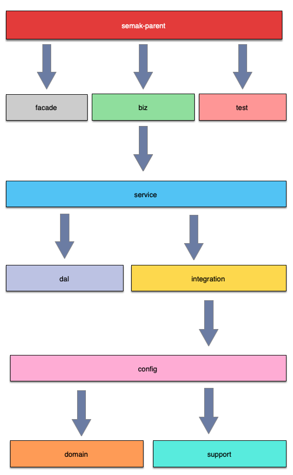

# 主体结构

## 模块构成

**结构说明：**

> 框架根POM继承了`semak-parent`，并可以根据需求，以import的方式多继承`semak-parent`下定义的字模块，目的为控制整个框架的类库版本。

* **biz** : 业务模块 - 服务入口，**Spring Boot 启动类**亦在此模块中（**以下为建议的子包划分**）。
  * `configure` - JavaConfig配置。
  * `controller` - 控制器（对接应用内页面)。
  * `facade` - 服务接口与实现。
  * `job` - 定时作业。
  * `mq.listener` - 消息监听。

* **service** : 业务处理及事务支持模块。

* **dal**: 数据访问模块(调用内部资源)。

* **integration**: 集成模块(调用外部资源)，主要包括：消息发送客户端、二/三方服务调用客户端等。

* **config**: 基本配置模块。

* **domain**: 领域模块，主要包含：DTO(数据传输对象)、 PO(持久对象)， BO(业务对象)。

* **support**: 基础支撑模块，主要包含：基类定义、通用资源、spi接入，可扩展业务工具类、常量枚举等。
  - 为什么没有常用工具类？ - apache commons、google guava、jodatime等还不够用么？试着去了解吧~ ... 当然，有些工具还是会以组件的形式来提供的。

* **test**: 测试模块，提供`springTest`，`springBootTest`，`Mockito`等功能支持。

* **facade**: 接口发布模块，提供给二/三方服务调用我方服务使用。`此模块无需进行手动编辑`，通过手动执行插件`semak-feign-maven-plugin`来生成。

## 模块关联

**关联说明：**

`semak-parent`作为应用根POM需要被依赖，为必选项。`facade`作为接口发布模块，与主业务模块没有关联关系。`test`作为测试模块也相对独立。其他模块的关联关系见图示。