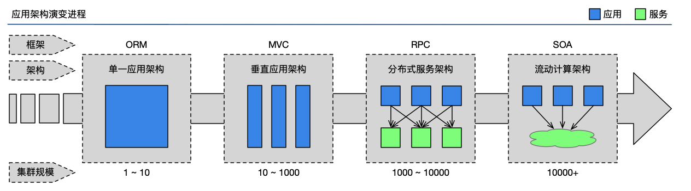

# 使用场景

SEMAK通用框架可以说是在不断地业务实践中成长起来了，已经历了4次大规模迭代，不论在组件、插件还是工具的成熟度和兼容性上都有了长足进步。虽然，最初的意愿仅仅是为了方便BU内部开发，但随着业务的复杂度的增加，功能性需求的增多，对框架本身的要求也逐渐提高。直到本代SEMAK框架初步迭代完成，基本已经能很好地适应较大规模企业的开发要求。本框架具备较大范围的普适性，不论企业目前是处于何种规模，都能很方便地通过本框架来进行构建和部署。下面列举几个框架适用的典型场景（对不同类型架构的支持）。

## 较小规模场景

一般适用于访问量较小、硬件资源比较吃紧的企业，以**单一**或**垂直**应用架构为主，承载的用户数量一般不会过千。在这种规模之下，只需一个或几个应用，将所有功能都部署在一起或粗粒度地进行简单拆分，以减少部署节点和成本。此时，功能主要集中在增删改查的功能和MVC的开发上。

## 中等规模场景

一般适用于具备一定访问量，硬件资源较为充足的企业，以**分布式服务**架构为主，承载用户量一般在上千的级别。在这种规模之下，将核心业务抽取出来，作为独立的服务，逐渐形成稳定的服务中心，使前端应用能更快速的响应多变的市场需求。此时，功能主要集中在业务的高复用和微服务之间的通讯上。

## 较大规模场景

一般适用于具备较大访问量，硬件资源十分充裕的企业，以**流动计算架构**为主，承载用户量一般在上万的级别。在这种规模之下，微服务越来越多，容量的评估，小服务资源的浪费等问题逐渐显现，需增加一个调度中心基于访问压力实时管理集群容量，提高集群利用率。此时，用于提高机器利用率的资源调度功能和服务治理中心成为了关键。

