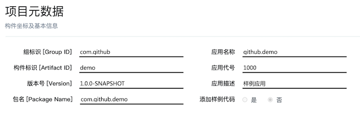
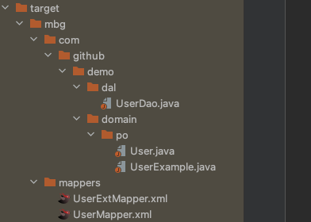
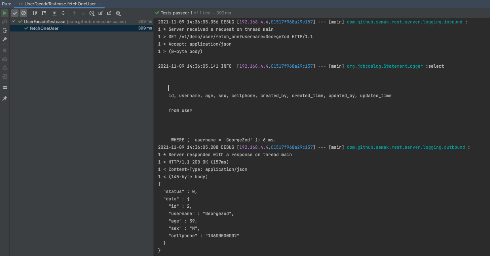

# 基础入门

> 以下样例基于MacOS系统，IDEA的IDE进行演示，用其他系统或IDE的同学请参照样例并酌情调整。

## 1. 准备

1. 使用 [项目生成平台](../准备/项目生成.md)生成一个Demo项目。

   - 设定元数据

     

   - 选择组件（此处为了能够覆盖大部分功能，故而会多选择一些组件）

     

   - 点击`生成项目`按钮，下载生成项目。

2. 解压下载项目后，打开IDEA，选择`Open`，找到`demo`项目并打开。

   

   打开后，IDEA会初始化一些配置，请耐心等待完成。下面是初始化完成后的项目结构，我们可以看到Maven模块、JDK和相关类库都已初始化完毕。

   

3. 进入`demo-biz`模块，我们可以看到`ApplicationLauncher`**启动类**，它是启动我们整个应用的**启动器**。但别忙，由于我们依赖了一些数据库、中间件的组件，我们需要配置之后才能成功启动。那么接下来我们先做一些简单配置。

   

4. 初始化配置文件。我们可以看到，项目生成之后，有`bootstrap.yml`和`application-dev.yml`两个配置。这里，我们主要修改的配置文件为`application-dev.yml`。

   

   根据我们选择依赖的组件，在数据库和相应的中间件都搭建完成并能正常提供服务的基础上，我们需要修改的内容分为以下部分：

   * 数据源
   
     ```yml
     spring:
     	...
       datasource:
         datasource-type: hikari
         datasource-names:
         - pri-ds
         base-datasource-configure:
           minimum-idle: 3
           maximum-pool-size: 5
           auto-commit: true
           idle-timeout: 60000
           max-lifetime: 600000
           connection-timeout: 5000
           leak-detection-threshold: 10000
         pri-ds:
           default-candidate: true
           connection-properties:
             useUnicode: true
             characterEncoding: utf8
             autoReconnect: true
             failOverReadOnly: false
             useSSL: false
             serverTimezone: Asia/Shanghai
             zeroDateTimeBehavior: CONVERT_TO_NULL
           jdbc-url: jdbc:mysql://192.168.3.10:3306/demo
           username: demo
           password: '123456'
           minimum-idle: 1
           maximum-pool-size: 3
           connection-test-query: SELECT 1
     ```
   
   * 缓存
   
     ```yaml
     spring:  
     	......
       redis:
         client-names:
         - pri-redis
         base-redis-configure:
           use-jackson-as-default-serializer: true
           key-prefix: ${spring.application.name}
           ssl: false
           connect-timeout-in-millis: 1500
           read-timeout-in-millis: 5000
           database: 0
           ignore-error: true
           pool:
             max-active: 20
             min-idle: 1
             max-idle: 4
             max-wait-in-millis: 35000
             time-between-eviction-runs-in-millis: 35000
             test-while-idle: true
           retry-policy:
             retry-times: 3
             retry-interval-in-millis: 3000
             exponential-back-off-policy:
               initial-interval-in-millis: 2000
               max-interval-in-millis: 3000
               multiplier: 2
         pri-redis:
           type: cluster
           nodes:
             - "192.168.3.21:7000"
             - "192.168.3.22:7000"
             - "192.168.3.31:7000"
             - "192.168.3.32:7000"
             - "192.168.3.41:7000"
             - "192.168.3.42:7000"
           max-redirects: 5
           password: 123456
     ```
   
     
   
   * 消息队列
   
     ```yaml
     spring:
     	...
       cloud:
         stream:
           binders:
             bizRocketmq:
               type: rocketmq
               defaultCandidate: true
               environment:
                 spring:
                   cloud:
                     stream:
                       rocketmq:
                         binder:
                           name-server:
                             - 192.168.3.23:9876
                             - 192.168.3.33:9876
                           access-key: rocketmqAdmin
                           secret-key: EV73MtjxEF
     ```
   
   * 中心化存储
   
     ```yaml
     spring:
     	...  
       fastdfs:
         enabled: true
         tracker-server:
           - 192.168.3.23:22122
           - 192.168.3.33:22122
         http:
           anti-steal-token: true
           secret-key: QXtEsrIBrh4g3yDiNcigMzx/VlC8beDvKQ/Wnl203BIkeJ3XxFLOAymUC1ldoidmyjrsq5AwB5GQiU0shQZeGQ==
     ```
   
   * 作业调度
   
     ```yaml
     elasticjob:
       reg-center:
         server-lists: 192.168.3.23:2181,192.168.3.33:2181,192.168.3.43:2181
         namespace: lite-job-${spring.profiles.active}/${spring.application.name}
         digest: admin:123456
         max-sleep-time-milliseconds: 30000
     ```
   
5. 当配置全部初始化完之后，我们切换到项目的根目录，将整个项目本地安装一下：`mvn -Dmaven.test.skip=true clean install`。

6. 安装完成之后，先将IDE启动配置中的激活配置变量设置为`application-`后面的具体文字，比如：`application-dev.yml`，则设置为`dev`。

   

   设置完成后，我们启动项目。

   

   启动完成后，我们访问服务地址，可以看到一个Swagger页面即可。
	
	


## 2. 了解配置

其实，在上一轮框架迭代时，已经摒弃了冗余繁杂的`properties`配置文件，转而使用结构清晰，配置精简清爽的`yaml`来替代。

和一般的SpringBoot项目不同，用户在当前环境需要关心的配置至少有2份。分别是`bootstrap.yaml`和`application-xxx.yaml`（**xxx**为当前激活的配置环境），那它们有什么不同？简单来说，`bootstrap.yaml`，我们称之为`核心配置`，优先于`application-xxx.yaml`进行加载，相当于**parent applicationContext**，故一些启动时就需要进行优先加载的配置项（如：分布式配置中心的配置）就需要放入其中。

另外，由于`yaml`文件可以在单个文件中，分别配置不同的环境，如：

```yaml
#通用配置
...

---
#dev环境配置
spring:
  profiles: dev
  ...

---
#qa环境配置  
spring:
  profiles: qa
  ...

```

我们可以看到，通过`---`符号隔开环境，再利用`spring.profiles`来定义环境，而**通用配置部分**可以被下面各个**分块的环境配置**所`继承`和`覆盖`的。这样，抽象一些分环境的属性就尤其方便。

紧接着`bootstrap.yaml`加载的是`application-xxx.yaml`，我们称之为`用户配置`，它会继承**核心配置**中的属性，进行**补充**和**覆盖**形成一份完整的配置加载到Spring容器中。所以，我们要看某个组件的完整配置，需要结合核心配置和用户配置一起看。


## 3. 声明

下面通过创建一个用户的**CRUD操作**服务来带领大家进入一个完整且高效的开发流程。由于本章节是一个快速向导，读者可以通过依样画葫芦来快速构建所需功能，所以过程中涉及的配置细节**不会**在本章节做过多赘述 ，如需了解更多可以进入**进阶**章节查看。


## 4. 我要创建一个Rest服务

> 过程中涉及的`单元测试案例`的写法，参照 [9. 我要添加单元测试](#_9-我要添加单元测试) 

### 4.1. 创建用户表

```sql
create table `user` (
    id int primary key auto_increment comment '序号',
    username varchar(20) not null comment '用户名',
    age int not null comment '年龄',
    sex char(1) not null comment '性别 M-男，F-女',
    cellphone varchar(16) not null comment '手机号码',
    created_by varchar(32) null comment '创建人',
    created_time datetime not null default CURRENT_TIMESTAMP comment '创建时间',
    updated_by varchar(32) null comment '更新人',
    updated_time datetime not null default CURRENT_TIMESTAMP on update CURRENT_TIMESTAMP comment '更新时间',
    unique index `idx_username`(`username`)
) CHARACTER SET = utf8mb4 COMMENT = '用户样例表';
```

通过以上表结构在**MySQL**数据库中将**user**表创建出来。


### 4.2. 配置数据源

由于数据源我们选择了HikariCP的连接池组件（通常情况下也是建议选此组件），下面会基于此组件进行数据源的配置。编辑`application-dev.yml`用户配置文件，定义一个Spring BeanName为

`pri-ds`的数据源：

```yaml
spring:
  datasource:
    datasource-type: hikari
    datasource-names:
    - pri-ds
    base-datasource-configure:
      minimum-idle: 3
      maximum-pool-size: 5
      auto-commit: true
      idle-timeout: 60000
      max-lifetime: 600000
      connection-timeout: 5000
      leak-detection-threshold: 10000
    pri-ds:
      default-candidate: true
      #数据库连接属性，作用于jdbc连接字符串上
      connection-properties:
        useUnicode: true
        characterEncoding: utf8
        autoReconnect: true
        failOverReadOnly: false
        useSSL: false
        serverTimezone: Asia/Shanghai
        zeroDateTimeBehavior: CONVERT_TO_NULL
      #数据库jdbc连接字符串
      jdbc-url: jdbc:mysql://192.168.3.10:3306/demo
      #数据库用户名
      username: demo
      #数据库明文密码
      #password: '123456'
      #数据库密文密码，使用Jasypt插件进行加密
      password: ENC(8wuaa/4TnqwE2MhxRUdAkQ==)
      minimum-idle: 1
      maximum-pool-size: 3
      connection-test-query: SELECT 1
```

使用加密密码需要在项目根目录执行以下maven命令（使用了项目中为Jasypt设置的默认password，更安全的方式是手动设置password并做到配置中心）：

```bash
$ mvn semak-jasypt:encrypt -Djasypt.plain-password=123456

[INFO] --- semak-jasypt-maven-plugin:1.0.0-SNAPSHOT:encrypt (default-cli) @ demo ---
[WARNING] -Djasypt.salt is ignored, using default.
[INFO] ========注意：同一明文每次转换的结果不同 ========
[INFO] >>>> 明文密码 [123456] 转换为密文密码 [8wuaa/4TnqwE2MhxRUdAkQ==] <<<<
[INFO] ------------------------------------------------------------------------
```


### 4.3. 生成Dal层

这里我们仅需使用**XMBG插件**生成数据访问代码即可。

1. 进入`demo-dal`模块，在`resources/generator`下找到`db.properties`，修改插件的数据库连接信息：

   ```properties
   mysql.jdbc.driverClass=com.mysql.cj.jdbc.Driver
   mysql.jdbc.connectionURL=jdbc:mysql://192.168.3.10:3306/demo?useSSL=false
   mysql.jdbc.userId=demo
   mysql.jdbc.password=123456
   
   target.project=target
   ```

   

2. 进入`demo-dal`模块，在`resources/generator`下找到`generatorConfig.xml`，修改：

   * `table`节点：添加需要做反向工程的表。

     ```xml
     <table tableName="user" domainObjectName="User" mapperName="UserDao">
         <!--mysql 配置-->
         <generatedKey column="id" sqlStatement="JDBC" identity="true"/>
     </table>
     ```

     

3. 进入`demo-dal`模块所在目录，执行`mvn clean mybatis-generator:generate`

   

   可以在`demo-dal/target/mbg`目录下分别得到：

   

   - MyBatis的Mapper文件，每张表对应2个Mapper文件，基本文件(**XxxMapper**)和扩展文件(**XxxExtMapper**)。基本文件罗列了CRUD的常规操作，用户新增操作可以写到**Ext**后缀的扩展文件中。对应到`demo-dal`模块中。

     

   - PO(Persistence Object)代码，对应到`demo-model`模块中。其中的**XxxExample**是基于实体类创建的查询准则，可以根据已有字段灵活地用代码构建出CRUD的操作，基本可以覆盖90%以上的单表操作。

     

   - DAO(Data Access Object)接口代码，对应到`demo-dal`模块中。

     
     
     * 生成的`UserDao`扩展了基本的**CRUD**操作和**XxxExample**查询准则，极大地丰富了Dao的功能性。
   
   这些生成代码和配置分别拷贝到对应模块中即可。
   
   

### 4.4. 开发Service层

1. 进入`demo-service`模块，定义`DemoService`接口。

    ```java
    package com.github.demo.service;
    
    import com.github.demo.domain.po.User;
    import com.github.pagehelper.Page;
    import org.apache.ibatis.session.RowBounds;
    
    /**
     * UserService
     *
     * @author caobin
     * @version 1.0
     * @date 2021.10.15
     */
    public interface UserService {
    
        /**
         * 添加用户
         *
         * @param user
         * @return
         */
        int addUser(User user);
    
        /**
         * 移除用户
         *
         * @param userId
         * @return
         */
        int removeUser(int userId);
    
        /**
         * 修改用户
         *
         * @param user
         * @return
         */
        int modifyUser(User user);
      
        /**
         * 通过用户名（唯一）获取用户
         * 
         * @param username 
         * @return
         */
        User fetchOne(String username);
    
        /**
         * 分页获取用户
         *
         * @param rowBounds
         * @return
         */
        Page<User> fetchUserPaged(RowBounds rowBounds);
    }
    
    ```

   * 定义CRUD的Service接口。

2. 在`demo-service`模块中，定义实现了`DemoService`接口的`DemoServiceImpl`实现类。其中，继承的基类`BaseService`，可以根据实际需要进行抽象。

   ```java
   package com.github.demo.service.impl;
   
   import org.slf4j.Logger;
   import org.slf4j.LoggerFactory;
   import org.springframework.beans.factory.annotation.Autowired;
   import org.springframework.context.support.MessageSourceAccessor;
   
   /**
    * BaseService
    *
    * @author caobin
    * @version 1.0
    * @date 2021.10.15
    */
   
   public abstract class BaseService {
   
       protected transient Logger log = LoggerFactory.getLogger(this.getClass());
   
       @Autowired
       protected MessageSourceAccessor msa;
   }
   ```

   ```java
   package com.github.demo.service.impl;
   
   import com.github.demo.dal.UserDao;
   import com.github.demo.domain.po.User;
   import com.github.demo.domain.po.UserExample;
   import com.github.demo.service.UserService;
   import com.github.pagehelper.Page;
   import org.apache.ibatis.session.RowBounds;
   import org.springframework.beans.factory.annotation.Autowired;
   import org.springframework.stereotype.Service;
   import org.springframework.transaction.annotation.Transactional;
   
   /**
    * UserServiceImpl
    *
    * @author caobin
    * @version 1.0
    * @date 2021.10.15
    */
   @Service
   public class UserServiceImpl extends BaseService implements UserService {
   
       @Autowired
       private UserDao userDao;
   
       @Transactional
       @Override
       public int addUser(User user) {
           int inserted = userDao.insertSelective(user);
           return inserted;
       }
   
       @Transactional
       @Override
       public int removeUser(int userId) {
           int deleted = userDao.deleteByPrimaryKey(userId);
           return deleted;
       }
   
       @Transactional
       @Override
       public int modifyUser(User user) {
           int updated = userDao.updateByPrimaryKeySelective(user);
           return updated;
       }
     
       @Override
       public User fetchOne(String username) {
           UserExample userExample = new UserExample();
           userExample.createCriteria().andUsernameEqualTo(username);
           List<User> userList = userDao.selectByExample(userExample);
           return CollectionUtils.isEmpty(userList) ? null : userList.get(0);
       }
   
       @Override
       public Page<User> fetchUserPaged(RowBounds rowBounds) {
           return userDao.selectAllPaged(rowBounds);
       }
   }
   ```

   * 引用MyBatis插件自动生成的Dao：`UserDao`。
   * 分别实现CRUD的接口方法。
   * 分别在持久化方法上添加`@Transactional`事务注解，以保障在操作多个持久化动作时的数据一致性。
   * `BaseService`中的`MessageSourceAccessor`，为标准**消息代码**输出类，可以在**进阶**相关章节了解更多。


### 4.5. 开发Facade层

1. 进入`demo-domain`模块，针对**CRUD**操作，我们定义了三个**DTO**对象。

   ```java
   package com.github.demo.domain.dto;
   
   import com.github.semak.commons.model.dto.BaseDto;
   import io.swagger.v3.oas.annotations.media.Schema;
   import lombok.Data;
   
   import javax.annotation.MatchesPattern;
   import javax.validation.constraints.NotBlank;
   import javax.validation.constraints.NotNull;
   
   /**
    * UserAddRequest
    *
    * @author caobin
    * @version 1.0
    * @date 2021.10.19
    */
   @Data
   @Schema(description = "用户添加请求")
   public class UserAddRequest extends BaseDto {
   
       /**
        * 用户名
        */
       @Schema(description = "用户名")
       @NotBlank
       private String username;
   
       /**
        * 年龄
        */
       @Schema(description = "年龄")
       @NotNull
       private Integer age;
   
       /**
        * 性别 M-男，F-女
        */
       @Schema(description = "性别 M-男，F-女")
       @NotNull
       @MatchesPattern("M|F")
       private String sex;
   
       /**
        * 手机号码
        */
       @Schema(description = "手机号码")
       @NotBlank
       private String cellphone;
   }
   
   ```

   ```java
   package com.github.demo.domain.dto;
   
   import com.github.semak.commons.model.dto.BaseDto;
   import io.swagger.v3.oas.annotations.media.Schema;
   import lombok.Data;
   
   import javax.annotation.MatchesPattern;
   import javax.validation.constraints.NotBlank;
   import javax.validation.constraints.NotNull;
   
   /**
    * UserModifyRequest
    *
    * @author caobin
    * @version 1.0
    * @date 2021.10.19
    */
   @Data
   @Schema(description = "用户修改请求")
   public class UserModifyRequest extends BaseDto {
   
       /**
        * 序号
        */
       @Schema(description = "序号")
       private Integer id;
   
       /**
        * 用户名
        */
       @Schema(description = "用户名")
       @NotBlank
       private String username;
   
       /**
        * 年龄
        */
       @Schema(description = "年龄")
       @NotNull
       private Integer age;
   
       /**
        * 性别 M-男，F-女
        */
       @Schema(description = "性别 M-男，F-女")
       @NotNull
       @MatchesPattern("M|F")
       private String sex;
   
       /**
        * 手机号码
        */
       @Schema(description = "手机号码")
       @NotBlank
       private String cellphone;
   }
   ```

   ```java
   package com.github.demo.domain.dto;
   
   import com.github.semak.commons.model.dto.BaseDto;
   import io.swagger.v3.oas.annotations.media.Schema;
   import lombok.Data;
   
   /**
    * UserResponse
    *
    * @author caobin
    * @version 1.0
    * @date 2021.10.19
    */
   @Data
   @Schema(description = "用户查询响应")
   public class UserFetchResponse extends BaseDto {
   
       /**
        * 序号
        */
       @Schema(description = "序号")
       private Integer id;
   
       /**
        * 用户名
        */
       @Schema(description = "用户名")
       private String username;
   
       /**
        * 年龄
        */
       @Schema(description = "年龄")
       private Integer age;
   
       /**
        * 性别 M-男，F-女
        */
       @Schema(description = "性别 M-男，F-女")
       private String sex;
   
       /**
        * 手机号码
        */
       @Schema(description = "手机号码")
       private String cellphone;
   }
   ```

   * 不论是**Request**或是**Response**对象，定义时都需要继承**DTO**的基类`com.github.semak.commons.model.dto.BaseDto`。
   * `@Schema`为**SpringDoc OpenAPI**的注解，用于描述类与字段。

   

2. 进入`demo-biz`模块，定义`UserFacade`接口。

   ```java
   package com.github.demo.biz.facade;
   
   import com.github.demo.domain.dto.UserAddRequest;
   import com.github.demo.domain.dto.UserFetchResponse;
   import com.github.demo.domain.dto.UserModifyRequest;
   import com.github.semak.commons.model.dto.Response;
   import com.github.semak.commons.model.dto.SimplePageInfo;
   
   /**
    * UserFacade
    *
    * @author caobin
    * @version 1.0
    * @date 2021.10.18
    */
   public interface UserFacade {
   
       /**
        * 添加用户
        *
        * @param userAddRequest
        * @return
        */
       Response addUser(UserAddRequest userAddRequest);
   
       /**
        * 修改用户
        *
        * @param userModifyRequest
        * @return
        */
       Response modifyUser(UserModifyRequest userModifyRequest);
   
       /**
        * 移除用户
        *
        * @param userId
        * @return
        */
       Response removeUser(int userId);
   
       /**
        * 获取指定用户
        *
        * @param username
        * @return
        */
       Response<UserFetchResponse> fetchOneUser(String username);
   
       /**
        * 分页获取所有用户
        *
        * @param pageNum
        * @param pageSize
        * @return
        */
       Response<SimplePageInfo<UserFetchResponse>> fetchUserPaged(int pageNum, int pageSize);
   }
   ```

   * 方法的返回是基于`com.github.semak.commons.model.dto.Response`的模板类。

3. 在`demo-biz`模块中， 定义实现了`UserFacade`接口的`UserFacadeProvider`实现类。其中，继承的基类`BaseFacade`，可以根据实际需要进行抽象。

   ```java
   package com.github.demo.biz.facade.provider;
   
   import org.slf4j.Logger;
   import org.slf4j.LoggerFactory;
   import org.springframework.beans.factory.annotation.Autowired;
   import org.springframework.context.support.MessageSourceAccessor;
   
   /**
    * BaseFacade
    *
    * @author caobin
    * @version 1.0
    * @date 2021.10.19
    */
   public abstract class BaseFacade {
   
       protected transient Logger log = LoggerFactory.getLogger(this.getClass());
   
       @Autowired
       protected MessageSourceAccessor msa;
   }
   ```

   ```java
   package com.github.demo.biz.facade.provider;
   
   import com.github.demo.biz.facade.UserFacade;
   import com.github.demo.domain.dto.UserAddRequest;
   import com.github.demo.domain.dto.UserFetchResponse;
   import com.github.demo.domain.dto.UserModifyRequest;
   import com.github.demo.domain.po.User;
   import com.github.demo.service.UserService;
   import com.github.demo.support.bundle.MessageCode;
   import com.github.pagehelper.Page;
   import com.github.pagehelper.PageInfo;
   import com.github.semak.commons.base.utility.BeanCopyUtil;
   import com.github.semak.commons.model.dto.Response;
   import com.github.semak.commons.model.dto.SimplePageInfo;
   import io.swagger.v3.oas.annotations.Operation;
   import io.swagger.v3.oas.annotations.Parameter;
   import io.swagger.v3.oas.annotations.tags.Tag;
   import lombok.extern.slf4j.Slf4j;
   import org.apache.ibatis.session.RowBounds;
   import org.springframework.beans.factory.annotation.Autowired;
   import org.springframework.http.MediaType;
   import org.springframework.web.bind.annotation.DeleteMapping;
   import org.springframework.web.bind.annotation.GetMapping;
   import org.springframework.web.bind.annotation.PathVariable;
   import org.springframework.web.bind.annotation.PostMapping;
   import org.springframework.web.bind.annotation.PutMapping;
   import org.springframework.web.bind.annotation.RequestBody;
   import org.springframework.web.bind.annotation.RequestMapping;
   import org.springframework.web.bind.annotation.RequestParam;
   import org.springframework.web.bind.annotation.RestController;
   
   import javax.validation.Valid;
   
   import static com.github.demo.support.Const.REQUEST_PARAM_PAGE_NUM;
   import static com.github.demo.support.Const.REQUEST_PARAM_PAGE_SIZE;
   
   /**
    * UserFacadeProvider
    *
    * @author caobin
    * @version 1.0
    * @date 2021.10.19
    */
   @Slf4j
   @Tag(name = "用户服务")
   @RestController
   @RequestMapping(value = "/v1/demo/user", produces = MediaType.APPLICATION_JSON_VALUE)
   public class UserFacadeProvider extends BaseFacade implements UserFacade {
   
       @Autowired
       private UserService userService;
   
       @Operation(summary = "添加用户")
       @PostMapping("/add")
       @Override
       public Response addUser(@RequestBody @Valid UserAddRequest userAddRequest) {
           //入参处理
           User user = new User();
           BeanCopyUtil.copyProperties(userAddRequest, user, BeanCopyUtil.OverridePolicy.FULL);
           //调用service
           int added = userService.addUser(user);
           //返回处理
           return added == 1 ?
                   Response.ofSuccess() :
                   Response.ofFailure(MessageCode.C_12321, msa.getMessage(MessageCode.C_12321.toString(), new Object[]{"插入失败"}));
       }
   
       @Operation(summary = "修改用户")
       @PutMapping("/modify")
       @Override
       public Response modifyUser(UserModifyRequest userModifyRequest) {
           //入参处理
           User user = new User();
           BeanCopyUtil.copyProperties(userModifyRequest, user, BeanCopyUtil.OverridePolicy.FULL);
           //调用service
           int modified = userService.modifyUser(user);
           //返回处理
           return Response.ofSuccess("更新记录数：" + modified);
   
       }
   
       @Operation(summary = "移除用户")
       @DeleteMapping("/remove/{id}")
       @Override
       public Response removeUser(@Parameter(description = "用户编号") @PathVariable("id")int userId) {
           int deleted = userService.removeUser(userId);
           return Response.ofSuccess("移除记录数：" + deleted);
       }
   
       @Operation(summary = "获取单个用户")
       @GetMapping("/fetch_one")
       @Override
       public Response<UserFetchResponse> fetchOneUser(@Parameter(description = "用户名称") @RequestParam("username") String username) {
           User user = userService.fetchOne(username);
           UserFetchResponse userFetchResponse = new UserFetchResponse();
           if (user != null) {
               BeanCopyUtil.copyProperties(user, userFetchResponse, BeanCopyUtil.OverridePolicy.FULL);
           }
           return Response.ofSuccess(userFetchResponse);
       }
   
       @Operation(summary = "分页获取用户列表")
       @GetMapping("/fetch_list_paged")
       @Override
       public Response<SimplePageInfo<UserFetchResponse>> fetchUserPaged(@Parameter(description = "页码") @RequestParam(REQUEST_PARAM_PAGE_NUM) int pageNum,
                                                                         @Parameter(description = "每页记录数") @RequestParam(REQUEST_PARAM_PAGE_SIZE) int pageSize) {
           Page<User> userPaged = userService.fetchUserPaged(new RowBounds(pageNum, pageSize));
           SimplePageInfo<UserFetchResponse> fetchResponseSimplePageInfo = new SimplePageInfo<>(userPaged, UserFetchResponse.class);
           return Response.ofSuccess(fetchResponseSimplePageInfo);
       }
   }
   ```

   * 引用**Service**接口：`UserService`。
   * 分别实现接口方法。
   * 在`UserFacadeProvider`类上添加Rest服务注解`@RestController`及当前服务的通用请求注解`@RequestMapping(value = "/v1/demo/user", produces = MediaType.APPLICATION_JSON_VALUE)`
   * 在方法上添加**RESTful**服务注解，此处的`@XxxMapping`注解路径与上面的`@RequestMapping`注解路径按序组合成完整的请求URI，如：`/v1/demo/user/add`。
     * `@PostMapping(value = "/add")`，**创建/非幂等更新**请求使用`@PostMapping`来进行注解。
     * `@PutMapping(value = "/modify")`，**幂等更新**请求使用`@PutMapping`来进行注解。
     * `@GetMapping(value = "/fetch_one")`，**查询**请求使用`@GetMapping`来进行注解。
     * `@DeleteMapping("/remove/{id}")`，**删除**请求使用`@DeleteMapping`来进行注解。
     * **请求参数**如果是**复杂类型**对象，用`@RequestBody`加以注解；如果是**简单类型**对象，用`@RequestParam`来注解；如果是**路径变量**模式，用`@PathVariable`来注解。
   * **PO**和**DTO**的类型互转，可以使用框架提供的`BeanCopyUtil`进行快速转换；分页情况下，可以通`SimplePageInfo`进行转换。
   * 在方法上添加**SpringDoc OpenAPI**注解（更多注解可以到**进阶**章节了解）
     * `@Tag`描述服务的标签
     * `@Operation`描述服务具体操作
     * `@Parameter`描述单个简单类型的服务参数


### 4.6. 展现Rest API描述

在Facade层开发完成后，我们可以启动一下应用，看一下基于**SpringDoc OpenAPI**展现的Rest API描述：


从上图可以看到，我们通过**SpringDoc OpenAPI**注解的服务方法都完整地列了出来。到这一步，所开放出的这些服务都已是可用状态。


### 4.7. 生成Facade客户端代理（可选）

服务开放完成后，事情还没有结束，为了善始善终，作为服务方，我们需要提供给**调用方**服务代理接口，供其调用。这也就是为什么，我们要将服务抽象出接口。

那么，我们是不是要手动去写这个接口？其实，并不需要，使用插件自动生成即可，是不是特别方便。

进入项目的根目录，先检查下面的插件配置是否正确，主要是`facadePackage`节点对应的facade包是否正确

```xml
<plugin> 
  <groupId>com.github.semak.plugin</groupId>  
  <artifactId>semak-feign-maven-plugin</artifactId>  
  <version>1.0.0-SNAPSHOT</version>  
  <inherited>false</inherited>  
  <configuration> 
    <applicationName>github.demo</applicationName>  
    <modules> 
      <module> 
        <name>demo-biz</name>  
        <type>FACADE</type>  
        <facadePackage>com.github.demo.biz.facade</facadePackage> 
      </module>  
      <module> 
        <name>demo-domain</name>  
        <type>DTO</type>  
        <dtoPackage>com.github.demo.domain.dto</dtoPackage> 
      </module>  
      <module> 
        <name>demo-facade</name>  
        <type>DESTINATION</type> 
      </module> 
    </modules> 
  </configuration> 
</plugin>  
```

执行`mvn semak-feign:generate`（执行前，先确认已执行过`mvn -Dmaven.test.skip=true clean install`），经过插件一系列的处理

```bash
$ mvn semak-feign:generate
[INFO] Scanning for projects...
[INFO] ------------------------------------------------------------------------
[INFO] Reactor Build Order:
[INFO] 
[INFO] demo                                                               [pom]
[INFO] demo-domain                                                        [jar]
[INFO] demo-dal                                                           [jar]
[INFO] demo-support                                                       [jar]
[INFO] demo-config                                                        [jar]
[INFO] demo-integration                                                   [jar]
[INFO] demo-service                                                       [jar]
[INFO] demo-biz                                                           [jar]
[INFO] demo-facade                                                        [jar]
[INFO] demo-test                                                          [pom]
[INFO] demo-test-biz                                                      [jar]
[INFO] demo-test-dal                                                      [jar]
[INFO] demo-test-facade                                                   [jar]
[INFO] demo-test-integration                                              [jar]
[INFO] demo-test-service                                                  [jar]
[INFO] demo-test-support                                                  [jar]
[INFO] 
[INFO] --------------------------< com.github:demo >---------------------------
[INFO] Building demo 1.0.0-SNAPSHOT                                      [1/16]
[INFO] --------------------------------[ pom ]---------------------------------
[INFO] 
[INFO] --- semak-feign-maven-plugin:1.0.0-SNAPSHOT:generate (default-cli) @ demo ---
[INFO] ######################### Generating Feign Facade [Author: caobin]#########################
[INFO] ****** 1. Loading Modules ******
[INFO] >>> Loaded module: demo-biz with type [FACADE]
[INFO] >>> Loaded module: demo-domain with type [DTO]
[INFO] >>> Loaded module: demo-facade with type [DESTINATION]
[INFO] ****** 2. Cleaning sources and resources of destination project ******
[INFO] >>> Sources was cleaned
[INFO] >>> Resources was cleaned
[INFO] ****** 3. Processing & Copying dto(s) to destination ******
[info] >>> Located directory of dto classes: /Users/caobin/Project/Temp/demo/demo-domain/target/classes/com/github/demo/domain/dto
[info] >>> Found dto class: com.github.demo.domain.dto.UserFetchResponse
[info] >>> Found dto class: com.github.demo.domain.dto.UserModifyRequest
[info] >>> Found dto class: com.github.demo.domain.dto.UserAddRequest
正在加载源文件/Users/caobin/Project/Temp/demo/demo-domain/src/main/java/com/github/demo/domain/dto/UserFetchResponse.java...
正在构造 Javadoc 信息...
正在加载源文件/Users/caobin/Project/Temp/demo/demo-domain/src/main/java/com/github/demo/domain/dto/UserFetchResponse.java...
正在构造 Javadoc 信息...
正在加载源文件/Users/caobin/Project/Temp/demo/demo-domain/src/main/java/com/github/demo/domain/dto/UserFetchResponse.java...
正在构造 Javadoc 信息...
正在加载源文件/Users/caobin/Project/Temp/demo/demo-domain/src/main/java/com/github/demo/domain/dto/UserModifyRequest.java...
正在构造 Javadoc 信息...
正在加载源文件/Users/caobin/Project/Temp/demo/demo-domain/src/main/java/com/github/demo/domain/dto/UserModifyRequest.java...
正在构造 Javadoc 信息...
正在加载源文件/Users/caobin/Project/Temp/demo/demo-domain/src/main/java/com/github/demo/domain/dto/UserModifyRequest.java...
正在构造 Javadoc 信息...
正在加载源文件/Users/caobin/Project/Temp/demo/demo-domain/src/main/java/com/github/demo/domain/dto/UserAddRequest.java...
正在构造 Javadoc 信息...
正在加载源文件/Users/caobin/Project/Temp/demo/demo-domain/src/main/java/com/github/demo/domain/dto/UserAddRequest.java...
正在构造 Javadoc 信息...
正在加载源文件/Users/caobin/Project/Temp/demo/demo-domain/src/main/java/com/github/demo/domain/dto/UserAddRequest.java...
正在构造 Javadoc 信息...
[info] >>> Outputting sources...
[info] >>> Generating Dto: /Users/caobin/Project/Temp/demo/demo-facade/src/main/java/com/github/demo/domain/dto/UserModifyRequest.java
[info] >>> Generating Dto: /Users/caobin/Project/Temp/demo/demo-facade/src/main/java/com/github/demo/domain/dto/UserAddRequest.java
[info] >>> Generating Dto: /Users/caobin/Project/Temp/demo/demo-facade/src/main/java/com/github/demo/domain/dto/UserFetchResponse.java
[INFO] ****** 4. Processing & Copying facade(s) to destination ******
[info] >>> Located directory of facade interfaces: /Users/caobin/Project/Temp/demo/demo-biz/target/classes/com/github/demo/biz/facade
[info] >>> Found facade interface: com.github.demo.biz.facade.UserFacade
[info] >>> Located directory of facade providers: /Users/caobin/Project/Temp/demo/demo-biz/target/classes/com/github/demo/biz/facade
[info] >>> Found facade provider: com.github.demo.biz.facade.provider.UserFacadeProvider
[info] >>> Found facade provider: com.github.demo.biz.facade.provider.BaseFacade
[info] >>> Facade Mapping: UserFacade -> UserFacadeProvider
[info] >>> Remove facade: []
正在加载源文件/Users/caobin/Project/Temp/demo/demo-biz/src/main/java/com/github/demo/biz/facade/UserFacade.java...
正在构造 Javadoc 信息...
正在加载源文件/Users/caobin/Project/Temp/demo/demo-biz/src/main/java/com/github/demo/biz/facade/UserFacade.java...
正在构造 Javadoc 信息...
[info] >>> Outputting sources...
[info] >>> Generating Facade: /Users/caobin/Project/Temp/demo/demo-facade/src/main/java/com/github/demo/biz/facade/UserFacade.java
[INFO] ****** 5. Generating & Copying Configurations to destination ******
[info] >>> Located directory of java configuration: /Users/caobin/Project/Temp/demo/demo-facade/src/main/java/com/github/demo/biz/facade
[info] >>> Located directory of spring configuration: /Users/caobin/Project/Temp/demo/demo-facade/src/main/resources/META-INF
[info] >>> Outputting sources...
[info] >>> Generating Configuration: /Users/caobin/Project/Temp/demo/demo-facade/src/main/java/com/github/demo/biz/facade/FeignScannerConfiguration.java
[info] >>> Generating Configuration: /Users/caobin/Project/Temp/demo/demo-facade/src/main/resources/META-INF/spring.factories
[INFO] ------------------------------------------------------------------------
[INFO] Reactor Summary for demo 1.0.0-SNAPSHOT:
[INFO] 
[INFO] demo ............................................... SUCCESS [  1.760 s]
[INFO] demo-domain ........................................ SKIPPED
[INFO] demo-dal ........................................... SKIPPED
[INFO] demo-support ....................................... SKIPPED
[INFO] demo-config ........................................ SKIPPED
[INFO] demo-integration ................................... SKIPPED
[INFO] demo-service ....................................... SKIPPED
[INFO] demo-biz ........................................... SKIPPED
[INFO] demo-facade ........................................ SKIPPED
[INFO] demo-test .......................................... SKIPPED
[INFO] demo-test-biz ...................................... SKIPPED
[INFO] demo-test-dal ...................................... SKIPPED
[INFO] demo-test-facade ................................... SKIPPED
[INFO] demo-test-integration .............................. SKIPPED
[INFO] demo-test-service .................................. SKIPPED
[INFO] demo-test-support .................................. SKIPPED
[INFO] ------------------------------------------------------------------------
[INFO] BUILD SUCCESS
[INFO] ------------------------------------------------------------------------
[INFO] Total time:  5.104 s
[INFO] Finished at: 2021-10-20T16:58:59+08:00
[INFO] -----------------------
```

我们可以在`demo-facade`模块中找到生成完成的客户端Facade代码


此时，仅需要将此facade发布到远程仓库即可（第一次发布请将项目做一次完整发布，后续仅需要发布facade即可）。至于怎么用，我们接着下一节继续讲。


## 5. 我要调用Rest服务

作为一个调用方，我们怎么去调用别人开发的服务呢？

为保障测试的独立可靠，我们同样通过**项目生成平台**生成一个调用demo服务的项目（仅需要依赖Restful相关组件即可），取名为`demo-invoker`。

> 由于是基础入门章节，这里只讨论直连调用的情况，不涉及服务治理相关内容

> 以下配置基于项目`demo-invoker`


### 5.1. 引用Facade类库

进入`demo-invoker-integration`模块，在POM文件中添加**服务方发布**的**Facade接口代理**类库。

```xml
<dependency>
  <groupId>com.github</groupId>
  <artifactId>demo-facade</artifactId>
  <version>1.0.0-SNAPSHOT</version>
</dependency>
```


### 5.2. 创建调用类

在`demo-invoker-integration`模块中，分别创建`UserManager`和`UserManagerImpl`，用于定义调用`demo`服务的方法。

```java
package com.github.demo.invoker.integration;

import com.github.demo.domain.dto.UserFetchResponse;

/**
 * UserManager
 *
 * @author caobin
 * @version 1.0
 * @date 2021.10.21
 */
public interface UserManager {

    /**
     * 获取用户
     *
     * @param username
     * @return
     */
    UserFetchResponse fetchOneUser(String username);
}
```

```java
package com.github.demo.invoker.integration.impl;

import com.github.demo.biz.facade.UserFacade;
import com.github.demo.domain.dto.UserFetchResponse;
import com.github.demo.invoker.integration.UserManager;
import com.github.semak.commons.model.dto.Response;
import lombok.extern.slf4j.Slf4j;
import org.springframework.beans.factory.annotation.Autowired;
import org.springframework.stereotype.Component;

/**
 * UserManagerImpl
 *
 * @author caobin
 * @version 1.0
 * @date 2021.10.21
 */
@Slf4j
@Component
public class UserManagerImpl implements UserManager {

    @Autowired
    private UserFacade userFacade;

    @Override
    public UserFetchResponse fetchOneUser(String username) {
        Response<UserFetchResponse> response = userFacade.fetchOneUser(username);
        if (response.getStatus() == 0L) {
            return response.getData();
        } else {
            log.error(">>> Get Error Message: {}", response.getMessage());
            return null;
        }
    }
}
```


### 5.3. 配置调用参数

进入`demo-invoker-config`模块，修改`application-dev.yml`文件，添加以下内容：

```yaml
#FeignClientName
"github.demo":
  ribbon:
  	#目标服务地址列表
    listOfServers: localhost:8080

ribbon:
  ConnectTimeout: 5000
  ReadTimeout: 15000
```

* 此处的`github.demo`是服务方提供的`UserFacade`的`@FeignClient`注解中的默认属性值。

  

  

### 5.4. 调用服务

进入`demo-invoker-test/demo-invoker-test-integration`模块，创建测试案例进行远程服务的调用。

```java
package com.github.demo.invoker.integration;

import org.springframework.boot.autoconfigure.EnableAutoConfiguration;
import org.springframework.context.annotation.ComponentScan;
import org.springframework.context.annotation.Configuration;

/**
* Integration Test Configuration
*
* @author caobin
* @version 1.0 2021.10.20
*/
@Configuration
@EnableAutoConfiguration
@ComponentScan(basePackages = {
        "com.github.demo.invoker.integration"
})
public class IntegrationTestConfiguration {
}
```

```java
package com.github.demo.invoker.integration.cases;

import com.github.demo.domain.dto.UserFetchResponse;
import com.github.demo.invoker.integration.IntegrationTestConfiguration;
import com.github.demo.invoker.integration.UserManager;
import lombok.extern.slf4j.Slf4j;
import org.junit.Assert;
import org.junit.Test;
import org.junit.runner.RunWith;
import org.springframework.beans.factory.annotation.Autowired;
import org.springframework.boot.test.context.SpringBootTest;
import org.springframework.test.context.ActiveProfiles;
import org.springframework.test.context.junit4.SpringRunner;

/**
 * UserManagerTestcase
 *
 * @author caobin
 * @version 1.0
 * @date 2021.10.21
 */
@Slf4j
@RunWith(SpringRunner.class)
@SpringBootTest(classes = IntegrationTestConfiguration.class, webEnvironment = SpringBootTest.WebEnvironment.NONE)
@ActiveProfiles("dev")
public class UserManagerTestcase {

    @Autowired
    private UserManager userManager;

    @Test
    public void fetchOne() {
        UserFetchResponse userFetchResponse = userManager.fetchOneUser("GeorgeZod");
        Assert.assertNotNull(userFetchResponse);
        log.info(">>> Received response: {}", userFetchResponse);
    }
}
```

执行结果：

`demo-invoker`控制台输出：


`demo`控制台输出：


至此，一个完整的基于接口代理调用的服务闭环就完成了。


## 6. 我要使用缓存

> 这里特指中心化的分布式缓存。虽然，框架层面还支持其他分布式缓存（如：Codis），但这里还是以最常用的Redis Cluster来进行演示。

### 6.1. 配置Redis

进入`demo-config`模块，修改`application-dev.yml`文件，添加以下内容：

```yaml
spring: 
  ......
  redis:
    client-names:
    - pri-redis
    base-redis-configure:
      use-jackson-as-default-serializer: true
      key-prefix: ${spring.application.name}
      ssl: false
      connect-timeout-in-millis: 1500
      read-timeout-in-millis: 5000
      database: 0
      ignore-error: true
      pool:
        max-active: 20
        min-idle: 1
        max-idle: 4
        max-wait-in-millis: 35000
        time-between-eviction-runs-in-millis: 35000
        test-while-idle: true
      retry-policy:
        retry-times: 3
        retry-interval-in-millis: 3000
        exponential-back-off-policy:
          initial-interval-in-millis: 2000
          max-interval-in-millis: 3000
          multiplier: 2
    pri-redis:
      type: cluster
      nodes:
        - "192.168.3.21:7000"
        - "192.168.3.22:7000"
        - "192.168.3.31:7000"
        - "192.168.3.32:7000"
        - "192.168.3.41:7000"
        - "192.168.3.42:7000"
      max-redirects: 5
      password: 123456
```

* 这里主要是将**Redis Cluster**的**节点地址（nodes）**和**鉴权信息（password）**补充一下。


### 6.2. 创建调用类

在`demo-integration`模块中，分别创建`CacheManager`和`CacheManagerImpl`，用于定义调用**Redis Cluster**的方法。

```java
package com.github.demo.integration;

/**
 * CacheManager
 *
 * @author caobin
 * @version 1.0
 * @date 2021.10.21
 */
public interface CacheManager {

    /**
     * 添加值
     *
     * @param key
     * @param val
     */
    void setVal(String key, String val);

    /**
     * 获取值
     *
     * @param key
     * @return
     */
    String getVal(String key);
}
```

```java
package com.github.demo.integration.impl;

import com.github.demo.integration.CacheManager;
import com.github.semak.redis.RedisClient;
import org.springframework.beans.factory.annotation.Autowired;
import org.springframework.stereotype.Component;

/**
 * CacheManager
 *
 * @author caobin
 * @version 1.0
 * @date 2021.10.21
 */
@Component
public class CacheManagerImpl implements CacheManager {

    @Autowired
    private RedisClient<String, Object> redisClient;

    @Override
    public void setVal(String key, String val) {
        redisClient.opsForValue().set(key, val);
    }

    @Override
    public String getVal(String key) {
        return (String) redisClient.opsForValue().get(key);
    }
}

```


### 6.3. 调用缓存

进入`demo-test/demo-test-integration`模块，创建测试案例进行分布式缓存服务的调用。

```java
package com.github.demo.integration.cases;

import com.github.demo.integration.CacheManager;
import com.github.demo.integration.IntegrationTestConfiguration;
import lombok.extern.slf4j.Slf4j;
import org.junit.Assert;
import org.junit.Test;
import org.junit.runner.RunWith;
import org.springframework.beans.factory.annotation.Autowired;
import org.springframework.boot.test.context.SpringBootTest;
import org.springframework.test.context.ActiveProfiles;
import org.springframework.test.context.junit4.SpringRunner;

/**
 * CacheManagerTestcase
 *
 * @author caobin
 * @version 1.0
 * @date 2021.10.21
 */
@Slf4j
@RunWith(SpringRunner.class)
@SpringBootTest(classes = IntegrationTestConfiguration.class, webEnvironment = SpringBootTest.WebEnvironment.NONE)
@ActiveProfiles("dev")
public class CacheManagerTestcase {

    @Autowired
    private CacheManager cacheManager;

    @Test
    public void setVal(){
        cacheManager.setVal("dkey", "123123测试");
    }

    @Test
    public void getVal(){
        String val = cacheManager.getVal("dkey");
        log.info(">>> Get val: {}", val);
        Assert.assertEquals("123123测试", val);
    }
}
```

分别调用`setVal`和`getVal`方法，在正确配置的前提下，两个测试案例都会通过。


## 7. 我要使用消息队列

和以往使用消息中间件提供的操作接口不同，这里，我们使用**Spring Cloud Stream**组件来简化消息中间件的使用复杂度，解耦与消息中间件的强绑定，使消息的处理更简单，更通用。


下面会使用RocketMQ作为中间件实现，下面让我们看看如何操作。


### 7.1. 配置绑定的中间件

在`application-dev.yml`中添加**stream**的绑定器，这里以**RocketMQ**为例：

```yaml
spring
	...
  cloud:
    stream:
      binders:
        bizRocketmq:
          type: rocketmq
          defaultCandidate: true
          environment:
            spring:
              cloud:
                stream:
                  rocketmq:
                    binder:
                      name-server:
                        - 192.168.3.23:9876
                        - 192.168.3.33:9876
                      access-key: rocketmqAdmin
                      secret-key: EV73MtjxEF         
```

* `bizRocketmq`为绑定器的名称。


### 7.2. 发消息

#### 7.2.1. 定义输出通道

进入`demo-integration`模块，配置输出通道：

```java
package com.github.demo.integration;

import org.springframework.cloud.stream.annotation.Output;
import org.springframework.messaging.MessageChannel;

/**
 * DemoSource
 *
 * @author caobin
 * @version 1.0
 * @date 2021.11.01
 */
public interface DemoSource {

    String OUTPUT = "demoOutput";

    @Output(OUTPUT)
    MessageChannel output();
}
```


#### 7.2.2. 配置输出通道绑定

```yaml
spring:
	...
  cloud:
    stream:
			...
      bindings:
        demoOutput:
          #binder为默认候选binder则无需指明binder名称
        	#binder: bizRocketmq
        	#需要在控制台预先创建Topic
          destination: demo_${spring.profiles.active}_dest   
```

这里将定义好的输出通道`demoOutput`绑定到**RocketMQ的绑定器**上，`destination`指定到**Topic**名称。


#### 7.2.3. 发送消息

我们可以定义一个基于通道的发送器。

```java
package com.github.demo.integration;

/**
 * DemoSender
 *
 * @author caobin
 * @version 1.0
 * @date 2021.11.01
 */
public interface DemoSender {

    /**
     * 发送消息
     *
     * @param payload 发送内容
     * @return boolean 消息是否已被发送
     */
    boolean send(Object payload);
}
```

```java
package com.github.demo.integration.impl;

import com.github.demo.integration.DemoSender;
import com.github.demo.integration.DemoSource;
import org.springframework.beans.factory.annotation.Autowired;
import org.springframework.cloud.stream.annotation.EnableBinding;
import org.springframework.integration.support.MessageBuilder;

/**
 * DemoSenderImpl
 *
 * @author caobin
 * @version 1.0
 * @date 2021.11.01
 */
@EnableBinding(DemoSource.class)
public class DemoSenderImpl implements DemoSender {

    @Autowired
    private DemoSource demoSource;

    @Override
    public boolean send(Object payload){
        return demoSource.output().send(MessageBuilder.withPayload(payload).build());
    }
}
```

- 需要通过类注解`@EnableBinding`开启通道绑定。
- 引用`DemoSource`通道进行发送。

然后再业务代码中引用发送器发送消息。

```java
@Autowired
private DemoSender demoSender;

......

demoSender.send(userAddRequest);
```

这样，一条消息就被发送到队列中了。


### 7.3. 收消息

基于发送的消息，我们做一个收消息的监听器。

#### 7.3.1. 定义输入通道

进入`demo-biz`模块，配置输入通道：

```java
package com.github.demo.biz.sink;

import org.springframework.cloud.stream.annotation.Input;
import org.springframework.messaging.SubscribableChannel;

/**
 * DemoSink
 *
 * @author caobin
 * @version 1.0
 * @date 2021.11.01
 */
public interface DemoSink {

    String INPUT = "demoInput";

    @Input(INPUT)
    SubscribableChannel input();
}
```


#### 7.3.2. 配置输入通道绑定

```yaml
spring:
	...
  cloud:
    stream:
			...
      bindings:
        demoInput:
          #binder为默认候选binder则无需指明binder名称
        	#binder: bizRocketmq
          #需要在控制台预先创建Topic
          destination: demo_${spring.profiles.active}_dest
          #需要在控制台预先创建订阅组
          group: demo_${spring.profiles.active}_consumer
```


#### 7.3.3. 接收消息

定义一个基于通道的接收器。

```java
package com.github.demo.biz.sink;

import com.github.demo.domain.dto.UserAddRequest;
import lombok.extern.slf4j.Slf4j;
import org.springframework.cloud.stream.annotation.EnableBinding;
import org.springframework.cloud.stream.annotation.StreamListener;

/**
 * DemoReceiver
 *
 * @author caobin
 * @version 1.0
 * @date 2021.11.01
 */
@Slf4j
@EnableBinding(DemoSink.class)
public class DemoReceiver {
    
    @StreamListener(DemoSink.INPUT)
    public void receive(UserAddRequest payload) {
        log.info(">>>> Retrieved: {} - {}", payload.getClass(), payload);
    }
}

```

- 需要通过类注解`@EnableBinding`开启通道绑定。
- 引用`DemoSink`通道进行消息收取。

然后，我们可以看到收到的消息日志：

- 需要通过类注解`@EnableBinding`开启通道绑定。
- 引用`DemoSink`通道进行消息收取。

然后，我们可以看到收到的消息日志：


## 8. 我要定时处理作业

我们使用了分布式的作业框架，So，不用担心集群部署的时候，同一任务会在不同节点同时运行的问题（当然，这是单分片情况。如果你需要也是可以通过多分片方式并行执行的）。

接下来，我们开始定义一个简单作业（更多类型的作业和高级用法可以到**进阶**章节学习）。

### 8.1. 定义一个简单作业

进入`demo-biz`模块，定义一个`DemoSimpleJob`：

```java
package com.github.demo.biz.job;

import lombok.extern.slf4j.Slf4j;
import org.apache.shardingsphere.elasticjob.api.ShardingContext;
import org.apache.shardingsphere.elasticjob.simple.job.SimpleJob;
import org.springframework.beans.factory.annotation.Autowired;
import org.springframework.stereotype.Component;

/**
 * DemoSimpleJob
 *
 * @author caobin
 * @version 1.0
 * @date 2021.11.04
 */
@Slf4j
@Component
public class DemoSimpleJob implements SimpleJob {

    @Autowired
    private DemoBean demoBean;

    @Override
    public void execute(ShardingContext shardingContext) {
        log.info(">>>> dep: {}", demoBean.getValue());
        log.info(">>>> get sharding: {}-{}", shardingContext.getShardingItem(), shardingContext.getShardingParameter());
        log.info(">>>> invoke DemoSimpleJob with job parameter: {}", new Object[]{shardingContext.getJobParameter()});
    }
}
```

- **Job**需实现 `org.apache.shardingsphere.elasticjob.simple.job.SimpleJob` 接口。
- **Job**需使用`@Component`进行注解。

* 在`execute`方法中执行你的业务逻辑。

* **DemoBean**用于测试Bean的引用功能是否正常。

  ```java
  package com.github.demo.biz.job;
  
  import org.springframework.stereotype.Component;
  
  /**
   * DemoBean
   *
   * @author caobin
   * @version 1.0
   * @date 2021.11.04
   */
  @Component
  public class DemoBean {
      public String getValue(){
          return "Hello, My Bean!!!";
      }
  }
  ```

  

### 8.2. 配置作业

进入`demo-config`模块，修改`application-dev.yml`文件，添加以下内容：

```yaml
elasticjob:
  ...
  jobs:
    demo-simple-job:
      elasticJobClass: com.github.demo.biz.job.DemoSimpleJob
      overwrite: true
      cron: "0/10 * * * * ?"
      sharding-total-count: 1
      job-parameter: "作业Simple-测试参数1"
      description: "DEMO SIMPLE 描述"
```

- `demo-simple-job `为**BeanName**，可自定义。
- `elasticJobClass` ：作业类全名。
- `overwrite`： 本地配置是否可覆盖注册中心配置。
- `sharding-total-count`： 作业分片总数（如无需分多片执行作业，将值设置为`1`即可）。
- `cron`：作业调度时间的cron表达式。
- `job-parameter`：作业的输入参数，可选填。
- `description`：作业的描述信息，可选填。

至此，启动项目后，作业即可按照**cron**定义的时间调度执行，执行日志如下：


### 8.3. 查看作业

我们如何观察和调整job？

到 [ShardingSphere ElasticJob UI](http://192.168.3.44:8899/) 查看你注册的作业，在**全局配置**中添加你的**注册中心配置**：


* 命名空间定义规则：`lite-job-环境名称/应用名称`，如：**github.demo** + **dev**环境，应为：`lite-job-dev/github.demo`

然后，我们可以切换到`作业维度`查看、修改以及手动触发作业：


## 9. 我要添加单元测试

框架主要借助了**JUnit**、**SpringTest**、**SpringBootTest**等测试类库来完成单元测试。这里主要介绍比较有代表性的几个案例来展示。


### 9.1. Service测试案例

> 一种比较常规的测试方式

进入`demo-test/demo-test-service`模块，在`src/test/java`测试主目录中，添加测试配置类`ServiceTestConfiguration`

```java
package com.github.demo.service;

import org.springframework.boot.autoconfigure.EnableAutoConfiguration;
import org.springframework.context.annotation.ComponentScan;
import org.springframework.context.annotation.Configuration;

/**
 * Service Test Configuration
 *
 * @author caobin
 * @version 1.0 2021.10.14
 */
@Configuration
@EnableAutoConfiguration(exclude = {
        ElasticJobLiteAutoConfiguration.class
})
@ComponentScan(basePackages = {
        "com.github.demo.support",
        "com.github.demo.dal",
        "com.github.demo.service"
})
public class ServiceTestConfiguration {
}
```

* `@EnableAutoConfiguration`：启用自动配置。你也可以通过配置`exclude`属性来排除一些**自动配置**的干扰。
* `@ComponentScan`：指定需要扫描的配置包，使得Spring可以进行Bean的装配。

```java
package com.github.demo.service.cases;

import com.github.demo.domain.po.User;
import com.github.demo.service.ServiceTestConfiguration;
import com.github.demo.service.UserService;
import com.github.pagehelper.Page;
import lombok.extern.slf4j.Slf4j;
import org.apache.ibatis.session.RowBounds;
import org.junit.Assert;
import org.junit.Test;
import org.junit.runner.RunWith;
import org.springframework.beans.factory.annotation.Autowired;
import org.springframework.boot.test.context.SpringBootTest;
import org.springframework.test.context.ActiveProfiles;
import org.springframework.test.context.junit4.SpringRunner;

/**
 * UserServiceTestcase
 *
 * @author caobin
 * @version 1.0
 * @date 2021.10.18
 */
@Slf4j
@RunWith(SpringRunner.class)
@SpringBootTest(
  classes = ServiceTestConfiguration.class, 
  properties = {"spring.profiles.active=dev"},
  webEnvironment = SpringBootTest.WebEnvironment.NONE)
public class UserServiceTestcase {

    @Autowired
    private UserService userService;

    @Test
    public void addUser() {
        User user = User.builder()
                .username("GeorgeZod")
                .age(40)
                .sex("M")
                .cellphone("13600000001")
                .createdBy("George")
                .build();
        int added = userService.addUser(user);
        log.info(">>> Inserted id: {}", user.getId());
        Assert.assertEquals(1, added);
    }


    @Test
    public void modifyUser() {
        User user = userService.fetchOne("GeorgeZod");
        if (user != null) {
            user.setAge(39);
            user.setCellphone("13600000002");
            user.setUpdatedBy("George");
            int updated = userService.modifyUser(user);
            Assert.assertEquals(1, updated);
        } else {
            Assert.fail("User is null");
        }
    }
}
```

* 这里不建议用`@ActiveProfiles("dev")`，会使依赖于`spring.profiles.active`的配置属性失效。建议使用`@SpringBootTest`的properties属性来显式指定`spring.profiles.active`。

* **addUser:**

  

* **modifyUser:**

  

​	   

### 9.2. Facade Provider测试案例

> 基于Mock的测试方式

这里的测试案例会使用到由**spring-test** 类库提供的 **MockMvc**功能。其实现了对Http请求的**模拟**，能够直接将用网络形式的测试方式（如：**Swagger**、**Postman**等）转换到对**Controller**的直接调用，使得测试速度更快，且不依赖网络环境。同时**MockMVC**提供了一套验证的工具，结果的验证十分方便。

进入`demo-test/demo-test-biz`模块，在`src/test/java`测试主目录中，添加测试配置类`BizTestConfiguration`

```java
package com.github.demo.biz;

import org.apache.shardingsphere.elasticjob.lite.spring.boot.job.ElasticJobLiteAutoConfiguration;
import org.springframework.boot.autoconfigure.EnableAutoConfiguration;
import org.springframework.context.annotation.ComponentScan;
import org.springframework.context.annotation.Configuration;

/**
* Biz Test Configuration
*
* @author caobin
* @version 1.0 2021.10.14
*/
@Configuration
@EnableAutoConfiguration(exclude = {
        ElasticJobLiteAutoConfiguration.class
})
@ComponentScan(basePackages = {
        "com.github.demo"
})
public class BizTestConfiguration {
}
```

* `@EnableAutoConfiguration`：启用自动配置。你也可以通过配置`exclude`属性来排除一些**自动配置**的干扰。
* `@ComponentScan`：指定需要扫描的配置包，使得Spring可以进行Bean的装配。

```java
package com.github.demo.biz.cases;

import com.fasterxml.jackson.databind.ObjectMapper;
import com.github.demo.biz.BizTestConfiguration;
import com.github.demo.domain.dto.UserAddRequest;
import com.github.demo.domain.po.User;
import com.github.demo.support.bundle.MessageCode;
import com.github.semak.commons.base.utility.BeanCopyUtil;
import com.github.semak.commons.model.dto.Response;
import com.google.common.util.concurrent.Uninterruptibles;
import io.swagger.v3.oas.annotations.Operation;
import lombok.extern.slf4j.Slf4j;
import org.junit.After;
import org.junit.Test;
import org.junit.runner.RunWith;
import org.springframework.beans.factory.annotation.Autowired;
import org.springframework.boot.test.autoconfigure.web.servlet.AutoConfigureMockMvc;
import org.springframework.boot.test.context.SpringBootTest;
import org.springframework.context.annotation.PropertySource;
import org.springframework.http.MediaType;
import org.springframework.test.context.ActiveProfiles;
import org.springframework.test.context.junit4.SpringRunner;
import org.springframework.test.web.servlet.MockMvc;
import org.springframework.test.web.servlet.request.MockMvcRequestBuilders;
import org.springframework.test.web.servlet.result.MockMvcResultHandlers;
import org.springframework.test.web.servlet.result.MockMvcResultMatchers;
import org.springframework.web.bind.annotation.PostMapping;
import org.springframework.web.bind.annotation.RequestBody;

import javax.validation.Valid;
import java.util.concurrent.TimeUnit;

/**
 * UserFacadeTestcase
 *
 * @author caobin
 * @version 1.0
 * @date 2021.11.08
 */
@Slf4j
@RunWith(SpringRunner.class)
@AutoConfigureMockMvc
@SpringBootTest(
        classes = BizTestConfiguration.class,
        properties = {"spring.profiles.active=dev"},
        webEnvironment = SpringBootTest.WebEnvironment.MOCK)
public class UserFacadeTestcase {

    @Autowired
    private ObjectMapper objectMapper;

    @Autowired
    private MockMvc mockMvc;

    @Test
    public void fetchOneUser() throws Exception {
       mockMvc.perform(
                MockMvcRequestBuilders.get("/v1/demo/user/fetch_one")
                        .param("username", "GeorgeZod")
                        .accept(MediaType.APPLICATION_JSON))
                .andExpect(MockMvcResultMatchers.status().isOk())
                .andExpect(MockMvcResultMatchers.content().contentTypeCompatibleWith(MediaType.APPLICATION_JSON))
                .andExpect(MockMvcResultMatchers.jsonPath("$.status").value(0))
                .andReturn();
    }

    @Test
    public void addUser() throws Exception {
        UserAddRequest userAddRequest = new UserAddRequest();
        userAddRequest.setUsername("Tony");
        userAddRequest.setCellphone("13700000000");
        userAddRequest.setAge(42);
        userAddRequest.setSex("M");
        mockMvc.perform(
                        MockMvcRequestBuilders.post("/v1/demo/user/add")
                                .content(objectMapper.writeValueAsString(userAddRequest))
                                .contentType(MediaType.APPLICATION_JSON)
                                .accept(MediaType.APPLICATION_JSON))
                .andExpect(MockMvcResultMatchers.status().isOk())
                .andExpect(MockMvcResultMatchers.content().contentTypeCompatibleWith(MediaType.APPLICATION_JSON))
                .andExpect(MockMvcResultMatchers.jsonPath("$.status").value(0))
                .andReturn();
    }
}
```

* 使用`@AutoConfigureMockMvc`来启用**MockMVC**的功能。

* 这里不建议用`@ActiveProfiles("dev")`，会使依赖于`spring.profiles.active`的配置属性失效。建议使用`@SpringBootTest`的`properties`属性来显式指定`spring.profiles.active`。

* 使用` @Autowired`直接绑定`MockMvc`供测试方法使用。

* 通过`MockMvcRequestBuilders`来构造请求，`andExpect`来验证结果。

* **fetchOneUser:**

  

* **addUser:**

  


## 10. 写在最后

到此为止，你已经学会了一个较为完整且简单通用的开发流程。当然，更多、更高阶的使用方式与技巧，你需要通过继续阅读后续的章节进行学习。
