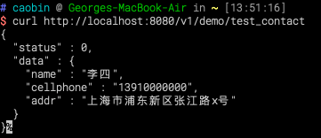
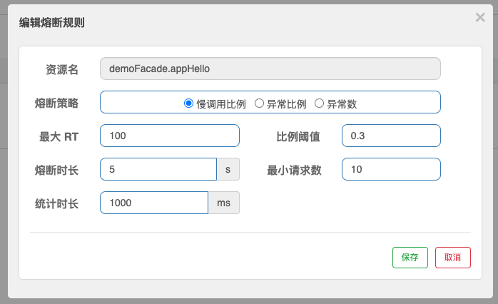

# 服务治理入门

> 以下样例基于MacOS系统，IDEA的IDE进行演示，用其他系统或IDE的同学请参照样例并酌情调整。

服务治理时一个非常宽泛的概念，对于**SEMAK**框架而言，主要是围绕对微服务之间的调用、配置管理，以及服务可靠性的保障来展开。

本节基于 [基础入门](基础入门.md) 章节进行扩展，依然承接之前DEMO项目进行展开，但一些**基础步骤**将不再重复阐述。


## 1. 服务注册与发现

服务注册与发现主要解耦了服务之间的依赖细节（IP，端口等），实现对微服务状态和数据的动态管理。


### 1.1. 准备

1. 已搭建好的 **Alibaba Nacos** 集群服务（**Nacos**版本尽量与框架依赖的客户端版本匹配）。

2. 如果没有通过 [项目生成平台](../准备/项目生成.md) 勾选**服务治理组件**组件的话，我们需要将下面的Maven坐标依赖到`demo-support`模块的POM文件中：

   ```xml
   <dependency>
      <groupId>com.github.semak.rest</groupId>
      <artifactId>semak-rest-spring-cloud-alibaba-starter</artifactId>
      <version>最新RELEASE版本</version>
   </dependency>
   ```

   

### 1.2. 服务注册

**服务注册**旨在将服务以**唯一服务名**的方式发布到一个**中心化**的服务上，让需要调用此服务的**客户端**可以通过**唯一服务名**找到它，并读取它的元数据（构成服务的地址列表，服务状态等）来进行访问。

编辑`application-dev.yml`用户配置文件，加入**Nacos**注册端配置

```yaml
spring:
  ...
  cloud:
    nacos:
      discovery:
        server-addr: 192.168.1.234:22048
```

* 将**Nacos**服务地址指定到 **server-addr** 属性上。

* 启动应用后，我们可以看到`demo`服务已经以应用名`github.demo`注册到**Nacos**服务上。

  
  
  点击 `详情` 操作后，从服务详情页面中，我们可以看到已注册服务节点的详细信息：
  
  
  
  再看一下模拟集群部署时的节点效果：
  
  
  
  


### 1.3. 服务发现

作为一个服务调用方，我们可以利用 [服务方生成的Facade客户端代理](基础入门#_47-生成facade客户端代理（可选）) 类库来**无感知**地访问服务端。

开始之前，我们依然使用**基础入门**中的`demo-invoker`项目来模拟对`demo`项目发布的服务进行调用。

同服务注册一样，我们需要将下面的Maven坐标依赖到`demo-support`模块的POM文件中

```xml
<dependency>
   <groupId>com.github.semak.rest</groupId>
   <artifactId>semak-rest-spring-cloud-alibaba-starter</artifactId>
   <version>最新RELEASE版本</version>
</dependency>
```

服务方生成的Facade客户端代理类库的Maven坐标依赖到`demo-integration`模块的POM文件中

```xml
<dependency>
  <groupId>com.github</groupId>
  <artifactId>demo-facade</artifactId>
  <version>1.0.0-SNAPSHOT</version>
</dependency>
```

编辑`application-dev.yml`用户配置文件，加入**Nacos**调用端配置

```yaml
spring:
  ...
  cloud:
    nacos:
      discovery:
        server-addr: 192.168.1.234:22048
```

同服务端一样，我们甚至不需要配置多余的配置（**listOfServers**这些配置将不再需要），仅仅需要将客户端指向**Nacos**服务即可。

进入`demo-invoker-test/demo-invoker-test-integration`模块，沿用原测试案例（基础入门中定义的测试案例）进行远程服务的调用。

```java
package com.github.demo.invoker.integration;

import org.springframework.boot.autoconfigure.EnableAutoConfiguration;
import org.springframework.context.annotation.ComponentScan;
import org.springframework.context.annotation.Configuration;

/**
* Integration Test Configuration
*
* @author caobin
* @version 1.0 2021.10.20
*/
@Configuration
@EnableAutoConfiguration
@ComponentScan(basePackages = {
        "com.github.demo.invoker.integration"
})
public class IntegrationTestConfiguration {
}
```

```java
package com.github.demo.invoker.integration.cases;

import com.github.demo.domain.dto.UserFetchResponse;
import com.github.demo.invoker.integration.IntegrationTestConfiguration;
import com.github.demo.invoker.integration.UserManager;
import lombok.extern.slf4j.Slf4j;
import org.junit.Assert;
import org.junit.Test;
import org.junit.runner.RunWith;
import org.springframework.beans.factory.annotation.Autowired;
import org.springframework.boot.test.context.SpringBootTest;
import org.springframework.test.context.ActiveProfiles;
import org.springframework.test.context.junit4.SpringRunner;

/**
 * UserManagerTestcase
 *
 * @author caobin
 * @version 1.0
 * @date 2021.10.21
 */
@Slf4j
@RunWith(SpringRunner.class)
@SpringBootTest(classes = IntegrationTestConfiguration.class, webEnvironment = SpringBootTest.WebEnvironment.NONE)
@ActiveProfiles("dev")
public class UserManagerTestcase {

    @Autowired
    private UserManager userManager;

    @Test
    public void fetchOne() {
        UserFetchResponse userFetchResponse = userManager.fetchOneUser("GeorgeZod");
        Assert.assertNotNull(userFetchResponse);
        log.info(">>> Received response: {}", userFetchResponse);
    }
}
```

执行结果：

`demo-invoker`控制台输出：


`demo`控制台输出：


至此，一个完整的服务注册和发现流程就完成了。我们可以看到，有服务治理功能的加持后，不仅中心化管理更为便捷，开发配置也更为简洁。


## 2. 动态配置

在系统开发过程中，开发者通常会将一些需要变更的参数、变量等从代码中分离出来独立管理，以独立的配置文件的形式存在。目的是让静态的系统工件或者交付物（如 WAR，JAR 包等）更好地和实际的物理运行环境进行适配。配置管理一般包含在系统部署的过程中，由系统管理员或者运维人员完成。配置变更是调整系统运行时的行为的有效手段。


### 2.1. 准备

1. 已搭建好的 **Alibaba Nacos** 集群服务（**Nacos**版本尽量与框架依赖的客户端版本匹配）。

2. 如果没有通过 [项目生成平台](../准备/项目生成.md) 勾选**分布式配置组件**的话，我们需要将下面的Maven坐标依赖到`demo-support`模块的POM文件中：

   ```xml
   <dependency>
       <groupId>com.github.semak.config</groupId>
       <artifactId>semak-config-spring-cloud-nacos-starter</artifactId>
       <version>最新RELEASE版本</version>
   </dependency>
   ```

   

### 2.2. 创建外化配置

进入`demo`项目的`demo-config`模块，编辑`bootstrap.yml`引导配置，加入动态配置内容：

```yaml
spring:
  application:
    name: github.demo
	...
  cloud:
    nacos:
      config:
        enabled: true
        file-extension: yaml
        server-addr: 192.168.1.234:22048
```

* 注意这里的`file-extension`要和Nacos控制台中配置的**Data ID**的文件扩展名一致。

进入**Nacos**的控制页面，在**配置管理-配置列表**功能页面中，点击右上角的 **+** 按钮，进入**新建配置**页面，如下图填写内容并点击**发布**：


- **Data ID**：填入`github.demo-dev.yaml`，即应用的`application.name` + `-` + `环境` + `文件扩展名`。
- **Group**：不修改，使用默认值DEFAULT_GROUP。
- **配置格式**：选择YAML。
- **配置内容**：应用要加载的配置内容，这里将**demo**项目中`application-dev.yml`中的的**数据库配置**转移到这里来验证一下（原配置文件中的数据库内容可以删除）。


### 2.3. 应用动态属性配置

#### 2.3.1. 单一类型属性

进入`demo-biz`模块，定义一套新的**DemoFacade**用于测试动态属性的配置。

```java
package com.github.demo.biz.facade;

import com.github.semak.commons.model.dto.Response;

/**
 * DemoFacade
 *
 * @author caobin
 * @version 1.0
 * @date 2021.12.07
 */
public interface DemoFacade {

    /**
     * 单一属性测试
     *
     * @return
     */
    Response<String> testSingleConfig();
}
```

```java
package com.github.demo.biz.facade.provider;

import com.github.demo.biz.facade.DemoFacade;
import com.github.semak.commons.model.dto.Response;
import io.swagger.v3.oas.annotations.tags.Tag;
import lombok.extern.slf4j.Slf4j;
import org.springframework.beans.factory.annotation.Value;
import org.springframework.cloud.context.config.annotation.RefreshScope;
import org.springframework.http.MediaType;
import org.springframework.web.bind.annotation.GetMapping;
import org.springframework.web.bind.annotation.RequestMapping;
import org.springframework.web.bind.annotation.RestController;

/**
 * DemoFacadeProvider
 *
 * @author caobin
 * @version 1.0
 * @date 2021.12.07
 */
@Slf4j
@Tag(name = "DEMO服务")
@RestController
@RefreshScope
@RequestMapping(value = "/v1/demo", produces = MediaType.APPLICATION_JSON_VALUE)
public class DemoFacadeProvider extends BaseFacade implements DemoFacade {

    @Value("${semak.config.demo.config.single:default}")
    private String singleConfig;


    @GetMapping("/test_single")
    @Override
    public Response<String> testSingleConfig() {
        return Response.ofSuccess(singleConfig);
    }
}
```

将`semak.config.demo.config.single`配置到Nacos控制台中，并**发布**。


然后，我们启动程序来验证一下：


在**不重启应用**的前提下，我们将`semak.config.demo.config.single`值更改一下，并重新在控制台上**发布**。


此时，去观察应用控制台，可以发现属性更新的日志：


然后，我们再验证一下：


可以看到，属性已被动态替换。


#### 2.3.2. 对象类型属性

基于上面的单一类型属性创建的**DemoFacade**类，我们继续**对象类型**属性的验证。

进入`demo-domain`模块，定义一个**DTO**类。


进入`demo-biz`模块，继续在**DemoFacade**中定义新的配置对象。


将`semak.config.demo.config.contact`配置到Nacos控制台中，并**发布**。


然后，我们启动程序来验证一下：


在**不重启应用**的前提下，我们将`semak.config.demo.config.contact`中的值更改一下，并重新在控制台上**发布**。


然后，我们再验证一下：



可以看到，对象中的属性也已经被替换了。


## 3. 服务保护

为什么会有服务保护这样一个功能？简单来说，随着业务流量与复杂性增加，微服务部署的增多，大致会产生这样两种情况：

1. 微服务节点流量或突发流量压力增大，而节点处理能力有限导致了服务响应缓慢或不可用情况。

2. 服务链路变长，某个链路上的服务单元如果出了故障，故障在链路调用中会产生放大的效果，导致整条链路的阻塞，继而演变为整体系统的瘫痪。

为解决这两种情况，会分别提供以下两种解决方案：

1. **流量控制**：其原理是监控应用流量的 QPS 或并发线程数等指标，当达到指定的阈值时对流量进行控制，以避免被瞬时的流量高峰冲垮，从而保障应用的高可用性。
2. **熔断降级**：暂时切断不稳定调用，避免局部不稳定因素导致整体的雪崩。


### 3.1. 准备

1. 已搭建好的 **Alibaba Nacos** 集群服务。

1. 已搭建好的 **Alibaba Sentinel Dashboard** 服务。

2. 如果没有通过 [项目生成平台](../准备/项目生成.md) 勾选**服务治理组件**组件的话，我们需要将下面的Maven坐标依赖到`demo-support`模块的POM文件中：

   ```xml
   <dependency>
      <groupId>com.github.semak.rest</groupId>
      <artifactId>semak-rest-spring-cloud-alibaba-starter</artifactId>
      <version>最新RELEASE版本</version>
   </dependency>
   ```

   

### 3.2. 基础配置

通过 **基础配置 + 注解(@SentinelResource)** 的方式来配置对服务资源的保护。**基础配置**需要配合 `Nacos Config` 服务来进行配置。

在应用的 `application-dev.yaml` 中添加如下配置内容：

```yaml
spring:
	...
  cloud:
    sentinel:
      enabled: true
      transport:
        #本应用与Sentinel控制台通信的http-server端口
        port: 8719
        #sentinel-dashboard的服务地址
        dashboard: 192.168.1.234:23048
      eager: true
      datasource:
        #流控规则
        flow:
          nacos:
            server-addr: ${spring.cloud.nacos.discovery.server-addr}
            data-id: ${spring.application.name}-flow-rules
            group-id: SENTINEL_GROUP
            # 规则类型，取值见：
            # org.springframework.cloud.alibaba.sentinel.datasource.RuleType
            rule-type: flow
        #降级规则
        degrade:
          nacos:
            server-addr: ${spring.cloud.nacos.discovery.server-addr}
            data-id: ${spring.application.name}-degrade-rules
            group-id: SENTINEL_GROUP
            rule-type: degrade
        #系统规则
        system:
          nacos:
            server-addr: ${spring.cloud.nacos.discovery.server-addr}
            data-id: ${spring.application.name}-system-rules
            group-id: SENTINEL_GROUP
            rule-type: system
        #授权规则
        authority:
          nacos:
            server-addr: ${spring.cloud.nacos.discovery.server-addr}
            data-id: ${spring.application.name}-authority-rules
            group-id: SENTINEL_GROUP
            rule-type: authority
        #热点规则
        param-flow:
          nacos:
            server-addr: ${spring.cloud.nacos.discovery.server-addr}
            data-id: ${spring.application.name}-param-flow-rules
            group-id: SENTINEL_GROUP
            rule-type: param-flow
```

**配置描述**

| **属性**                                                     | **数据类型**                                                 | **必填** | **默认值**    | **描述**                                                     |
| ------------------------------------------------------------ | ------------------------------------------------------------ | -------- | ------------- | ------------------------------------------------------------ |
| **spring.cloud.sentinel.enabled**                            | boolean                                                      | 否       | true          | 启用Sentinel功能                                             |
| **spring.cloud.sentinel.transport.port**                     | String                                                       | 否       | 8719          | 应用与Sentinel控制台交互的端口，应用本地会起一个该端口占用的HttpServer |
| **spring.cloud.sentinel.transport.dashboard**                | String                                                       | 是       |               | Sentinel控制台的服务地址                                     |
| **spring.cloud.sentinel.transport.heartbeat-interval-ms**    | String                                                       | 否       |               | 应用发送心跳到Sentinel控制台的时间间隔（单位：毫秒）         |
| **spring.cloud.sentinel.transport.client-ip**                | String                                                       | 否       |               | 指定的心跳客户端IP将被注册到Sentinel控制台                   |
| **spring.cloud.sentinel.eager**                              | boolean                                                      | 否       | false         | 是否提前触发 Sentinel 初始化                                 |
| **spring.cloud.sentinel.datasource**                         | `java.util.Map<String, com.alibaba.cloud.sentinel.datasource.config.DataSourcePropertiesConfiguration>` | 否       |               | 数据源配置。Map的Key值，即ruleName可分为：<br/>`flow` , `degrade` , `system` , `authority` , `param-flow` 。 |
| **spring.cloud.sentinel.datasource.&lt;ruleName&gt;.nacos.server-addr** | String                                                       | 是       |               | Nacos服务地址，多个请用英文逗号分隔                          |
| **spring.cloud.sentinel.datasource.&lt;ruleName&gt;.nacos.data-id** | String                                                       | 是       |               | 配置集ID。建议使用 `spring.application.name` + `ruleName` + rules来构成保证唯一性。 |
| **spring.cloud.sentinel.datasource.&lt;ruleName&gt;.nacos.groud-id** | String                                                       | 否       | DEFAULT_GROUP | 配置分组。                                                   |
| **spring.cloud.sentinel.datasource.&lt;ruleName&gt;.nacos.namespace** | String                                                       | 否       |               | 命名空间。建议用于环境隔离                                   |
| **spring.cloud.sentinel.datasource.&lt;ruleName&gt;.nacos.rule-type** | com.alibaba.cloud.sentinel.datasource.RuleType               | 否       |               | 规则类型                                                     |


### 3.3. 应用配置

由于规则的配置都是动态的，所以只要在需要的服务方法上配置 `@SentinelResource` 注解及降级方法等通用属性，规则属性则使用 `sentinel-dashboard` 配置好之后，自动发布到 `Nacos Config` 服务上，再由应用端自动获取到相关规则配置内容，并自动刷新配置。

下面创建一个配置样例，进入`demo-biz`，创建一套服务保护类：

```java
package com.github.demo.biz.facade;

import com.github.semak.commons.model.dto.Response;

/**
 * ProtectFacade
 *
 * @author caobin
 * @version 1.0
 * @date 2021.12.07
 */
public interface ProtectFacade {

    Response<String> appHello(String name);
}
```

```java
package com.github.demo.biz.facade.provider;

import com.alibaba.csp.sentinel.annotation.SentinelResource;
import com.alibaba.csp.sentinel.slots.block.BlockException;
import com.github.demo.biz.facade.ProtectFacade;
import com.github.semak.commons.model.dto.Response;
import com.github.semak.rest.core.exception.BizException;
import com.google.common.util.concurrent.Uninterruptibles;
import io.swagger.v3.oas.annotations.tags.Tag;
import lombok.extern.slf4j.Slf4j;
import org.springframework.http.MediaType;
import org.springframework.web.bind.annotation.GetMapping;
import org.springframework.web.bind.annotation.PathVariable;
import org.springframework.web.bind.annotation.RequestMapping;
import org.springframework.web.bind.annotation.RestController;

import java.util.concurrent.TimeUnit;

/**
 * ProtectFacadeProvider
 *
 * @author caobin
 * @version 1.0
 * @date 2021.12.07
 */
@Slf4j
@Tag(name = "保护服务")
@RestController
@RequestMapping(value = "/v1/demo", produces = MediaType.APPLICATION_JSON_VALUE)
public class ProtectFacadeProvider extends BaseFacade implements ProtectFacade {

    @SentinelResource(value="demoFacade.appHello", blockHandler = "appHelloBlockHandler", fallback = "appHelloFallback")
    @GetMapping(value = "/appHello/{name}")
    @Override
    public Response<String> appHello(@PathVariable("name")String name) {
        if("sleep".equals(name)){
            Uninterruptibles.sleepUninterruptibly(2, TimeUnit.SECONDS);
        }
        if("exception".equals(name)){
            throw new BizException(-99999, "hello, biz exception");
        }
        return Response.ofSuccess("Hello!! " + name);
    }

    public Response<String> appHelloFallback(String name, Throwable e){
        return Response.ofSuccess("Fallback: " + name + ", ex: " + e.getMessage());
    }

    public Response<String> appHelloBlockHandler(String name, BlockException e){
        log.error(e.getMessage(), e);
        return Response.ofSuccess("Block: " + name + ", ex: " + e.getMessage());
    }
}
```

* **@SentinelResource**中的`value`指定了需要做服务保护的资源名称，需要在控制台中制定规则时用到。
* **@SentinelResource**中的`blockHander`和`fallback`分别指定了2中降级处理方法，后面会展开说明


当上述配置完成并启动应用后，使用`curl http://localhost:8080/v1/demo/app_hello/aaa`调用几次接口，我们可以看到 `Sentinel-Dashboard` 上已经将 `github.demo` 应用实例的监控显示出来：


可能出现的问题：

* 实时监控不显示：调用接口后，停止一段时间，监控获取不到新的数据，会停止显示；另外，请检查**Sentinel Dashboard**服务回调应用的IP是否打通（不同网段，路由表设置等问题），从日志中可以看出来（如下）。

  


### 3.4. 流量控制

**流量控制**（flow control），其原理是监控应用流量的 QPS 或并发线程数等指标，当达到指定的阈值时对流量进行控制，以避免被瞬时的流量高峰冲垮，从而保障应用的高可用性。

流量控制主要有两种统计类型，一种是**统计并发线程数**，另外一种则是**统计QPS**。

#### 3.4.1. 并发线程数控制

并发数控制用于保护业务线程池不被慢调用耗尽。例如，当应用所依赖的下游应用由于某种原因导致服务不稳定、响应延迟增加，对于调用者来说，意味着吞吐量下降和更多的线程数占用，极端情况下甚至导致线程池耗尽。

为应对太多线程占用的情况，业内有使用隔离的方案，比如通过不同业务逻辑使用不同线程池来隔离业务自身之间的资源争抢（线程池隔离）。这种隔离方案虽然隔离性比较好，但是代价就是线程数目太多，线程上下文切换的开销比较大，特别是对**低延时的调用**有比较大的影响。

Sentinel 并发控制不负责创建和管理线程池，而是**简单统计当前请求上下文的线程数目**（正在执行的调用数目），如果超出阈值，新的请求会被立即拒绝，效果类似于信号量隔离。

**配置并发线程数的流控规则的步骤：**

1. 登录Sentinel控制台，点选当前应用，如这里的 `github.demo` 。在展开的菜单中点选 **流控规则** ，这里的规则配置会在此应用的所有服务节点上生效。

2. 点击右上角按钮 **新增流控规则**，分别配置**资源名**、**阈值类型**和**单机阈值**。配置完成后，点选**新增按钮**，这条规则就在应用服务侧更新完毕了。

   

   - 新增完成以后，需要刷新页面，才可以显示出新规则。
   - **资源名**： `@SentinelResource` 中的 `value` 属性值。
   - **阈值类型**：选择**线程数**。
   - **单机阈值**：输入**3**，即单个服务节点同时处理当前资源的线程数不超过3个。

 3. 在**Sentinel Dashboard**上配置完成后，我们可以看到**Nacos**的配置中自动添加了一条**Sentinel**的流控规则，且即时生效。

    

 4. 基于上面应用配置的样例，我们执行一次 `curl -X GET "http://localhost:8080/v1/demo/app_hello/sleep" -H "accept: application/json"` ，返回结果如下：	

    

    然后，我们分出4个会话窗口同时执行，让 `demoFacade.appHello` 占满4个以上线程，就会发现，其中一个会话窗口的返回的报文内容为降级后的输出（执行降级方法-`xxxBlockHandler`），故其请求的流量被拒绝了。	

    

    查看 `Sentinel` 控制台的实时监控，的确也是如此。通过3个QPS，拒绝了1个QPS。

    


#### 3.4.2. QPS流量控制

和并发线程数控制不同，5个并发线程如果每个处理效率不同，其QPS是不定的。有时候，为了更精确的控制QPS，需要用到QPS的流量控制规则。

所谓QPS流量控制，就是当QPS超过某个阈值的时候，则采取措施进行流量控制。流量控制的效果包括以下几种：**直接拒绝**、**Warm Up**、**匀速排队**。

1. **直接拒绝**方式是默认的流量控制方式，当QPS超过任意规则的阈值后，新的请求就会被立即拒绝，拒绝方式为抛出`FlowException`。这种方式适用于对系统处理能力确切已知的情况下，比如通过压测确定了系统的准确水位时。
2. **Warm Up**方式，即预热/冷启动方式。当系统长期处于低水位的情况下，当流量突然增加时，直接把系统拉升到高水位可能瞬间把系统压垮。通过"冷启动"，让通过的流量缓慢增加，在一定时间内逐渐增加到阈值上限，给冷系统一个预热的时间，避免冷系统被压垮。
3. **匀速排队**方式，会严格控制请求通过的间隔时间，也即是让请求以均匀的速度通过，对应的是漏桶算法。


**配置QPS的流控规则的步骤：**

此处样例仅以**直接拒绝**的流控效果做演示，其他流控效果，请同学们自己查阅官方文档，进行调试，这里就不再赘述了。

1. 登录Sentinel控制台，点选当前应用，如这里的 `semak-rest-demo` 。在展开的菜单中点选 **流控规则** ，这里的规则配置会在此应用的所有服务节点上生效。

2. 点击右上角按钮 **新增流控规则**，分别配置**资源名**、**阈值类型**和**单机阈值**。配置完成后，点选**新增按钮**，这条规则就在应用服务侧更新完毕了。

   

   * 资源名为 `@SentinelResource` 中的 `value` 属性值。

   - 阈值类型选择期望设置的QPS值。

   - 单机阈值选输入**100**，即100QPS。

3. 基于上面应用配置的样例，我们用JMeter进行一次60秒的接口压力测试（请求相对路径为`/v1/demo/app_hello/aaa`），并发数为10，测试报告如下：

   

   按照整体吞吐量（QPS）和错误比率来算，大致的QPS应该是 `4395.6*(1-0.9772)=100.21968`，折算部分损耗，十分接近我们所设定的100QPS的值了。再查看 `Sentinel` 控制台的实时监控，整个压测过程通过100个QPS，拒绝了4000~5000+个QPS，数据与测试报告基本吻合。

   


### 3.5. 熔断降级

除了流量控制以外，对调用链路中不稳定的资源进行熔断降级也是保障高可用的重要措施之一。

由于调用关系的复杂性，如果调用链路中的某个资源不稳定，最终会导致请求发生堆积。Sentinel **熔断降级**会在调用链路中某个资源出现不稳定状态时（例如调用超时或异常比例升高），对这个资源的调用进行限制，让请求快速失败，避免影响到其它的资源而导致级联错误。当资源被降级后，在接下来的降级时间窗口之内，对该资源的调用都**自动熔断**。


#### 3.5.1. 熔断策略

我们通常用以下几种方式来衡量资源是否处于稳定的状态：

- **慢调用比例**：选择以慢调用比例作为阈值，需要设置允许的慢调用 RT（即最大的响应时间），请求的响应时间大于该值则统计为慢调用。当单位统计时长（`statIntervalMs`）内请求数目大于设置的最小请求数目，并且慢调用的比例大于阈值，则接下来的熔断时长内请求会自动被熔断。经过熔断时长后熔断器会进入探测恢复状态（HALF-OPEN 状态），若接下来的一个请求响应时间小于设置的慢调用 RT 则结束熔断，若大于设置的慢调用 RT 则会再次被熔断。

  - **比例阈值**：慢调用统计数对于最小请求数的占有比例；

  - **熔断时长**：超过时间后会尝试恢复；
  - **最小请求数**：触发熔断的最小请求数目，若当前统计窗口内的请求数小于此值，即使达到了熔断条件也不会触发。

- **异常比例**：当资源的每秒请求量 >= N（可配置），并且每秒异常总数占通过量的比值超过阈值之后，资源进入降级状态，即在接下的时间窗口（以 s 为单位）之内，对这个方法的调用都会自动地返回。异常比率的阈值范围是 `[0.0, 1.0]`，代表 0% - 100%。

- **异常数**：当资源近 1 分钟的异常数目超过阈值之后会进行熔断。注意由于统计时间窗口是分钟级别的，若 `timeWindow` 小于 60s，则结束熔断状态后仍可能再进入熔断状态。

需要注意的是，在下面这段样例代码中，我们可以发现两个降级处理方法，即 `blockHandler` 指向的 `appHelloBlockHandler` 和 `fallback` 指向的 `appHelloFallback` 。

```java
@Slf4j
@Tag(name = "保护服务")
@RestController
@RequestMapping(value = "/v1/demo", produces = MediaType.APPLICATION_JSON_VALUE)
public class ProtectFacadeProvider extends BaseFacade implements ProtectFacade {

    @SentinelResource(value="demoFacade.appHello", blockHandler = "appHelloBlockHandler", fallback = "appHelloFallback")
    @GetMapping(value = "/appHello/{name}")
    @Override
    public Response<String> appHello(@PathVariable("name")String name) {
        if("sleep".equals(name)){
            Uninterruptibles.sleepUninterruptibly(2, TimeUnit.SECONDS);
        }
        if("exception".equals(name)){
            throw new BizException(-99999, "hello, biz exception");
        }
        return Response.ofSuccess("Hello!! " + name);
    }

    public Response<String> appHelloFallback(String name, Throwable e){
        return Response.ofSuccess("Fallback: " + name + ", ex: " + e.getMessage());
    }

    public Response<String> appHelloBlockHandler(String name, BlockException e){
        log.error(e.getMessage(), e);
        return Response.ofSuccess("Block: " + name + ", ex: " + e.getMessage());
    }
}
```

这两个降级处理方法的区别在于：

- `xxxFallback` : 处理应用级抛出的所有异常。

- `xxxBlockHandler` : 限流降级本身的异常（`BlockException`）。比如，流控中被拒绝的哪些QPS的请求；进入熔断状态后直至恢复正常状态前的请求等。


**配置慢调用比例熔断规则的步骤：**

> 此处样例仅以**慢调用比例熔断规则**的降级效果做演示，模拟服务调用超时情况。其他策略，请同学们自己查阅官方文档，进行调试，这里就不再赘述了。

1. 调整sleep代码：

   ```java
   if("sleep".equals(name)){
       int s = DateTime.now().secondOfMinute().get();
       if ( s > 5 && s < 15 || s > 25 && s < 35 || s > 45 && s < 55) {
           Uninterruptibles.sleepUninterruptibly(2, TimeUnit.SECONDS);
       } else {
           Uninterruptibles.sleepUninterruptibly(50, TimeUnit.MILLISECONDS);
       }
   }
   ```

   这样调整的目的是为了能看出整个过程中规则运作的曲线是否符合预期。

2. 那么，现在我们要为这个方法设置一个**慢调用比例熔断规则**。登录Sentinel控制台，点选当前应用，如这里的 `github.demo` 。在展开的菜单中点选 **熔断规则** ，这里的规则配置会在此应用的所有服务节点上生效。

3. 点击右上角按钮 **新增熔断规则**，分别配置**资源名**、**熔断策略**、**最大RT**、**比例阈值**、**熔断时长**、**最小请求数**和**统计时长**。配置完成后，点选**新增按钮**，这条规则就在应用服务侧更新完毕了。

   

   - 资源名为 `@SentinelResource` 中的 `value` 属性值。
   - 熔断策略选择慢调用比例。
   - 最大RT值设置为100ms。
   - 比例阈值设置为0.3（慢调用的比例大于阈值，则接下来的熔断时长内请求会自动被熔断）。
   - 熔断时长设置为5秒。
   - 最小请求数设置为10个（熔断触发的最小请求数，请求数小于该值时即使异常比率超出阈值也不会熔断）。

4. 在**Sentinel Dashboard**上配置完成后，我们可以看到**Nacos**的配置中自动添加了一条**Sentinel**的降级规则，且即时生效。

   

5. 在配置好**慢调用比例熔断规则**的情况下，再用JMeter调用sleep的接口，30个并发调用180秒的测试报告如下，我们用响应时间的聚合图表看起来会更加直观。

   

   * 在正常区间调用一段时间后，一旦有超过阈值设定响应时间的请求，就会触发熔断机制，并进入熔断窗口。
   * 在半开尝试接受请求并符合阈值区间后，断路器关闭，后面的请求会正常进入。

   再查看Sentinel控制台的实时监控图形如下：

   

   - 上图**绿色部分**指向的波谷QPS全部通过，说明正在正常调用服务。
   - 上图**蓝色部分**指向的波峰为拒绝的QPS，说明触发了熔断规则，服务进入了熔断的时间窗口，直接返回了降级的响应报文。

   在设置了**慢调用比例熔断规则**的情况下，测试报告和控制台监控的数据也是高度吻合。
