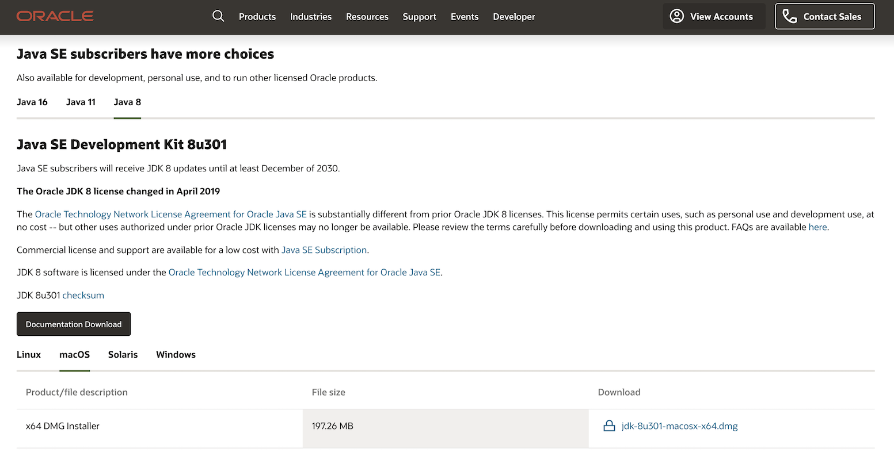
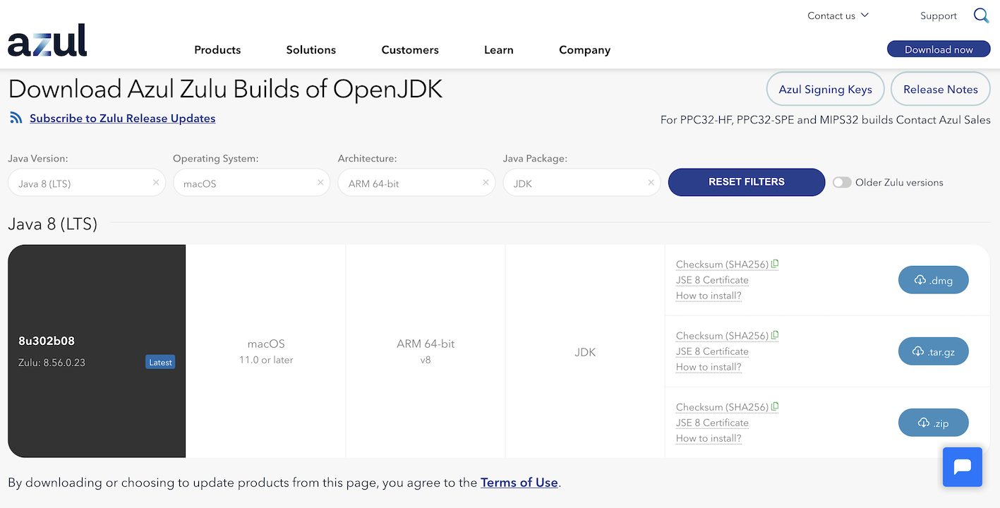
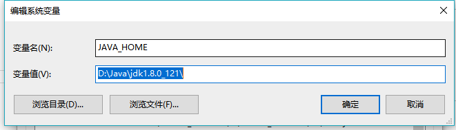
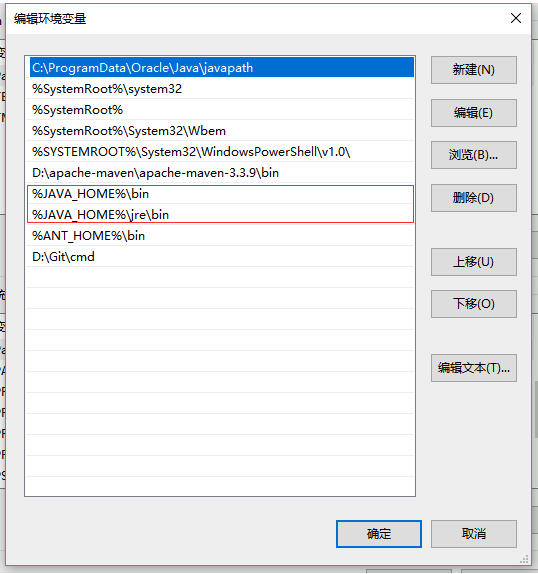
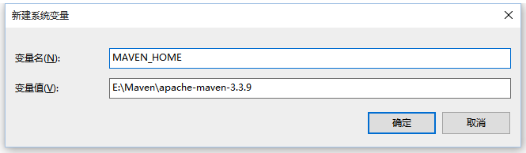
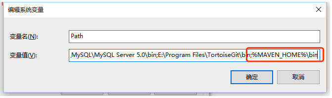

# 环境配置

## 1. 安装Java

使用Java的第一步是安装它。总的来说，你需要联网执行本部分的命令，因为我们要从网上下载Java。

Java编译器可以运行和编译在许多平台上，诸如 x86 和 x86-64 CPU 构架的 Linux、Mac 和 Windows 平台。

由于开发同学们都是使用MacOS和Windows平台，故此处仅以这2个平台的环境配置进行阐述。


### 1.1. 开始安装Java

> 由于SEMAK框架及组件代码基于Java8进行开发，所以你安装的JDK版本必须在8版本及以上

1. 进入Oracle官方下载页面下载JDK：[JDK8下载](http://www.oracle.com/technetwork/java/javase/downloads/jdk8-downloads-2133151.html) 。
    
2. 接受`Accept License Agreement`，找到相应的`Product / File Description`对应的文件，点击下载。例如：MacOS对应`jdk-8u301-macosx-x64.dmg`，Windows对应`jdk-8u301-windows-x64.exe`。  

      

3. 点击安装包，并按照步骤进行安装，安装完毕后，进入下一环节。

4. 如果你使用的是基于ARM架构的MacOS，请到[这里](https://www.azul.com/downloads/?version=java-8-lts&os=macos&architecture=arm-64-bit&package=jdk)下载对应的JDK安装程序。

    


### 1.2. 环境变量配置

> 版本号请根据实际下载的版本号进行调整

* **MacOS配置方式**

  1. 确认本机所使用的shell是哪个：`zsh`或`bash`。在命令行中输入`echo $SHELL`，如果输出`/bin/bash`则为`bash`，如果输出结果为`/bin/zsh`则为`zsh`。

  2. 根据上面不同的结果修改不同的配置文件。若为`bash`，打开 `~/.bash_profile`，若为`zsh`打开`~/.zshrc`。

  3. 在相应的文件末尾添加以下内容，并保存。
      ```bash
      export JAVA_HOME=$(/usr/libexec/java_home)
      #使用 echo $PATH 查看是否已将JDK的bin目录加入PATH，如未添加，则再添加下面的PATH配置
      export PATH=$PATH:$(/usr/libexec/java_home)/bin
      ```

  4. 在`~/`目录，命令行执行`source`命令，`source .bash_profile` 或 `source .zshrc`。

  5. 执行`java -version`，`javac -version`命令，出现JDK的版本信息即已配置成功。

* **Windows配置方式**

  1. 配置系统环境变量`JAVA_HOME`，变量值就是安装JDK的目录。    
     
     
     
  2. 配置系统环境变量PATH,下图中的红色区域。    
  
     
  
  3. 执行`java -version`，`javac -version`命令，出现JDK的版本信息即已配置成功。
  
* **是否需要配置CLASSPATH ？**

  如果使用JDK1.4及以前版本，由于没有自动搜索当前路径下类文件的功能，且无法自动加载Java的编译和运行工具，所以必须配置`dt.jar`和`tools.jar`。

  而JDK1.5(JDK 5.0)以后的版本，都具有自动搜索当前路径下的类文件的功能，而且使用Java的编译和运行工具时，系统可以自动加载`dt.jar`和`tools.jar`文件中的Java类，因此不再需要设置classpath环境变量了。

  我们现在使用JDK8.0版本，所以不需要配置`CLASSPATH`。


## 2. 安装Maven

安装完成JDK以后，我们需要Maven进行项目的管理及构建。

### 2.1. 开始安装Maven

> Maven版本需在3.3.9及以上

1. 进入Apache官方下载页面下载Maven：[Maven3下载](https://maven.apache.org/download.cgi)

2. 解压压缩包到指定目录即可，解压完毕后，进入下一环节。


### 2.2. 环境变量配置

> 版本号请根据实际下载的版本号进行调整

* **MacOS配置方式**

  1. 确认本机所使用的shell是哪个：`zsh`或`bash`。在命令行中输入`echo $SHELL`，如果输出`/bin/bash`则为`bash`，如果输出结果为`/bin/zsh`则为`zsh`。

  2. 根据上面不同的结果修改不同的配置文件。若为`bash`，打开 `~/.bash_profile`，若为`zsh`打开`~/.zshrc`。

  3. 在相应的文件末尾添加以下内容，并保存。
      ```bash
      export MAVEN_HOME=$HOME/local/maven
      export PATH=$PATH:$MAVEN_HOME/bin
      ```

  4. 在`~/`目录，命令行执行`source`命令，`source .bash_profile` 或 `source .zshrc`。

  5. 执行`mvn -v`命令，出现Maven的版本信息即已配置成功。

* **Windows配置方式**

  1. 配置系统环境变量`MAVEN_HOME`，变量值就是安装Maven的目录。    
     
      

  2. 配置系统环境变量PATH,下图中的红色区域。    
     
      

  3. 执行`mvn -v`命令，出现Maven的版本信息即已配置成功。


### 2.3. Maven配置

我们需要为Maven添加一些配置，以配合项目开发的需要。

进入Maven的`conf`目录，修改`settings.xml`文件，添加如下内容：

```xml
<profile>
    <id>xx-repo</id>
    <properties>
         <distribution.snapshots.id>snapshots</distribution.snapshots.id>
         <distribution.releases.id>releases</distribution.releases.id>
         <distribution.snapshots.url>http://你的Nexus私服地址/nexus/content/repositories/snapshots/</distribution.snapshots.url>
         <distribution.releases.url>http://你的Nexus私服地址/nexus/content/repositories/releases/</distribution.releases.url>
    </properties>
    <repositories>
        <repository>
            <snapshots>
                <enabled>true</enabled>
            </snapshots>
            <id>public</id>
            <name>Public Repositories</name>
            <url>http://你的Nexus私服地址/nexus/content/groups/public/</url>
        </repository>
    </repositories>
    <pluginRepositories>
      <pluginRepository>
          <id>public</id>
          <name>Public Repositories</name>
          <url>http://你的Nexus私服地址/nexus/content/groups/public/</url>
          <releases>
              <enabled>true</enabled>
          </releases>
          <snapshots>
              <enabled>true</enabled>
          </snapshots>
      </pluginRepository>
    </pluginRepositories>
</profile>


<activeProfiles>
    <activeProfile>xx-repo</activeProfile>
</activeProfiles>
```