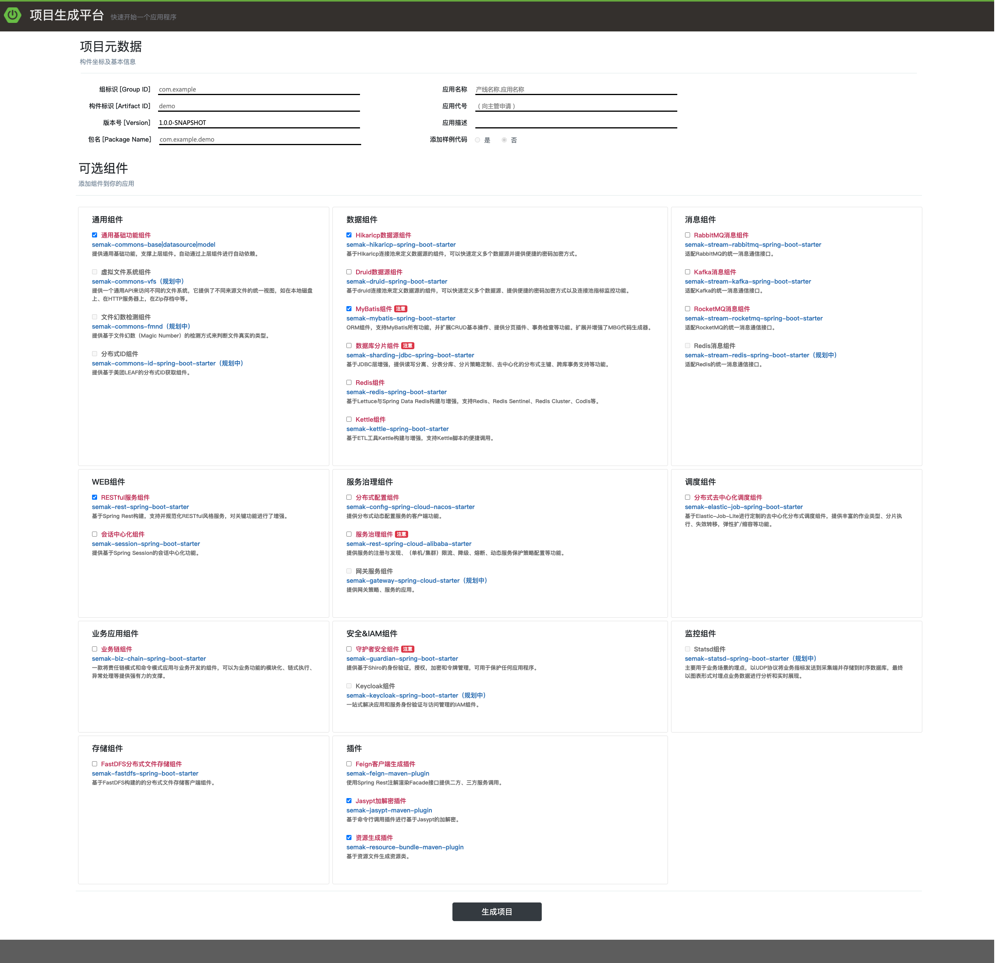
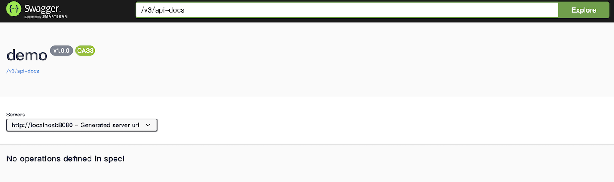

# 项目生成

在配置完开发环境后，我们开始使用脚手架生成项目。


## 1. 项目生成方式

### 1.1. 使用项目生成平台生成

`项目生成平台`是一个可视化、可配置化的项目生成工具。工具地址 (内网环境)：[项目生成平台](http://192.168.3.102:11080/)




* 项目元数据区域：主要提供生成项目必须的元数据，如坐标、版本等。  
  - 组名：项目的组名，即`GroupId`。
  - 构件名：项目构件名，即`ArtifactId`。
  - 版本号：项目版本号。
  - 包名：项目的包名。
  - 应用名称：项目的应用名称，对应`spring.application.name`，请严格按照`产线.应用名`来定义。
  - 应用代号：项目的应用代号，向各自主管申请后填入。
  - 应用描述：项目的简要描述。
  - 添加样例代码：增加样例代码，由于不同组件搭配时，样例之间组合的兼容性问题，目前此功能仅能选否，后续再排计划进行开发验证。

* 依赖组件区域：主要提供可灵活配置的依赖组件，根据项目需要进行勾选。

填写完毕**项目元数据**及选择完成**依赖组件**后，点击`生成项目`，稍候片刻，项目将自动以zip包的方式下载到本地。解压后，按照[运行](#_2-运行项目)流程启动项目。


### 1.2. 使用命令行方式生成

由于项目生成机制的变化，已经不基于Archetype的脚手架模式来生成了，所以命令行的方式取消。


## 2. 运行项目

当我们创建完成一个`demo`项目后，我们需要对项目先进行`install`：

```bash
cd demo
mvn -Dmaven.test.skip=true install
```

安装成功后，接下来，我们可以开始启动项目了。


### 2.1. 启动项目

> 如果依赖了一些数据库和中间件，请将相关配置安装文档要求配置好再启动

#### 2.1.1. 命令行方式启动

命令行方式启动，会加载项目中的`logback-spring.xml`文件，将日志输出到文件，默认起始目录为 **用户目录**。

```bash
cd demo-biz/target
java -Dspring.profiles.active=dev -jar demo-biz-exec.jar
```


#### 2.1.2. IDE方式启动

将`demo`项目导入Eclipse或IDEA，在`demo-biz`下找到`ApplicationLauncher`执行即可，此时会调用`logback-spring.xml`在控制台进行日志输出。

**需要注意的事项**

* 如果你在IDE中运行项目，别忘记指定激活的环境：`-Dspring.profiles.active=dev`，不设置的话会造成应用无法启动的哦。

* 细心的同学应该发现，在biz模块的target目录下有：`demo-biz.jar`和`demo-biz-exec.jar`2个jar，那有啥区别呢？由于`test`模块运行时需要依赖**非boot结构的jar**，而exec后缀的jar是基于boot结构来构建的。所以，当你需要使用jar来启动服务时，需要使用`demo-biz-exec.jar`。


### 3. 服务验证

怎么才算启动好，当然，看日志是一种方式。在依赖**RESTful服务组件**后最直观的方式就是打开浏览器，输入`http://localhost:8080`，看到如下画面，就大功告成了：  

