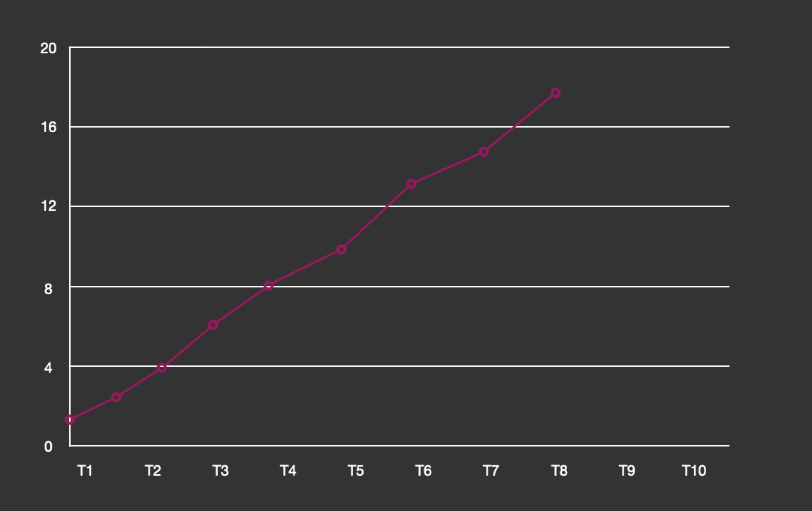

# semak-commons-id

`semak-commons-id`组件是基于美团分布式ID服务Leaf构建的客户端配套组件。主要特性包括：

1. 全局唯一，绝对不会出现重复的ID。
1. 客户端负载均衡支持，并提供多种策略选择。
2. 支持号段模式生成ID。
3. 支持通过分布式增强的SNOWFLAKE算法模式生成ID。
4. 支持生成趋势递增的ID（可动态扩容/缩容，高性能，高可用）。
5. 支持生成单调递增的ID（为严格保障ID的单调递增，目前仅支持指定单节点生成ID）。
6. 支持简单的通信认证。


## 1. 先决条件

### 1.1. 环境配置


1. Open JDK 1.8+，并已配置有效的环境变量。
1. Maven 3.3.x+，并已配置有效的环境变量。
1. 已部署的Leaf服务（2个节点以上），源码来源：https://github.com/manticorecao/Leaf ， 在原有框架上添加了部分增加功能。


### 1.2. Maven依赖配置

```xml
<dependency>
   <groupId>com.github.semak.commons</groupId>
   <artifactId>semak-commons-id-spring-boot-starter</artifactId>
   <version>最新RELEASE版本</version>
</dependency>
```


## 2. 属性定义

```yaml
spring:
  id-service:
    enabled: true
    server: 192.168.3.24:13080,192.168.3.25:13080
    mono-incr-server: 192.168.3.24:13080
    secret: zBVf5tXmHxFGApFFQ
    lb-strategy: round_robin_strategy
```


### 2.1. 属性描述

| **属性**                               | **数据类型** | **必填** | **默认值**           | **描述**                                                     |
| :------------------------------------- | :----------- | :------- | :------------------- | :----------------------------------------------------------- |
| **spring.id-service.enabled**          | boolean      | 否       | true                 | 是否启用分布式ID生成客户端                                   |
| **spring.id-service.server**           | string       | 是       |                      | 用于**趋势递增ID**指定的Leaf服务节点，多个请用英文逗号分隔。<br/> e.g.: xx:xx:xx:xx:13080,xx.xx.xx.xy:13080 |
| **spring.id-service.mono-incr-server** | string       | 是       |                      | 用于**单调递增ID**指定的Leaf服务节点，由于特性所限，仅支持配置一个节点。<br/> e.g.: xx:xx:xx:xx:13080<br/>需要注意的是，当更换此节点时，务必保证原来使用的节点被关闭或重启。否则，当切换回来的时候无法保证ID的单调递增。 |
| **spring.id-service.secret**           | string       | 否       |                      | 用于通信认证使用的secret                                     |
| **spring.id-service.lb-strategy**      | string       | 否       | round_robin_strategy | 支持的客户端负载均衡策略：<br/> 1. **round_robin_strategy**: 轮询 <br/> 2. **random_strategy**: 随机 |


## 3. 使用方式

### 3.1. 名词解释

在开始使用之前，我们需要了解有序性递增的两种模式：**单调递增和趋势递增**。

**有序性之单调递增**



**单调递增**：T表示全局绝对时点，假设有T<sub>n+1</sub>>T<sub>n</sub>（绝对时间总是往前进的），那么必然有F(T<sub>n+1</sub>)>F(T<sub>n</sub>)，它能够保证**下一个ID一定大于上一个ID**。 另外需要特别说明的是**单调递增**跟**连续性递增**是**不同**的概念。 **连续性递增**：`F(n+1)=(F(n)+step)`即下一次获取的ID一定等于当前`ID+Step`，当`Step=1`时类似于这样一个序列:`1->2->3->4->5`。

本组件中，为保障单调递增的严格性，仅能指定一个节点用于单调递增ID的获取。


**有序性之趋势递增**


**趋势递增**：T<sub>n</sub>>T<sub>n-s</sub>，那么大概率有F(T<sub>n</sub>)>F(T<sub>n-s</sub>)。虽然在一段时间间隔内有乱序，但是整体趋势是递增。从上图上看，是有上升趋势的（趋势线）。

- 在**SnowflakeId**中n-s受到全局时钟同步影响。
- 在号段模式(**SegmentId**)中n-s受到号段可用区间(`Step`)影响。

本组件中，由于Leaf Server节点各自持有不同号段，意味着在一个时间段内不同节点获取到的ID是乱序的。但整体趋势的递增，即全局趋势递增。


### 3.2. 号段模式

由于号段模式是依赖**数据库（目前仅支持MySQL）**的。所以，当你想要新建一个号段的时候，请在Leaf Server的数据库中添加一条业务类型相关的ID生成初始化记录。如：

```sql
insert into leaf_alloc(biz_tag, max_id, step, description) values('leaf-segment-test', 1, 2000, 'Test leaf Segment Mode Get Id')
```

* **biz_tag**：业务类型
* **max_id**：当前可以生成的最大ID
* **step**：一次缓冲到Leaf Server的号段跨度


```java
@Autowired
private IdServiceClient idServiceClient;

@Test
public void getSegment() {
    log.info("id:{}", idServiceClient.getSegment("leaf-segment-test"));
}
```

```
id:1
id:2001
id:2
id:2002
id:3
id:2003
id:4
id:2004
id:5
id:2005
```

* 绑定**IdServiceClient**接口。
* 利用**getSegment**方法来生成**趋势递增**的ID（建议）。


```java
@Autowired
private IdServiceClient idServiceClient;

@Test
public void getMonoIncrSegment() {
    log.info("id:{}", idServiceClient.getMonoIncrSegment("leaf-segment-test"));
}
```

```
id:6
id:7
id:8
id:9
id:10
id:11
id:12
id:13
id:14
id:15
```

* 绑定**IdServiceClient**接口。
* 利用**getMonoIncrSegment**方法来生成**单调递增**的ID。


### 3.3. Snowflake模式

```java
@Autowired
private IdServiceClient idServiceClient;

@Test
public void getSnowflake() {
    log.info("id:{}", idServiceClient.getSnowflake());
}
```

```
id:2217051141705737
id:2217051267530768
id:2217051305283631
id:2217051334639694
id:2217051368198213
id:2217051397554205
id:2217051426918431
id:2217051481440310
id:2217051506610259
id:2217051535966264
```

* 绑定**IdServiceClient**接口。
* 利用**getSnowflake**方法来生成**趋势递增**的ID（建议）。


```java
@Autowired
private IdServiceClient idServiceClient;

@Test
public void getSnowflake() {
    log.info("id:{}", idServiceClient.getMonoIncrSnowflake());
}
```

```
id:2219130904121441
id:2219130962841680
id:2219131097059355
id:2219131130613762
id:2219131159973927
id:2219131193528324
id:2219131218694196
id:2219131243859985
id:2219131269025883
id:2219131302580320
```

* 绑定**IdServiceClient**接口。
* 利用**getMonoIncrSnowflake**方法来生成**单调递增**的ID。

