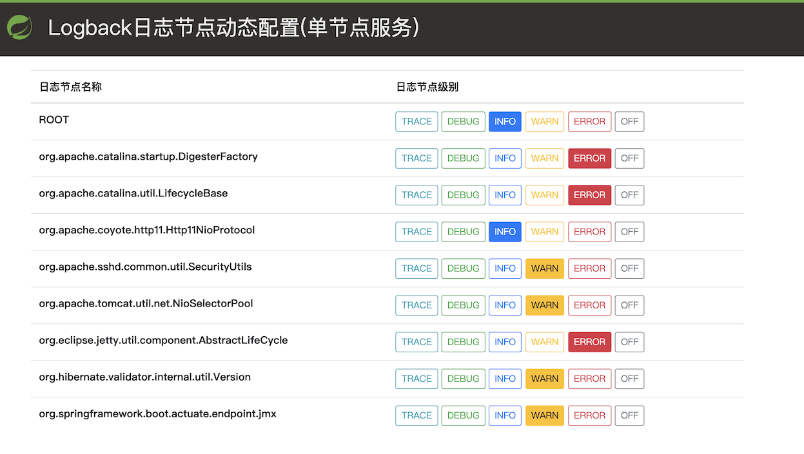
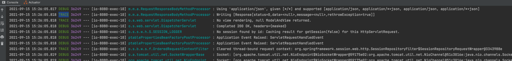
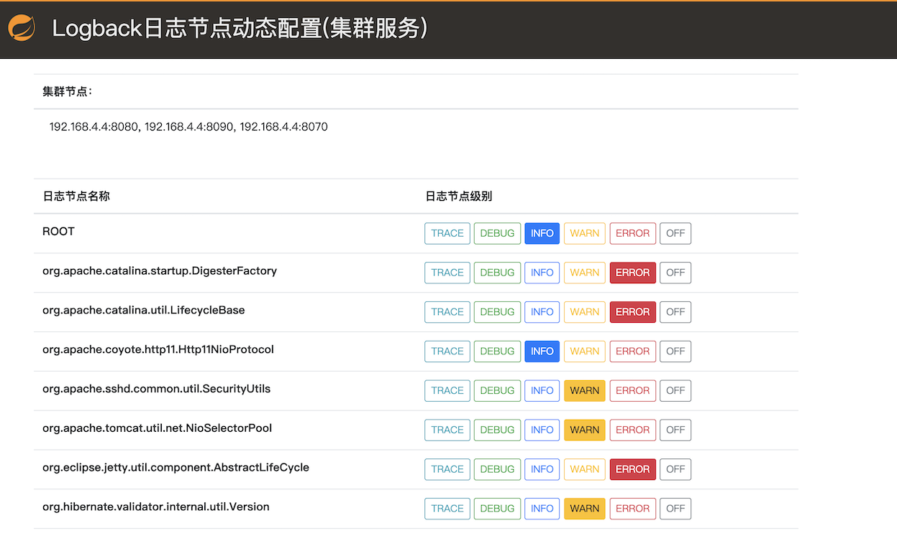
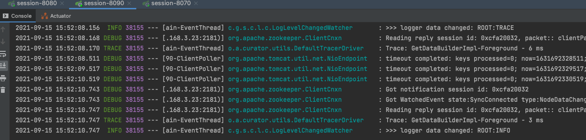
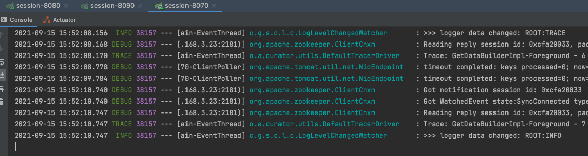

# semak-commons-logback

`semak-commons-logback`组件主要提供应用节点的日志级别动态调整，方便线上环境进行日志调试。主要特性包括：


1. 支持Logback。
1. 应用单节点日志级别的动态调整。
1. 应用集群日志级别的动态调整。
1. UI调整界面。


## 1. 先决条件


### 1.1. 环境配置


1. Open JDK 1.8+，并已配置有效的环境变量。
1. Maven 3.3.x+，并已配置有效的环境变量。
1. Zookeeper 3.6+ （在使用应用集群日志级别的动态调整功能时必选）


### 1.2. Maven依赖配置


```xml
<dependency>
    <groupId>com.github.semak.commons</groupId>
    <artifactId>semak-commons-logback</artifactId>
    <version>最新RELEASE版本</version>
</dependency>
```


## 2. 调整日志级别

### 2.1. 调整单节点日志级别

调整后的日志级别，仅对当前节点生效。

#### 2.1.1. 访问Logback日志节点动态配置服务

通过访问`http://{IP:PORT}/logback/_index`来打开Logback日志节点的动态配置服务页面：




#### 2.1.2. 更改日志节点级别

找到需要更改的**日志节点名称**，点击页面右侧的**日志节点级别**，点击**按钮**修改到你需要的日志级别，无需重启应用，即时生效。

比如，我们把**ROOT**节点改为**TRACE**


观察控制台输出如下：



我们可以看到，**TRACE**和**DEBUG**日志都打印出来了。


### 2.2. 调整集群节点日志级别

调整后的日志级别，由Zookeeper进行协调，对当前**应用名（spring.application.name）**下的所有节点生效。

#### 2.2.1. 属性配置

```yaml
spring:
  logback:
    endpoint:
      cluster:
        enabled: true
        reg-center:
          server-list: "192.168.3.23:2181,192.168.3.33:2181,192.168.3.43:2181"
          namespace: logback-endpoints/${spring.application.name}/${spring.profiles.active}
          digest: "admin:123456"
```


#### 2.2.2. 属性描述

| **属性**                                                     | 类型    | **必填** | **默认值** | **描述**                                                     |
| :----------------------------------------------------------- | :------ | :------- | :--------- | :----------------------------------------------------------- |
| **spring.logback.endpoint.cluster.enabled**                  | boolean | 否       | false      | 启用集群节点的日志级别调整功能                               |
| **spring.logback.endpoint.cluster.server-list**              | String  | 是       |            | 连接 ZooKeeper 服务器的列表。由IP地址和端口组成，多个IP地址使用英文逗号分隔 。<br/>例子：`host1:2181,host2:2181` |
| **spring.logback.endpoint.cluster.reg-center.namespace**     | String  | 是       |            | zookeeper的命名空间                                          |
| **spring.logback.endpoint.cluster.reg-center.base-sleep-time-milliseconds** | int     | 否       | 1000       | 等待重试的间隔时间的初始毫秒数                               |
| **spring.logback.endpoint.cluster.reg-center.max-sleep-time-milliseconds** | int     | 否       | 3000       | 等待重试的间隔时间的最大毫秒数                               |
| **spring.logback.endpoint.cluster.reg-center.max-retries**   | int     | 否       | 3          | 最大重试次数                                                 |
| **spring.logback.endpoint.cluster.reg-center.session-timeout-milliseconds** | int     | 否       | 60000      | 会话超时毫秒数                                               |
| **spring.logback.endpoint.cluster.reg-center.connection-timeout-milliseconds** | int     | 否       | 15000      | 连接超时毫秒数                                               |
| **spring.logback.endpoint.cluster.reg-center.digest**        | String  | 否       |            | 连接 ZooKeeper 的权限令牌（digest为ACL Schema中的一种）      |


#### 2.2.3. 访问Logback日志节点动态配置服务

通过访问`http://{IP:PORT}/logback/_cluster`来打开Logback日志节点的动态配置服务页面：



同时，通过展示的**集群节点**，我们可以看到有哪些节点服务这次的改动生效。


#### 2.2.4. 更改日志节点级别

找到需要更改的**日志节点名称**，点击页面右侧的**日志节点级别**，点击**按钮**修改到你需要的日志级别，无需重启应用，即时生效。

比如，我们把**ROOT**节点改为**TRACE**


我们开启3个进程，观察控制台输出如下：

**进程-8080**


**进程-8090**



**进程-8070**



我们可以看到，当我们调整某一个节点时，所有节点的**TRACE**和**DEBUG**日志都打印出来了。