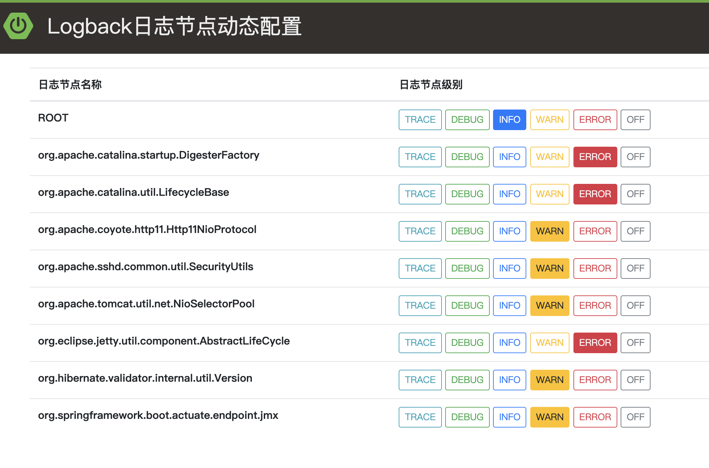

# semak-commons-logback

`semak-commons-logback`组件主要提供应用节点的日志级别动态调整，方便线上环境进行日志调试。主要特性包括：


1. 支持Logback。
1. 应用单节点日志级别的动态调整。
1. 应用集群日志级别的动态调整（规划中）。
1. UI调整界面。


## 1. 先决条件


### 1.1. 环境配置


1. Open JDK 1.8+，并已配置有效的环境变量。
1. Maven 3.3.x+，并已配置有效的环境变量。
1. 需要Spring MVC支持。


### 1.2. Maven依赖配置


```xml
<dependency>
    <groupId>com.github.semak.commons</groupId>
    <artifactId>semak-commons-logback</artifactId>
    <version>最新RELEASE版本</version>
</dependency>
```


## 2. 调整日志级别

### 2.1. 访问Logback日志节点动态配置服务

通过访问`http://{IP:PORT}/logback/_index`来打开Logback日志节点的动态配置服务页面：



### 2.2. 更改日志节点级别

找到需要更改的日志节点名称，点击页面右侧的日志节点级别，点击**按钮**修改到你需要的日志级别，无需重启应用，即时生效。

