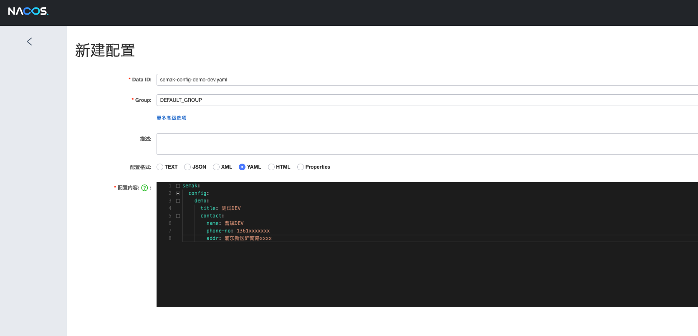
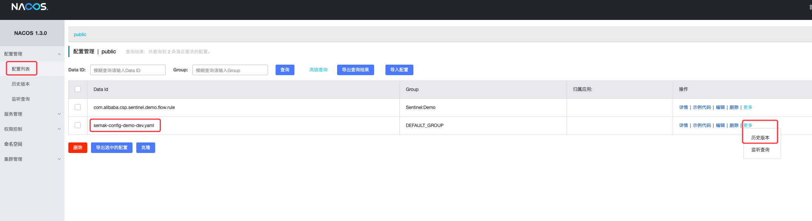
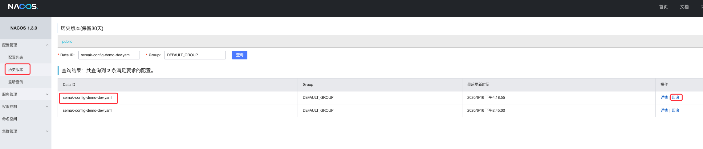
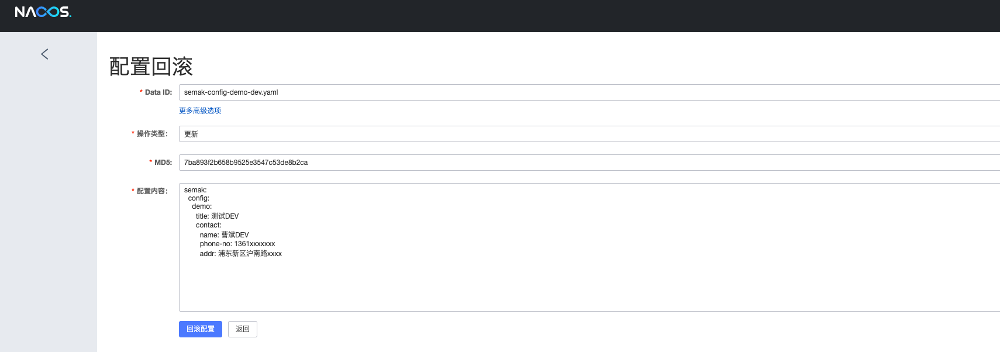

# semak-config

`semak-config`组件是一款基于Alibaba Nacos的分布式动态配置服务客户端组件。


## 1. 什么是动态配置服务


- 动态配置服务可以让您以中心化、外部化和动态化的方式管理所有环境的应用配置和服务配置。
- 动态配置消除了配置变更时重新部署应用和服务的需要，让配置管理变得更加高效和敏捷。
- 配置中心化管理让实现无状态服务变得更简单，让服务按需弹性扩展变得更容易。
- 通过Nacos控制台帮助您管理所有的服务和应用的配置。还提供包括配置版本跟踪、金丝雀发布、一键回滚配置以及客户端配置更新状态跟踪在内的一系列开箱即用的配置管理特性，帮助您更安全地在生产环境中管理配置变更和降低配置变更带来的风险。
- Nacos的配置管理模型与淘宝开源的配置中心Diamond类似，基础层面都通过`DataId`和`Group`来定位配置内容，除此之外还增加了很多其他的管理功能。


## 2. 先决条件


### 2.1. 环境配置


1. Open JDK 1.8+，并已配置有效的环境变量。
1. Maven 3.3.x+，并已配置有效的环境变量。
1. Alibaba Nacos-Server 1.3.0+，并以集群方式提供高可用的服务。


### 2.2. Maven依赖配置


```xml
<dependency>
    <groupId>com.github.semak.config</groupId>
    <artifactId>semak-config-spring-cloud-nacos-starter</artifactId>
    <version>最新RELEASE版本</version>
</dependency>
```


## 3. 创建外化配置


进入Nacos的控制页面，在配置列表功能页面中，点击右上角的“+”按钮，进入“新建配置”页面，如下图填写内容：





其中：


- Data ID：填入`semak-config-demo-dev.yaml`。
- Group：不修改，使用默认值DEFAULT_GROUP。
- 配置格式：选择YAML。
- 配置内容：应用要加载的配置内容，这里仅作为示例，做简单配置。


## 4. 支持Profile粒度的配置


从上面创建的外化配置的Data Id来看，可以分解成下面三个部分：


1. 前缀部分：`semak-config-demo`，默认对应应用的`${spring.application.name}`。
1. 环境部分：`dev`，对应应用的`${spring.profiles.active}`，对应JVM的`-Dspring.profiles.active=xxx`同样有效。
1. 后缀部分：`yaml`，文件格式。

Nacos Config 在加载配置的时候，不仅仅加载了以 DataId 为 `${spring.application.name}.${file-extension:properties}` 为前缀的基础配置，还加载了DataId为 `${spring.application.name}-${profile}.${file-extension:properties}` 的基础配置。在日常开发中如果遇到多套环境下的不同配置，可以通过Spring 提供的 ${spring.profiles.active} 这个配置项来配置。


> 注意：`${spring.profiles.active}` 当通过配置文件来指定时必须放在 `bootstrap.properties` 文件中。


## 5. 基础配置


在应用的classpath下创建`bootstrap.yaml`，如果存在，则在此基础上进行下面内容的添加：


> 注意：这里必须使用`bootstrap.yaml`。同时，`${spring.application.name}-${spring.profiles.active}.yaml`值必须与Nacos中创建配置的`Data Id`匹配。

```yaml
spring:
  application:
    name: semak-config-demo
  cloud:
    nacos:
      config:
        #启用Nacos Config
        enabled: true
        #使用配置文件的扩展名
        file-extension: yaml
        #Nacos服务地址，多个请使用英文逗号隔开
        server-addr: 127.0.0.1:8848
```


### 5.1. 完整的配置项信息

| **配置项** | **Key** | **默认值** | **说明** |
| :--- | :--- | :--- | :--- |
| 服务端地址 | `spring.cloud.nacos.config.server-addr` |  | Nacos Server 启动监听的ip地址和端口 |
| 配置对应的 DataId | `spring.cloud.nacos.config.name` |  | 先取 prefix，再取 name，最后取 spring.application.name(三者并不叠加，而是优先级关系) |
| 配置对应的 DataId | `spring.cloud.nacos.config.prefix` |  | 先取 prefix，再取 name，最后取 spring.application.name(三者并不叠加，而是优先级关系) |
| 配置内容编码 | `spring.cloud.nacos.config.encode` |  | 读取的配置内容对应的编码 |
| GROUP | `spring.cloud.nacos.config.group` | `DEFAULT_GROUP` | 配置对应的组 |
| 文件扩展名 | `spring.cloud.nacos.config.fileExtension` | `properties` | 配置项对应的文件扩展名，目前支持 properties 和 yaml(yml) |
| 获取配置超时时间 | `spring.cloud.nacos.config.timeout` | `3000` | 客户端获取配置的超时时间(毫秒) |
| 接入点 | `spring.cloud.nacos.config.endpoint` |  | 地域的某个服务的入口域名，通过此域名可以动态地拿到服务端地址 |
| 命名空间 | `spring.cloud.nacos.config.namespace` |  | 常用场景之一是不同环境的配置的区分隔离，例如开发测试环境和生产环境的资源（如配置、服务）隔离等 |
| AccessKey | `spring.cloud.nacos.config.accessKey` |  | 当要上阿里云时，阿里云上面的一个云账号名 |
| SecretKey | `spring.cloud.nacos.config.secretKey` |  | 当要上阿里云时，阿里云上面的一个云账号密码 |
| Nacos Server 对应的 context path | `spring.cloud.nacos.config.contextPath` |  | Nacos Server 对外暴露的 context path |
| 集群 | `spring.cloud.nacos.config.clusterName` |  | 配置成Nacos集群名称 |
| 共享配置 | `spring.cloud.nacos.config.sharedDataids` |  | 共享配置的 DataId, "," 分割 |
| 共享配置动态刷新 | `spring.cloud.nacos.config.refreshableDataids` |  | 共享配置中需要动态刷新的 DataId, "," 分割 |
| 自定义 Data Id 配置 | `spring.cloud.nacos.config.extConfig` |  | 属性是个集合，内部由 `Config` POJO 组成。`Config` 有 3 个属性，分别是 `dataId`, `group` 以及 `refresh` |


## 6. 应用配置


### 6.1. 单一类型属性


#### 第一步：创建一个类。


```java
@Slf4j
@RestController
@RefreshScope
public class DemoController {

    @Value("${semak.config.demo.title:default}")
    private String title;

    @GetMapping("/test")
    public String hello() {
        return title;
    }
}
```


- 类必须声明为Spring Bean。
- 类必须标注作用域注解`@RefreshScope`，用来让这个类下的配置内容支持动态刷新，也就是当我们的应用启动之后，修改了Nacos中的配置内容之后，这里也会马上生效。
- 其中通过`@Value`注解，注入了key为`semak.config.demo.title`的配置（默认为`default`字符串）。
- 配置内容会通过`/test`接口返回，后续我们会通过这个接口来验证Nacos中配置的加载。


#### 第二步：启动应用


使用`spring.profiles.active=dev`来启动应用。


#### 第三步：验证配置


由于Nacos服务上配置了如下一段配置：


```yaml
semak:
  config:
    demo:
      title: 测试DEV
```


在应用启动后，使用`curl`验证一下：


```bash
$ curl http://localhost:8080/test
```


输出：


```
测试DEV
```


#### 第四步：验证配置的动态刷新


当我们通过Nacos服务的`编辑配置`功能，修改内容如下并点击`发布`(正式发布前，Nacos服务会弹出内容比较框，仔细核对后再进行`确认发布`)：


```yaml
semak:
  config:
    demo:
      title: 测试DEV-修改
```


可以马上在应用端的日志中看到如下日志：


```
2020-06-16 16:18:54.879  INFO 79834 --- [-127.0.0.1_8848] c.a.n.client.config.impl.ClientWorker    : [fixed-127.0.0.1_8848] [polling-resp] config changed. dataId=semak-config-demo-dev.yaml, group=DEFAULT_GROUP
2020-06-16 16:18:54.879  INFO 79834 --- [-127.0.0.1_8848] c.a.n.client.config.impl.ClientWorker    : get changedGroupKeys:[semak-config-demo-dev.yaml+DEFAULT_GROUP]
2020-06-16 16:18:54.888  INFO 79834 --- [-127.0.0.1_8848] c.a.n.client.config.impl.ClientWorker    : [fixed-127.0.0.1_8848] [data-received] dataId=semak-config-demo-dev.yaml, group=DEFAULT_GROUP, tenant=null, md5=7dca7f8d7164fce20304e34550ef8af1, content=semak:
  config:
    demo:
      title: 测试DEV-修改
      contact:
        name: 曹斌DEV
        phone-no..., type=yaml
```


再使用`curl`验证一下：


```bash
$ curl http://localhost:8080/test
```


输出：


```
测试DEV-修改
```


### 6.2. 对象类型属性


#### 第一步：创建一个属性类。


```java
@Data
@ConfigurationProperties(prefix = PREFIX)
public class Contact {

    public static final String PREFIX = "semak.config.demo.contact";

    private String name;

    private String phoneNo;

    private String addr;
}
```


- 类必须实现Getter和Setter方法，上例用Lombok的`@Data`注解来代替。
- 类必须标注作用域注解`@ConfigurationProperties`，并设置有效属性前缀。


#### 第二步：引用属性类


```java
@Service
@EnableConfigurationProperties({Contact.class})
@RefreshScope
public class DemoService {

    @Autowired
    private Contact contact;

    public Contact getContact(){
        return contact;
    }

}
```


- 类必须声明为Spring Bean。
- 类必须标注作用域注解`@RefreshScope`，用来让这个类下的配置内容支持动态刷新，也就是当我们的应用启动之后，修改了Nacos中的配置内容之后，这里也会马上生效。
- 通过注解`@EnableConfigurationProperties`来引用属性类。


```java
@Slf4j
@RestController
public class DemoController {

    @Autowired
    private ObjectMapper objectMapper;

    @Autowired
    private DemoService demoService;

    @GetMapping("/contact")
    public String contact() throws Exception {
        return objectMapper.writeValueAsString(demoService.getContact());
    }
}
```


- 配置内容会通过`/contact`接口返回，后续我们会通过这个接口来验证Nacos中配置的加载。


#### 第三步：启动应用


使用`spring.profiles.active=dev`来启动应用。


#### 第三步：验证配置


由于Nacos服务上配置了如下一段配置：


```yaml
semak:
  config:
    demo:
      contact:
        name: 曹斌DEV
        phone-no: 1361xxxxxxx
        addr: 浦东新区沪南路xxxx
```


在应用启动后，使用`curl`验证一下：


```bash
$ curl http://localhost:8080/contact
```


输出：


```json
{"name":"曹斌DEV","phoneNo":"1361xxxxxxx","addr":"浦东新区沪南路xxxx"}
```


#### 第四步：验证配置的动态刷新


当我们通过Nacos服务的`编辑配置`功能，修改内容如下并点击`发布`(正式发布前，Nacos服务会弹出内容比较框，仔细核对后再进行`确认发布`)：


```yaml
semak:
  config:
    demo:
      contact:
        name: 曹斌DEV-修改
        phone-no: 1361xxxxxxx
        addr: 浦东新区沪南路xxxx
```


可以马上在应用端的日志中看到如下日志：


```
2020-06-17 08:25:51.494  INFO 84842 --- [-127.0.0.1_8848] c.a.n.client.config.impl.ClientWorker    : [fixed-127.0.0.1_8848] [polling-resp] config changed. dataId=semak-config-demo-dev.yaml, group=DEFAULT_GROUP
2020-06-17 08:25:51.494  INFO 84842 --- [-127.0.0.1_8848] c.a.n.client.config.impl.ClientWorker    : get changedGroupKeys:[semak-config-demo-dev.yaml+DEFAULT_GROUP]
2020-06-17 08:25:51.499  INFO 84842 --- [-127.0.0.1_8848] c.a.n.client.config.impl.ClientWorker    : [fixed-127.0.0.1_8848] [data-received] dataId=semak-config-demo-dev.yaml, group=DEFAULT_GROUP, tenant=null, md5=1df8cc2d28661da8e24221d1c98c1bcf, content=semak:
  config:
    demo:
      contact:
        name: 曹斌DEV-修改
        phone-no: 1361xxxxxxx
     ..., type=
```


再使用`curl`验证一下：


```bash
$ curl http://localhost:8080/test
```


输出：


```
{"name":"曹斌DEV-修改","phoneNo":"1361xxxxxxx","addr":"浦东新区沪南路xxxx"}
```


## 7. 配置回滚


如果新发布的配置内容，对应用造成了一定的问题，需要回滚时，可以按照下面的步骤进行操作：


1. 在 `配置管理` -> `配置列表` 中选择 Data Id为`semak-config-demo-dev.yaml`的配置项，在操作列点击`更多`，打开`历史版本`列表。
   

2. 选择需要回滚的版本，点击`回滚`操作。
   

3. 核对所有项后，点击`回滚配置`按钮，再次确认后，即可将配置回滚到当前版本。此时，应用接收到配置变更通知后，会立刻刷新配置值。
   


## 8. 扩展配置


### 8.1. 自定义 namespace 的配置


namespace配置用于进行租户粒度的配置隔离。不同的命名空间下，可以存在相同的 Group 或 Data ID 的配置。Namespace 的常用场景之一是不同环境的配置的区分隔离，例如开发测试环境和生产环境的资源（如配置、服务）隔离等。


在没有明确指定 `${spring.cloud.nacos.config.namespace}` 配置的情况下， 默认使用的是 Nacos 上 Public 这个namespae。如果需要使用自定义的命名空间，可以通过以下配置来实现：


```yaml
spring:
  cloud:
    nacos:
      config:
        namespace: b3404bc0-d7dc-4855-b519-570ed34b62d7
```


> 注意: 该配置必须放在 `bootstrap.properties` 文件中。此外 `spring.cloud.nacos.config.namespace` 的值是 namespace 对应的 id，id 值可以在 Nacos 的控制台获取。并且在添加配置时注意不要选择其他的 namespae，否则将会导致读取不到正确的配置。


### 8.2. 支持自定义 Group 的配置


在没有明确指定 `${spring.cloud.nacos.config.group}` 配置的情况下， 默认使用的是 `DEFAULT_GROUP` 。如果需要自定义自己的 Group，可以通过以下配置来实现：


```yaml
spring:
  cloud:
    nacos:
      config:
        group: DEVELOP_GROUP
```


> 注意: 该配置必须放在 `bootstrap.properties` 文件中。并且在添加配置时 Group 的值一定要和 `spring.cloud.nacos.config.group` 的配置值一致。

