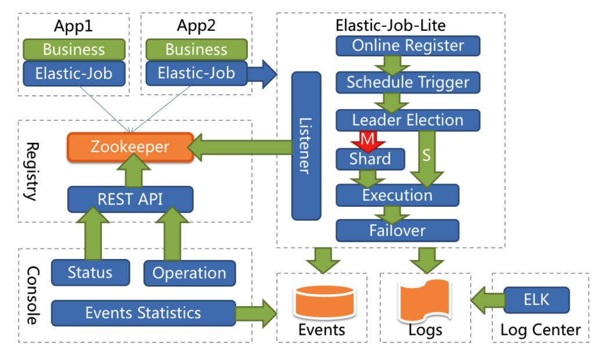
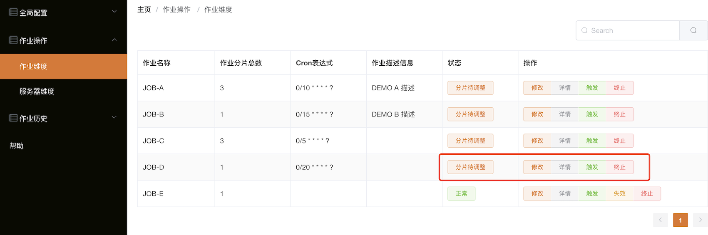
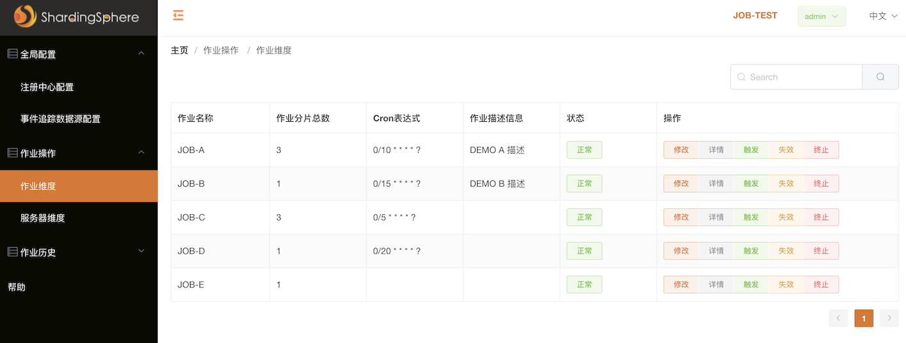
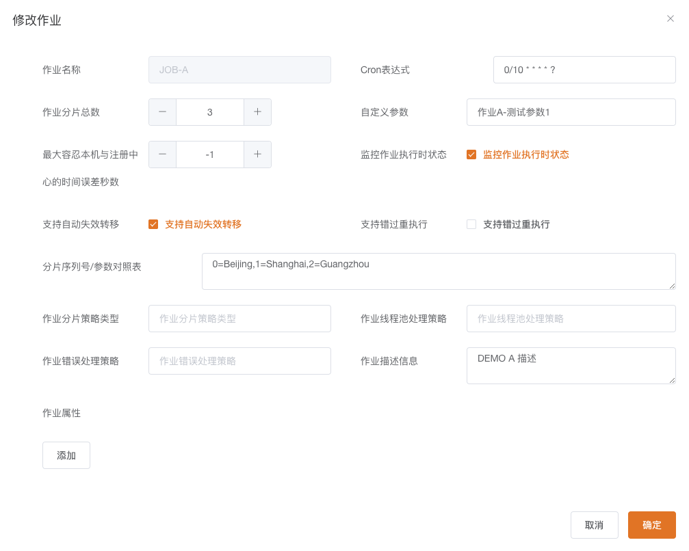
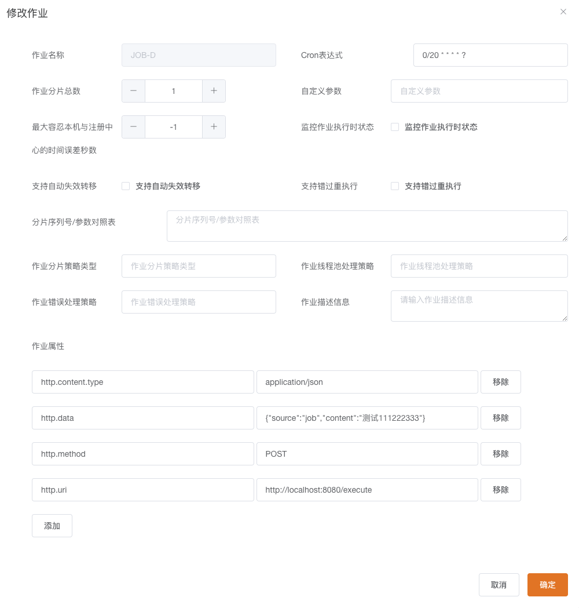

# 	semak-elastic-job

`semak-elastic-job`组件是一款基于当当网Elastic-Job-Lite进行定制的去中心化的分布式调度组件，其主要特性包括：


1. 支持丰富的作业类型（SimpleJob, DataflowJob, ScriptJob, HttpJob）。
1. 支持作业监听。
1. 支持基于数据库存储的作业事件追踪。
1. 支持分布式调度。
1. 支持弹性扩容缩容。
1. 支持失效转移。
1. 支持错过执行作业重触发。
1. 支持作业分片一致性，保证同一分片在分布式环境中仅一个执行实例。
1. 支持基于分片的并行调度。
1. 支持一次性调度和定时调度
1. 更简单的JOB配置方式。
1. 丰富的错误处理策略。
1. 运维平台。


## 1. 先决条件


### 1.1. 环境配置


1. Open JDK 1.8+，并已配置有效的环境变量。
1. Maven 3.3.x+，并已配置有效的环境变量。
1. 安装Zookeeper 3.4.6或以上版本，并以集群(2n+1个节点)方式提供高可用的服务。


### 1.2. Maven依赖配置


```xml
<dependency>
    <groupId>com.github.semak.elastic.job</groupId>
    <artifactId>semak-elastic-job-spring-boot-starter</artifactId>
    <version>最新RELEASE版本</version>
</dependency>
```


## 2. 核心理念


### 2.1. 分布式调度


`semak-elastic-job`组件并无作业调度中心节点，而是基于部署作业框架的程序在到达相应时间点时各自触发调度。


注册中心仅用于作业注册和监控信息存储。而主作业节点仅用于处理分片和清理等功能。


### 2.2. 作业高可用

`semak-elastic-job`组件提供最安全的方式执行作业。将分片总数设置为1，并使用多于1台的服务器执行作业，作业将会以1主n从的方式执行。


一旦执行作业的服务器崩溃，等待执行的服务器将会在下次作业启动时替补执行。开启失效转移功能效果更好，可以保证在本次作业执行时崩溃，备机立即启动替补执行。


### 2.3. 最大限度利用资源


`semak-elastic-job`组件也提供最灵活的方式，最大限度的提高执行作业的吞吐量。将分片项设置为大于服务器的数量，最好是大于服务器倍数的数量，作业将会合理的利用分布式资源，动态的分配分片项。


例如：3台服务器，分成10片，则分片项分配结果为服务器A=0,1,2;服务器B=3,4,5;服务器C=6,7,8,9。 如果服务器C崩溃，则分片项分配结果为服务器A=0,1,2,3,4;服务器B=5,6,7,8,9。在不丢失分片项的情况下，最大限度的利用现有资源提高吞吐量。


## 3. 整体架构





## 4. 作业定义


当前支持4种类型的作业，下面分别进行说明。需要注意的是，下面的作业，除了ScriptJob和HttpJob外，定义时不仅需要实现必要的接口，还需要添加`@Component`注解来声明为一个Spring的Bean。


### 4.1. Simple类型作业


意为简单实现，未经任何封装的类型。需实现`com.dangdang.ddframe.job.api.simple.SimpleJob`接口。该接口仅提供单一方法用于覆盖，此方法将定时执行。与Quartz原生接口相似，但提供了弹性扩缩容和分片等功能。


```java
@Component
public class DemoSimpleJob implements SimpleJob {
    
    @Override
    public void execute(ShardingContext context) {
        switch (context.getShardingItem()) {
            case 0: 
                // do something by sharding item 0
                break;
            case 1: 
                // do something by sharding item 1
                break;
            case 2: 
                // do something by sharding item 2
                break;
            // case n: ...
        }
    }
}
```


### 4.2. Dataflow类型作业


Dataflow类型用于处理数据流，需实现`com.dangdang.ddframe.job.api.dataflow.DataflowJob`接口。该接口提供2个方法可供覆盖，分别用于抓取(fetchData)和处理(processData)数据。


```java
@Component
public class DemoDataFlowJob implements DataflowJob<Foo> {
    
    @Override
    public List<Foo> fetchData(ShardingContext context) {
        switch (context.getShardingItem()) {
            case 0: 
                List<Foo> data = // get data from database by sharding item 0
                return data;
            case 1: 
                List<Foo> data = // get data from database by sharding item 1
                return data;
            case 2: 
                List<Foo> data = // get data from database by sharding item 2
                return data;
            // case n: ...
        }
    }
    
    @Override
    public void processData(ShardingContext shardingContext, List<Foo> data) {
        // process data
        // ...
    }
}
```


#### 4.2.1. 流式处理


流式处理数据只有**fetchData**方法的返回值为null或集合长度为空时，作业才停止抓取，否则作业将一直运行下去。


非流式处理数据则只会在每次作业执行过程中执行一次**fetchData**方法和**processData**方法，随即完成本次作业。


如果采用流式作业处理方式，建议**processData**处理数据后更新其状态，避免**fetchData**再次抓取到，从而使得作业永不停止。 流式数据处理参照**TbSchedule**设计，适用于不间歇的数据处理。


### 4.3. Script类型作业


Script类型作业为脚本类型作业，支持shell，python，perl等所有类型脚本。只需通过控制台或代码配置scriptCommandLine即可，无需编码。执行脚本路径可包含参数，参数传递完毕后，作业框架会自动追加最后一个参数为作业运行时信息。


```bash
#!/bin/bash
echo sharding execution context is $*
```


作业运行时输出


```
sharding execution context is {"jobName":"scriptElasticDemoJob","shardingTotalCount":10,"jobParameter":"","shardingItem":0,"shardingParameter":"A"}
```


### 4.4. HTTP类型作业

HTTP类型作业基于Http协议来调用服务端点，通过一系列的`http.*`属性来配置调用参数，无需编码，分片信息以**Http Header**的形式传递


## 5. 作业配置


定义完作业类或脚本后，我们需要进行一下简单配置，以启用作业。下面是一份jiao


```yaml
elasticjob:
  reg-center:
    server-lists: ${spring.zookeeper.connect-string}
    namespace: lite-job-${spring.profiles}/${spring.application.name}
    digest: ${spring.zookeeper.digest}
    max-sleep-time-milliseconds: 30000
  jobs:
    JOB-A:
      elasticJobClass: com.github.semak.elastic.job.test.job.DemoSimpleJob
      overwrite: true
      #监控作业执行时状态
      monitorExecution: true
      #是否开启失效转移,只有monitorExecution开启才生效
      failover: true
      cron: "0/10 * * * * ?"
      sharding-total-count: 3
      sharding-item-parameters: 0=Beijing,1=Shanghai,2=Guangzhou
      job-parameter: "作业A-测试参数1"
      description: "DEMO A 描述"
      #将JobListener实现添加至resources/META-INF/services/org.apache.shardingsphere.elasticjob.infra.listener.ElasticJobListener中
      job-listener-types:
        - "simpleListener"
    JOB-B:
      elasticJobClass: com.github.semak.elastic.job.test.job.DemoDataflowJob
      overwrite: true
      cron: "0/15 * * * * ?"
      sharding-total-count: 1
      job-parameter: "作业B-测试参数1"
      description: "DEMO B 描述"
      job-listener-types:
        - "onceListener"
    JOB-C:
      elasticJobType: SCRIPT
      overwrite: true
      cron: "0/5 * * * * ?"
      sharding-total-count: 3
      props:
        script.command.line: "echo SCRIPT Job: "
    JOB-D:
      elasticJobType: HTTP
      overwrite: true
      cron: "0/20 * * * * ?"
      sharding-total-count: 1
      props:
        http.uri: "http://localhost:8080/execute"
        http.method: "POST"
        http.data: "{\"source\":\"job\",\"content\":\"测试111222333\"}"
        http.content.type: "application/json"
    #一次性调度
    JOB-E:
      jobBootstrapBeanName: manualJobBean
      elasticJobClass: com.github.semak.elastic.job.test.job.ManualSimpleJob
      overwrite: true
      sharding-total-count: 1
      job-parameter: "作业E-测试参数1"    
```


### 5.1. 配置描述

#### 5.1.1. 注册中心配置

> 当前仅支持zookeeper作为其注册中心

| **属性** | 类型 | **必填** | **默认值** | **描述** |
| :--- | :--- | :--- | :--- | :--- |
| **elasticjob.reg-center.server-lists** | String | 是 |  | 连接 ZooKeeper 服务器的列表。由IP地址和端口组成，多个IP地址使用英文逗号分隔 。<br/>例子：`host1:2181,host2:2181` |
| **elasticjob.reg-center.namespace** | String | 是 |   | zookeeper的命名空间 |
| **elasticjob.reg-center.base-sleep-time-milliseconds** | int | 否 | 1000 | 等待重试的间隔时间的初始毫秒数 |
| **elasticjob.reg-center.max-sleep-time-milliseconds** | int | 否 | 3000 | 等待重试的间隔时间的最大毫秒数 |
| **elasticjob.reg-center.max-retries** | int | 否 | 3 | 最大重试次数 |
| **elasticjob.reg-center.session-timeout-milliseconds** | int | 否 | 60000 | 会话超时毫秒数 |
| **elasticjob.reg-center.connection-timeout-milliseconds** | int | 否 | 15000 | 连接超时毫秒数 |
| **elasticjob.reg-center.digest** | String | 否 | | 连接 ZooKeeper 的权限令牌（digest为ACL Schema中的一种） |


#### 5.1.2. 作业配置

| **属性**                                                     | 类型       | **必填**                                                     | **默认值**     | **描述**                                                     |
| ------------------------------------------------------------ | ---------- | ------------------------------------------------------------ | -------------- | ------------------------------------------------------------ |
| **elasticjob.jobs.&lt;jobName&gt;.elasticJobClass**          | String     | 是（与`elasticJobType`属性互斥）                             |                | 作业的Java全类名                                             |
| **elasticjob.jobs.&lt;jobName&gt;. elasticJobType**          | String     | 是（与`elasticJobClass`属性互斥）                            |                | 作业的类型，目前支持项为：**SCRIPT**和**HTTP**               |
| **elasticjob.jobs.&lt;jobName&gt;.cron**                     | String     | 否（配置此属性为**定时调度**作业，不配置为**一次性调度**作业） |                | CRON 表达式，用于控制作业触发时间                            |
| **elasticjob.jobs.&lt;jobName&gt;.timeZone**                 | String     | 否                                                           |                | CRON 的时区设置。<br/>例子：`GMT+08:00`                      |
| **elasticjob.jobs.&lt;jobName&gt;.jobBootstrapBeanName**     | String     | 否                                                           |                | 一次性调度作业时配置，指定`OneOffJobBootstrap Bean`的名称    |
| **elasticjob.jobs.&lt;jobName&gt;.sharding-total-count**     | int        | 是                                                           |                | 作业分片总数（如无需分多片执行作业，将值设置为`1`即可）      |
| **elasticjob.jobs.&lt;jobName&gt;. sharding-item-parameters** | String     | 否                                                           |                | 设置分片序列号和个性化参数对照表。<br/>例子：`0=Beijing,1=Shanghai,2=Guangzhou` |
| **elasticjob.jobs.&lt;jobName&gt;. job-parameter**           | String     | 否                                                           |                | 作业自定义参数                                               |
| **elasticjob.jobs.&lt;jobName&gt;. monitor-execution**       | boolean    | 否                                                           | true           | 监控作业运行时状态                                           |
| **elasticjob.jobs.&lt;jobName&gt;.failover**                 | boolean    | 否                                                           | false          | 是否开启任务执行失效转移，只有`monitorExecution`开启才生效   |
| **elasticjob.jobs.&lt;jobName&gt;.misfire**                  | boolean    | 否                                                           | true           | 是否开启错过任务重新执行                                     |
| **elasticjob.jobs.&lt;jobName&gt;. max-time-diff-seconds**   | int        | 否                                                           | -1（不检查）   | 最大允许的本机与注册中心的时间误差秒数                       |
| **elasticjob.jobs.&lt;jobName&gt;. reconcile-interval-minutes** | int        | 否                                                           | 10             | 修复作业服务器不一致状态服务调度间隔分钟                     |
| **elasticjob.jobs.&lt;jobName&gt;. job-sharding-strategy-type** | String     | 否                                                           | AVG_ALLOCATION | 作业分片策略类型                                             |
| **elasticjob.jobs.&lt;jobName&gt;. job-executor-service-handler-type** | String     | 否                                                           | CPU            | 作业线程池处理策略                                           |
| **elasticjob.jobs.&lt;jobName&gt;. job-error-handler-type**  | String     | 否                                                           |                | 作业错误处理策略                                             |
| **elasticjob.jobs.&lt;jobName&gt;. job-listener-types**      | String     | 否                                                           |                | 作业监听器类型                                               |
| **elasticjob.jobs.&lt;jobName&gt;.description**              | String     | 否                                                           |                | 作业描述信息                                                 |
| **elasticjob.jobs.&lt;jobName&gt;. props**                   | Properties | 否                                                           |                | 作业属性配置信息                                             |
| **elasticjob.jobs.&lt;jobName&gt;. disabled**                | boolean    | 否                                                           | false          | 作业是否禁止启动                                             |
| **elasticjob.jobs.&lt;jobName&gt;.overwrite**                | boolean    | 否                                                           | false          | 本地配置是否可覆盖注册中心配置                               |

**核心配置项说明：**

* **sharding-item-parameters**： 分片序列号和参数用等号分隔，多个键值对用逗号分隔。 分片序列号从0开始，不可大于或等于作业分片总数。 如：`0=a,1=b,2=c`。
* **job-parameter**: 可通过传递该参数为作业调度的业务方法传参，用于实现带参数的作业 例：每次获取的数据量、作业实例从数据库读取的主键等。
* **monitor-execution**: 每次作业执行时间和间隔时间均非常短的情况，建议不监控作业运行时状态以提升效率。 因为是瞬时状态，所以无必要监控。请用户自行增加数据堆积监控。并且不能保证数据重复选取，应在作业中实现幂等性。 每次作业执行时间和间隔时间均较长的情况，建议监控作业运行时状态，可保证数据不会重复选取。
*  **max-time-diff-seconds**: 如果时间误差超过配置秒数则作业启动时将抛异常。
* **reconcile-interval-minutes**: 在分布式的场景下由于网络、时钟等原因，可能导致 ZooKeeper 的数据与真实运行的作业产生不一致，这种不一致通过正向的校验无法完全避免。 需要另外启动一个线程定时校验注册中心数据与真实作业状态的一致性，即维持 ElasticJob 的最终一致性。配置为小于 1 的任意值表示不执行修复。
*  **job-sharding-strategy-type**: 详情请参见 [作业分片策略](#_61-作业分片策略)。
* **job-executor-service-handler-type**: 详情请参见 [线程池策略](#_62-线程池策略)。
* **job-error-handler-type**: 详情请参见 [错误处理策略](#_63-错误处理策略)。 
* **props**: 详情请参见 [作业属性配置](#_7-作业属性配置)。
* **disabled**: 可用于部署作业时，先禁止启动，部署结束后统一启动。
* **overwrite**: 如果可覆盖，每次启动作业都以本地配置为准。


## 6. 内置策略

### 6.1. 作业分片策略

#### 6.1.1. 平均分片策略

类型：**AVG_ALLOCATION**

根据分片项平均分片。

如果作业服务器数量与分片总数无法整除，多余的分片将会顺序的分配至每一个作业服务器。

举例说明：

1. 如果 3 台作业服务器且分片总数为9，则分片结果为：1=[0,1,2], 2=[3,4,5], 3=[6,7,8]；
2. 如果 3 台作业服务器且分片总数为8，则分片结果为：1=[0,1,6], 2=[2,3,7], 3=[4,5]；
3. 如果 3 台作业服务器且分片总数为10，则分片结果为：1=[0,1,2,9], 2=[3,4,5], 3=[6,7,8]。


#### 6.1.2. 奇偶分片策略

类型：**ODEVITY**

根据作业名称哈希值的奇偶数决定按照作业服务器 IP 升序或是降序的方式分片。

如果作业名称哈希值是偶数，则按照 IP 地址进行升序分片； 如果作业名称哈希值是奇数，则按照 IP 地址进行降序分片。 可用于让服务器负载在多个作业共同运行时分配的更加均匀。

举例说明：

1. 如果 3 台作业服务器，分片总数为2且作业名称的哈希值为偶数，则分片结果为：1 = [0], 2 = [1], 3 = []；
2. 如果 3 台作业服务器，分片总数为2且作业名称的哈希值为奇数，则分片结果为：3 = [0], 2 = [1], 1 = []。


#### 6.1.3. 轮询分片策略

类型：**ROUND_ROBIN**

根据作业名称轮询分片。


### 6.2. 线程池策略

#### 6.2.1. CPU 资源策略

类型：**CPU**

根据 CPU 核数 x 2 创建作业处理线程池。


#### 6.2.2 单线程策略

类型：**SINGLE_THREAD**

使用单线程处理作业。


### 6.3. 错误处理策略

#### 6.3.1. 记录日志策略

类型：**LOG**

默认内置：是

记录作业异常日志，但不中断作业执行。


#### 6.3.2. 抛出异常策略

类型：**THROW**

默认内置：是

抛出系统异常并中断作业执行。


#### 6.3.3. 忽略异常策略

类型：**IGNORE**

默认内置：是

忽略系统异常且不中断作业执行。


#### 6.3.4. 邮件通知策略

类型：**EMAIL**

默认内置：否

发送邮件消息通知，但不中断作业执行。

Maven 坐标：

```xml
<dependency>
    <groupId>org.apache.shardingsphere.elasticjob</groupId>
    <artifactId>elasticjob-error-handler-email</artifactId>
    <version>${latest.release.version}</version>
</dependency>
```

可配置属性（在节点**elasticjob.jobs.&lt;jobName&gt;. props**下）：

| 属性名         | 说明                  | 是否必填 | 默认值                   |
| :------------- | :-------------------- | :------- | :----------------------- |
| **email.host**     | 邮件服务器地址        | 是       |                          |
| **email.port**     | 邮件服务器端口        | 是       |                          |
| **email.username** | 邮件服务器用户名      | 是       |                          |
| **email.password** | 邮件服务器密码        | 是       |                          |
| **email.useSsl**   | 是否启用 SSL 加密传输 | 否       | true                     |
| **email.subject**  | 邮件主题              | 否       | ElasticJob error message |
| **email.from**     | 发送方邮箱地址        | 是       |                          |
| **email.to**       | 接收方邮箱地址        | 是       |                          |
| **email.cc**       | 抄送邮箱地址          | 否       |                          |
| **email.bcc**      | 密送邮箱地址          | 否       |                          |
| **email.debug**    | 是否开启调试模式      | 否       | false                    |


#### 6.3.5. 企业微信通知策略

类型：**WECHAT**

默认内置：否

发送企业微信消息通知，但不中断作业执行。

Maven 坐标：

```xml
<dependency>
    <groupId>org.apache.shardingsphere.elasticjob</groupId>
    <artifactId>elasticjob-error-handler-wechat</artifactId>
    <version>${latest.release.version}</version>
</dependency>
```

可配置属性（在节点**elasticjob.jobs.&lt;jobName&gt;. props**下）：

| 属性名                            | 说明                                     | 是否必填 | 默认值    |
| :-------------------------------- | :--------------------------------------- | :------- | :-------- |
| **wechat.webhook**                | 企业微信机器人的 webhook 地址            | 是       |           |
| **wechat.connectTimeoutMilliseconds** | 与企业微信服务器建立连接的超时时间       | 否       | 3000 毫秒 |
| **wechat.readTimeoutMilliseconds**    | 从企业微信服务器读取到可用资源的超时时间 | 否       | 5000 毫秒 |


#### 钉钉通知策略

类型：**DINGTALK**

默认内置：否

发送钉钉消息通知，但不中断作业执行。

Maven 坐标：

```xml
<dependency>
    <groupId>org.apache.shardingsphere.elasticjob</groupId>
    <artifactId>elasticjob-error-handler-dingtalk</artifactId>
    <version>${latest.release.version}</version>
</dependency>
```

可配置属性（在节点**elasticjob.jobs.&lt;jobName&gt;. props**下）：

| 属性名                              | 说明                                 | 是否必填 | 默认值    |
| :---------------------------------- | :----------------------------------- | :------- | :-------- |
| **dingtalk.webhook**                   | 钉钉机器人的 webhook 地址            | 是       |           |
| **dingtalk.keyword**                    | 自定义关键词                         | 否       |           |
| **dingtalk.secret**                     | 签名的密钥                           | 否       |           |
| **dingtalk.connectTimeoutMilliseconds** | 与钉钉服务器建立连接的超时时间       | 否       | 3000 毫秒 |
| **dingtalk.readTimeoutMilliseconds**    | 从钉钉服务器读取到可用资源的超时时间 | 否       | 5000 毫秒 |


## 7. 作业属性配置

### 7.1. 简单作业

接口名称：**org.apache.shardingsphere.elasticjob.simple.job.SimpleJob**

可配置属性：无


### 7.2. 数据流作业

接口名称：**org.apache.shardingsphere.elasticjob.dataflow.job.DataflowJob**

可配置属性：

| 名称              | 数据类型 | 说明             | 默认值 |
| :---------------- | :------- | :--------------- | :----- |
| **streaming.process** | boolean  | 是否开启流式处理 | false  |


### 7.3. 脚本作业

类型：**SCRIPT**

可配置属性（在节点**elasticjob.jobs.&lt;jobName&gt;. props**下）：

| 名称                | 数据类型 | 说明               | 默认值 |
| :------------------ | :------- | :----------------- | :----- |
| **script.command.line** | String   | 脚本内容或运行路径 |        |


### HTTP作业

类型：**HTTP**

可配置属性（在节点**elasticjob.jobs.&lt;jobName&gt;. props**下）：

| 名称                            | 数据类型 | 说明              | 默认值 |
| :-------------------------------- | :--------- | :------------------ | :------- |
| **http.url**                          | String     | http请求url         |         |
| **http.method**                       | String     | http请求方法        |         |
| **http.data**                         | String     | http请求数据        |         |
| **http.connect.timeout.milliseconds** | String     | http连接超时        | 3000     |
| **http.read.timeout.milliseconds**    | String     | http读超时          | 5000     |
| **http.content.type**                 | String     | http请求ContentType |         |


## 8. 作业监听器


用于在任务执行前和执行后执行监听的方法。 监听器分为每台作业节点均执行的常规监听器和分布式场景中仅单一节点执行的分布式监听器。

### 8.1. 常规监听器

> 每台作业节点均执行的监听


若作业处理作业服务器的文件，处理完成后删除文件，可考虑使用每个节点均执行清理任务。 此类型任务实现简单，且无需考虑全局分布式任务是否完成，应尽量使用此类型监听器。


#### 8.1.1. 定义监听器


监听器需实现接口`org.apache.shardingsphere.elasticjob.infra.listener.ElasticJobListener`。


```java
@Slf4j
public class JobListener implements ElasticJobListener {
    @Override
    public void beforeJobExecuted(ShardingContexts shardingContexts) {
        log.info(">>> Before {} executed <<<", shardingContexts.getJobName());
    }

    @Override
    public void afterJobExecuted(ShardingContexts shardingContexts) {
        log.info(">>> After {} executed <<<", shardingContexts.getJobName());
    }

    @Override
    public String getType() {
        return "simpleListener";
    }
}
```


#### 8.1.2. 配置监听器


通过**elasticjob.jobs.&lt;jobName&gt;. job-listener-types**来添加监听器。


```yaml
elasticjob:
  ...
  jobs:
    JOB-A:
      ...
      job-listener-types:
        - "simpleListener"
```


#### 8.1.3. 添加SPI实现

将**JobListener**实现添加至`resources/META-INF/services/org.apache.shardingsphere.elasticjob.infra.listener.ElasticJobListener`中：

```
com.github.semak.elastic.job.test.listener.JobListener
```


### 8.2. 分布式监听器

> 分布式场景中仅单一节点执行的监听


若作业处理数据库数据，处理完成后只需一个节点完成数据清理任务即可。 此类型任务处理复杂，需同步分布式环境下作业的状态同步，提供了超时设置来避免作业不同步导致的死锁，**应谨慎使用**。


#### 8.2.1. 定义监听器


监听器需继承抽象类`org.apache.shardingsphere.elasticjob.lite.api.listener.AbstractDistributeOnceElasticJobListener`。


```java
@Slf4j
public class JobOnceListener extends AbstractDistributeOnceElasticJobListener {

    public JobOnceListener() {
        super(5000L, 10000L);
    }

    @Override
    public void doBeforeJobExecutedAtLastStarted(ShardingContexts shardingContexts) {
        log.info(">>> CLEANING: Before {} executed <<<", shardingContexts.getJobName());
    }

    @Override
    public void doAfterJobExecutedAtLastCompleted(ShardingContexts shardingContexts) {
        log.info(">>> CLEANING: After {} executed <<<", shardingContexts.getJobName());
    }

    @Override
    public String getType() {
        return "onceListener";
    }
}
```


#### 8.2.2. 配置监听器

通过**elasticjob.jobs.&lt;jobName&gt;. job-listener-types**来添加监听器。


```yaml
elasticjob:
  ...
  jobs:
    JOB-B:
      ...
      job-listener-types:
        - "onceListener"
```


#### 8.2.3. 添加SPI实现

将**JobListener**实现添加至`resources/META-INF/services/org.apache.shardingsphere.elasticjob.infra.listener.ElasticJobListener`中：

```
com.github.semak.elastic.job.test.listener.JobOnceListener
```


## 9. 事件追踪（可选功能）


通过事件订阅的方式处理调度过程的重要事件，用于查询、统计和监控。 目前提供了基于关系型数据库的事件订阅方式记录事件，开发者也可以通过 SPI 自行扩展。


### 9.1.  开启事件追踪


```yaml
elasticjob:
  tracing:
    type: RDB
```


开启事件追踪的同时，需要配置对应的数据源（这里使用`semak`数据源组件来配置数据源）：


```yaml
spring:
  application:
    name: job-test
  datasource:
    url: jdbc:mysql://localhost:3306/test?useUnicode=true&characterEncoding=UTF-8&useSSL=false
    username: root    password: 12345678
    hikari:
      minimum-idle: 2
      maximum-pool-size: 5
      auto-commit: true
      idle-timeout: 60000
      pool-name: EjlRdbHikariCP
      max-lifetime: 600000
      connection-timeout: 12000
      connection-test-query: SELECT 1
      leak-detection-threshold: 5000
elasticjob:
  tracing:
    type: RDB
```


- 用于分布式调度功能的数据源必须为**候选（Candidate）**数据源。
- 以上例子是基于Spring-JDBC定义的数据源，建议配置`semak`系列组件中的`HikariCP`或`Druid`数据源组件来使用。


### 9.2. 事件追踪表


时间追踪主要涉及2张表，`JOB_EXECUTION_LOG`和`JOB_STATUS_TRACE_LOG`，请提前在MySQL数据库中建立好。原始SQL脚本如下：


```sql
CREATE TABLE `JOB_EXECUTION_LOG`
(
    `id`               varchar(40)  NOT NULL,
    `job_name`         varchar(100) NOT NULL,
    `task_id`          varchar(255) NOT NULL,
    `hostname`         varchar(255) NOT NULL,
    `ip`               varchar(50)  NOT NULL,
    `sharding_item`    int(11)      NOT NULL,
    `execution_source` varchar(20)  NOT NULL,
    `failure_cause`    varchar(4000)         DEFAULT NULL,
    `is_success`       int(11)      NOT NULL,
    `start_time`       timestamp    NOT NULL DEFAULT CURRENT_TIMESTAMP ON UPDATE CURRENT_TIMESTAMP,
    `complete_time`    timestamp    NULL     DEFAULT NULL,
    PRIMARY KEY (`id`)
) ENGINE = InnoDB
  DEFAULT CHARSET = utf8;

CREATE TABLE `JOB_STATUS_TRACE_LOG`
(
    `id`               varchar(40)  NOT NULL,
    `job_name`         varchar(100) NOT NULL,
    `original_task_id` varchar(255) NOT NULL,
    `task_id`          varchar(255) NOT NULL,
    `slave_id`         varchar(50)  NOT NULL,
    `source`           varchar(50)  NOT NULL,
    `execution_type`   varchar(20)  NOT NULL,
    `sharding_item`    varchar(100) NOT NULL,
    `state`            varchar(20)  NOT NULL,
    `message`          varchar(4000)     DEFAULT NULL,
    `creation_time`    timestamp    NULL DEFAULT NULL,
    PRIMARY KEY (`id`),
    KEY `TASK_ID_STATE_INDEX` (`task_id`, `state`)
) ENGINE = InnoDB
  DEFAULT CHARSET = utf8;
```


#### 9.2.1. JOB_EXECUTION_LOG字段含义

| **字段名称** | **字段类型** | **是否必填** | **描述** |
| :--- | :--- | :--- | :--- |
| id | VARCHAR(40) | 是 | 主键 |
| job_name | VARCHAR(100) | 是 | 作业名称 |
| task_id | VARCHAR(1000) | 是 | 任务名称,每次作业运行生成新任务 |
| hostname | VARCHAR(255) | 是 | 主机名称 |
| ip | VARCHAR(50) | 是 | 主机IP |
| sharding_item | INT | 是 | 分片项 |
| execution_source | VARCHAR(20) | 是 | 作业执行来源。可选值为NORMAL_TRIGGER, MISFIRE, FAILOVER |
| failure_cause | VARCHAR(2000) | 否 | 执行失败原因 |
| is_success | BIT | 是 | 是否执行成功 |
| start_time | TIMESTAMP | 是 | 作业开始执行时间 |
| complete_time | TIMESTAMP | 否 | 作业结束执行时间 |

**JOB_EXECUTION_LOG**记录每次作业的执行历史。分为两个步骤：


- 作业开始执行时向数据库插入数据，除`failure_cause`和`complete_time`外的其他字段均不为空。
- 作业完成执行时向数据库更新数据，更新`is_success`, `complete_time`和`failure_cause`(如果作业执行失败)。


#### 9.2.2. JOB_STATUS_TRACE_LOG字段含义
| **字段名称** | **字段类型** | **是否必填** | **描述** |
| :--- | :--- | :--- | :--- |
| id | VARCHAR(40) | 是 | 主键 |
| job_name | VARCHAR(100) | 是 | 作业名称 |
| original_task_id | VARCHAR(1000) | 是 | 原任务名称 |
| task_id | VARCHAR(1000) | 是 | 任务名称 |
| slave_id | VARCHAR(1000) | 是 | 执行作业服务器的名称，Lite版本为服务器的IP地址，Cloud版本为Mesos执行机主键 |
| source | VARCHAR(50) | 是 | 任务执行源，可选值为CLOUD_SCHEDULER, CLOUD_EXECUTOR, LITE_EXECUTOR |
| execution_type | VARCHAR(20) | 是 | 任务执行类型，可选值为NORMAL_TRIGGER, MISFIRE, FAILOVER |
| sharding_item | VARCHAR(255) | 是 | 分片项集合，多个分片项以逗号分隔 |
| state | VARCHAR(20) | 是 | 任务执行状态，可选值为TASK_STAGING, TASK_RUNNING, TASK_FINISHED, TASK_KILLED, TASK_LOST, TASK_FAILED, TASK_ERROR |
| message | VARCHAR(2000) | 是 | 相关信息 |
| creation_time | TIMESTAMP | 是 | 记录创建时间 |

**JOB_STATUS_TRACE_LOG**记录作业状态变更痕迹表。可通过每次作业运行的`task_id`查询作业状态变化的生命周期和运行轨迹。


## 10. 运维平台


### 10.1. 部署方式


1. 找到`semak-elastic-job/semak-elastic-job-console/bin`的`apache-shardingsphere-elasticjob-3.0.0-lite-ui-bin.tar.gz`二进制程序压缩包。

1. 将压缩包放在`/usr/local`目录下，解压压缩包，并重命名为`elasticjob-lite-ui`。进入`/usr/local/elasticjob-lite-ui/conf`目录，编辑`application.properties`文件：

   ```properties
   #服务端口
   server.port=8899
   
   #登录认证
   auth.root_username=admin
   auth.root_password=admin
   auth.guest_username=guest
   auth.guest_password=guest
   
   spring.datasource.default.driver-class-name=org.h2.Driver
   spring.datasource.default.url=jdbc:h2:mem:
   spring.datasource.default.username=sa
   spring.datasource.default.password=
   spring.jpa.show-sql=false
   ```

   主要配置服务端口和登录认证这两块属性。

1. 由于部署的作业未到触发时间，不会出现触发按钮（一般要到作业第一次自动触发完成，状态从**分片待调整**转换为**正常**的情况下，才会出现触发按钮），为解决这个问题，修改了vue部分内容，可以让触发按钮在作业未触发前出现。找到`semak-elastic-job/semak-elastic-job-console/bin`的`shardingsphere-elasticjob-lite-ui.jar`，替换`/usr/local/elasticjob-lite-ui/lib`目录下的`shardingsphere-elasticjob-lite-ui-backend-3.0.0.jar`。

   ```bash
   #替换
   mv -f /usr/local/elasticjob-lite-ui/lib/shardingsphere-elasticjob-lite-ui-backend-3.0.0.jar /usr/local/elasticjob-lite-ui/lib/shardingsphere-elasticjob-lite-ui-backend-3.0.0.jar
   cp shardingsphere-elasticjob-lite-ui.jar /usr/local/elasticjob-lite-ui/lib/
   ```

   替换后效果

   

1. 进入`/usr/local/elasticjob-lite-ui/bin`目录，执行`start.sh`启动即可。


### 10.2. 登录


提供两种账户，管理员及访客，管理员拥有全部操作权限，访客仅拥有察看权限。

默认管理员用户名和密码参考之前的身份认证属性配置。


### 10.3. 功能列表


1. 登录安全控制。
1. 注册中心、事件追踪数据源管理。
1. 快捷修改作业设置。
1. 作业和服务器维度状态查看。
1. 操作作业禁用\启用、停止和删除等生命周期。
1. 事件追踪查询。


### 10.4. 设计理念


运维平台和Job本身并无直接关系，是通过读取作业注册中心数据展现作业状态，或更新注册中心数据修改全局配置。


控制台只能控制作业本身是否运行，但不能控制作业进程的启动，因为控制台和作业本身服务器是完全分离的，控制台并不能控制作业服务器。


### 10.5. 不支持项


- 添加作业：作业在首次运行时将自动添加，并无作业分发功能。


### 10.6. 我们如何观察和调整作业


到Console查看你注册的Job。

在**全局配置**中添加你的注册中心：


默认命名空间定义规则：`lite-job-环境/应用名称`，如：应用名称为`xj.demo` ，环境为`dev`，应定义为：`lite-job-dev/xj.demo`


然后，我们可以切换到`作业维度`查看和修改作业：







