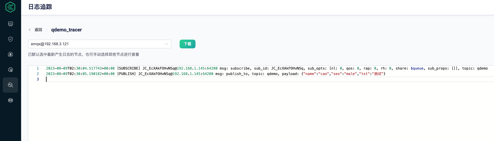

# semak-mqtt

`semak-mqtt` 是基于MQTT协议的、低延迟、高性能的物联网通信组件，基于MICA-MQTT项目进行扩展。其主要特性包括：

1. 支持 MQTT v3.1、v3.1.1 以及 v5.0 协议。

2. 支持发布/订阅功能。

3. 支持共享订阅功能。

4. 支持对发布/订阅对象的JSON序列化与反序列化。

5. 提供SSL支持。

6. 支持集群环境下客户端ID的自动生成。

7. 支持 Spring boot 项目快速接入。

   

## 1. 先决条件

### 1.1. 环境配置

1. Open JDK 1.8+，并已配置有效的环境变量。
2. Maven 3.3.x+，并已配置有效的环境变量。
3. Spring Boot 2.1.0.RELEASE+， 最高3.x。


### 1.2. Maven依赖配置

```xml
<dependency>
    <groupId>com.github.semak.mqtt</groupId>
    <artifactId>semak-mqtt-spring-boot-starter</artifactId>
    <version>最新RELEASE版本</version>
</dependency>
```


## 2. 客户端定义

本组件对MQTT客户端的定义主要是在`mqtt.client`属性下。


### 2.1. 客户端配置示例

```yaml
mqtt:
  client:
    enabled: true                       # 是否开启客户端，默认：true
    ip: 127.0.0.1                       # 连接的服务端 ip ，默认：127.0.0.1
    port: 1883                          # 端口：默认：1883
    name: Mica-Mqtt-Client              # 名称，默认：Mica-Mqtt-Client
    clientId: 000001                    # 客户端Id（非常重要，一般为设备 sn，不可重复）
    cluster-client: true                # 是否集群客户端。当配置为true时，clientId属性自动失效，改由组件默认分配客户端Id。默认：false
    cluster-client-id-prefix: JC_				# 在启用集群客户端后，为集群客户端配置客户端ID的前缀
    user-name: mica                     # 认证的用户名
    password: 123456                    # 认证的密码
    timeout: 5                          # 超时时间，单位：秒，默认：5秒
    reconnect: true                     # 是否重连，默认：true
    re-interval: 5000                   # 重连时间，默认 5000 毫秒
    version: mqtt_3_1_1                 # mqtt 协议版本，可选 MQTT_3_1、mqtt_3_1_1、mqtt_5，默认：mqtt_3_1_1
    read-buffer-size: 8KB               # 接收数据的 buffer size，默认：8KB
    max-bytes-in-message: 10MB          # 消息解析最大 bytes 长度，默认：10MB
    buffer-allocator: heap              # 堆内存和堆外内存，默认：堆内存
    keep-alive-secs: 15                 # keep-alive 时间，单位：秒
    clean-session: true                 # mqtt clean session，默认：true
    ssl:
      enabled: false                    # 是否开启 ssl 认证，2.1.0 开始支持双向认证
      keystore-path:                    # 可选参数：ssl 双向认证 keystore 目录，支持 classpath:/ 路径。
      keystore-pass:                    # 可选参数：ssl 双向认证 keystore 密码
      truststore-path:                  # 可选参数：ssl 双向认证 truststore 目录，支持 classpath:/ 路径。
      truststore-pass:                  # 可选参数：ssl 双向认证 truststore 密码
```


### 2.2. 客户端配置属性描述

以下属性为`mqtt.client`的子节点属性。

| 属性                         | 是否必填 | 默认值           | 描述                                                         |
| ---------------------------- | -------- | ---------------- | ------------------------------------------------------------ |
| **enabled**                  | 否       | true             | 是否开启客户端                                               |
| **ip**                       | 否       | 127.0.0.1        | 连接的服务端的IP地址                                         |
| **port**                     | 否       | 1883             | 连接的服务端的端口                                           |
| **name**                     | 否       | Mica-Mqtt-Client | 名称                                                         |
| **clientId**                 | 是       |                  | 非常重要，一般为设备 sn、imei等，不可重复                    |
| **cluster-client**           | 否       |                  | 是否集群客户端。当配置为`true`时，`clientId`属性自动失效，改由组件默认分配客户端Id |
| **cluster-client-id-prefix** | 否       | CCID_            | 在启用集群客户端后，为集群客户端配置客户端ID的前缀           |
| **user-name**                | 是       |                  | 服务端认证的用户名                                           |
| **password**                 | 是       |                  | 服务端认证的密码                                             |
| **timeout**                  | 否       | 5                | 连接超时时间，单位：秒                                       |
| **reconnect**                | 否       | true             | 是否重连                                                     |
| **re-interval**              | 否       | 5000             | 重连时间，单位：毫秒                                         |
| **version**                  | 否       | mqtt_3_1_1       | mqtt 协议版本，可选 MQTT_3_1、mqtt_3_1_1、mqtt_5             |
| **read-buffer-size**         | 否       | 8KB              | 接收数据的 buffer size                                       |
| **max-bytes-in-message**     | 否       | 10MB             | 消息解析最大 bytes 长度                                      |
| **buffer-allocator**         | 否       | heap             | 堆内存（heap）和堆外内存（direct），默认：heap               |
| **keep-alive-secs**          | 否       | 60               | keep-alive 时间，单位：秒                                    |
| **clean-session**            | 否       | true             | mqtt clean session                                           |
| **ssl.enabled**              | 否       | false            | 是否开启 ssl 认证                                            |
| **ssl.keystore-path**        | 否       |                  | ssl 双向认证 keystore 目录，支持 classpath:/ 路径            |
| **ssl.keystore-pass**        | 否       |                  | ssl 双向认证 keystore 密码                                   |
| **ssl.truststore-path**      | 否       |                  | ssl 双向认证 truststore 目录，支持 classpath:/ 路径          |
| **ssl.truststore-pass**      | 否       |                  | ssl 双向认证 truststore 密码                                 |


## 3. 客户端使用方式

> 注：这里使用了EMQX开源版本作为MQTT Broker使用

### 3.1. 发布

```java
@Slf4j
@Component
public class MqttClientPub {

    @Autowired
    private MqttClientTemplate client;

    public void publish() {
        client.publish("qdemo", Demo.builder().name("cao").sex("male").txt("测试").build());
        log.info(">>> 消息已发布");
    }
}
```

这里使用了`com.github.semak.mqtt.MqttClientTemplate`进行消息的发布动作。执行`publish`方法后，我们可以看到Broker端收到的报文。




### 3.2. 订阅

```java
@Slf4j
@Component
public class MqttClientSub {

    @MqttClientSubscribe("qdemo")
    public void subQueue(String topic, Demo demo) {
        log.info("topic:{} payload:{}", topic, demo);
        log.info("name:{}", demo.getName());
    }
}
```

输出日志：

```
2023-08-09 10:45:25.011  INFO 65240 --- [  mqtt-worker-7] c.g.s.m.test.MqttClientSub   : topic:qdemo payload:Demo(name=cao, sex=male, txt=测试)
2023-08-09 10:45:25.011  INFO 65240 --- [  mqtt-worker-7] c.g.s.m.test.MqttClientSub   : name:cao
```


### 3.3. 共享订阅

组件支持**两种共享订阅**方式：

1. 共享订阅：订阅前缀 `$queue/`，多个客户端订阅了 `$queue/topic`，发布者发布到topic，则只有一个客户端会接收到消息（经测试，支持方式为`$share/$queue/`，而非官方文档中的`$queue`订阅前缀）。

   ```java
   @Slf4j
   @Component
   public class MqttClientSub {
   
       @MqttClientSubscribe("$share/$queue/sdemo")
       public void subQueue(String topic, Demo demo) {
           log.info("topic:{} payload:{}", topic, demo);
           log.info("name:{}", demo.getName());
       }
   }
   ```

2. 分组订阅：订阅前缀 `$share/<group>/`，组客户端订阅了`$share/group1/topic`、`$share/group2/topic`..，发布者发布到topic，则消息会发布到每个group中，但是每个group中只有一个客户端会接收到消息。

   ```java
   @Slf4j
   @Component
   public class MqttClientSub {
   
       @MqttClientSubscribe("$share/g1/gdemo")
       public void subQueue(String topic, Demo demo) {
           log.info("topic:{} payload:{}", topic, demo);
           log.info("name:{}", demo.getName());
       }
     
     	@MqttClientSubscribe("$share/g2/gdemo")
       public void subQueue(String topic, Demo demo) {
           log.info("topic:{} payload:{}", topic, demo);
           log.info("name:{}", demo.getName());
       }
   }
   ```

   

### 3.4. 客户端上下线监听

使用 Spring event 解耦客户端上下线监听，会和自定义的 `IMqttClientConnectListener` 实现冲突，取一即可。

```java
@Slf4j
@Component
public class MqttClientConnectListener {

    @EventListener
    public void onConnected(MqttConnectedEvent event) {
        log.info("MqttConnectedEvent:{}", event);
    }

   
    @EventListener
    public void onDisconnect(MqttDisconnectEvent event) {
        log.info("MqttDisconnectEvent:{}", event);
    }
}
```


### 3.5. 自定义客户端配置

> 基于Java Config

```java
@Configuration(proxyBeanMethods = false)
public class MqttClientCustomizerConfiguration {

	@Bean
	public MqttClientCustomizer mqttClientCustomizer() {
		return new MqttClientCustomizer() {
			@Override
			public void customize(MqttClientCreator creator) {
				// 此处可自定义配置 creator，会覆盖 yml 中的配置
				System.out.println("----------------MqttServerCustomizer-----------------");
			}
		};
	}
}
```

