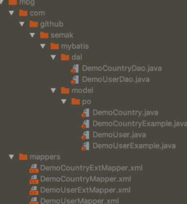

# semak-mybatis

`semak-mybatis`组件是一款基于ORM框架MyBatis的组件，其特性主要包括：


1. 提供基于CRUD的基本操作和模板操作（基于mbg的Example，可选）接口。
2. 支持扩展Mapper文件。
3. 支持物理分页。
4. 基于属性配置（properties或yaml）的拦截器属性扩展。
5. 支持事务检查拦截器。
6. 支持分页结果转换器。
7. 提供基于官方代码生成器的扩展插件，以增强代码生成功能（解决了@Builder在复合主键情况下的继承问题）。


## 1. 先决条件


### 1.1. 环境配置


1. Open JDK 1.8+，并已配置有效的环境变量。
2. Maven 3.3.x+，并已配置有效的环境变量。


### 1.2. Maven依赖配置


```xml
<dependency>
    <groupId>com.github.semak.mybatis</groupId>
    <artifactId>semak-mybatis-spring-boot-starter</artifactId>
    <version>最新RELEASE版本</version>
</dependency>
```


**重要：请依赖数据源组件及对应的jdbc驱动。**


## 2. 自动生成代码


基于官方MBG（MyBatis Generator）工具结合扩展插件来自动生成代码。


### 2.1. 配置mbg插件


请在需要的模块POM中添加MBG的插件坐标（插件版本受semak的parent管理，这里无需配置）：


```xml
<!-- mvn clean mybatis-generator:generate -->
<plugin>
    <groupId>org.mybatis.generator</groupId>
    <artifactId>mybatis-generator-maven-plugin</artifactId>
    <configuration>
        <!-- 配置文件 -->
        <configurationFile>${basedir}/src/main/resources/generator/generatorConfig.xml</configurationFile>
        <!-- 文件生成目录 -->
        <outputDirectory>${project.build.directory}/mbg</outputDirectory>
        <!-- 覆盖之前生成的文件 -->
        <overwrite>true</overwrite>
        <!-- 将进度消息写入构建日志 -->
        <verbose>true</verbose>
        <!-- 定义多个Context时，可指定对应的Context id，多个请用英文逗号分隔。如未指定，则执行所有Context -->
        <!--<contexts>Oracle</contexts>-->
    </configuration>
    <dependencies>
        <dependency>
            <groupId>com.github.semak.mybatis</groupId>
            <artifactId>semak-mybatis-mbg-plugin</artifactId>
            <version>最新RELEASE版本</version>
        </dependency>
        <dependency>
            <groupId>com.github.semak.commons</groupId>
            <artifactId>semak-commons-model</artifactId>
            <version>最新RELEASE版本</version>
        </dependency>
        <dependency>
            <groupId>uk.com.robust-it</groupId>
            <artifactId>cloning</artifactId>
            <version>1.9.12</version>
        </dependency>
        <dependency>
            <groupId>mysql</groupId>
            <artifactId>mysql-connector-java</artifactId>
            <version>8.0.16</version>
        </dependency>
        <dependency>
            <groupId>com.github.noraui</groupId>
            <artifactId>ojdbc7</artifactId>
            <version>12.1.0.2</version>
        </dependency>
    </dependencies>
</plugin>
```


#### 2.1.1. 插件属性配置说明

| 属性 | 是否必填 | 默认值 | 描述 |
| :--- | :--- | :--- | :--- |
| configurationFile | 否 | `${basedir}/src/main/resources/generatorConfig.xml` | XML配置文件路径。 |
| outputDirectory | 否 | `${project.build.directory}/generated-sources/mybatis-generator` | 生成文件存放路径。 |
| overwrite | 否 | false | 对生成的同名文件进行覆盖。 |
| verbose | 否 | N/A | 将处理进度消息构建到日志中。 |
| contexts | 否 | N/A | 以逗号分隔的当前运行中使用的上下文列表。指定的id必须与`<context>`配置元素的`id`属性的值完全匹配。
如果未指定此参数，则所有上下文都将激活。 |


#### 2.1.2. 插件依赖类库说明
| 类库名称 | 是否必填 | 描述 |
| :--- | :--- | :--- |
| semak-mybatis-mbg-plugin | 是 | MBG扩展插件 |
| semak-commons-model | 是 | PO的基类依赖 |
| cloning | 是 | MBG扩展插件中的深度拷贝依赖 |
| JDBC驱动 | 是 | 选择对应的JDBC驱动依赖 |


### 2.2. 配置mbg模板


这里以Oracle和MySQL的混合生成模板为例。在选定模块的`${basedir}/src/main/resources/generator`下新建文件`db.properties`和`generatorConfig.xml`，内容分别如下：


#### 2.2.1. db.properties


```properties
mysql.jdbc.driverClass=com.mysql.cj.jdbc.Driver
mysql.jdbc.connectionURL=jdbc:mysql://domain:3306/schema
mysql.jdbc.userId=username
mysql.jdbc.password=password

oracle.jdbc.driverClass=oracle.jdbc.OracleDriver
oracle.jdbc.connectionURL=jdbc:oracle:thin:@domain:service
oracle.jdbc.userId=username
oracle.jdbc.password=password
```


#### 2.2.2. generatorConfig.xml


```xml
<?xml version="1.0" encoding="UTF-8"?>
<!DOCTYPE generatorConfiguration
        PUBLIC "-//mybatis.org//DTD MyBatis Generator Configuration 1.0//EN"
        "http://mybatis.org/dtd/mybatis-generator-config_1_0.dtd">
<generatorConfiguration>
    <!-- 引入DB参数配置 -->
    <properties resource="generator/db.properties"/>

    <context id="Mysql" targetRuntime="com.github.semak.mybatis.mbg.plugin.runtime.MyBatis3Impl">
 				<property name="javaFileEncoding" value="UTF-8"/>
        
      	<!-- 加载Semak增强插件 -->
        <plugin type="com.github.semak.mybatis.mbg.plugin.EnhancedGeneratorPlugin">
            <property name="lombok" value="Getter,Setter,Builder"/>
        </plugin>

        <jdbcConnection driverClass="${mysql.jdbc.driverClass}"
                        connectionURL="${mysql.jdbc.connectionURL}"
                        userId="${mysql.jdbc.userId}"
                        password="${mysql.jdbc.password}">
        </jdbcConnection>

        <!-- 生成实体类 指定包名 以及生成的地址 （使用Maven则生成在target目录下） -->
        <javaModelGenerator targetPackage="com.github.semak.mybatis.model.po" targetProject="MAVEN">
            <property name="enableSubPackages" value="false"/>
            <property name="trimStrings" value="false"/>
            <!-- 父类 -->
            <property name="rootClass" value="com.github.semak.commons.model.po.BasePo" />
        </javaModelGenerator>

        <!-- 生成SQLMAP文件 -->
        <sqlMapGenerator targetPackage="mappers" targetProject="MAVEN"/>

        <!-- 生成Dao文件 -->
        <javaClientGenerator type="XMLMAPPER" targetPackage="com.github.semak.mybatis.dal" targetProject="MAVEN"/>

        <!-- 添加Table -->
        <table tableName="t_demo_country" domainObjectName="DemoCountry" mapperName="DemoCountryDao">
            <!--mysql 配置-->
            <generatedKey column="id" sqlStatement="JDBC" identity="true"/>
        </table>
    </context>

    <!-- targetRuntime ==> MyBatis3SimpleImpl or MyBatis3Impl -->
    <context id="Oracle" targetRuntime="com.github.semak.mybatis.mbg.plugin.runtime.MyBatis3Impl">

        <!-- 加载Semak增强插件 -->
        <plugin type="com.github.semak.mybatis.mbg.plugin.EnhancedGeneratorPlugin">
            <property name="lombok" value="Getter,Setter,Builder"/>
        </plugin>

        <jdbcConnection driverClass="${oracle.jdbc.driverClass}"
                        connectionURL="${oracle.jdbc.connectionURL}"
                        userId="${oracle.jdbc.userId}"
                        password="${oracle.jdbc.password}">
        </jdbcConnection>

        <!-- 生成实体类 指定包名 以及生成的地址 （使用Maven生成在target目录下） -->
        <javaModelGenerator targetPackage="com.github.semak.mybatis.model.po" targetProject="MAVEN">
            <property name="trimStrings" value="false"/>
            <!-- 父类 -->
            <property name="rootClass" value="com.github.semak.commons.model.po.BasePo" />
        </javaModelGenerator>

        <!-- 生成SQLMAP文件 -->
        <sqlMapGenerator targetPackage="mappers" targetProject="MAVEN"/>

        <!-- 生成Dao文件 -->
        <javaClientGenerator type="XMLMAPPER" targetPackage="com.github.semak.mybatis.dal" targetProject="MAVEN"/>

        <!-- 添加Table -->
        <table tableName="T_DEMO_USER" domainObjectName="DemoUser" mapperName="DemoUserDao">
            <!--oracle 配置-->
            <generatedKey column="id" sqlStatement="select SEQ_DEMO_USER.nextval from dual" identity="false" type="pre"/>
        </table>
    </context>
</generatorConfiguration>
```


- 配置模板时涉及的扩展项（不建议变更）：
   - **context.targetRuntime**: 这里**建议**指定`com.github.semak.mybatis.mbg.plugin.runtime.MyBatis3Impl`，可以生成基于Example模板操作的动态SQL项；也可以指定`com.github.semak.mybatis.mbg.plugin.runtime.MyBatis3SimpleImpl`，以省略Example模板操作项，仅生成基本操作项。
   - **plugin.type**": 这里**必须**指定`com.github.semak.mybatis.mbg.plugin.EnhancedGeneratorPlugin`以扩展MBG插件。
- 配置模板时涉及需要变动的项：
   - **javaModelGenerator.targetPackage**: PO类生成到的目标包。
   - **javaClientGenerator.targetPackage**: Dao类生成到的目标包。
   - **table**: 表配置。
- 参照模板给出的注释进行配置，需要进一步了解MBG的配置，请移步[官方站点](http://www.mybatis.org/generator/quickstart.html)。
- 如果是做**分库分表**等操作，可以先按逻辑表名建立物理表，生成完毕后将逻辑表对应的物理表删除。


#### 2.2.3. 增强插件说明


在mbg的配置模板中，我们使用了下面的插件：


```xml
<!-- 加载Semak增强插件 -->
<plugin type="com.github.semak.mybatis.mbg.plugin.EnhancedGeneratorPlugin">
    <property name="lombok" value="Getter,Setter,Builder"/>
</plugin>
```


此插件主要对原有MBG工具进行了简化和增强，包括但不限于注释增强，Swagger注解支持，Lombok支持，CRUD接口整合等。


此插件涉及的属性配置如下：

| 属性名称 | 是否必填 | 默认值 | 描述 |
| :--- | :--- | :--- | :--- |
| crudInterface | 否 | `com.github.semak.mybatis.repository.CrudRepository` | Dao所继承的CRUD接口，通过`context.targetRuntime`的值进行适配，不建议进行配置。 |
| crudSimpleInterface | 否 | `com.github.semak.mybatis.repository.CrudSimpleRepository` | Dao所继承的简化版CRUD接口，通过`context.targetRuntime`的值进行适配，不建议进行配置。 |
| lombok | 否 | N/A | Model的lombok注解，支持`Builder`、`Data`、`Getter`、`Setter`、`ToString`、`EqualsAndHashCode`、`lombokEqualsAndHashCodeCallSuper`属性，配置多个时通过英文逗号进行分隔。 |
| swagger | 否 | false | Model的Swagger注解，注解内容汲取自表与字段的注释。（不建议配置为`true`，除非你打算把PO和DTO混用） |
| extMapper | 否 | true | 生成扩展Mapper文件，用于编写自定义的SQL，与模板生成的常规Mapper文件分开，以便Mapper重新生成后便于覆盖。 |


#### 2.2.4. 代码生成方式


进入配置MBG插件的模块，通过命令行方式生成：


```bash
# cd module
mvn clean mybatis-generator:generate
```


生成完毕后，在预先指定的生成目录下查找文件，拷贝到需要的模块中。


### 2.3. Mapper文件使用约定


代码生成工具针对同一个表，会生成2个Mapper文件，一个为标准的Mapper文件，含CRUD操作的样例；另一个为扩展的ExtMapper文件，内容为空，自定义的SQL可以写在这里。


针对这2个文件，我们按约定进行操作。

#### 2.3.1. 标准Mapper文件


> 文件名如：`xxxMapper.xml`

文件提供基础且标准的CRUD操作和与PO匹配的结果集定义，原则上**不能进行改动**，以便数据库表变动时，新生成的标准Mapper文件可以直接进行**全量覆盖**。


#### 2.3.2. ExtMapper文件


> 文件名如：`xxxExtMapper.xml`

业务产生的数据库**自定义操作**和**特定结果集**定义在这里，和标准Mapper文件分开，便于维护。


### 2.4. 生成文件使用方式

通过执行mbg的生成命令后，我们可以看到的生成文件的目录结构大致如下：




- `dal`包下的dao接口文件：拷贝到对应的dal层，作为数据访问接口使用，其继承了预定义的CRUD接口，可以直接使用预定义操作。
- `model`包下的model及example模板文件：拷贝到对应的model层，作为PO和模板使用。
- `mappers`包下的mapper及extMapper文件：拷贝到对应的mapper资源文件夹下，作为mapper资源使用。


### 2.5. MBG在不同SCHEMA中同一表名的处理问题


使用Myatis Generator插件生产代码时，如果配置的数据库用户**可以访问多个schema**时，你就要注意生成的代码可能会有冲突了。冲突的具体表现为：使用了`mvn clean mybatis-generator:generate`命令（这里是用了`clean`的），却有文件覆盖的警告产生：


```
......

[INFO] Saving file UserExtMapper.xml
[INFO] Saving file UserExtMapper.xml
[WARNING] Existing file /xxx/target/mbg/mappers/UserExtMapper.xml was overwritten

......
```


问题特征：


- INFO级别的日志中，会看到生成多个同名文件。
- WARNING级别的日志中，会有覆盖产生（命令使用了`mvn clean`时，依然产生此类警告）。

下面看一下解决方式。


#### 2.5.1. 通用解决方案


在`table`节点中添加`schema`属性来指定表的`schema`。然后，在其子节点中新增节点`<property name="ignoreQualifiersAtRuntime" value="true"/>`，以保证`schema`的前缀不会附加到SQL语句中。


```xml
<table schema="${oracle.table.schema}"  tableName="TS_COUNTRY" domainObjectName="Country" mapperName="CountryDao">
    <!-- 默认为false，如果设置为true，在生成的SQL中，table名字不会加上catalog或schema； -->
    <property name="ignoreQualifiersAtRuntime" value="true"/>    
</table>
```


#### 2.5.2. MySQL 8.x


如果连接数据库使用的是MySQL 8.x驱动时，此时设置table的schema也没有效果，需要在连接节点里面添加`nullCatalogMeansCurrent`属性，且值为`true`：


```xml
<jdbcConnection driverClass="${mysql.jdbc.driverClass}"
                connectionURL="${mysql.jdbc.connectionURL}"
                userId="${mysql.jdbc.userId}"
                password="${mysql.jdbc.password}">
    <property name="nullCatalogMeansCurrent" value="true" />
</jdbcConnection>
```


## 3. 属性定义


通过MBG生成完文件后，这里再对MyBatis稍作配置，即可使用MyBatis对数据库进行操作了。


### 3.1. MyBatis核心属性定义


```yaml
mybatis:
  #核心配置
  configuration:
    #全局映射器启用缓存
    cache-enabled: true
    #延迟加载的全局开关。当开启时，所有关联对象都会延迟加载
    lazy-loading-enabled: true
    #当开启时，任何方法的调用都会加载该对象的所有属性
    aggressive-lazy-loading: false
    #是否允许单一语句返回多结果集
    multiple-result-sets-enabled: true
    #使用列标签代替列名
    use-column-label: true
    #指定 MyBatis 应如何自动映射列到字段或属性。 none 表示取消自动映射；partial 只会自动映射没有定义嵌套结果集映射的结果集。 full 会自动映射任意复杂的结果集（无论是否嵌套）
    auto-mapping-behavior: full
    #设置超时时间，它决定驱动等待数据库响应的秒数
    default-statement-timeout: 180
    #当没有为参数提供特定的 JDBC 类型时，为空值指定 JDBC 类型。 某些驱动需要指定列的 JDBC 类型，多数情况直接用一般类型即可，比如 null、varchar 或 other
    jdbc-type-for-null: null
    #默认session，即同一session中，相同的SQL语句只能执行一次。当作用域改为statement时，同一session中，相同SQL可执行多次
    local-cache-scope: session
  #Locations of Mapper xml config file.
  mapper-locations:
    - classpath*:/mappers/*Mapper.xml
  #指定类型别名扫描包名(使用英文逗号进行分割)
  type-aliases-package: com.github.semak.mybatis.model.typealias
  #指定类型处理器扫描包名(使用英文逗号进行分割)
  type-handlers-package: com.github.semak.mybatis.typehandler
  #拦截器
  interceptors:
    #Spring事务检视拦截器
    inspectTransactionInterceptor:
      enabled: true
      class-name: com.github.semak.mybatis.interceptor.InspectTransactionInterceptor
      #properties:
      # a1: b
      # a2: c
```


- 配置核心属性定义时，涉及需要变动的项：
   - **mybatis.mapper-locations**: 指定mapper文件的路径。
   - **mybatis.type-aliases-package**: 指定类型别名扫描包名。
   - **mybatis.type-handlers-package**: 指定类型处理器扫描包名。


#### 3.1.1. 属性描述
| 属性 | 必填 | 默认值 | 描述 |
| :--- | :--- | :--- | :--- |
| **mybatis.configuration.cache-enabled** | 否 | true | 全局映射器启用缓存。 |
| **mybatis.configuration.lazy-loading-enabled** | 否 | false | 延迟加载的全局开关。当开启时，所有关联对象都会延迟加载。 |
| **mybatis.configuration.aggressive-lazy-loading** | 否 | false | 当开启时，任何方法的调用都会加载该对象的所有属性。 |
| **mybatis.configuration.multiple-result-sets-enabled** | 否 | true | 是否允许单一语句返回多结果集。 |
| **mybatis.configuration.use-column-label** | 否 | true | 使用列标签代替列名。 |
| **mybatis.configuration.auto-mapping-behavior** | 否 | partial | 指定 MyBatis 应如何自动映射列到字段或属性。 none 表示取消自动映射；partial 只会自动映射没有定义嵌套结果集映射的结果集。 full 会自动映射任意复杂的结果集（无论是否嵌套）。 |
| **mybatis.configuration.default-statement-timeout** | 是 | N/A | 设置超时时间，它决定驱动等待数据库响应的秒数。 |
| **mybatis.configuration.jdbc-type-for-null** | 否 | other | 当没有为参数提供特定的 JDBC 类型时，为空值指定 JDBC 类型。 某些驱动需要指定列的 JDBC 类型，多数情况直接用一般类型即可，比如 null、varchar 或 other。 |
| **mybatis.configuration.local-cache-scope** | 否 | session | 默认session，即同一session中，相同的SQL语句只能执行一次。当作用域改为statement时，同一session中，相同SQL可执行多次。 |
| **mybatis.mapper-locations** | 是 | N/A | Mapper XML文件路径。 |
| **mybatis.type-aliases-package** | 否 | N/A | 指定类型别名扫描包名(使用英文逗号进行分割)。 |
| **mybatis.type-handlers-package** | 否 | N/A | 指定类型处理器扫描包名(使用英文逗号进行分割)。 |
| **mybatis.interceptors.&lt;interceptorName&gt;.enabled** | 否 | true | 启用拦截器。 |
| **mybatis.interceptors.&lt;interceptorName&gt;.class-name** | 是 | N/A | 拦截器的类名（需提供无参构造方法）。 |
| **mybatis.interceptors.&lt;interceptorName&gt;.properties** | 否 | N/A | 拦截器属性。 |

**P.S.: 建议配置请参考样例中的属性值**


### 3.2. PageHelper分页插件定义


```yaml
#分页插件配置
pagehelper:
  #分页插件会自动检测当前的数据库链接，自动选择合适的分页方式。特别注意：使用 SqlServer2012 数据库时，需要手动指定为 sqlserver2012，否则会使用 SqlServer2005 的方式进行分页。
  #helper-dialect:
  #默认值为 false，该参数对使用 RowBounds 作为分页参数时有效。 当该参数设置为 true 时，会将 RowBounds 中的 offset 参数当成 pageNum 使用，可以用页码和页面大小两个参数进行分页。
  offset-as-page-num: true
  #默认值为false，该参数对使用 RowBounds 作为分页参数时有效。 当该参数设置为true时，使用 RowBounds 分页会进行 count 查询。
  row-bounds-with-count: true
  #默认值为 false，当该参数设置为 true 时，如果 pageSize=0 或者 RowBounds.limit = 0 就会查询出全部的结果（相当于没有执行分页查询，但是返回结果仍然是 Page 类型）。
  page-size-zero: false
  #分页合理化参数，默认值为false。当该参数设置为 true 时，pageNum<=0 时会查询第一页， pageNum>pages（超过总数时），会查询最后一页。默认false 时，直接根据参数进行查询。
  reasonable: false
```


#### 3.2.1. 属性描述

| 属性 | 必填 | 默认值 | 描述 |
| :--- | :--- | :--- | :--- |
| **pagehelper.helper-dialect** | 否 | N/A | 自动选择合适的分页方式。特别注意：使用 SqlServer2012 数据库时，需要手动指定为 sqlserver2012，否则会使用 SqlServer2005 的方式进行分页。 |
| **pagehelper.offset-as-page-num** | 否 | false | 当该参数设置为 `true` 时，**会将 RowBounds 中的 offset 参数当成 pageNum 使用**，可以用页码和页面大小两个参数进行分页。该参数对使用 RowBounds 作为分页参数时有效。 |
| **pagehelper.row-bounds-with-count** | 否 | false | 当该参数设置为true时，使用 RowBounds 分页会进行 count 查询。该参数对使用 RowBounds 作为分页参数时有效。 |
| **pagehelper.page-size-zero** | 否 | false | 当该参数设置为 `true` 时，如果 pageSize=0 或者 RowBounds.limit = 0 就会查询出全部的结果（相当于没有执行分页查询，但是返回结果仍然是 Page 类型）。 |
| **pagehelper.reasonable** | 否 | false | 当该参数设置为 `true` 时，pageNum<=0 时会查询第一页， pageNum>pages（超过总数时），会查询最后一页。默认 `false` 时，直接根据参数进行查询。 |

**P.S.: 建议配置请参考样例中的属性值**


### 3.3. 数据源定义


由数据源组件`semak-hikaricp`、`semak-druid`等来提供支撑，具体属性含义参照组件相关文档。


配置样例：


```yaml
spring:
  profiles: mysql
  datasource:
    #hikari / druid
    datasource-type: hikari
    datasource-names:
      - "pri-ds"
    base-datasource-configure:
      minimum-idle: 2
      maximum-pool-size: 5
      auto-commit: true
      idle-timeout: 60000
      max-lifetime: 600000
      connection-timeout: 12000
      leak-detection-threshold: 5000
    pri-ds:
      #enabled: true
      #default-candidate: false
      data-source-properties:
        useUnicode: true
        characterEncoding: utf8
        autoReconnect: true
        failOverReadOnly: false
        useSSL: false
      jdbc-url: jdbc:mysql://domain:3306/schema
      username: username
      password: password
      minimum-idle: 2
      maximum-pool-size: 5
      connection-test-query: SELECT 1
```


## 4. 数据操作


### 4.1. 基于CRUD接口的操作


为方便单表的CRUD操作，在上述MBG插件生成的Mapper文件和Dao文件中，预置了一些操作方法，以提升开发人员效率。

### 4.1.1. 基于CRUD接口的基本数据操作


基于MBG的`Context`中的属性`targetRuntime`设置为`com.github.semak.mybatis.mbg.plugin.runtime.MyBatis3SimplImpl`而生成的代码。在没有特别指定的情况下，Dao接口会自动选择继承`com.github.semak.mybatis.repository.CrudSimpleRepository`接口，提供CRUD的基本方法，具体如下：


**CrudSimpleRepository.java**


```java
/**
 * CRUD通用接口 (对应Context的TargetRuntime为com.github.semak.mybatis.mbg.plugin.runtime.MyBatis3SimpleImpl)
 *
 * <p> 泛型类型代表：M - Model ID - ID</p>
 *
 * @author caobin
 * @version 1.0 2019.06.12
 */
public interface CrudSimpleRepository<M, ID extends Serializable> {

    /**
     * 插入记录
     *
     * @param record
     * @return
     */
    int insert(M record);

    /**
     * 统计所有记录数
     *
     * @return
     */
    long count();

    /**
     * 通过主键获取记录
     *
     * @param id
     * @return
     */
    M selectByPrimaryKey(ID id);

    /**
     * 获取所有记录
     *
     * @return
     */
    List<M> selectAll();

    /**
     * 分页获取所有记录
     *
     * @param rowBounds
     * @return
     */
    Page<M> selectAllPaged(RowBounds rowBounds);

    /**
     * 通过主键更新记录
     *
     * @param demoUser
     * @return
     */
    int updateByPrimaryKey(M demoUser);

    /**
     * 通过主键删除记录
     *
     * @param id
     * @return
     */
    int deleteByPrimaryKey(ID id);
}
```


生成的Dao如下：


```java
public interface DemoUserDao extends CrudSimpleRepository<DemoUser, Long> {

}
```


这样，既保持了业务Dao的简洁，又保证了单表操作的高效。


### 4.1.2. 基于CRUD接口的模板数据操作


基于MBG的`Context`中的属性`targetRuntime`设置为`com.github.semak.mybatis.mbg.plugin.runtime.MyBatis3Impl`而生成的代码。在没有特别指定的情况下，Dao接口会自动选择继承`com.github.semak.mybatis.repository.CrudRepository`接口，提供CRUD的基本方法，具体如下：


```java
/**
 * CRUD通用接口 (对应Context的TargetRuntime为com.github.semak.mybatis.mbg.plugin.runtime.MyBatis3Impl)
 *
 * <p> 泛型类型代表：M - Model, ME - ModelExample, ID - ID</p>
 *
 * @author caobin
 * @version 1.0 2019.06.11
 */
public interface CrudRepository<M, ME, ID extends Serializable> {

    /**
     * 插入记录
     *
     * @param record
     * @return
     */
    int insert(M record);

    /**
     * 选择性插入记录（动态SQL）
     *
     * @param record
     * @return
     */
    int insertSelective(M record);

    /**
     * 统计所有记录数
     *
     * @return
     */
    long count();

    /**
     * 通过复杂条件统计记录数
     *
     * @param example
     * @return
     */
    long countByExample(ME example);

    /**
     * 获取所有记录
     *
     * @return
     */
    List<M> selectAll();

    /**
     * 分页获取所有记录
     *
     * @param rowBounds
     * @return
     */
    Page<M> selectAllPaged(RowBounds rowBounds);

    /**
     * 通过主键获取记录
     *
     * @param id
     * @return
     */
    M selectByPrimaryKey(ID id);

    /**
     * 通过复杂条件获取记录
     *
     * @param example
     * @return
     */
    List<M> selectByExample(ME example);

    /**
     * 通过复杂条件分页获取记录
     *
     * @param example
     * @param rowBounds
     * @return
     */
    Page<M> selectByExamplePaged(ME example, RowBounds rowBounds);

    /**
     * 通过主键更新记录
     *
     * @param record
     * @return
     */
    int updateByPrimaryKey(M record);

    /**
     * 通过复杂条件更新记录
     *
     * @param record
     * @param example
     * @return
     */
    int updateByExample(@Param("record") M record, @Param("example") ME example);

    /**
     * 通过复杂条件选择性更新记录（动态SQL）
     *
     * @param record
     * @param example
     * @return
     */
    int updateByExampleSelective(@Param("record") M record, @Param("example") ME example);

    /**
     * 通过主键选择性更新记录（动态SQL）
     *
     * @param record
     * @return
     */
    int updateByPrimaryKeySelective(M record);

    /**
     * 通过主键删除记录
     *
     * @param id
     * @return
     */
    int deleteByPrimaryKey(ID id);

    /**
     * 通过复杂条件删除记录
     *
     * @param example
     * @return
     */
    int deleteByExample(ME example);
}
```


生成的Dao如下：


```java
public interface DemoUserDao extends CrudRepository<DemoUser, DemoUserExample, Long> {

}
```


这里，我们可以看到，除了一些简单条件的CRUD操作外，还额外附加了基于Example模板的复杂条件操作。


关于Example模板的复杂条件操作，这里简单的例举一下：


```java
DemoUserExample demoUserExample = new DemoUserExample();
//创建条件
demoUserExample.createCriteria()
        //条件要素
        .andSexEqualTo("M")
        .andAgeGreaterThan(25)
        .andAgeLessThan(30);
//demoUserExample.or(NewcreateCriteria);
List<DemoUser> result = demoUserDao.selectByExample(demoUserExample);
```


简单来说，就是创建条件对象，设置（预置）条件来操作数据，更具体的可以参考[官方说明](http://www.mybatis.org/generator/generatedobjects/exampleClassUsage.html)。


### 4.2. 基于PageHelper的物理分页查询操作


分页插件采用了[PageHelper](https://github.com/pagehelper/Mybatis-PageHelper)做物理分页，使用步骤如下：


#### 4.2.1. 为Dao添加分页方法


分页样例：


```java
public interface UserDao {

    Page<DemoUser> selectXxxPaged(Condition queryCondition, RowBounds rowbounds);
}
```


- 定义方法时，如果需要分页，只需要在常规的查询方法上做两点改动：
   - 在参数列表的**最末位置**，追加参数`org.apache.ibatis.session.RowBounds`。
   - 返回的结果用`com.github.pagehelper.Page`来包装，Page对象中既能获取结果集列表，也可以获取详细的分页返回参数。
- `RowBounds`: RowBounds的两参构造方法提供了`offset`和`limit`两个参数，我们在PageHelper的配置中，已将`offset`作为`pageNum`来使用，即`offset`代表的是第N页。


#### 4.2.2. 为ExtMapper文件添加分页查询方法


```xml
 <select id="selectXxxPaged" resultMap="BaseResultMap">
    select
    <include refid="Base_Column_List" />
    from demo_user
    where condition = #{queryCondition,jdbcType=VARCHAR}
 </select>
```


- Mapper中定义的查询语句，**不需添加任何分页关键字**，分页的执行会通过插件自动对`RowBounds`的拦截，并在执行的SQL中进行分页关键字的拼接操作。然后，我们看到的SQL日志片段是这样的：

  ```
  2019-06-17 09:55:27.661  INFO 8758 --- [main] org.jdbcdslog.StatementLogger: select
   
  id, name, sex
  
  from demo_user
   
  where sex = 'F'  LIMIT 2 ; 2 ms.


#### 4.2.3. 自动执行count的分页查询

在执行分页查询的同时，PageHelper会执行对应的count语句，相应的日志片段是这样的：

```
2019-06-17 09:55:27.636  INFO 8758 --- [main] org.jdbcdslog.StatementLogger: SELECT count(0) FROM demo_user where sex = 'F'; 1 ms.
```

所以说，一个Dao的分页查询，既执行了数据查询，也执行了count查询。


#### 4.2.4. 不执行count的分页查询


如果你并不想在每次分页时都进行`count`语句进行统计，可以这样执行Dao：


```java
Page<DemoUser> result = PageHelper.startPage(pageNum, pageSize, false).doSelectPage(() -> demoUserDao.selectXxxpaged(Condition queryCondition));
```


`startPage`方法的第三个参数设置为`false`来主动关闭`count`语句，同时，也不用将`RowBounds`附加在Dao方法上了。


## 5. 数据转换


### 5.1. 分页结果转换


> **PO**: Persistent Object，**DTO**: Data Transfer Object

为了方便分页对象`Page<PO>`到`DTO`对象的快速转换，这里提供了`com.github.semak.commons.model.dto.SimplePageInfo`类来进行处理。


#### 5.1.1. SimplePageInfo的结构


```java
/**
 * 通用PageInfo
 *
 * <p>用于基于PageHelper的分页PO到分页DTO的转换</p>
 *
 * @author caobin
 * @version 1.0 2019.06.10
 */
@Data
public class SimplePageInfo<D> extends BaseDto {

    /**
     * 当前页
     */
    private int currentPage;

    /**
     * 每页的数量
     */
    private int pageSize;

    /**
     * 总页数
     */
    private int totalPage;

    /**
     * 总记录数
     */
    private long totalNum;

    /**
     * (转换后的)结果集
     */
    private List<D> list;


    public SimplePageInfo(){}


    public SimplePageInfo(Page<? extends Serializable> page, Class<D> targetClass){
        this(page, poList -> {
            if (targetClass != null && !CollectionUtils.isEmpty(poList)) {
                return poList.stream().map(p -> {
                    Object targetObject = newInstance(targetClass);
                    //BeanCopier本身已有缓存机制，故这里不用再做缓存
                    BeanCopier beanCopier = BeanCopier.create(p.getClass(), targetObject.getClass(), false);
                    beanCopier.copy(p, targetObject, null);
                    return (D) targetObject;
                }).collect(Collectors.toList());
            }
            return null;
        });
    }


    public SimplePageInfo(Page<? extends Serializable> page, Transformer<D> transformer){
        if(!(page == null || page.isEmpty())){
            currentPage = page.getPageNum();
            pageSize = page.getPageSize();
            totalPage = page.getPages();
            totalNum = page.getTotal();
            list = transformer.transform(page.getResult());
        }
    }


    private static Object newInstance(Class<?> clazz){
        try {
            return clazz.newInstance();
        } catch (InstantiationException | IllegalAccessException e) {
            throw new IllegalArgumentException(e);
        }
    }

    @FunctionalInterface
    public interface Transformer<D> {

        /**
         * 结果集转换
         * @param poList
         * @return
         */
        List<D> transform(List<? extends Serializable> poList);
    }
}
```


关于分页的字段名称定义，请尽量与前端按此标准进行协商。如有不一致，亦可根据此类进行扩展。


#### 5.1.2. 使用方式


当PO和DTO中**需要映射的字段名一致**，只是数量不一致，我们可以这样进行转换：


> 下面例子中的`DemoUser`为PO类，`UserResponse`为DTO类

```java
Page<DemoUser> result = demoUserDao.selectAllPaged(new RowBounds(1, 4));
SimplePageInfo<UserResponse> simplePageInfo = new SimplePageInfo<>(result, UserResponse.class);
```


#### 5.1.3. 自定义转换的使用方式


当PO和DTO中**需要映射的字段名不一致**，我们可以这样进行转换：


> 例子中的`DemoUser`为PO类，`UserCustomResponse`为DTO类

```java
Page<DemoUser> result = demoUserDao.selectAllPaged(new RowBounds(1, 4));
        SimplePageInfo<UserCustomResponse> simplePageInfo = new SimplePageInfo<>(result, poList -> poList.stream().map(po -> (DemoUser)po).map(po ->
           UserCustomResponse.builder()
                    .id(po.getId().longValue())
                    .user(po.getUsername())
                    .age(po.getAge())
                    .sex(po.getSex())
                    .build()
        ).collect(Collectors.toList()));
```


## 6. 扩展拦截器


### 6.1. 事务检查拦截器


为避免在执行持久化语句时，开发人员遗漏`@Transactional`注解，造成数据出错的问题。组件默认启用了事务检视插件`com.github.semak.mybatis.interceptor.InspectTransactionInterceptor`。


```yaml
mybatis:
  #......
  #拦截器
  interceptors:
    #Spring事务检视拦截器
    inspectTransactionInterceptor:
      enabled: true
      class-name: com.github.semak.mybatis.interceptor.InspectTransactionInterceptor
```


当遗漏事务注解时，会抛出如下错误：


> Spring managed transaction is not available

```
Caused by: javax.transaction.TransactionRequiredException: Spring managed transaction is not available: com.github.semak.mybatis.dal.DemoCountryDao.insert in file [/Users/brevy/Project/Github/semak/semak-mybatis/semak-mybatis-test/target/classes/mappers/DemoCountryMapper.xml]
	at com.github.semak.mybatis.interceptor.InspectTransactionInterceptor.intercept(InspectTransactionInterceptor.java:56)
	at org.apache.ibatis.plugin.Plugin.invoke(Plugin.java:61)
	... 44 more
```


开发环境建议开启，避免开发中的遗漏事务注解造成数据出错的情况。


在生产环境可以通过配置将`inspectTransactionInterceptor`插件的`enabled`属性置为`false`来关闭拦截器。


```yaml
mybatis:
  #......
  #拦截器
  interceptors:
    #Spring事务检视拦截器
    inspectTransactionInterceptor:
      enabled: false
      class-name: com.github.semak.mybatis.interceptor.InspectTransactionInterceptor
```
