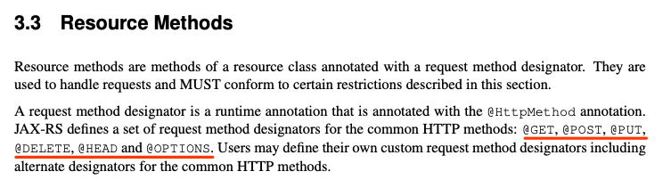
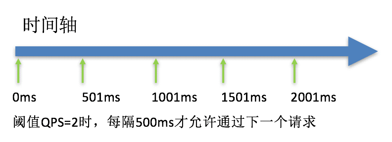

# semak-rest

`rsemak-rest` 组件是一款基于Spring Rest构建的组件。除了支持最基本的RESTful风格服务之外，通过整合SpringCloud和SpringCloud Alibaba，将 `semak-rest` 组件纳入到一个更大的服务治理生态圈之内，大幅提高其应用价值。通过整合一系列的功能，组件提供了如下的一些特性：


**服务端功能：**

1. 统一的服务响应格式（主要针对Http Header `Accept` 为 `application/json` 和 `application/xml` ）。
1. 基于Jackson类库提供的序列化和反序列化能力（支持JSON & XML）。
1. 全局异常处理机制。
1. 出入站请求/响应详细日志。
1. 通过简单配置实现跨域功能。
1. 自定义业务异常的SPI接入。
1. 基于Logback的日志占位符扩展。
1. 基于Resource Bundle的响应错误码映射。
1. SSL证书校验功能。
1. Springdoc-openapi支持（整合Swagger-UI）。
1. 支持Thymeleaf。
1. Undertow内嵌应用服务器支持。
1. 通过 `semak-feign-maven-plugin` 插件自动生成基于Spring Cloud Openfeign的服务调用接口。


**客户端功能：**

1. 基于Spring Cloud OpenFeign构建的基于接口代理实现的Rest服务客户端，支持基于具体URL和基于服务发现的REST服务调用。
1. 支持基于Spring Cloud Ribbon的客户端负载均衡功能（仅限于服务发现功能启用时）。
1. 支持基于HttpClient和OkHttp的客户端Http实现。
1. 支持客户端发送请求前对Http Headers的动态设置。
1. 多种客户端异常处理机制：被动抛出异常和主动处理异常机制。
1. 出入站请求/响应详细日志。
1. 提供可以处理统一请求/响应格式的插件，组件默认提供和服务端默认服务响应格式配套的插件，对于更多的响应格式处理，用户可以通过自定义插件来实现。


**服务治理功能：**

1. 整合基于Alibaba Nacos的服务注册、发现与管理功能，并提供Nacos控制台。
1. 整合基于Alibaba Sentinel的服务保护功能（包括：限流、降级等），并提供Sentinel控制台。
1. 提供在分布式微服务环境中，Sentinel基于Nacos Config的服务保护策略动态调整与实时生效功能。


## 1. 先决条件
### 1.1. 环境配置

1. Open JDK 1.8+，并已配置有效的环境变量。
1. Maven 3.3.x+，并已配置有效的环境变量。


### 1.2. Maven依赖配置
> 以下Maven依赖二选一，根据实际项目需要进行选择。

#### 1.2.1. 核心依赖（服务端+客户端完整功能）
```xml
<dependency>
    <groupId>com.github.semak.rest</groupId>
    <artifactId>semak-rest-spring-boot-starter</artifactId>
    <version>最新RELEASE版本</version>
</dependency>
```
#### 1.2.2. 扩展依赖（服务端+客户端+服务治理完整功能）
```xml
<dependency>
   <groupId>com.github.semak.rest</groupId>
   <artifactId>semak-rest-spring-cloud-alibaba-starter</artifactId>
   <version>最新RELEASE版本</version>
</dependency>
```


## 2. 服务端功能

### 2.1. 服务定义方式
和一般直接定义一个**RestController**类不同，基于 `semak-rest` 组件的服务在定义上需要遵循下面一些约定。


#### 2.1.1. 定义一个干净的接口
作为一个门面API接口，建议将命名定义为 `xxxFacade` 而不是Controller。当我们定义一个**Facade**接口时，必须保持接口的**干****净**，**不附加**任何的注解以免对接口造成污染（注解应都附加于实现类上）。
```java
public interface DemoFacade {

    /**
     * Hello - application/json
     *
     * @param name
     * @return
     */
    Response<String> appHello(String name);


    /**
     * 分页获取用户列表
     *
     * @param pageNum 当前页
     * @param pageSize 每页记录数
     * @return
     */
    Response<SimplePageInfo<UserResponse>> getUserList(int pageNum, int pageSize);


    /**
     * 添加用户
     *
     * @param userRequest
     * @return
     */
    Response<UserResponse> addUser(UserRequest userRequest);

}
```

- Facade接口不包含任何注解，保持干净，可用于基于接口代理的不同类型服务协议的实现。
- 返回类型的数据协议如果是 `application/json` 或 `application/xml` ，那么必须遵循 `Response<T>` 泛型模板类型的返回规范（规范会在后续进行详解）。


#### 2.1.2. 定义一个实现类


基于上面定义的Facade接口，我们为其定义一个实现，具体如下：
```java
@Slf4j
@RestController
@RequestMapping(value = "/demo", produces = {MediaType.APPLICATION_JSON_VALUE})
public class DefaultDemoFacade implements DemoFacade {

    @Autowired
    private DemoService demoService;

    @GetMapping(value = "/appHello/{name}")
    @Override
    public Response<String> appHello(@PathVariable("name")String name) {
        return Response.ofSuccess("Hello!! " + name);
    }

    @GetMapping("/getUsers")
    @Override
    public Response<SimplePageInfo<UserResponse>> getUserList(@RequestParam("pageNum")int pageNum, @RequestParam("pageSize")int pageSize) {
        Page<UserInfo> result = demoService.getUserInfos(new RowBounds(pageNum, pageSize));
        //下面没有使用连接查询（不是最优的方式），这里仅扩展工具使用方式，所以会略显啰嗦
        SimplePageInfo<UserResponse> simplePageInfo = new SimplePageInfo<>(result, poList -> poList.stream().map(po -> (UserInfo)po).map(po -> {
            List<RefUserContact> refUserContacts = demoService.getRefIdsByUserInfoIds(Lists.newArrayList(po.getId()));
            List<Integer> contactIds = CollectionUtils.isEmpty(refUserContacts) ? null : refUserContacts.stream().map(refUserContact -> refUserContact.getContactInfoId()).collect(Collectors.toList());
            List<Contact> contacts = contactIds == null ? null : demoService.getContactInfos(contactIds).stream().map(contactInfo -> {
                Contact contact = new Contact();
                BeanCopier
                        .create(ContactInfo.class, Contact.class, false)
                        .copy(contactInfo, contact, null);
                return contact;
            }).collect(Collectors.toList());
            UserResponse userResponse = GenericBuilder.of(UserResponse :: new)
                    .with(UserResponse :: setId, po.getId())
                    .with(UserResponse :: setUsername, po.getUsername())
                    .with(UserResponse :: setAge, po.getAge())
                    .with(UserResponse :: setContactList, contacts)
                    .build();
            return userResponse;
        }).collect(Collectors.toList()));
        return Response.ofSuccess(simplePageInfo);
    }

    @Operation(summary = "添加用户")
    @PostMapping(value = "/addUser")
    @Override
    public Response<UserResponse> addUser(@RequestBody @Valid UserRequest userRequest) {
        UserInfo userInfo = new UserInfo();
        UserResponse userResponse = new UserResponse();
        BeanCopier
                .create(UserRequest.class, UserInfo.class, false)
                .copy(userRequest, userInfo, null);
        demoService.addUser(userInfo);
        BeanCopier
                .create(UserInfo.class, UserResponse.class, false)
                .copy(userInfo, userResponse, null);
        return Response.ofSuccess(userResponse);
    }
}
```

- 实现类必须以 `org.springframework.web.bind.annotation.RestController` 注解进行标注。
- **服务类**支持的常用**Spring REST**注解如下：
   - **@RestController**: 必选，类级注解，声明Rest服务。
   - **@RequestMapping的属性：**
      - **value**: 可选，全局注解，建议填写通用URI前缀。
      - **method**: 可选，全局注解，支持`RequestMethod`中的枚举方法（GET, HEAD, POST, PUT, PATCH, DELETE, OPTIONS, TRACE），可以使用`@GetMapping/@PostMapping/@PutMapping/@DeleteMapping`简化`@RequestMapping`的部分**method**属性。
      - **produces**: 可选，全局注解，影响**响应**的`Content-Type`值，默认情况下，建议填写`MediaType.APPLICATION_JSON_VALUE`。
      - **consumes**: 可选，全局注解，限制**请求**的`Content-Type`值，一般不建议填写。
- **服务方法**支持的常用**Spring REST**注解
   - **@RequestMapping的升级线：**
      - **value**: 可选，可拼接类级`@RequestMapping`注解，形成完整的URL。
      - **method**: 可选，支持`RequestMethod`中的枚举方法，可以使用`@GetMapping/@PostMapping/@PutMapping/@DeleteMapping/@PatchMapping`简化`@RequestMapping`的`method`属性。
      - **produces**: 可选，影响**响应**的`Content-Type`值，默认情况下，建议填写`MediaType.APPLICATION_JSON_VALUE`。
      - **consumes**: 可选，限制**请求**的`Content-Type`值，一般不建议填写。
   - **@RequestBody**: 可选，指定方法参数绑定到**请求体**（一般泛指POJO类）上，请求体会通过匹配的`HttpMessageConverter`进行转换。
   - **@RequestParam**: 可选，指定方法参数绑定到**请求参数**上。
   - **@PathVariable**: 可选，指定方法参数绑定到**URI模板变量**上（如： `/appHello/{name}` 中的URI模板变量为 `name` ）。

如果是从 `Jax-rs` 注解迁移过来的同学（如之前使用Jersey、Resteasy等基于Jax-rs实现的类库），参考下面这张注解比对表进行注解迁移：

| **JAX-RS Annotation** | **Spring Annotation** |
| :--- | :--- |
| @Path("/troopers") | @RequestMapping(path = "/troopers"） |
| @POST | @RequestMapping(method = RequestMethod.POST) |
| @GET | @RequestMapping(method = RequestMethod.GET) |
| @DELETE | @RequestMapping(method = RequestMethod.DELETE) |
| @PUT | @RequestMapping(method = RequestMethod.PUT) |
| @HEAD | @RequestMapping(method = RequestMethod.HEAD) |
| @OPTIONS | @RequestMapping(method = RequestMethod.OPTIONS) |
| N/A | @RequestMapping(method = RequestMethod.PATCH) |
| N/A | @RequestMapping(method = RequestMethod.TRACE) |
| N/A | @ResponseBody |
| N/A | @RequestBody |
| @PathParam("id") | @PathVariable("id") |
| @QueryParam('xyz") | @RequestParam("xyz") |
| @FormParam(“xyz”) | @RequestParam(value="xyz") |
| @Produces("application/json") | @RequestMapping(produces = {"application/json"}) |
| @Consumes("application/json") | @RequestMapping(consumes = {"application/json"}) |

根据Jax-rs 2.0 Spec的规范，我们可以看到它所支持的Http方法注解的种类：




#### 2.1.3. 需遵循的标准响应报文格式

`semak-rest` 组件定义了类 `com.github.semak.commons.model.dto.Response` 来规范响应报文，其遵循的响应报文结构如下(这里以JSON展示)：
```json
{
  "status": 0,
  "message": "",
  "data": {}
}
```

- **status**: **0**表示响应成功，**非0**表示响应失败。
- **message**: 当响应失败时，返回的错误信息，当message为NULL时，应将此项数据过滤掉。
- **data**: 当响应成功时，返回的业务报文内容。
   - 报文类型可以是对象、数组、字符串、简单类型等等。
   - 当对象为NULL时，应将此项数据过滤掉。


`Response` 类本身，也提供了一些静态方法，包括成功响应和失败响应，来简化对于标准响应报文的构造过程。
```java
/**
 * 成功响应
 *
 * @return
 */
@Slf4j
public static<T> Response<T> ofSuccess() {
    return new Response();
}

/**
 * 成功响应
 *
 * @param data 响应内容
 * @return
 */
public static<T> Response<T> ofSuccess(T data){
    Response<T> response = new Response<>();
    response.setData(data);
    return response;
}

/**
 * 失败响应
 *
 * @param status 非0状态码
 * @param message 错误信息
 * @param <T>
 * @return
 */
public static<T> Response<T> ofFailure(long status, String message){
    log.error("[{}]{}", status, message);
    return new Response(status, null, message);
}
```

- **ofSuccess**：用于快速构建成功响应报文对象。
- **ofFailure**：用于快速构建失败响应报文对象。此方法会打印ERROR级别日志，但由于不是抛出异常，故无异常堆栈信息。


#### 2.1.4. 如何不使用标准响应报文格式
由于 `semak-rest` 组件本身是对于满足条件的Http的端点服务都会进行二次处理，以标准化报文输出格式。但一些情况下，报文是无需经过处理输出的，如：Swagger、spring-boot-actuactor等。


此时，我们有两种方式来避免响应报文被二次处理。


##### 2.1.4.1. 属性配置方式
通过在应用的 `application.yaml` 中添加如下配置，可以跳过响应报文的二次处理：
```yaml
spring:
  rest:
    advice:
      skip-pattern:
        - "/v3/api-docs.*"
        - "/beans"
        - "/env.*"
        - "/configprops"
        - "/mappings"
        - "/health"
        - "/info"
        - "/autoconfig"
        - "/trace"
        - "/dump"
        - "/metrics"
```

- 配置项 `spring.rest.advice.skip-pattern` 支持类型为 `List<String>` 
- List中配置的每个元素值为请求的URI，支持正则表达式。这些配置的URI都会跳过响应报文的二次处理，将响应报文直接返回给调用方。


##### 2.1.4.2. 注解方式
在服务方法上，添加注解 `com.github.semak.rest.core.annotations.IgnoreReponseAdvice` ，可以忽略当前方法返回报文的二次处理。
```java
@IgnoreReponseAdvice
@PostMapping(value = "/addUserWithIgnoreAdvice")
@Override
public UserResponse addUserWithIgnoreAdvice(@RequestBody @Valid UserRequest userRequest) {
    UserInfo userInfo = new UserInfo();
    UserResponse userResponse = new UserResponse();
    BeanCopier
            .create(UserRequest.class, UserInfo.class, false)
            .copy(userRequest, userInfo, null);
    demoService.addUser(userInfo);
    BeanCopier
            .create(UserInfo.class, UserResponse.class, false)
            .copy(userInfo, userResponse, null);
    return userResponse;
}
```
返回报文如下：
```java
2020-06-29 13:41:46.369 DEBUG [192.168.1.190,931f865a18a8e492] --- [XNIO-1 task-1] com.github.semak.rest.server.logging.outbound :
6 * Server responded with a response on thread XNIO-1 task-1
6 < HTTP/1.1 200 OK (234ms)
6 < Content-Type: application/json
6 < (68-byte body)
{
  "id" : 11,
  "username" : "string",
  "age" : 0,
  "sex" : "M"
}
```
可以看到，未经过二次处理的响应报文，已经没有外层的包装了。


### 2.2. 接口文档交互与管理

之前，我们会使用SpringFox的Swagger类库来为我们的APIs生成文档。但目前最新的版本-2.9.2仍旧使用OpenAPI 2的规范，且与SpringBoot2.x适配时亦有问题。有鉴于此， `semak-rest` 组件采用了 `springdoc-openapi` 的类库来替代，`springdoc-openapi`不仅能为我们的API生成标准的OpenAPI 3文档，与SpringBoot2.x整合良好，还能较好地兼容Swagger。

利用 `springdoc-openapi` 标准的OpenAPI 3规范（也可以说是将Swagger3整合了进来），可以和原有的Swagger-UI进行整合，故在展现层的操作上和原来的UI基本一致。


#### 2.2.1. 从Swagger2迁移到Springdoc-openapi


如果，原来有使用Swagger注解做开发的同学，可以参照下面的注解映射表来从Swagger迁移到Springdoc-openapi上。

| **swagger2 注解** | **Springdoc-openapi注解（或者叫做Swagger 3注解）** |
| --- | --- |
| @Api  | @Tag |
| @ApiIgnore | @Parameter(hidden = true) or @Operation(hidden = true) or @Hidden |
| @ApiImplicitParam | @Parameter |
| @ApiImplicitParams | @Parameters |
| @ApiModel | @Schema |
| @ApiModelProperty(hidden = true) | @Schema(accessMode = READ_ONLY) |
| @ApiModelProperty | @Schema |
| @ApiOperation(value = "foo", notes = "bar") | @Operation(summary = "foo", description = "bar") |
| @ApiParam | @Parameter |
| @ApiResponse(code = 404, message = "foo") | @ApiResponse(responseCode = "404", description = "foo") |


#### 2.2.2. 配置Springdoc-openapi
在 `application.yaml` 的配置文件中，可以添加如下配置来启用 `springdoc-openapi` ：
```yaml
springdoc:
  api-docs:
    enabled: true
  info:
    title: SEMAK-REST-DEMO
    description: 基于SEMAK-REST的服务样例
  packages-to-scan: com.github.semak.rest.test.nacos.server
```
**配置描述**

| **属性** | **数据类型** | **必填** | **默认值** | **描述** |
| --- | --- | --- | --- | --- |
| **springdoc.api-docs.enabled** | boolean | 否 | true | 开启springdoc-openapi |
| **springdoc.api-docs.path** | String | 否 | /v3/api-docs | 生成API文档的访问路径 |
| **springdoc.writer-with-default-pretty-printer** | boolean | 否 | false | 格式化输出遵循OpenAPI 3规范的内容 |
| **springdoc.packages-to-scan** | java.util.List<String> | 否 | * | 对需要生成API文档的服务所在包进行扫描 |
| **springdoc.packages-to-exclude** | java.util.List<String> | 否 |  | 对不需要生成API文档的服务所在包进行排除 |
| **springdoc.paths-to-match** | java.util.List<String> | 否 | /* | 对需要生成API文档的服务访问路径进行匹配，如：/v1, /api/balance/** |
| **springdoc.paths-to-exclude** | java.util.List<String> | 否 |  | 对不需要生成API文档的服务访问路径进行排除 |
| **springdoc.info.title** | String | 否 |  | 应用名称 |
| **springdoc.info.description** | String | 否 |  | 对应用的简短描述 |
| **springdoc.info.terms-of-service** | String | 否 |  | 指向服务条款的URL地址，如：http://swagger.io/terms/ |
| **springdoc.info.contact** | io.swagger.v3.oas.models.info.Contact | 否 |  | 所有开放的API的联系人信息 |
| **springdoc.info.license** | io.swagger.v3.oas.models.info.License | 否 |  | 所有开放的API的证书信息 |
| **springdoc.info.version** | String | 否 |  | API文档版本信息 |


#### 2.2.3. DTO的注解

下面是为一个DTO添加 `springdoc-openapi` 注解的例子：
```java
@Schema(description = "用户请求")
public class UserRequest extends BaseDto {

    /**
     * 用户名
     */
    @Schema(description = "用户名", required = true)
    @Size(max = 10)
    private String username;

    /**
     * 年龄
     */
    @Schema(description = "年龄", required = true)
    private Integer age;

    /**
     * 性别： M - 男 F - 女
     */
    @Schema(description = "性别", allowableValues = {"M,F"}, required = true)
    private String sex;

    /**
     * 通讯录
     */
    @Schema(description = "通讯录", hidden = true)
    private List<Contact> contactList;

    @Schema(description = "测试Map", hidden = true)
    private Map<String, Contact> contactMap;

}
```

- **@Schema**：适用于类、字段、方法级的注解。为一组元素（类、字段、方法）定义一个模式，并通过模式属性来描述其具体内容。


#### 2.2.4. Facade实现的注解
下面是为一个Facade实现添加`springdoc-openapi` 注解的例子：
```java
@Tag(name = "Demo服务")
@RestController
@RequestMapping(value = "/demo", produces = {MediaType.APPLICATION_JSON_VALUE})
public class DefaultDemoFacade implements DemoFacade {

    @Autowired
    private DemoService demoService;

    @Operation(summary = "AppHello")
    @GetMapping(value = "/appHello/{name}")
    @Override
    public Response<String> appHello(@PathVariable("name")String name) {
        return Response.ofSuccess("Hello!! " + name);
    }
}
```

- **@Tag**：适用于类、方法级的注解。类级别使用时，定义所有操作的一个统一标记；方法级别使用时，定义单个操作的标记。

  

   - 上图我们可以看到，在类级别用@Tag来定义name值为“Demo服务”的时候，类中包含的所有可操作的方法都会归类到这个Tag下面。
   - 如果为其中某个可操作的方法再打上@Tag时，此方法会额外再分出一个Tag出来以区别其他Tag。
- **@Operation**：使用于方法级的注解。用于定义资源方法的具体属性与内容。


更多的注解使用方式，请参照 `io.swagger.v3.oas.annotations` 包下的注解的源码注释，并参照[相关文档](https://springdoc.org)进行释疑。

一个较为完整的展示API文档展示页大致如下，可以作为参考：


### 2.3. 异常处理

`semak-rest` 组件提供了全局的异常处理器，处理结果通过合适的数据适配器进行输出（取决于Http Header的Accept的值）。但由于异常类型不同，我们也需要区别对待，比如：业务异常和系统异常。


下面来说一下，怎么接入业务异常和组件对不同异常类型的区别处理方式。


#### 2.3.1. 接入自定义业务异常类
`semak-rest` 组件提供了Java SPI的方式来接入自定义的业务异常类。


> **SPI** Service Provider Interface，是一种**调用方**来制定接口，**实现方**针对接口进行不同的实现。**调用方**来选择自己需要的实现方。 和API（Application Programming Interface）不同，都是**实现方**来制定接口并完成对接口的不同实现，**调用方**仅仅依赖却无权选择不同实现。

具体接入流程如下：


##### 1. 定义SPI接口描述文件
在项目classpath的`resources/META-INF/services`目录下新建文件，命名为 `com.github.semak.rest.core.spi.BizExceptionDescriber`  。


##### 2. 实现SPI接口
新建一个异常类，如： `XxxBizException` 。


再新建一个类，并实现接口`com.github.semak.rest.core.spi.BizExceptionDescriber`，大致如下：
```java
public class XxxDefaultBizExceptionDescriber implements BizExceptionDescriber {
    @Override
    public Class<? extends Throwable> getErrorType() {
        return XxxBizException.class;
    }

    @Override
    public String getErrorCodeMethod() {
        return "getErrorCode";
    }

    @Override
    public String getErrorMessageMethod() {
        return "getErrorMsg";
    }
}
```
需要实现的接口方法分别是：

- **getErrorType**: 需要接入的业务异常类。
- **getErrorCodeMethod**: 业务异常类中，获取错误码的方法。
- **getErrorMessageMethod**: 业务异常类中，获取错误消息的方法。

这样，就完成了自定义的业务异常类的接入。


为了避免组件整合过程中的复杂度， `semak-rest` 组件也提供了默认的业务异常类接入，在没有检测到任何的SPI方式的实现接入的时候，会使用 `com.github.semak.rest.core.DefaultBizExceptionDescriber` 来进行实现，对应的业务异常类为 `com.github.semak.rest.core.exception.BizException` 。


#### 2.3.2. 业务异常处理

`semak-rest` 组件提供了自动处理业务异常的能力，在接入完成业务异常类（扩展业务异常可以通过继承此接入的异常来实现）后，一旦在程序运行中**抛出业务异常**，组件会自动进行包装并返回给调用方。比如我们这里抛出了一个业务异常：
```
2020-06-29 09:05:25.714 ERROR [192.168.1.190,6aeb286a58f8fded] --- [XNIO-1 task-1] com.github.semak.rest.core.advice.server.GlobalRestExceptionAdvice :[90909]业务异常|3
com.github.semak.rest.core.exception.BizException: 业务异常|3
	at com.github.semak.rest.test.nacos.server.facade.provider.DefaultDemoFacade.doException(DefaultDemoFacade.java:246)
	at com.github.semak.rest.test.nacos.server.facade.provider.DefaultDemoFacade$$FastClassBySpringCGLIB$$5f9f46cd.invoke(<generated>)
```
调用方接将接收到如下响应报文：
```json
{
  "status": 90909,
  "message": "业务异常|3"
}
```


#### 2.3.3. 系统异常处理


##### 2.3.3.1. 客户端异常处理
所谓**客户端异常**，主要指的是`4XX`的异常，通常是由于客户端提交数据或请求方式错误引起的。错误的响应报文会返回到调用方。
比如，我们提交的信息中，字段校验不通过，将会抛出异常：
```
2020-06-29 09:14:16.705 ERROR [192.168.1.190,546c1b29add8a331] --- [XNIO-1 task-1] com.github.semak.rest.core.advice.server.GlobalRestExceptionAdvice :[-40000]userRequest.username个数必须在0和10之间
java.lang.Throwable: userRequest.username个数必须在0和10之间
	at com.github.semak.rest.core.advice.server.GlobalRestExceptionAdvice.handleValidationClientException(GlobalRestExceptionAdvice.java:143)
	at sun.reflect.NativeMethodAccessorImpl.invoke0(Native Method)
```
调用方接将接收到如下响应报文：
```json
{
  "status": -40000,
  "message": "userRequest.username个数必须在0和10之间"
}
```


##### 2.3.3.2. 服务端异常处理

所谓**服务端异常**，主要指的是`5XX`的异常，通常是由于服务方内部程序错误引起的。由于和用户没有相关性，故错误信息会统一包装成服务器内部异常返回到调用方，而不会出现过多的堆栈内容。
比如，我们请求后，服务端运算出错了，抛出异常：
```
2020-06-29 09:17:36.947 ERROR [192.168.1.190,93def63e2e864e10] --- [XNIO-1 task-1] com.github.semak.rest.core.advice.server.GlobalRestExceptionAdvice :[-50000]Internal Server Error
java.lang.RuntimeException: 系统异常|4
	at com.github.semak.rest.test.nacos.server.facade.provider.DefaultDemoFacade.doException(DefaultDemoFacade.java:248)
	at com.github.semak.rest.test.nacos.server.facade.provider.DefaultDemoFacade$$FastClassBySpringCGLIB$$5f9f46cd.invoke(<generated>)
```
此异常经组件判断如并非业务异常和客户端异常，那么，调用方接将接收到如下响应报文：
```json
{
  "status": -50000,
  "message": "Internal Server Error"
}
```
在返回给调用方的报文中，组件统一封装错误信息为`Internal Server Error`。这样，系统级的错误信息就不会展现到用户层面。


#### 2.3.4. Http状态码映射

`semak-rest` 组件对原始Http状态码的返回进行了包装，以区分Http状态码和业务状态码。比如，**404**的http状态码映射为**-40400**的错误代码，映射的效果如下：


```json
{
  "status" : -40400,
  "message": "Not Found"
}
```


组件默认启用了一套Http状态错误码映射文件，如下：
```
###4xx
400=-40000
401=-40100
402=-40200
403=-40300
404=-40400
405=-40500
406=-40600
407=-40700
408=-40800
409=-40900
410=-41000
411=-41100
412=-41200
413=-41300
414=-41400
415=-41500
416=-41600
417=-41700
418=-41800
422=-42200
423=-42300
424=-42400
426=-42600
428=-42800
429=-42900
431=-43100
451=-45100
###5xx
500=-50000
501=-50100
502=-50200
503=-50300
504=-50400
505=-50500
506=-50600
507=-50700
508=-50800
509=-50900
510=-52000
511=-51100
```
这样做的意义在于，系统在出现异常的情况下，能保证返回到请求方的Http状态码始终为200。而返回报文内容的正确与否，可以依靠status字段来判断，既统一了请求方对返回报文的处理方式，也避免了状态码与业务状态码的混淆。


**注意：对于业务状态码的定义，不在此范围内，需要额外定义。**


### 2.4. 出入站报文日志

（服务端）出入站报文日志其实是记录了通讯过程中的有效负载报文，便于问题定位时进行参考。需要在日志配置文件中通过配置相应的日志节点来打开日志。

#### 2.4.1. 入站报文节点配置
> 基于Logback

```xml
<logger name="com.github.semak.rest.server.logging.inbound" level="debug" additivity="false">
	<appender-ref ref="ROOT_CONSOLE"/>
</logger>
```


#### 2.4.2. 入站报文样例

```
2020-06-29 13:02:41.312 DEBUG [192.168.1.190,f02ea29fece55234] --- [XNIO-1 task-1] com.github.semak.rest.server.logging.inbound :
7 * Server received a request on thread XNIO-1 task-1
7 > POST /demo/addUser HTTP/1.1
7 > Accept: application/json
7 > Accept-Encoding: gzip, deflate, br
7 > Cache-Control: no-cache
7 > Connection: keep-alive
7 > Content-Length: 53
7 > Content-Type: application/json
7 > Host: localhost:8080
7 > Postman-Token: c9ba3a18-1d95-4250-9579-555dfe16d18f
7 > User-Agent: PostmanRuntime/7.25.0
7 > (53-byte body)
{
  "username": "caobin",
  "age": 30,
  "sex": "M"
}
```


#### 2.4.3. 出站报文节点配置

> 基于Logback

```xml
<logger name="com.github.semak.rest.server.logging.outbound" level="debug" additivity="false">
	<appender-ref ref="ROOT_CONSOLE"/>
</logger>
```


#### 2.4.4. 出站报文样例

```
2020-06-29 13:02:41.315 DEBUG [192.168.1.190,f02ea29fece55234] --- [XNIO-1 task-1] com.github.semak.rest.server.logging.outbound :
7 * Server responded with a response on thread XNIO-1 task-1
7 < HTTP/1.1 200 OK (3ms)
7 < Content-Type: application/json
7 < (110-byte body)
{
  "status" : 0,
  "data" : {
    "id" : 12,
    "username" : "caobin",
    "age" : 30,
    "sex" : "M"
  }
}
```


### 2.5. 跨域处理

为了处理跨域问题， `semak-rest` 组件默认支持对跨域的配置。


在应用的 `application.yaml` 配置文件中，添加如下内容，以启用跨域支持：


**泛匹配样例：**
```yaml
spring:  
  cors:
    enabled: true
    # 跨域设置: * 或 -(List模式)来设置
    allowed-origins: "*"
    allowed-headers: "*"
    allowed-methods: "*"

```
**精确匹配样例：**
```yaml
spring:
  cors:
   enabled: true
   # 跨域设置: * 或 -(List模式)来设置
   allowed-origins:
     - http://192.168.1.128:9527
   allowed-headers:
     - "Accept"
     - "Content-Type"
   allowed-methods:
     - POST
```

**配置描述**


| **属性** | **数据类型** | **必填** | **默认值** | **描述** |
| :--- | :--- | :--- | :--- | :--- |
| **spring.cors.enabled** | boolean | 否 | false | 开启跨域支持 |
| **spring.cors.allowed-origins** | String 或 List<String> | 否 |   | 允许的主机列表，全部允许设置为`*` |
| **spring.cors.allowed-headers** | String 或 List<String> | 否 |   | 允许的Header列表，全部允许设置为`*` |
| **spring.cors.allowed-methods** | String 或 List<String> | 否 |   | 允许的请求Method列表，全部允许设置为`*` |


## 3. 客户端功能
### 3.1. 服务调用


这里的**服务**主要指没有在服务治理生态内，需要通过**显式**配置**IP**或**域名**才能进行调用的服务。在调用这种类型的服务时，一般需要自己创建符合`OpenFeign`客户端使用的代理接口类。


#### 3.1.1. 创建基于OpenFeign客户端的代理接口
> 如果有基于 `semak-rest` 的服务端，可以利用来生成代理接口。但由于插件生成的类基于服务治理生态，故不能直接打包依赖，需要将生成的源码拷贝到客户端，再进行少量修改。这样，可以节省大量手写工作。


##### 3.1.1.1. 启用注解


新建一个 `FeignScannerConfiguration` 类如下，**此类所在包及子包****必须要涵盖将要被OpenFeign代理的Facade接口**，且可以被应用的**ComponentScan**扫描到。
```java
@Configuration
@EnableFeignClients(basePackageClasses = FeignScannerConfiguration.class)
public class FeignScannerConfiguration {
}
```


##### 3.1.1.2. 创建与渲染接口

```java
@FeignClient(name = "demo-feign", url="${demo-feign.url:}")
@RequestMapping(value = "/json", produces = MediaType.APPLICATION_JSON_VALUE)
public interface Remote3RdFacade {

    @Reader(RemoteReaderPlugin.class)
    @GetMapping(value = "/{ip}")
    Map<String, String> queryIP(@PathVariable("ip")String ip);

}
```
自己创建的接口除了RESTful相关注解外，还需要在类上创建`@FeignClient`注解，标明下面两个属性：

- `name`属性：这里的`name`和服务发现就没关系了，更多的是为了个性化配置使用。
- `url`属性：这里的`url`是三方服务地址，可以使用占位符替换。

仔细的同学可能还发现了`getIpInfo`方法上的`@Reader`注解，至于是干什么的，可以到下一节**处理非标准类型响应**进行了解。


需要注意的是， `semak-rest` 组件由于使用的spring-boot版本高于2.1，故要将 `spring.main.allow-bean-definition-overriding` 开启，以免OpenFeign出现重名Bean的错误。
```yaml
spring:
  main:
    #spring-boot 2.1后，此属性默认变为false，造成同名bean（尤其是feign的bean）报错，主要是为了Feign而更改
    allow-bean-definition-overriding: true
```


#### 3.1.2. 接口配置

基于上面样例，我们需要进行一些简单的配置。这些配置可以添加在应用配置`application.yaml`中。


由于在上面样例中，我们使用了占位符`${demo-feign.url:}`，所以必须配合属性进行配置。
```yaml
#三方服务地址配置
demo-feign:
  url: http://ip-api.com
```
接下来的配置属于个性化配置，主要调整了通讯的超时参数。这些参数可配可不配，不配置时使用全局的默认值。
```yaml
feign:
  client:
    config:
      #默认全局配置（即启用了服务注册发现机制时）
      default:
      	#连接超时
        connectTimeout: 3000
        #读取超时
        readTimeout: 15000
  		#使用@FeignClient的name属性值对单个客户端进行配置
  		demo-feign:
      	connectTimeout: 2000
        readTimeout: 5000
```


#### 3.1.3. 调用服务

基于上面样例创建并配置完接口后，我们来调用一下。这个服务是查询淘宝IP地址库来获取具体IP信息的服务。
```java
@Autowired
private Remote3RdFacade remote3RdFacade;

@Test
public void queryIP(){
    Map<String, String> result = remote3RdFacade.queryIP("115.191.200.34");
    log.info(">>> result: {}", result);
    Assert.assertTrue(true);
}
```
执行结果如下：
```
2020-06-29 15:56:01.039 DEBUG [192.168.1.190,-] --- [main] com.github.semak.rest.client.logging.outbound :
1 * Client sent a request on thread main
1 < GET http://ip-api.com/json/115.191.200.34 HTTP/1.1
1 < Accept: application/json
1 < (0-byte body)

2020-06-29 15:56:01.825 DEBUG [192.168.1.190,-] --- [main] com.github.semak.rest.client.logging.inbound :
1 * Client received a response on thread main
1 > HTTP/1.1 200 OK (782ms)
1 > access-control-allow-origin: *
1 > content-length: 283
1 > content-type: application/json; charset=utf-8
1 > date: Mon, 29 Jun 2020 07:56:01 GMT
1 > x-rl: 44
1 > x-ttl: 60
1 > (283-byte body)
{"status":"success","country":"China","countryCode":"CN","region":"BJ","regionName":"Beijing","city":"Beijing","zip":"","lat":39.9042,"lon":116.407,"timezone":"Asia/Shanghai","isp":"GWBN-WUHAN's IP","org":"","as":"AS7497 Computer Network Information Center","query":"115.191.200.34"}
2020-06-29 15:56:01.875 INFO  [192.168.1.190,-] --- [main] com.github.semak.rest.test.boot.FeignClientTestcase :>>> result: {status=success, country=China, countryCode=CN, region=BJ, regionName=Beijing, city=Beijing, zip=, lat=39.9042, lon=116.407, timezone=Asia/Shanghai, isp=GWBN-WUHAN's IP, org=, as=AS7497 Computer Network Information Center, query=115.191.200.34}
```


### 3.2. 处理非标准响应报文格式

大部分情况下，我们的服务通讯都会遵循一定的规范和格式，这样既利于沟通，也利于组件或框架来处理。但还是有一部分情况，它们的响应报文格式并非我们所期望的，比如：遗留系统，外部服务等。所以，这里我们主要讲解一下怎么处理这类非标准的响应报文格式。


#### 3.2.1. 标准响应报文格式
`semak-rest` 组件定义的标准响应格式如下：
```json
{
  "status": 0,
  "message": "",
  "data": {}
}
```

- **status**: **0**表示响应成功，**非0**表示响应失败。
- **message**: 当响应失败时，返回的错误信息，当message为NULL时，应将此项数据过滤掉。
- **data**: 当响应成功时，返回的业务报文内容。
   - 报文类型可以是对象、数组、字符串、简单类型等等。
   - 当对象为NULL时，应将此项数据过滤掉。


#### 3.2.2. 非标准响应报文格式
标准响应报文格式，组件可以正确处理。而对于非标准响应报文格式，需要提供额外的方式进行适配。以下面这个非标准的返回报文格式为例：
```json
{
  "code": 0,
  "msg": "",
  "data": {},
}
```
通过实现接口`com.github.semak.rest.core.plugin.client.ReaderPlugin`来进行响应报文的适配。


组件默认提供插件实现：`com.github.semak.rest.core.plugin.client.impl.DefaultReaderPlugin`，用于处理默认的响应报文。

- 当使用**标准响应报文格式**时，无需添加任何注解。
- 当使用**非标准响应报文格式**时，方法级需添加`@Reader`注解，并指明相应的插件类，如：`@Reader(MyJsonReaderPlugin.class)`。


##### 3.2.2.1. 实现一个处理非标准响应报文格式的插件


**定义返回类型结构**
```java
@Data
public class NonStandardResponse <T> extends BaseDto {

    /**
     * 响应状态：0 - 成功响应 / 非0 - 失败响应
     */
    private long code;

    /**
     * 成功响应返回的数据负载
     */
    private T data;

    /**
     * 失败响应返回的错误信息
     */
    private String msg;
}
```


**定义插件实现**
```java
public class NonStandardReaderPlugin implements ReaderPlugin {

    private Mappers mappers;

    public NonStandardReaderPlugin(Mappers mappers) {
        this.mappers = mappers;
    }

    @Override
    public Object readPayload(Object deserializedRawObject, Type responseType, Annotation annotation, List<MediaType> contentTypes) throws Exception {
        ObjectMapper objectMapper = mappers.getMapper(MediaType.APPLICATION_JSON, ObjectMapper.class);
        if (objectMapper != null) {
            JavaType javaType = objectMapper.constructType(responseType);
            return objectMapper.convertValue(deserializedRawObject, javaType);
        }
        return deserializedRawObject;
    }
}
```

- 这是一个比较简单的ReaderPlugin实现，如果要实现异常处理等更多功能，可以参照组件提供的默认实现类 `com.github.semak.rest.core.plugin.client.impl.DefaultReaderPlugin` 。


##### 3.2.2.2. 使用处理非标准响应报文格式的插件
通过显式注解 `@Reader` 来适配响应报文格式。
```java
@FeignClient(name = "nonStandardFacade", url="http://localhost:8080")
@RequestMapping(value = "/demo", produces = MediaType.APPLICATION_JSON_VALUE)
public interface NonStandardFacade {

    @Reader(NonStandardReaderPlugin.class)
    @PostMapping(value = "/addUserWithIgnoreAdvice")
    NonStandardResponse<UserResponse> addUserWithIgnoreAdvice(UserRequest userRequest);
}
```
使用非标准的Facade接口调用服务
```java
@Autowired
private NonStandardFacade nonStandardFacade;

@Test
public void nonstandard(){
    UserRequest userRequest = new UserRequest();
    userRequest.setUsername("Alice");
    userRequest.setAge(10);
    userRequest.setSex("F");
    RestClientContextHolder.HttpHeader.addHeader(HttpHeaders.CONTENT_TYPE, MediaType.APPLICATION_JSON_VALUE);
    NonStandardResponse<UserResponse> userResponse = nonStandardFacade.addUserWithIgnoreAdvice(userRequest);
    log.info(">>> result: {}", userResponse);
    Assert.assertEquals(0L, userResponse.getCode());
    Assert.assertEquals("Alice", userResponse.getData().getUsername());
    Assert.assertEquals("F", userResponse.getData().getSex());
    Assert.assertEquals(10, userResponse.getData().getAge().intValue());
}
```
执行结果如下：
```
2020-06-29 18:03:41.501 DEBUG [192.168.1.190,-] --- [main] com.github.semak.rest.client.logging.outbound :
1 * Client sent a request on thread main
1 < POST http://localhost:8080/demo/addUserWithIgnoreAdvice HTTP/1.1
1 < Accept: application/json
1 < Content-Length: 55
1 < Content-Type: application/json
1 < (55-byte body)
{
  "username" : "Alice",
  "age" : 10,
  "sex" : "F"
}
2020-06-29 18:03:41.558 DEBUG [192.168.1.190,-] --- [main] com.github.semak.rest.client.logging.inbound :
1 * Client received a response on thread main
1 > HTTP/1.1 200 OK (52ms)
1 > connection: keep-alive
1 > content-length: 107
1 > content-type: application/json
1 > date: Mon, 29 Jun 2020 10:03:41 GMT
1 > vary: Origin,Access-Control-Request-Method,Access-Control-Request-Headers
1 > (107-byte body)
{
  "code" : 0,
  "data" : {
    "id" : 23,
    "username" : "Alice",
    "age" : 10,
    "sex" : "F"
  }
}
2020-06-29 18:03:41.606 INFO  [192.168.1.190,-] --- [main] com.github.semak.rest.test.boot.FeignClientTestcase :>>> result: NonStandardResponse(code=0, data=UserResponse(id=23, username=Alice, age=10, sex=F), msg=null)
```


##### 3.2.2.3. 设置默认的非标准处理插件

通过向 `application.yaml` 中添加如下选项来设置默认的响应报文处理插件。
```yaml
feign:
  #设置默认的reader plugin
  default-reader-plugin: com.github.semak.rest.test.boot.NonStandardReaderPlugin
```

- 通过设置 `feign.default-reader-plugin` ，可以将所有客户端读取响应报文时的反序列化处理默认指定到所设置的插件上，Facade接口上也无需额外添加 `@Reader` 注解。
- 不设置 `feign.default-reader-plugin` ，那么 `semak-rest` 组件默认指定为 `com.github.semak.rest.core.plugin.client.impl.DefaultReaderPlugin` 插件。


### 3.3. 出入站报文日志
（客户端）出入站报文日志其实是记录了通讯过程中的有效负载报文，便于问题定位时进行参考。需要在日志配置文件中通过配置相应的日志节点来打开日志。

#### 3.3.1. 出站报文节点配置
> 基于Logback

```xml
<logger name="com.github.semak.rest.client.logging.outbound" level="debug" additivity="false">
	<appender-ref ref="ROOT_CONSOLE"/>
</logger>
```


#### 3.3.2. 出站报文样例

```
2020-06-30 08:45:41.730 DEBUG [192.168.1.190,-] --- [main] com.github.semak.rest.client.logging.outbound :
3 * Client sent a request on thread main
3 < POST http://semak-rest-demo/demo/addUser HTTP/1.1
3 < Accept: application/json
3 < Content-Length: 56
3 < Content-Type: application/json
3 < (56-byte body)
{
  "username" : "George",
  "age" : 20,
  "sex" : "M"
}
```


#### 3.3.3. 入站报文节点配置

> 基于Logback

```xml
<logger name="com.github.semak.rest.client.logging.inbound" level="debug" additivity="false">
	<appender-ref ref="ROOT_CONSOLE"/>
</logger>
```


#### 3.3.4. 入站报文样例

```
2020-06-30 08:45:41.736 DEBUG [192.168.1.190,-] --- [main] com.github.semak.rest.client.logging.inbound :
3 * Client received a response on thread main
3 > HTTP/1.1 200 OK (5ms)
3 > connection: keep-alive
3 > content-length: 110
3 > content-type: application/json
3 > date: Tue, 30 Jun 2020 00:45:41 GMT
3 > vary: Origin,Access-Control-Request-Method,Access-Control-Request-Headers
3 > (110-byte body)
{
  "status" : 0,
  "data" : {
    "id" : 21,
    "username" : "George",
    "age" : 20,
    "sex" : "M"
  }
}
```


### 3.4. SSL证书校验

`semak-rest` 组件为OpenFeign提供了SSL证书校验功能。默认情况下会对**非安全证书**进行报错，可以通过配置方式进行开关。

**配置方式**
在应用配置`application.yaml`中，设置下面的选项：
```yaml
feign:
  # 关闭SSL证书校验(默认：开启校验-false)
  disable-trust-manager: false
```
**配置描述**

| **属性** | **数据类型** | **必填** | **默认值** | **描述** |
| --- | --- | --- | --- | --- |
| **feign.disable-trust-manager** | boolean | 否 | false | 关闭证书校验（默认值**false**为开启证书校验） |


### 3.5. 异常处理
> 特别注意的是，这里的异常处理机制，是配合服务端标准化或可适配非标准化响应报文来实现的，针对服务端直接抛出的未经处理的异常，由OpenFeign本身的异常处理机制接管，这里不做额外处理。

为灵活处理客户端异常，`semak-rest` 组件为OpenFeign客户端提量身定制了一套异常处理机制。在默认情况下，客户端在调用服务端出现异常时，会抛出`com.github.semak.rest.core.RestClientException`异常。

通过调研一部分开发人员，他们对异常的处理有各自的需求，总结下来为两大类：

1. 主动抛出异常，自动处理。
1. 不主动抛异常，手动处理。

为了满足开发人员对不同异常处理的需求，组件通过一定的设置可以控制客户端异常的抛出机制，改由用户自行处理。需要注意的是，**在手动处理时，需要更加仔细谨慎，在异常链的断裂处做好处理，否则，一旦出错，将无从查究**。


那么下面，我们来讲一下两种异常的处理模式。


#### 3.5.1. 自动处理客户端异常

在没有额外的配置前提下， `semak-rest` 组件会自动处理异常的机制，对返回的报文自动解析，判断异常，并主动抛出 `com.github.semak.rest.core.RestClientException` 异常。


#### 3.5.2. 手动处理客户端异常

在手动处理异常的机制下，`semak-rest` 组件不会主动抛出异常，开发人员可以从响应报文中自行获取状态信息进行处理。


启动手动机制，需要满足下面两点条件：

1. Facade的方法返回类必须为`com.github.semak.commons.model.dto.Response`。如果是非标准的响应类，需要有对应的ReaderPlugin处理插件，并参照 `com.github.semak.rest.core.plugin.client.impl.DefaultReaderPlugin.procFailedResponse` 方法来构建客户端在手动处理异常时的状态。
2. 在调用基于`OpenFeign`客户端的Facade接口类的方法前，需设置`RestClientContextHolder.Response.disableRethrow()`来**关闭**自动抛出异常的机制。每调用一次Facade接口方法前，都需要显式设置一次 `disableRethrow` 方法。
    ```java
    RestClientContextHolder.Response.disableRethrow();
    Response<UserResponse> userResponse = demoFacade.doException("4");
    if (userResponse.getStatus() != 0) {
        log.error("status: {}, message: {}", userResponse.getStatus(), userResponse.getMessage());
        Assert.assertTrue(true);
    } else {
        Assert.fail();
    }
    ```
    执行结果：
    ```
    2020-06-30 10:39:15.995 DEBUG [192.168.1.190,-] --- [main] com.github.semak.rest.client.logging.outbound :
    1 * Client sent a request on thread main
    1 < OPTIONS http://semak-rest-demo/demo/doException/4 HTTP/1.1
    1 < Accept: application/json
    1 < (0-byte body)
    
    2020-06-30 10:39:16.807 DEBUG [192.168.1.190,-] --- [main] com.github.semak.rest.client.logging.inbound :
    1 * Client received a response on thread main
    1 > HTTP/1.1 200 OK (807ms)
    1 > connection: keep-alive
    1 > content-type: application/json
    1 > date: Tue, 30 Jun 2020 02:39:16 GMT
    1 > has-exception: true
    1 > transfer-encoding: chunked
    1 > vary: Origin,Access-Control-Request-Method,Access-Control-Request-Headers
    1 > (62-byte body)
    {
      "status" : -50000,
      "message" : "Internal Server Error"
    }
    2020-06-30 10:39:16.906 INFO  [192.168.1.190,-] --- [main] com.github.semak.rest.test.nacos.client.DemoClientTestcase :>>> userResponse: Response[status=-50000,data=<null>,message=Internal Server Error,rethrowException=false]
    2020-06-30 10:39:16.918 ERROR [192.168.1.190,-] --- [main] com.github.semak.rest.test.nacos.client.DemoClientTestcase :status: -50000, message: Internal Server Error
    ```
    从上面的执行日志可以看出，组件不再显式抛出异常，仅由用户自行处理。


### 3.6. 添加请求头

如果在请求发送前，需要在请求头上添加Http Header发送到服务端，可以使用 `semak-rest` 组件提供的 `com.github.semak.rest.core.context.client.RestClientContextHolder.HttpHeader` 来实现。下面，我们看一下如何使用。
```java
RestClientContextHolder.HttpHeader.addHeader("X-H1-ZK1", "ABC");
RestClientContextHolder.HttpHeader.addHeader("X-H2-ZK2", "DEF" );
demoFacade.getUserList(1, 5);
```
执行结果：
```
2020-06-30 10:50:31.982 DEBUG [192.168.1.190,-] --- [main] com.github.semak.rest.client.logging.outbound :
1 * Client sent a request on thread main
1 < GET http://semak-rest-demo/demo/getUsers?pageNum=1&pageSize=5 HTTP/1.1
1 < Accept: application/json
1 < X-H1-ZK1: ABC
1 < X-H2-ZK2: DEF
1 < (0-byte body)
```
从上面的日志可以看出，添加的`Http Headers`已经出现在客户端请求中。


## 4. 服务治理功能


`semak-rest` 组件整合了 `spring cloud alibaba` 中的 `Nacos` 和 `Sentinel` 来实现服务治理生态。


这里的 `Nacos` 服务和 `Sentinel` 服务的搭建就不在此赘述了。


### 4.1. 服务注册与发现

这里用到的是 `Nacos` 服务中的注册与发现功能，部署好的 `Nacos` 服务如下：

控制台中的**服务管理-服务列表**功能能看到已注册的服务列表。


#### 4.1.2. 注册服务
在应用的 `application.yaml` 中添加如下配置，可以快速地将应用的服务注册到 `Nacos` 注册中心上。
```yaml
spring:
  application:
    name: semak-rest-demo
  cloud:
    nacos:
      discovery:
        # default - true
        enabled: true
        server-addr: 127.0.0.1:8848
        #namespace: bc7cb956-f9e4-4c2e-a5d2-0bc40c6d1202
        #group: DEMO
```

- 必须配置本应用服务的 `spring.application.name` 的值，作为注册服务的服务名。
- 注册服务的配置项集中在 `spring.cloud.nacos.discovery` 节点下。


**配置描述**

| **属性** | **数据类型** | **必填** | **默认值** | **描述** |
| --- | --- | --- | --- | --- |
| **spring.cloud.nacos.discovery.enabled** | boolean | 否 | true | 启动Nacos的服务注册与发现功能 |
| **spring.cloud.nacos.discovery.server-addr** | String | 是 |  | 服务端地址（多个用英文逗号隔开） |
| **spring.cloud.nacos.discovery.service** | String | 否 | `${spring.application.name}`  | 服务名 |
| **spring.cloud.nacos.discovery.group** | String | 否 | DEFAULT_GROUP | 服务分组 |
| **spring.cloud.nacos.discovery.weight** | float | 否 | 1 | 权重。取值范围 1 到 100，数值越大，权重越大 |
| **spring.cloud.nacos.discovery.network-interface** | String | 否 |  | 网卡名。当IP未配置时，注册的IP为此网卡所对应的IP地址，如果此项也未配置，则默认取第一块网卡的地址 |
| **spring.cloud.nacos.discovery.ip** | String | 否 |  | 注册的IP地址。优先级最高 |
| **spring.cloud.nacos.discovery.port** | int | 否 | -1 | 注册的端口。默认情况下不用配置，会自动探测 |
| **spring.cloud.nacos.discovery.namespace** | String | 否 |  | 命名空间。常用场景之一是不同环境的注册的区分隔离，例如开发测试环境和生产环境的资源（如配置、服务）隔离等。 |
| **spring.cloud.nacos.discovery.metadata** | Map<String, String> | 否 |  | Metadata。使用Map格式配置，用户可以根据自己的需要自定义一些和服务相关的元数据信息 |
| **spring.cloud.nacos.discovery.log-name** | String | 否 |  | 日志文件名 |
| **spring.cloud.nacos.discovery.cluster-name** | String | 否 | DEFAULT | Nacos集群名称 |
| **spring.cloud.nacos.discovery.enpoint** | String | 否 | UTF-8 | 接入点。地域的某个服务的入口域名，通过此域名可以动态地拿到服务端地址 |
| **spring.cloud.nacos.discovery.watch.enabled** | boolean | 否 | true | 是否开启Nacos Watch。可以设置成false来关闭watch |
| **ribbon.nacos.enabled** | boolean | 否 | true | 是否集成Ribbon |

通过上述样例的配置，我们启动了2个服务实例，可以在控制台上查看：


- 我们可以看到启动了2个有效实例，服务名为 `semak-rest-demo` 。

  

- 点击 `详情` 操作后，我们可以看到注册实例的详细信息。
- 在有效实例的操作一栏中，可以做实例的实时编辑（权重、是否上限、元数据）和下线动作，都是实时生效的。


#### 4.1.3. 发现服务
##### 4.1.3.1. 配置方式
`OpenFeign` 客户端的相关配置添加到应用的 `application.yaml` 中。
```yaml
spring:
  main:
    # spring-boot 2.1后，此属性默认变为false，造成同名bean（尤其是feign的bean）报错，主要是为了Feign而更改
    allow-bean-definition-overriding: true
  application:
    name: test.nacos.client
  cloud:
    nacos:
      discovery:
        # default - true
        enabled: true
        server-addr: localhost:8848
        #namespace: bc7cb956-f9e4-4c2e-a5d2-0bc40c6d1202
        #group: DEMO
feign:
  httpclient:
    # 关闭SSL证书校验(默认：开启校验-false)，适用于httpclient和okhttpclient
    disable-ssl-validation: false
    enabled: false
  okhttp:
    enabled: true
  client:
    config:
      # 默认配置，启动Ribbon时失效（即启用了服务注册发现机制时）
      default:
        connectTimeout: 3000
        readTimeout: 15000
  # 设置默认的reader plugin
  #default-reader-plugin:


# Ribbon
# 启用服务发现或listOfServers时有效，在FeignClient上直接配置url，此配置会失效
# 此配置生效时会覆盖feign的相关默认配置
ribbon:
  ConnectTimeout: 3000
  ReadTimeout: 15000
  # true-对所有方法(GET,POST,PUT...)进行重试，false-仅对GET方法进行重试
  OkToRetryOnAllOperations: false
  # 当前实例的重试次数
  MaxAutoRetries: 1
  # 切换实例的重试次数
  MaxAutoRetriesNextServer: 2
  http:
    client:
      enabled: false
  okhttp:
    enabled: true
    
# 实例配置（如果全局配置满足，实例配置可不配）
semak-rest-demo:
  ribbon:
    ConnectTimeout: 5000
    ReadTimeout: 20000   
```
这份配置我们可以分解为三个部分来说明。


**Part1. 基础配置部分**
基础配置部分相对比较简单，主要包含了 `OpenFeign` 客户端连接到 `Nacos` 服务的地址和一些必要性配置。

```yaml
spring:
  main:
    # spring-boot 2.1后，此属性默认变为false，造成同名bean（尤其是feign的bean）报错，主要是为了Feign而更改
    allow-bean-definition-overriding: true
  application:
    name: test.nacos.client
  cloud:
    nacos:
      discovery:
        # default - true
        enabled: true
        server-addr: localhost:8848
        #namespace: bc7cb956-f9e4-4c2e-a5d2-0bc40c6d1202
        #group: DEMO
```
**配置描述**

| **属性** | **数据类型** | **必填** | **默认值** | **描述** |
| --- | --- | --- | --- | --- |
| **spring.main.allow-bean-definition-overriding** | boolean | 否 | false | spring-boot 2.1后，此属性默认变为false，造成同名bean（尤其是feign的bean）报错，所以需要设置为true |
| **spring.application.name** | String | 否 |  | 应用名称。服务注册和一些其他关键功能均会使用。不同类型的应用需要将此项的值设置为唯一值，加以区分。 |
| **spring.cloud.nacos.discovery.enabled** | boolean | 否 | true | 启动Nacos的服务注册与发现功能 |
| **spring.cloud.nacos.discovery.server-addr** | String | 是 |  | 服务端地址（多个用英文逗号隔开） |
| **spring.cloud.nacos.discovery.service** | String | 否 | `${spring.application.name}` | 服务名 |
| **spring.cloud.nacos.discovery.group** | String | 否 | DEFAULT_GROUP | 服务分组 |
| **spring.cloud.nacos.discovery.weight** | float | 否 | 1 | 权重。取值范围 1 到 100，数值越大，权重越大 |
| **spring.cloud.nacos.discovery.network-interface** | String | 否 |  | 网卡名。当IP未配置时，注册的IP为此网卡所对应的IP地址，如果此项也未配置，则默认取第一块网卡的地址 |
| **spring.cloud.nacos.discovery.ip** | String | 否 |  | 注册的IP地址。优先级最高 |
| **spring.cloud.nacos.discovery.port** | int | 否 | -1 | 注册的端口。默认情况下不用配置，会自动探测 |
| **spring.cloud.nacos.discovery.namespace** | String | 否 |  | 命名空间。常用场景之一是不同环境的注册的区分隔离，例如开发测试环境和生产环境的资源（如配置、服务）隔离等。 |
| **spring.cloud.nacos.discovery.metadata** | Map<String, String> | 否 |  | Metadata。使用Map格式配置，用户可以根据自己的需要自定义一些和服务相关的元数据信息 |
| **spring.cloud.nacos.discovery.log-name** | String | 否 |  | 日志文件名 |
| **spring.cloud.nacos.discovery.cluster-name** | String | 否 | DEFAULT | Nacos集群名称 |
| **spring.cloud.nacos.discovery.enpoint** | String | 否 | UTF-8 | 接入点。地域的某个服务的入口域名，通过此域名可以动态地拿到服务端地址 |
| **spring.cloud.nacos.discovery.watch.enabled** | boolean | 否 | true | 是否开启Nacos Watch。可以设置成false来关闭watch |
| **ribbon.nacos.enabled** | boolean | 否 | true | 是否集成Ribbon |


**Part2. 全局配置部分**
全局配置部分主要分为：`OpenFeign`客户端全局配置和`Ribbon`全局配置。


**Part2.1. OpenFeign全局配置**
`OpenFeign` 作为服务调用方的基础，主要配置如下：
```yaml
feign:
  httpclient:
    # 关闭SSL证书校验(默认：开启校验-false)，适用于httpclient和okhttpclient
    disable-ssl-validation: false
    enabled: false
  okhttp:
    enabled: true
  client:
    config:
      # 默认配置，启动Ribbon时失效（即启用了服务注册发现机制时）
      default:
        connectTimeout: 3000
        readTimeout: 15000
  # 设置默认的reader plugin
  #default-reader-plugin:
```
**配置描述**

| **属性** | **数据类型** | **必填** | **默认值** | **描述** |
| --- | --- | --- | --- | --- |
| **feign.httpclient.disable-ssl-validation** | boolean | 否 | false | 禁用SSL证书验证 |
| **feign.httpclient.enabled** | boolean | 否 | true | 使用Apache HttpClient |
| **feign.okhttp.enabled** | boolean | 否 | false | 使用OKHttp3 |
| **feign.client.config.<feignName>.connectTimeout** | int | 否 | 10000 | 连接超时，单位：毫秒 |
| **feign.client.config.<feignName>.readTimeout** | int | 否 | 60000 | 读取超时，单位：毫秒 |
| **feign.default-reader-plugin** | String | 否 | com.github.semak.rest.core.plugin.client.impl.DefaultReaderPlugin | 客户端读取响应报文的适配插件的全类名 |

- **&lt;feignName&gt;属性** 指的是 **@FeignClient** 注解中的**name**属性。 如果此项值为**default**，则默认为全局的OpenFeign客户端设置属性。
- **这里需要注意的是**，`feign.client.config.<feignName>.*`属性的生效条件为：使用`@FeignClient注解的url属性`这里，我们简单阐述一下这个配置的失效原因。由于启用服务发现功能时，客户端负载均衡组件`Ribbon`的配置优先，会覆盖掉`Feign`的冲突配置。覆盖的配置我们可以到`Ribbon`中进行配置。


**Part2.2. Ribbon全局配置**
`Ribbon` 作为客户端负载均衡组件，在**启用服务发现功能**时，自动启用，相关配置如下：

```yaml
# Ribbon
# 启用服务发现或listOfServers时有效，在FeignClient上直接配置url，此配置会失效
# 此配置生效时会覆盖feign的相关默认配置
ribbon:
  ConnectTimeout: 3000
  ReadTimeout: 15000
  # true-对所有方法(GET,POST,PUT...)进行重试，false-仅对GET方法进行重试
  OkToRetryOnAllOperations: false
  # 当前实例的重试次数
  MaxAutoRetries: 1
  # 切换实例的重试次数
  MaxAutoRetriesNextServer: 2
  http:
    client:
      enabled: false
  okhttp:
    enabled: true
```
**配置描述**

| **属性** | **数据类型** | **必填** | **默认值** | **描述** |
| --- | --- | --- | --- | --- |
| **ribbon.ConnectTimeout** | int | 否 | 1000 | 连接超时，单位：毫秒 |
| **ribbon.ReadTimeout** | int | 否 | 1000 | 读取超时，单位：毫秒 |
| **ribbon.OkToRetryOnAllOperations** | boolean | 否 | false | **true**-对所有方法(GET,POST,PUT...)进行重试；**false**-仅对GET方法进行重试 |
| **ribbon.MaxAutoRetries** | int | 否 | 0 | 当前实例的重试次数 |
| **ribbon.MaxAutoRetriesNextServer** | int | 否 | 1 | 切换实例的重试次数 |
| **ribbon.http.client.enabled** | boolean | 否 | true | 使用Apache HttpClient |
| **ribbon.okhttp.enabled** | boolean | 否 | false | 使用OkHttp3 |

- 这里只列出一些常用的属性。所有的可用的属性都在 `com.netflix.client.conf.CommonClientConfigKey` 类中定义。若属性没有配置，则会使用 `com.netflix.client.config.DefaultClientConfigImpl` 类中的默认配置。
- **ribbon.http.client.enabled**的配置出处：`org.springframework.cloud.netflix.ribbon.apache.HttpClientRibbonConfiguration` 中的 `@ConditionalOnProperty(name = "ribbon.httpclient.enabled", matchIfMissing = true)` 。
- **ribbon.okhttp.enabled**的配置出处 ：`org.springframework.cloud.netflix.ribbon.okhttp.OkHttpRibbonConfiguration` 中的 `@ConditionalOnProperty("ribbon.okhttp.enabled")` 。


**关于客户端负载均衡策略的说明**


`Ribbon`默认使用的负载均衡策略为`区域亲和特性+轮询规则策略`。该策略具有区域感知能力，能对区域层次的调用信息进行统计，供具体负载均衡实例使用。
一般情况下，无需更改此策略，如有需要，可以通过**Ribbon实例配置**的方式来定义，如：
```yaml
semak-rest-demo:
  ribbon:
    NFLoadBalancerRuleClassName: com.netflix.loadbalancer.RoundRobinRule
```

- 负载均衡规则一般会实现`com.netflix.loadbalancer.IRule`接口。
- Yaml配置中，仅能以 `<feignName>.ribbon.NFLoadBalancerRuleClassName` 的方式来做单个 `OpenFeign` 客户端的负载均衡策略。如果需要做全局负载均衡策略，需要使用JavaConfig的方式来将策略定义为Bean。


**Part3. Ribbon实例配置部分**


Ribbon实例配置部分，一般在全局配置满足不了的情况下进行配置，是对单个Ribbon服务实例的独立配置（不影响全局配置），继承并覆盖了全局配置的属性。
```yaml
# 实例配置（如果全局配置满足，实例配置可不配）
semak-rest-demo:
  ribbon:
    ConnectTimeout: 5000
    ReadTimeout: 20000   
```
上面配置中的`semak-rest-demo`即为实例名，位于**服务方**提供的Facade注解`@FeignClient`的`name`属性中。
```java
@FeignClient("semak-rest-demo")
@RequestMapping(path="/demo", produces="application/json", value="/demo")
public interface DemoFacade {


	/**
	 * 添加用户
	 *
	 * @param arg0
	 * @return
	 */
	@PostMapping(path="/addUser", value="/addUser") 
	Response<UserResponse> addUser(UserRequest arg0);
    
    //.....
}
```


##### 4.1.3.2. 服务调用方式


一般来说，作为服务提供方，特别是作为服务治理生态中的服务提供方，都需要提供给**调用方**服务的调用方式（包括但不仅限于接口类、配置等）。在服务治理的生态中，我们会使用`OpenFeign`作为服务调用时的客户端，它会对接口进行代理并调用**服务方**。


原则上，类似这种**伪RPC**服务，我们这里的**服务方**仅需要提供**Facade**接口和**DTO**即可。按照`OpenFeign`的代理规则，如果**Facade**接口没有附加标准的RESTful注解，会无法进行代理。但是手动去添加注解，必然带来很多冗余的工作量。
所以，为方便大家提供给**调用方**经过RESTful注解渲染的`Facade`、`DTO`，可以使用  插件来自动生成这些类，并将这个Facade模块打成Jar并发布到Maven私服上。

当我们将**服务方**提供的**facade**坐标依赖到项目中后，不需要做任何配置，直接`@Autowired`**服务方**提供接口即可调用。一个调用的例子如下：
```java
@Autowired
private DemoFacade demoFacade;

@Test
public void getUserList() {
    Response<SimplePageInfo<UserResponse>> userResponseSimplePageInfo = demoFacade.getUserList(1, 5);
    log.info(">>> result: {}", userResponseSimplePageInfo);
    Assert.assertNotNull(userResponseSimplePageInfo);
}
```
输出日志如下：

从输出的日志来看，通过FeignClient的name，可以在Nacos服务上找到对应服务的服务信息，再进行直连调用。


### 4.2. 服务保护


`semak-rest` 组件使用了 `Sentinel` 来保护服务，主要体现在流量控制、熔断降级等关键方面。为了保障 `Sentinel` 中的规则/策略能动态实时地应用到集群应用节点，这里部署的 `Sentinel-Dashboard` 服务是整合了 `Nacos Config` 服务，进而达成了规则/策略的动态更新。


> 整合了 `Nacos Config` 服务的 `Sentinel-Dashboard` 的源码位置（私有仓库）：[https://github.com/manticorecao/sentinel/tree/feature/dashboard-based-nacos/sentinel-dashboard](https://github.com/manticorecao/sentinel/tree/feature/dashboard-based-nacos/sentinel-dashboard)。

由于 `Sentinel-Dashboard` 服务的搭建不在讨论范围内，故此处不再赘述。


由于 `Sentinel` 提供的功能众多，这里仅例举一些关键且常用的服务保护功能是如何配置的，更多的功能可以参考官方的Wiki：[https://github.com/alibaba/Sentinel/wiki/%E4%BB%8B%E7%BB%8D](https://github.com/alibaba/Sentinel/wiki/%E4%BB%8B%E7%BB%8D) 。


#### 4.2.1. 基础配置


`semak-rest` 组件采用**基础配置 + 注解(@SentinelResource)**的方式来配置对服务资源的保护。基础配置需要配合 `Nacos Config` 服务来进行配置。


在应用的 `application.yaml` 中添加如下配置内容：
```yaml
nacos:
	server-addr: localhost:8848
spring:
  application:
    name: semak-rest-demo
  cloud:
    sentinel:
      enabled: true
      transport:
        #本应用与Sentinel控制台通信的http-server端口
        port: 8719
        #sentinel-dashboard的服务地址
        dashboard: 127.0.0.1:8280
      eager: true
      datasource:
        #流制规则
        flow:
          nacos:
            server-addr: ${nacos.server-addr}
            data-id: ${spring.application.name}-flow-rules
            group-id: SENTINEL_GROUP
            # 规则类型，取值见：
            # org.springframework.cloud.alibaba.sentinel.datasource.RuleType
            rule-type: flow
        #降级规则
        degrade:
          nacos:
            server-addr: ${nacos.server-addr}
            data-id: ${spring.application.name}-degrade-rules
            group-id: SENTINEL_GROUP
            rule-type: degrade
        #系统规则
        system:
          nacos:
            server-addr: ${nacos.server-addr}
            data-id: ${spring.application.name}-system-rules
            group-id: SENTINEL_GROUP
            rule-type: system
        #授权规则
        authority:
          nacos:
            server-addr: ${nacos.server-addr}
            data-id: ${spring.application.name}-authority-rules
            group-id: SENTINEL_GROUP
            rule-type: authority
        #热点规则
        param-flow:
          nacos:
            server-addr: ${nacos.server-addr}
            data-id: ${spring.application.name}-param-flow-rules
            group-id: SENTINEL_GROUP
            rule-type: param-flow
```
**配置描述**

| **属性** | **数据类型** | **必填** | **默认值** | **描述** |
| --- | --- | --- | --- | --- |
| **spring.cloud.sentinel.enabled** | boolean | 否 | true | 启用Sentinel功能 |
| **spring.cloud.sentinel.transport.port** | String | 否 | 8719 | 应用与Sentinel控制台交互的端口，应用本地会起一个该端口占用的HttpServer |
| **spring.cloud.sentinel.transport.dashboard** | String | 是 |  | Sentinel控制台的服务地址 |
| **spring.cloud.sentinel.transport.heartbeat-interval-ms** | String | 否 |  | 应用发送心跳到Sentinel控制台的时间间隔（单位：毫秒） |
| **spring.cloud.sentinel.transport.client-ip** | String | 否 |  | 指定的心跳客户端IP将被注册到Sentinel控制台 |
| **spring.cloud.sentinel.eager** | boolean | 否 | false | 是否提前触发 Sentinel 初始化 |
| **spring.cloud.sentinel.datasource** | java.util.Map<String, com.alibaba.cloud.sentinel.datasource.config.DataSourcePropertiesConfiguration> | 否 |  | 数据源配置。Map的Key值，即ruleName可分为：
`flow` , `degrade` , `system` , `authority` , `param-flow` 。 |
| **spring.cloud.sentinel.datasource.<ruleName>.nacos.server-addr** | String | 是 |  | Nacos服务地址，多个请用英文逗号分隔 |
| **spring.cloud.sentinel.datasource.<ruleName>.nacos.data-id** | String | 是 |  | 配置集ID。建议使用 `spring.application.name` + `ruleName` + rules来构成保证唯一性。 |
| **spring.cloud.sentinel.datasource.<ruleName>.nacos.groud-id** | String | 否 | DEFAULT_GROUP | 配置分组。 |
| **spring.cloud.sentinel.datasource.<ruleName>.nacos.namespace** | String | 否 |  | 命名空间。建议用于环境隔离 |
| **spring.cloud.sentinel.datasource.<ruleName>.nacos.rule-type** | com.alibaba.cloud.sentinel.datasource.RuleType | 否 |  | 规则类型 |


**应用配置**
由于规则的配置都是动态的，所以只要在需要的服务方法上配置 `@SentinelResource` 注解及降级方法等通用属性，规则属性则使用 `sentinel-dashboard` 配置好之后，自动发布到 `Nacos Config` 服务上，再由应用端自动获取到相关规则配置内容，并自动刷新配置。


下面是一个配置样例：
```java
@SentinelResource(value="demoFacade.appHello", blockHandler = "appHelloBlockHandler", fallback = "appHelloFallback")
@GetMapping(value = "/appHello/{name}")
@Override
public Response<String> appHello(@PathVariable("name")String name) {
    if("sleep".equals(name)){
        Uninterruptibles.sleepUninterruptibly(2, TimeUnit.SECONDS);
    }
    if("exception".equals(name)){
        throw new BizException(12345, "hello, biz exception");
    }
    return Response.ofSuccess("Hello!! " + name);
}

public Response<String> appHelloFallback(String name, Throwable e){
    return Response.ofSuccess("Fallback: " + name + ", ex: " + e.getMessage());
}

public Response<String> appHelloBlockHandler(String name, BlockException e){
    log.error(e.getMessage(), e);
    return Response.ofSuccess("Block: " + name + ", ex: " + e.getMessage());
}
```

当上述配置完成并启动引用时，我们可以看到 `Sentinel-Dashboard` 上已经将 `semak-rest-demo` 应用实例显示出来：


#### 4.2.1. 流量控制


**流量控制**（flow control），其原理是监控应用流量的 QPS 或并发线程数等指标，当达到指定的阈值时对流量进行控制，以避免被瞬时的流量高峰冲垮，从而保障应用的高可用性。


流量控制主要有两种统计类型，一种是**统计并发线程数**，另外一种则是**统计QPS**。

##### 4.2.1.1. 并发线程数控制


并发数控制用于保护业务线程池不被慢调用耗尽。例如，当应用所依赖的下游应用由于某种原因导致服务不稳定、响应延迟增加，对于调用者来说，意味着吞吐量下降和更多的线程数占用，极端情况下甚至导致线程池耗尽。

为应对太多线程占用的情况，业内有使用隔离的方案，比如通过不同业务逻辑使用不同线程池来隔离业务自身之间的资源争抢（线程池隔离）。这种隔离方案虽然隔离性比较好，但是代价就是线程数目太多，线程上下文切换的开销比较大，特别是对**低延时的调用**有比较大的影响。

Sentinel 并发控制不负责创建和管理线程池，而是**简单统计当前请求上下文的线程数目**（正在执行的调用数目），如果超出阈值，新的请求会被立即拒绝，效果类似于信号量隔离。


**配置并发线程数的流控规则的步骤：**


1. 登录Sentinel控制台，点选当前应用，如这里的 `semak-rest-demo` 。在展开的菜单中点选 **流控规则-Nacos** ，这里的规则配置会在此应用的所有服务节点上生效。

   

2. 点击右上角按钮 **新增流控规则 **，分别配置**资源名**、**阈值类型**和**单机阈值**。配置完成后，点选**新增按钮**，这条规则就在应用服务侧更新完毕了。

   

   - 资源名为 `@SentinelResource` 中的 `value` 属性值。

   - 阈值类型选择**线程数**。

   - 单机阈值选输入**5**，即同时处理当前资源的线程数不超过5个。

     

3. 基于上面应用配置的样例，我们执行一次 `curl -X GET "http://localhost:8080/demo/appHello/sleep" -H "accept: application/json"` ，返回结果如下：

   
   
   然后，我们分出6个会话窗口同时执行，让 `demoFacade.appHello` 占满5个以上线程，就会发现，其中一个会话窗口的返回的报文内容为降级后的输出，故其请求的流量被拒绝了。
   
   查看 `Sentinel` 控制台的实时监控，的确也是如此。通过5个QPS，拒绝了1个QPS。
   


##### 4.2.1.2. QPS流量控制

和并发线程数控制不同，5个并发线程如果每个处理效率不同，其QPS是不定的。有时候，为了更精确的控制QPS，需要用到QPS的流量控制规则。

所谓QPS流量控制，就是当QPS超过某个阈值的时候，则采取措施进行流量控制。流量控制的效果包括以下几种：**直接拒绝**、**Warm Up**、**匀速排队**。


1. **直接拒绝**方式是默认的流量控制方式，当QPS超过任意规则的阈值后，新的请求就会被立即拒绝，拒绝方式为抛出`FlowException`。这种方式适用于对系统处理能力确切已知的情况下，比如通过压测确定了系统的准确水位时。

2. **Warm Up**方式，即预热/冷启动方式。当系统长期处于低水位的情况下，当流量突然增加时，直接把系统拉升到高水位可能瞬间把系统压垮。通过"冷启动"，让通过的流量缓慢增加，在一定时间内逐渐增加到阈值上限，给冷系统一个预热的时间，避免冷系统被压垮。通常冷启动的过程系统允许通过的 QPS 曲线如下图所示：

       

   简单来说，默认 `coldFactor` 为 3，即请求 QPS 从 `threshold / 3` 开始，经预热时长逐渐升至设定的 QPS 阈值。更详细的文档可以参考 [流量控制 - Warm Up](https://github.com/alibaba/Sentinel/wiki/%E9%99%90%E6%B5%81---%E5%86%B7%E5%90%AF%E5%8A%A8)。

3. **匀速排队**方式，会严格控制请求通过的间隔时间，也即是让请求以均匀的速度通过，对应的是漏桶算法。详细文档可以参考 [流量控制 - 匀速器模式](https://github.com/alibaba/Sentinel/wiki/%E6%B5%81%E9%87%8F%E6%8E%A7%E5%88%B6-%E5%8C%80%E9%80%9F%E6%8E%92%E9%98%9F%E6%A8%A1%E5%BC%8F)。该方式的作用如下图所示：

   
   这种方式主要用于处理间隔性突发的流量，例如消息队列。想象一下这样的场景，在某一秒有大量的请求到来，而接下来的几秒则处于空闲状态，我们希望系统能够在接下来的空闲期间逐渐处理这些请求，而不是在第一秒直接拒绝多余的请求。

**配置QPS的流控规则的步骤：**

> 此处样例仅以**直接拒绝**的流控效果做演示，其他流控效果，请同学们自己查阅官方文档，进行调试，这里就不再赘述了。

1. 登录Sentinel控制台，点选当前应用，如这里的 `semak-rest-demo` 。在展开的菜单中点选 **流控规则-Nacos** ，这里的规则配置会在此应用的所有服务节点上生效。

   

2. 点击右上角按钮 **新增流控规则 **，分别配置**资源名**、**阈值类型**和**单机阈值**，高级选型保持默认即可。配置完成后，点选**新增按钮**，这条规则就在应用服务侧更新完毕了。

   

   * 资源名为 `@SentinelResource` 中的 `value` 属性值。

   * 阈值类型选择期望设置的QPS值。

   * 单机阈值选输入**150**，即150QPS。

     


3. 基于上面应用配置的样例，我们用JMeter进行一次60秒的接口压力测试，并发数为2，测试报告如下：

   
   按照整体吞吐量（QPS）和错误比率来算，大致的QPS应该是 `3041.5*(1-0.9502)=151.4667` ，折算部分损耗，十分接近我们所设定的150QPS的值了。再查看 `Sentinel` 控制台的实时监控，整个压测过程通过150个QPS，拒绝了2000~3000+个QPS，数据与测试报告基本吻合。

   


#### 4.2.2. 熔断降级


除了流量控制以外，对调用链路中不稳定的资源进行熔断降级也是保障高可用的重要措施之一。

由于调用关系的复杂性，如果调用链路中的某个资源不稳定，最终会导致请求发生堆积。Sentinel **熔断降级**会在调用链路中某个资源出现不稳定状态时（例如调用超时或异常比例升高），对这个资源的调用进行限制，让请求快速失败，避免影响到其它的资源而导致级联错误。当资源被降级后，在接下来的降级时间窗口之内，对该资源的调用都自动熔断。

##### 4.2.2.1. 降级策略


我们通常用以下几种方式来衡量资源是否处于稳定的状态：

- **平均响应时间**：当 1s 内持续进入 N 个请求，对应时刻的平均响应时间（秒级）均超过阈值（以 ms 为单位），那么在接下的时间窗口（以 s 为单位）之内，对这个方法的调用都会自动地熔断（抛出 `DegradeException`）。注意 Sentinel 默认统计的 RT（响应时间） 上限是 4900 ms，**超出此阈值的都会算作 4900 ms**，若需要变更此上限可以通过启动配置项 `-Dcsp.sentinel.statistic.max.rt=xxx` 来配置。
- **异常比例**：当资源的每秒请求量 >= N（可配置），并且每秒异常总数占通过量的比值超过阈值之后，资源进入降级状态，即在接下的时间窗口（以 s 为单位）之内，对这个方法的调用都会自动地返回。异常比率的阈值范围是 `[0.0, 1.0]`，代表 0% - 100%。
- **异常数**：当资源近 1 分钟的异常数目超过阈值之后会进行熔断。注意由于统计时间窗口是分钟级别的，若 `timeWindow` 小于 60s，则结束熔断状态后仍可能再进入熔断状态。

需要注意的是，在下面这段样例代码中，我们可以发现两个降级处理方法，即 `blockHandler` 指向的 `appHelloBlockHandler` 和 `fallback` 指向的 `appHelloFallback` 。
```java
@SentinelResource(value="demoFacade.appHello", blockHandler = "appHelloBlockHandler", fallback = "appHelloFallback")
@GetMapping(value = "/appHello/{name}")
@Override
public Response<String> appHello(@PathVariable("name")String name) {
    if("sleep".equals(name)){
        Uninterruptibles.sleepUninterruptibly(2, TimeUnit.SECONDS);
    }
    if("exception".equals(name)){
        throw new BizException(12345, "hello, biz exception");
    }
    return Response.ofSuccess("Hello!! " + name);
}

public Response<String> appHelloFallback(String name, Throwable e){
    return Response.ofSuccess("Fallback: " + name + ", ex: " + e.getMessage());
}

public Response<String> appHelloBlockHandler(String name, BlockException e){
    log.error(e.getMessage(), e);
    return Response.ofSuccess("Block: " + name + ", ex: " + e.getMessage());
}
```
这两个降级处理方法的区别在于：

- `fallback` : 处理应用级抛出的所有异常。
- `blockHandler` : 限流降级本身的异常（`BlockException`）。比如，流控中被拒绝的哪些QPS的请求；进入熔断状态后直至恢复正常状态前的请求等。


**配置RT降级策略的步骤：**

> 此处样例仅以**RT降级策略**的降级效果做演示，模拟服务调用超时情况。其他策略，请同学们自己查阅官方文档，进行调试，这里就不再赘述了。

1. 在没有RT降级规则的情况下，用JMeter调用一个会休眠2秒的方法，2个并发调用60秒的测试报告如下：

   
   虽然QPS非常低，只有 `59.4/60=0.99` ，但是没有任何错误。这样的话，在并发更高的情况下，会耗尽应用资源。

2. 那么，现在我们要为这个方法设置一个RT降级规则。登录Sentinel控制台，点选当前应用，如这里的 `semak-rest-demo` 。在展开的菜单中点选 **降级规则** ，这里的规则配置会在此应用的所有服务节点上生效。

   


3. 点击右上角按钮 **新增降级规则 **，分别配置**资源名**、**降级策略、RT**和**时间窗口**。配置完成后，点选**新增按钮**，这条规则就在应用服务侧更新完毕了。

   

   * 资源名为 `@SentinelResource` 中的 `value` 属性值。
   * 降级策略选择RT-响应时间。
   * RT值设置为100ms。
   * 时间窗口设置为5秒。

4. 在配置好RT降级规则的情况下，再用JMeter调用一个会休眠2秒的方法，2个并发调用60秒的测试报告如下，我们用响应时间的聚合图表看起来会更加直观：

   

   - 上图**红色箭头**指向的波峰响应时间较大，说明正在正常调用服务，但服务响应慢。
   - 上图**绿色箭头**指向的波谷响应时间极小，说明触发了RT降级规则，服务进入了熔断的时间窗口，直接返回了降级的响应报文。

再查看Sentinel控制台的实时监控图形如下：


   - 上图**绿色箭头**指向的波谷响QPS全部通过，说明正在正常调用服务，但服务响应慢。
   - 上图**红色箭头**指向的波峰为拒绝的QPS，说明触发了RT降级规则，服务进入了熔断的时间窗口，直接返回了降级的响应报文。

在设置了RT降级规则的情况下，测试报告和控制台监控的数据也是高度吻合。
