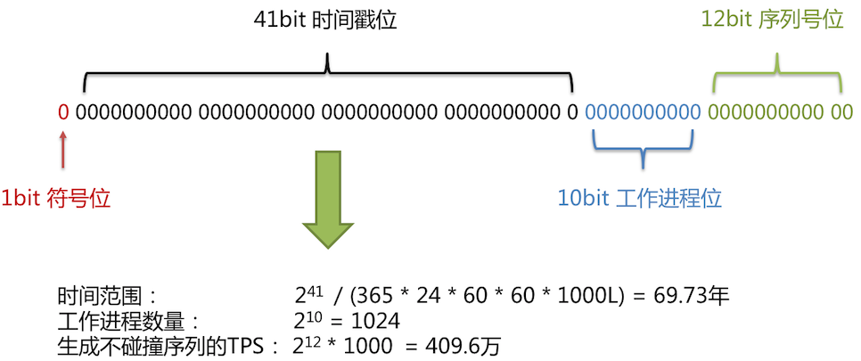

# semak-sharding-jdbc

`semak-sharding-jdbc`组件是一个基于`Apache ShardingShpere`项目开发的JDBC层的扩展与增强类库。 它使用客户端直连数据库，无需额外部署和依赖，可理解为增强版的JDBC驱动，完全兼容JDBC和各种ORM框架。其特性主要包括：


1. 支持读写分离功能。
2. 支持分库和分表功能。
3. 分片策略定制化，支持基于`=`，`BETWEEN`，`IN`的分片。
4. 支持多种分布式主键生成策略。
5. 跨库事务支持。


## 1. 先决条件


### 1.1. 环境配置


1. Open JDK 1.8+，并已配置有效的环境变量。
2. Maven 3.3.x+，并已配置有效的环境变量。
3. Zookeeper 3.6+。


### 1.2. Maven依赖配置


```xml
<dependency>
    <groupId>com.github.semak.shardingsphere</groupId>
    <artifactId>semak-sharding-jdbc-spring-boot-starter</artifactId>
    <version>最新RELEASE版本</version>
</dependency>
```


## 2. 概念&功能


### 2.1. 读写分离


面对日益增加的系统访问量，数据库的吞吐量面临着巨大瓶颈。 对于同一时刻有大量并发读操作和较少写操作类型的应用系统来说，将数据库拆分为主库和从库，主库负责处理事务性的增删改操作，从库负责处理查询操作，能够有效的避免由数据更新导致的行锁，使得整个系统的查询性能得到极大的改善。


通过一主多从的配置方式，可以将**查询请求**均匀的分散到多个数据副本，能够进一步的提升系统的处理能力。 使用多主多从的方式，不但能够提升系统的吞吐量，还能够提升系统的可用性，可以达到在任何一个数据库宕机，甚至磁盘物理损坏的情况下仍然不影响系统的正常运行。


读写分离是根据SQL语义的分析，将读操作和写操作分别路由至主库与从库。


读写分离的数据节点中的数据内容基本是一致的（主库与从库的数据同步延迟会造成短暂的不一致现象），而水平分片的每个数据节点的数据内容却并不相同。将水平分片和读写分离联合使用，能够更加有效的提升系统性能。


#### 2.1.1. 概念


1. **主库**：添加、更新以及删除数据操作所使用的数据库，目前仅支持单主库。
2. **从库**：查询数据操作所使用的数据库，可支持多从库。
3. **主从同步**：将主库的数据异步的同步到从库的操作。由于主从同步的异步性，从库与主库的数据会短时间内不一致(中间件不做支持)。
4. **负载均衡策略**：通过负载均衡策略将查询请求疏导至不同从库。


#### 2.1.2. 功能


1. 提供一主多从的读写分离配置，可独立使用，也可配合分库分表使用。
2. 独立使用读写分离支持SQL透传。
3. 同一线程且同一数据库连接内，如有写入操作，以后的读操作均从主库读取，用于保证数据一致性。
4. 基于Hint的强制主库路由。


#### 2.1.3. 不支持项


1. 主库和从库的数据同步。
2. 主库和从库的数据同步延迟导致的数据不一致。
3. 主库双写或多写。


### 2.2. 数据分片


#### 2.2.1. 概念


##### 2.2.1.1. SQL


- **逻辑表**

  水平拆分的数据库（表）的相同逻辑和数据结构表的总称。例：订单数据根据主键尾数拆分为10张表，分别是`t_order_0`到`t_order_9`，他们的逻辑表名为`t_order`。

- **真实表**

  在分片的数据库中真实存在的物理表。即上个示例中的`t_order_0`到`t_order_9`。

- **数据节点**

  数据分片的最小单元。由数据源名称和数据表组成，例：`ds_0.t_order_0`。

- **绑定表**

  指分片规则一致的主表和子表。例如：`t_order`表和`t_order_item`表，均按照`order_id`分片，则此两张表互为绑定表关系。绑定表之间的多表关联查询不会出现笛卡尔积关联，关联查询效率将大大提升。举例说明，如果SQL为：
  ```sql
  SELECT i.* FROM t_order o JOIN t_order_item i ON o.order_id=i.order_id WHERE o.order_id in (10, 11);
  ```
  在不配置绑定表关系时，假设分片键`order_id`将数值10路由至第0片，将数值11路由至第1片，那么路由后的SQL应该为4条，它们呈现为笛卡尔积：
  ```sql
  SELECT i.* FROM t_order_0 o JOIN t_order_item_0 i ON o.order_id=i.order_id WHERE o.order_id in (10, 11);
  SELECT i.* FROM t_order_0 o JOIN t_order_item_1 i ON o.order_id=i.order_id WHERE o.order_id in (10, 11);
  SELECT i.* FROM t_order_1 o JOIN t_order_item_0 i ON o.order_id=i.order_id WHERE o.order_id in (10, 11);
  SELECT i.* FROM t_order_1 o JOIN t_order_item_1 i ON o.order_id=i.order_id WHERE o.order_id in (10, 11);
  ```
  在配置绑定表关系后，路由的SQL应该为2条：
  ```sql
  SELECT i.* FROM t_order_0 o JOIN t_order_item_0 i ON o.order_id=i.order_id WHERE o.order_id in (10, 11);
  SELECT i.* FROM t_order_1 o JOIN t_order_item_1 i ON o.order_id=i.order_id WHERE o.order_id in (10, 11);
  ```
	其中`t_order`在FROM的最左侧，组件将会以它作为整个绑定表的主表。 所有路由计算将会只使用主表的策略，那么`t_order_item`表的分片计算将会使用`t_order`的条件。故绑定表之间的分区键要完全相同。
- **广播表**

  指所有的分片数据源中都存在的表，表结构和表中的数据在每个数据库中均完全一致。适用于数据量不大且需要与海量数据的表进行关联查询的场景，例如：字典表。

- **逻辑索引**

  某些数据库（如：PostgreSQL/Oracle）不允许同一个库存在名称相同索引，某些数据库（如：MySQL/SQLServer）则允许只要同一个表中不存在名称相同的索引即可。 逻辑索引用于同一个库不允许出现相同索引名称的分表场景，需要将同库不同表的索引名称改写为`索引名 + 表名`，改写之前的索引名称成为逻辑索引。


##### 2.2.1.2. 分片


- **分片键**

  用于分片的数据库字段，是将数据库(表)水平拆分的关键字段。例：将订单表中的订单主键的尾数取模分片，则订单主键为分片字段。 SQL中如果无分片字段，将执行全路由，性能较差。 除了对单分片字段的支持，组件也支持根据多个字段进行分片。

- **分片算法**

  通过分片算法将数据分片，支持通过`=`、`BETWEEN`和`IN`分片。分片算法需要应用方开发者自行实现，可实现的灵活度非常高。

  目前组件提供3种分片算法。由于分片算法和业务实现紧密相关，因此，组件仅实现了取模的基本算法，更多的分片算法开发人员可以通过抽象的分片策略将各种场景提炼出来，自行实现。

   - 精确分片算法

     对应`PreciseShardingAlgorithm`，用于处理使用单一键作为分片键的`=`与`IN`进行分片的场景。需要配合`StandardShardingStrategy`使用。

   - 范围分片算法

     对应`RangeShardingAlgorithm`，用于处理使用单一键作为分片键的`BETWEEN AND`进行分片的场景。需要配合`StandardShardingStrategy`使用。

   - 复合分片算法

     对应`ComplexKeysShardingAlgorithm`，用于处理使用多键作为分片键进行分片的场景，包含多个分片键的逻辑较复杂，需要应用开发者自行处理其中的复杂度。需要配合`ComplexShardingStrategy`使用。

- **分片策略**

  包含分片键和分片算法，由于分片算法的独立性，将其独立抽离。真正可用于分片操作的是**分片键** + **分片算法**，也就是**分片策略**。目前提供4种分片策略。

   - 标准分片策略

     对应`StandardShardingStrategy`。提供对SQL语句中的=, IN和BETWEEN AND的分片操作支持。`StandardShardingStrategy`只支持单分片键，提供`PreciseShardingAlgorithm`和`RangeShardingAlgorithm`两个分片算法。`PreciseShardingAlgorithm`是必选的，用于处理=和IN的分片。`RangeShardingAlgorithm`是可选的，用于处理`BETWEEN AND`分片，如果不配置`RangeShardingAlgorithm`，SQL中的`BETWEEN AND`将按照全库路由处理。

   - 复合分片策略

     对应`ComplexShardingStrategy`。复合分片策略。提供对SQL语句中的`=`, `IN`和`BETWEEN AND`的分片操作支持。`ComplexShardingStrategy`支持多分片键，由于多分片键之间的关系复杂，因此并未进行过多的封装，而是直接将分片键值组合以及分片操作符透传至分片算法，完全由应用开发者实现，提供最大的灵活度。

   - 行表达式分片策略

     对应`InlineShardingStrategy`。使用Groovy的表达式，提供对SQL语句中的`=`和`IN`的分片操作支持，只支持单分片键。对于简单的分片算法，可以通过简单的配置使用，从而避免繁琐的Java代码开发，如: `t_user_$->{u_id % 8}` 表示`t_user`表根据`u_id`模8，而分成8张表，表名称为`t_user_0`到`t_user_7`。

   - 不分片策略

     对应`ShardingStrategy`。不分片的策略。


#### 2.2.2. 使用规范


在组件的使用过程中，有两类关注度比较高的问题：


1. 所支持和不支持的SQL类型。
2. 针对分页这类性能相关度很高的问题。

下面会对这些问题进行一个使用规范的阐述。


##### 2.2.2.1. SQL


由于SQL语法灵活复杂，分布式数据库和单机数据库的查询场景又不完全相同，难免有和单机数据库不兼容的SQL出现。


本章节详细罗列出已明确可支持的SQL种类以及已明确不支持的SQL种类，尽量让使用者避免踩坑。


- **支持项**
   - **路由至单数据节点**
      - 100%全兼容（目前仅MySQL，其他数据库完善中）。
   - **路由至多数据节点**
   
      全面支持DQL、DML、DDL、DCL、TCL。支持分页、去重、排序、分组、聚合、关联查询（不支持跨库关联）。以下用最为复杂的DQL举例：
   
      - SELECT主语句
   
         ```sql
         SELECT select_expr [, select_expr ...] FROM table_reference [, table_reference ...]
         [WHERE where_condition] 
         [GROUP BY {col_name | position} [ASC | DESC]] 
         [ORDER BY {col_name | position} [ASC | DESC], ...] 
         [LIMIT {[offset,] row_count | row_count OFFSET offset}]
         ```
   
      * select_expr
   
        ```sql
        * | 
        [DISTINCT] COLUMN_NAME [AS] [alias] | 
        (MAX | MIN | SUM | AVG)(COLUMN_NAME | alias) [AS] [alias] | 
        COUNT(* | COLUMN_NAME | alias) [AS] [alias]
        ```
   
      * table_reference
   
         ```sql
         tbl_name [AS] alias] [index_hint_list] | 
         table_reference ([INNER] | {LEFT|RIGHT} [OUTER]) JOIN table_factor [JOIN ON conditional_expr | USING (column_list)] |
         ```
   
- **不支持项**
   - 路由至多数据节点

     不支持冗余括号、CASE WHEN、HAVING、UNION (ALL)，有限支持子查询。

     除了分页子查询的支持之外，也支持同等模式的子查询。无论嵌套多少层，组件都可以解析至第一个包含数据表的子查询，一旦在下层嵌套中再次找到包含数据表的子查询将直接抛出解析异常。

     例如，以下子查询可以支持：

      ```sql
      SELECT COUNT(*) FROM (SELECT * FROM t_order o)
      ```
		以下子查询不支持：
      ```sql
      SELECT COUNT(*) FROM (SELECT * FROM t_order o WHERE o.id IN (SELECT id FROM t_order WHERE status = ?))
      ```
     
     
     简单来说，通过子查询进行非功能需求，在大部分情况下是可以支持的。比如分页、统计总数等；而通过子查询实现业务查询当前并不能支持。
     
     由于归并的限制，子查询中包含聚合函数目前无法支持。
     
     不支持包含schema的SQL。因为ShardingSphere的理念是像使用一个数据源一样使用多数据源，因此对SQL的访问都是在同一个逻辑schema之上。
   
- **示例**
   - 支持的SQL
      | SQL | 必要条件 |
      | :--- | :--- |
      | SELECT * FROM tbl_name |  |
      | SELECT * FROM tbl_name WHERE (col1 = ? or col2 = ?) and col3 = ? |  |
      | SELECT * FROM tbl_name WHERE col1 = ? ORDER BY col2 DESC LIMIT ? |  |
      | SELECT COUNT(*), SUM(col1), MIN(col1), MAX(col1), AVG(col1) FROM tbl_name WHERE col1 = ? |  |
      | SELECT COUNT(col1) FROM tbl_name WHERE col2 = ? GROUP BY col1 ORDER BY col3 DESC LIMIT ?, ? |  |
      | INSERT INTO tbl_name (col1, col2,…) VALUES (?, ?, ….) |  |
      | INSERT INTO tbl_name VALUES (?, ?,….) |  |
      | INSERT INTO tbl_name (col1, col2, …) VALUES (?, ?, ….), (?, ?, ….) |  |
      | UPDATE tbl_name SET col1 = ? WHERE col2 = ? |  |
      | DELETE FROM tbl_name WHERE col1 = ? |  |
      | CREATE TABLE tbl_name (col1 int, …) |  |
      | ALTER TABLE tbl_name ADD col1 varchar(10) |  |
      | DROP TABLE tbl_name |  |
      | TRUNCATE TABLE tbl_name |  |
      | CREATE INDEX idx_name ON tbl_name |  |
      | DROP INDEX idx_name ON tbl_name |  |
      | DROP INDEX idx_name | TableRule中配置logic-index |
      | SELECT DISTINCT * FROM tbl_name WHERE col1 = ? |  |
      | SELECT COUNT(DISTINCT col1) FROM tbl_name |  |
      
   - 不支持的SQL
      | SQL | 不支持原因 |
      | :--- | :--- |
      | INSERT INTO tbl_name (col1, col2, …) VALUES(1+2, ?, …) | VALUES语句不支持运算表达式 |
      | INSERT INTO tbl_name (col1, col2, …) SELECT col1, col2, … FROM tbl_name WHERE col3 = ? | INSERT .. SEL |
      | INSERT INTO tbl_name SET col1 = ? | INSERT .. SET |
      | SELECT COUNT(col1) as count_alias FROM tbl_name GROUP BY col1 HAVING count_alias > ? | HAVING |
      | SELECT _ FROM tbl_name1 UNION SELECT _ FROM tbl_name2 | UNION |
      | SELECT _ FROM tbl_name1 UNION ALL SELECT _ FROM tbl_name2 | UNION ALL |
      | SELECT * FROM tbl_name1 WHERE (val1=?) AND (val1=?) | 冗余括号(MySQL数据库已支持) |
      | SELECT * FROM ds.tbl_name1 | 包含schema |
      | SELECT SUM(DISTINCT col1), SUM(col1) FROM tbl_name | 详见`DISTINCT`支持情况详细说明 |

- **DISTINCT支持情况详细说明**
   - 支持的SQL
      | SQL | 所需条件 |
      | :--- | :--- |
      | SELECT DISTINCT * FROM tbl_name WHERE col1 = ? |  |
      | SELECT DISTINCT col1 FROM tbl_name |  |
      | SELECT DISTINCT col1, col2, col3 FROM tbl_name |  |
      | SELECT DISTINCT col1 FROM tbl_name ORDER BY col1 |  |
      | SELECT DISTINCT col1 FROM tbl_name ORDER BY col2 |  |
      | SELECT DISTINCT(col1) FROM tbl_name | MySQL |
      | SELECT AVG(DISTINCT col1) FROM tbl_name | MySQL |
      | SELECT SUM(DISTINCT col1) FROM tbl_name | MySQL |
      | SELECT COUNT(DISTINCT col1) FROM tbl_name | MySQL |
      | SELECT COUNT(DISTINCT col1) FROM tbl_name GROUP BY col1 | MySQL |
      | SELECT COUNT(DISTINCT col1 + col2) FROM tbl_name | MySQL |
      | SELECT COUNT(DISTINCT col1), SUM(DISTINCT col1) FROM tbl_name | MySQL |
      | SELECT COUNT(DISTINCT col1), col1 FROM tbl_name GROUP BY col1 | MySQL |
      | SELECT col1, COUNT(DISTINCT col1) FROM tbl_name GROUP BY col1 | MySQL |
   
   * 不支持的SQL
      | SQL | 不支持原因 |
      | :--- | :--- |
      | SELECT SUM(DISTINCT col1), SUM(col1) FROM tbl_name | 同时使用普通聚合函数和DISTINCT聚合函数 |


##### 2.2.2.2. 分页


完全支持MySQL、PostgreSQL和Oracle的分页查询，SQLServer由于分页查询较为复杂，仅部分支持。


- **分页性能**
   - 性能瓶颈
   
     查询偏移量过大的分页会导致数据库获取数据性能低下，以MySQL为例：

      ```sql
      SELECT * FROM t_order ORDER BY id LIMIT 1000000, 10
      ```
		这句SQL会使得MySQL在无法利用索引的情况下跳过1000000条记录后，再获取10条记录，其性能可想而知。 而在分库分表的情况下（假设分为2个库），为了保证数据的正确性，SQL会改写为：
      ```sql
      SELECT * FROM t_order ORDER BY id LIMIT 0, 1000010
      ```
     
     
     即将偏移量前的记录全部取出，并仅获取排序后的最后10条记录。这会在数据库本身就执行很慢的情况下，进一步加剧性能瓶颈。 因为原SQL仅需要传输10条记录至客户端，而改写之后的SQL则会传输`1,000,010 * 2`的记录至客户端。
   
- **资源优化**

   首先，采用流式处理 + 归并排序的方式来避免内存的过量占用。由于SQL改写不可避免的占用了额外的带宽，但并不会导致内存暴涨。 与直觉不同，大多数人认为组件会将`1,000,010 * 2`记录全部加载至内存，进而占用大量内存而导致内存溢出。 但由于每个结果集的记录是有序的，因此组件每次比较仅获取各个分片的当前结果集记录，驻留在内存中的记录仅为当前路由到的分片的结果集的当前游标指向而已。对于本身即有序的待排序对象，归并排序的时间复杂度仅为`O(n)`，性能损耗很小。

   其次，对仅落至单分片的查询进行进一步优化。落至单分片查询的请求并不需要改写SQL也可以保证记录的正确性，因此在此种情况下，组件并未进行SQL改写，从而达到节省带宽的目的。

- **分页方案优化**

  由于LIMIT并不能通过索引查询数据，因此如果可以保证ID的连续性，通过ID进行分页是比较好的解决方案：
  ```sql
  SELECT * FROM t_order WHERE id > 100000 AND id <= 100010 ORDER BY id
  ```

  或通过记录上次查询结果的最后一条记录的ID进行下一页的查询：
  ```sql
  SELECT * FROM t_order WHERE id > 100000 LIMIT 10
  ```

- **分页子查询**

   Oracle和SQLServer的分页都需要通过子查询来处理，组件支持分页相关的子查询。

   - Oracle

     支持使用rownum进行分页：

      ```sql
      SELECT * FROM (SELECT row_.*, rownum rownum_ FROM (SELECT o.order_id as order_id FROM t_order o JOIN t_order_item i ON o.order_id = i.order_id) row_ WHERE rownum <= ?) WHERE rownum > ?
      ```
     
     
     目前不支持rownum + BETWEEN的分页方式。
     
   - SQLServer
   
     支持使用TOP + ROW_NUMBER() OVER配合进行分页：

      ```sql
      SELECT * FROM (SELECT TOP (?) ROW_NUMBER() OVER (ORDER BY o.order_id DESC) AS rownum, * FROM t_order o) AS temp WHERE temp.rownum > ? ORDER BY temp.order_id
      ```
		支持SQLServer 2012之后的OFFSET FETCH的分页方式：
     
      ```sql
      SELECT * FROM t_order o ORDER BY id OFFSET ? ROW FETCH NEXT ? ROWS ONLY
      ```
		目前不支持使用WITH xxx AS (SELECT …)的方式进行分页。由于Hibernate自动生成的SQLServer分页语句使用了WITH语句，因此目前并不支持基于Hibernate的SQLServer分页。 目前也不支持使用两个TOP + 子查询的方式实现分页。
   - MySQL, PostgreSQL
		MySQL和PostgreSQL都支持LIMIT分页，无需子查询：
     
      ```sql
      SELECT * FROM t_order o ORDER BY id LIMIT ? OFFSET ?
      ```


#### 2.2.3. 行表达式


##### 2.2.3.1. 实现动机


配置的简化与一体化是行表达式所希望解决的两个主要问题。


在繁琐的数据分片规则配置中，随着数据节点的增多，大量的重复配置使得配置本身不易被维护。通过行表达式可以有效的简化数据节点配置工作量。


对于常见的分片算法，使用Java代码实现并不有助于配置的统一管理。通过行表达式书写分片算法，可以有效的将规则配置一同存放，更加易于浏览与存储。


##### 2.2.3.2. 语法说明


行表达式的使用非常直观，只需要在配置中使用`$->{ expression }`标识行表达式即可。 目前支持数据节点和分片算法这两个部分的配置。行表达式的内容使用的是Groovy的语法，Groovy能够支持的所有操作，行表达式均能够支持。例如：


`$->{begin..end}`表示范围区间


`$->{[unit1, unit2, unit_x]}`表示枚举值


行表达式中如果出现连续多个`$->{ expression }`表达式，整个表达式最终的结果将会根据每个子表达式的结果进行笛卡尔组合。


例如，以下行表达式：


```groovy
$->{['online', 'offline']}_table${1..3}
```


最终会解析为：


```
online_table1, online_table2, online_table3, offline_table1, offline_table2, offline_table3
```


##### 2.2.3.3. 配置数据节点


对于均匀分布的数据节点，如果数据结构如下：


```
db0
  ├── t_order0 
  └── t_order1 
db1
  ├── t_order0 
  └── t_order1
```


用行表达式可以简化为：


```
db$->{0..1}.t_order$->{0..1}
```


对于自定义的数据节点，如果数据结构如下：


```
db0
  ├── t_order0 
  └── t_order1 
db1
  ├── t_order2
  ├── t_order3
  └── t_order4
```


用行表达式可以简化为：


```
db0.t_order$->{0..1},db1.t_order$->{2..4}
```


对于有前缀的数据节点，也可以通过行表达式灵活配置，如果数据结构如下：


```
db0
  ├── t_order_00
  ├── t_order_01
  ├── t_order_02
  ├── t_order_03
  ├── t_order_04
  ├── t_order_05
  ├── t_order_06
  ├── t_order_07
  ├── t_order_08
  ├── t_order_09
  ├── t_order_10
  ├── t_order_11
  ├── t_order_12
  ├── t_order_13
  ├── t_order_14
  ├── t_order_15
  ├── t_order_16
  ├── t_order_17
  ├── t_order_18
  ├── t_order_19
  └── t_order_20
db1
  ├── t_order_00
  ├── t_order_01
  ├── t_order_02
  ├── t_order_03
  ├── t_order_04
  ├── t_order_05
  ├── t_order_06
  ├── t_order_07
  ├── t_order_08
  ├── t_order_09
  ├── t_order_10
  ├── t_order_11
  ├── t_order_12
  ├── t_order_13
  ├── t_order_14
  ├── t_order_15
  ├── t_order_16
  ├── t_order_17
  ├── t_order_18
  ├── t_order_19
  └── t_order_20
```


可以使用分开配置的方式，先配置包含前缀的数据节点，再配置不含前缀的数据节点，再利用行表达式笛卡尔积的特性，自动组合即可。 上面的示例，用行表达式可以简化为：


```
db->${0..1}.t_order_0$->{0..9}, db$->{0..1}.t_order_$->{10..20}
```


##### 2.2.3.4. 配置分片算法


对于只有一个分片键的使用`=`和`IN`进行分片的SQL，可以使用行表达式代替编码方式配置。


行表达式内部的表达式本质上是一段Groovy代码，可以根据分片键进行计算的方式，返回相应的真实数据源或真实表名称。


例如：分为10个库，尾数为0的路由到后缀为0的数据源， 尾数为1的路由到后缀为1的数据源，以此类推。用于表示分片算法的行表达式为：


```
ds$->{id % 10}
```


#### 2.2.4. 分布式主键


##### 2.2.4.1. 实现动机


传统数据库软件开发中，主键自动生成技术是基本需求。而各个数据库对于该需求也提供了相应的支持，比如MySQL的自增键，Oracle的自增序列等。 数据分片后，不同数据节点生成全局唯一主键是非常棘手的问题。同一个逻辑表内的不同实际表之间的自增键由于无法互相感知而产生重复主键。 虽然可通过约束自增主键初始值和步长的方式避免碰撞，但需引入额外的运维规则，使解决方案缺乏完整性和可扩展性。


目前有许多第三方解决方案可以完美解决这个问题，如UUID等依靠特定算法自生成不重复键，或者通过引入主键生成服务等。为了方便用户使用、满足不同用户不同使用场景的需求， 组件不仅提供了内置的分布式主键生成器，例如：UUID、SNOWFLAKE、ZK_BASED_SNOWFLAKE，Redis/Codis(进行中)、LEAF(美团开源)，还抽离出分布式主键生成器的接口，方便用户自行实现自定义的自增主键生成器。


##### 2.2.4.2. 内置的主键生成器


- **UUID**

  采用`UUID.randomUUID()`的方式产生分布式主键。

- **SNOWFLAKE**

  组件提供灵活的配置分布式主键生成策略方式。 在分片规则配置模块可配置每个表的主键生成策略，默认使用雪花算法（snowflake）生成64bit的长整型数据。

  雪花算法是由Twitter公布的分布式主键生成算法，它能够保证不同进程主键的不重复性，以及相同进程主键的有序性。

  在同一个进程中，它首先是通过时间位保证不重复，如果时间相同则是通过序列位保证。 同时由于时间位是单调递增的，且各个服务器如果大体做了时间同步，那么生成的主键在分布式环境可以认为是总体有序的，这就保证了对索引字段的插入的高效性。例如MySQL的Innodb存储引擎的主键。

  使用雪花算法生成的主键，二进制表示形式包含4部分，从高位到低位分表为：1bit符号位、41bit时间戳位、10bit工作进程位以及12bit序列号位。

  * 符号位(1bit)

    预留的符号位，恒为零。

  * 时间戳位(41bit)

    41位的时间戳可以容纳的毫秒数是2的41次幂，一年所使用的毫秒数是：`365 * 24 * 60 * 60 * 1000`。通过计算可知：

    ```java
    Math.pow(2, 41) / (365 * 24 * 60 * 60 * 1000L);
    ```

    结果约等于69.73年。组件的雪花算法的时间纪元从2016年11月1日零点开始，可以使用到2086年，相信能满足绝大部分系统的要求。

  * 工作进程位(10bit)

    该标志在Java进程内是唯一的，如果是分布式应用部署应保证每个工作进程的id是不同的。该值默认为0，可通过属性设置。

  * 序列号位(12bit)

    该序列是用来在同一个毫秒内生成不同的ID。如果在这个毫秒内生成的数量超过4096(2的12次幂)，那么生成器会等待到下个毫秒继续生成。

  

  **时钟回拨**

  服务器时钟回拨会导致产生重复序列，因此默认分布式主键生成器提供了一个最大容忍的时钟回拨毫秒数。 如果时钟回拨的时间超过最大容忍的毫秒数阈值，则程序报错；如果在可容忍的范围内，默认分布式主键生成器会等待时钟同步到最后一次主键生成的时间后再继续工作。 最大容忍的时钟回拨毫秒数的默认值为0，可通过属性设置。

  雪花算法主键的详细结构见下图。

  

- **ZK_BASED_SNOWFLAKE** (不再建议使用，使用Leaf替换)

  在SNOWFLAKE算法的基础上，通过Zookeeper协调自动生成唯一的**工作进程位(10bit)**，以方便集群化部署。

* **LEAF_SEGMENT**

  通过访问Leaf服务节点，获取趋势递增(多节点)/单调递增(多节点)的号段ID。

* **LEAF_SNOWFLAKE**

​		通过访问Leaf服务节点，获取趋势递增(多节点)/单调递增(多节点)的基于SNOWFLAKE算法(含10bit工作进程位)的ID。


### 2.3. 跨库事务


> 可使用原生事务注解，如：`@Transactional`，无需额外处理。

这里的跨库事务主要是基于本地事务的一种扩展，其特性主要包括：


1. 完全支持正常的跨库事务。
2. 完全支持因逻辑异常导致的跨库事务。例如：同一事务中，跨两个库更新。更新完毕后，抛出空指针，则两个库的内容都能回滚。
3. 不支持因网络、硬件异常导致的跨库事务。例如：同一事务中，跨两个库更新，更新完毕后、未提交之前，第一个库宕机，则只有第二个库数据提交。


### 2.4. JDBC不支持项


#### 2.4.1. DataSource接口


- 不支持timeout相关操作


#### 2.4.2. Connection接口


- 不支持存储过程，函数，游标的操作
- 不支持执行native的SQL
- 不支持savepoint相关操作
- 不支持Schema/Catalog的操作
- 不支持自定义类型映射


#### 2.4.3. Statement和PreparedStatement接口


- 不支持返回多结果集的语句（即存储过程，非SELECT多条数据）
- 不支持国际化字符的操作


#### 2.4.4. 对于ResultSet接口


- 不支持对于结果集指针位置判断
- 不支持通过非next方法改变结果指针位置
- 不支持修改结果集内容
- 不支持获取国际化字符
- 不支持获取Array


#### 2.4.5. JDBC 4.1


- 不支持JDBC 4.1接口新功能


## 3. 命名约定


我们在建表或建库时，建议采用**均匀分布**的模式，数据表在每个数据源内也呈现均匀分布的态势，如下：


```
db0
├── t_order_0
├── t_order_1
└── t_order_2
db1
├── t_order_0
├── t_order_1
└── t_order_2
```


为了配合分片算法进行分表与分库，请遵循以下规则：


- **分表：** 在定义的表名后追加`_`并编上连续的序号，必须从`0`开始（兼容一些算法，如`取模`）。
- **分库：** 在定义的库schema名称后，直接编上连续的序号，必须从`0`开始（兼容一些算法，如`取模`）。


## 4. 读写分离


### 4.1. 多数据源定义


这里可以使用`semak-hikaricp`或`semak-druid`组件来定义多数据源，详细可参考相关文档。


下面，我们使用`semak-hikaricp`来定义三个数据源，分别是：`master0`、`slave00`和`slave01`。


```yaml
spring:
  datasource:
    datasource-type: hikari
    datasource-names:
      - master0
      - slave00
      - slave01
    base-datasource-configure:
      default-candidate: false
      data-source-properties:
        useUnicode: true
        characterEncoding: utf8
        autoReconnect: true
        failOverReadOnly: false
        useSSL: false
      minimum-idle: 2
      maximum-pool-size: 5
      auto-commit: true
      idle-timeout: 60000
      max-lifetime: 600000
      connection-timeout: 12000
      leak-detection-threshold: 5000
      connection-test-query: SELECT 1
    master0:
      jdbc-url: jdbc:mysql://IP:3306/demo0
      username: root
      password: ENC(o4rh2ZxUNPWBkL2oCalD6iSzndeJEkGj)
    slave00:
      jdbc-url: jdbc:mysql://IP:3306/demo1
      username: root
      password: ENC(o4rh2ZxUNPWBkL2oCalD6iSzndeJEkGj)
    slave01:
      jdbc-url: jdbc:mysql://IP:3306/demo2
      username: root
      password: ENC(o4rh2ZxUNPWBkL2oCalD6iSzndeJEkGj)
```


**特别注意：** 这里定义的数据源，需要将`spring.datasource.base-datasource-configure.default-candidate`的值设置为`false`，以避免和后面的读写分离数据源冲突。


### 4.2. 读写分离属性配置


```yaml
spring:
  shardingsphere:
    #enabled: true
    #使用的数据源名称，多个数据源用英文逗号分隔
    datasource:
      names: master0,slave00,slave01
    #读写分离规则
    masterslave:
      #主库数据源名称
      master-data-source-name: master0
      #从库数据源名称列表，多个数据源用英文逗号分隔
      slave-data-source-names: slave00,slave01
      #从库负载均衡算法(实现MasterSlaveLoadBalanceAlgorithm接口)
      #load-balance-algorithm-type:
```


### 4.3. 读写分离属性描述


以下属性为`spring.shardingsphere`的子节点属性


| 属性 | 数据 类型 | 是否必填 | 默认值 | 描述 |
| :--- | :--- | :--- | :--- | :--- |
| **enabled** | Boolean | 否 | true | 是否启用组件 |
| **datasource.names** | String | 是 |  | 使用的数据源名称，多个数据源用英文逗号分隔 |
| **masterslave.master-data-source-name** | String | 是 |  | 主库数据源名称 |
| **masterslave.slave-data-source-names** | String | 是 |  | 从库数据源名称列表，多个数据源用英文逗号分隔 |
| **masterslave.load-balance-algorithm-type** | String | 否 | ROUND_ROBIN | 从库负载均衡算法(需实现MasterSlaveLoadBalanceAlgorithm接口) |


### 4.4. 基于暗示(Hint)的强制主库路由


某些时效性要求比较高的查询场景，可以利用暗示(Hint)强制将数据库连接切换到`主库`进行操作。


#### 4.4.1. 设置主库路由


- 获取`HintManager`：
  ```java
  HintManager hintManager = HintManager.getInstance();
  ```

- 设置主库路由：
  ```java
  hintManager.setMasterRouteOnly();
  ```


#### 4.4.2. 清除分片键值


分片键值保存在ThreadLocal中，所以需要在操作结束时调用`hintManager.close()`来清除ThreadLocal中的内容。


`hintManager`实现了`java.lang.AutoCloseable`接口，可推荐使用`try-with-resource`语法自动关闭。


#### 4.4.3. 完整代码示例


```java
userDao.selectByPrimaryKey(1L);

//强制路由到主库
try(HintManager hintManager = HintManager.getInstance()) {
    hintManager.setMasterRouteOnly();
    userDao.selectByPrimaryKey(2L);
}
```


### 4.5. 使用场景模拟


需要将`spring.shardingsphere.props.sql.show`属性设置为`true`，以开启打印SQL解析和改写日志的功能。


#### 4.5.1. 仅查询场景


```java
public void queryOnly(){
    userDao.selectByPrimaryKey(1L);
    userDao.selectByPrimaryKey(2L);
}
```


输出日志片段：


```
2019-07-04 09:11:45.092 INFO  [#] <main> ShardingSphere-SQL :Rule Type: master-slave
2019-07-04 09:11:45.093 INFO  [#] <main> ShardingSphere-SQL :SQL: select 
    id, username, age, sex, phone_no, email
    from ts_user
    where id = ? ::: DataSources: slave00
    
......

2019-07-04 09:11:45.169 INFO  [#] <main> ShardingSphere-SQL :Rule Type: master-slave
2019-07-04 09:11:45.169 INFO  [#] <main> ShardingSphere-SQL :SQL: select 
    id, username, age, sex, phone_no, email
    from ts_user
    where id = ? ::: DataSources: slave01
```


- 数据库连接会在`从库`间以轮询的方式获取。


#### 4.5.2. 仅插入（持久化）场景


```java
@Transactional
public void insertOnly(){
    User user = User.builder().username("George").age(36).sex("M").build();
    int inserted = userDao.insert(user);
}
```


输出日志片段：


```
2019-07-04 09:27:40.219 INFO  [#] <main> ShardingSphere-SQL :Rule Type: master-slave
2019-07-04 09:27:40.219 INFO  [#] <main> ShardingSphere-SQL :SQL: insert into ts_user (username, age, sex, 
      phone_no, email)
    values (?, ?, ?, 
      ?, ?) ::: DataSources: master0
```


- 数据库连接会自动路由到`主库`进行持久化操作。


#### 4.5.3. 查询 -> 插入（持久化）-> 查询（事务模式）场景


```java
@Transactional
public void queryInsertQueryWithTx(){
    //查询
    userDao.selectByPrimaryKey(1L);

    //插入
    User user = User.builder().username("George").age(36).sex("M").build();
    int inserted = userDao.insert(user);

    //查询
    userDao.selectByPrimaryKey(2L);
}
```


输出日志片段：


```
2019-07-04 09:47:52.305 INFO  [#] <main> ShardingSphere-SQL :Rule Type: master-slave
2019-07-04 09:47:52.306 INFO  [#] <main> ShardingSphere-SQL :SQL: select 
    id, username, age, sex, phone_no, email
    from ts_user
    where id = ? ::: DataSources: slave00

......

2019-07-04 09:47:52.357 INFO  [#] <main> ShardingSphere-SQL :Rule Type: master-slave
2019-07-04 09:47:52.357 INFO  [#] <main> ShardingSphere-SQL :SQL: insert into ts_user (username, age, sex, 
      phone_no, email)
    values (?, ?, ?, 
      ?, ?) ::: DataSources: master0

......

2019-07-04 09:47:52.365 INFO  [#] <main> ShardingSphere-SQL :Rule Type: master-slave
2019-07-04 09:47:52.365 INFO  [#] <main> ShardingSphere-SQL :SQL: select 
    id, username, age, sex, phone_no, email
    from ts_user
    where id = ? ::: DataSources: master0
```


- **事务模式下：**
   - **STEP1:** 查询时，数据库连接会在`从库`间以轮询的方式获取。
   - **STEP2:** 插入时，数据库连接会自动路由到`主库`进行持久化操作。
   - **STEP3:** 再次查询时，数据库连接依然会从`主库`进行获取。
- **策略说明：**
   - 持久化以后的查询操作直接从主库进行查询，不用考虑主从库同步数据的延迟，能及时获取到最新数据。
   - 基于主库的事务操作，保障数据的一致性。


#### 4.5.4. 查询 -> 插入（持久化）-> 查询（非事务模式）场景


```java
public void queryInsertQueryWithoutTx(){
    //查询
    userDao.selectByPrimaryKey(1L);

    //插入
    User user = User.builder().username("George").age(36).sex("M").build();
    int inserted = userDao.insert(user);

    //查询
    userDao.selectByPrimaryKey(2L);
}
```


输出日志片段：


```
2019-07-04 09:54:43.129 INFO  [#] <main> ShardingSphere-SQL :Rule Type: master-slave
2019-07-04 09:54:43.130 INFO  [#] <main> ShardingSphere-SQL :SQL: select 
    id, username, age, sex, phone_no, email 
    from ts_user
    where id = ? ::: DataSources: slave00

......

2019-07-04 09:54:43.182 INFO  [#] <main> ShardingSphere-SQL :Rule Type: master-slave
2019-07-04 09:54:43.182 INFO  [#] <main> ShardingSphere-SQL :SQL: insert into ts_user (username, age, sex, 
      phone_no, email)
    values (?, ?, ?, 
      ?, ?) ::: DataSources: master0

......

2019-07-04 09:54:43.204 INFO  [#] <main> ShardingSphere-SQL :Rule Type: master-slave
2019-07-04 09:54:43.204 INFO  [#] <main> ShardingSphere-SQL :SQL: select 
    id, username, age, sex, phone_no, email
    from ts_user
    where id = ? ::: DataSources: slave01
```


- **非事务模式下：**
   - **STEP1:** 查询时，数据库连接会在`从库`间以轮询的方式获取。
   - **STEP2:** 插入时，数据库连接会自动路由到`主库`进行持久化操作。
   - **STEP3:** 再次查询时，数据库连接会在`从库`间以轮询的方式获取。


#### 4.5.5. 查询 -> 强行切换主库再查询 -> 查询 (事务模式) 场景


```java
@Transactional
public void queryByHintWithTx(){
    userDao.selectByPrimaryKey(1L);

    //强制路由到主库
    try(HintManager hintManager = HintManager.getInstance()) {
        hintManager.setMasterRouteOnly();
        userDao.selectByPrimaryKey(2L);
    }

    userDao.selectByPrimaryKey(3L);
}
```


输出日志片段：


```
2019-07-04 09:58:52.287 INFO  [#] <main> ShardingSphere-SQL :Rule Type: master-slave
2019-07-04 09:58:52.288 INFO  [#] <main> ShardingSphere-SQL :SQL: select 
    id, username, age, sex, phone_no, email
    from ts_user
    where id = ? ::: DataSources: slave00

......

2019-07-04 09:58:52.334 INFO  [#] <main> ShardingSphere-SQL :Rule Type: master-slave
2019-07-04 09:58:52.334 INFO  [#] <main> ShardingSphere-SQL :SQL: select 
    id, username, age, sex, phone_no, email
    from ts_user
    where id = ? ::: DataSources: master0

......

2019-07-04 09:58:52.337 INFO  [#] <main> ShardingSphere-SQL :Rule Type: master-slave
2019-07-04 09:58:52.337 INFO  [#] <main> ShardingSphere-SQL :SQL: select 
    id, username, age, sex, phone_no, email
    from ts_user
    where id = ? ::: DataSources: master0
```


- **STEP1:** 查询时，数据库连接会在`从库`间以轮询的方式获取。
- **STEP2:** 使用Hint策略强制路由到`主库`，此时查询所使用的数据库连接会从`主库`获取。
- **STEP3:** 再次查询时，数据库连接会从`主库`获取。


#### 4.5.6. 查询 -> 强行切换主库再查询 -> 查询 (非事务模式) 场景


```java
public void queryByHintWithoutTx(){
    userDao.selectByPrimaryKey(1L);

    //强制路由到主库
    try(HintManager hintManager = HintManager.getInstance()) {
        hintManager.setMasterRouteOnly();
        userDao.selectByPrimaryKey(2L);
    }

    userDao.selectByPrimaryKey(3L);
}
```


输出日志片段：


```
2019-07-04 10:22:00.655 INFO  [#] <main> ShardingSphere-SQL :Rule Type: master-slave
2019-07-04 10:22:00.656 INFO  [#] <main> ShardingSphere-SQL :SQL: select 
    id, username, age, sex, phone_no, email
    from ts_user
    where id = ? ::: DataSources: slave00

......

2019-07-04 10:22:00.705 INFO  [#] <main> ShardingSphere-SQL :Rule Type: master-slave
2019-07-04 10:22:00.705 INFO  [#] <main> ShardingSphere-SQL :SQL: select 
    id, username, age, sex, phone_no, email
    from ts_user
    where id = ? ::: DataSources: master0

......

2019-07-04 10:22:00.708 INFO  [#] <main> ShardingSphere-SQL :Rule Type: master-slave
2019-07-04 10:22:00.708 INFO  [#] <main> ShardingSphere-SQL :SQL: select 
    id, username, age, sex, phone_no, email
    from ts_user
    where id = ? ::: DataSources: slave01
```


- **STEP1:** 查询时，数据库连接会在`从库`间以轮询的方式获取。
- **STEP2:** 使用Hint策略强制路由到`主库`，此时查询所使用的数据库连接会从`主库`获取。
- **STEP3:** 再次查询时，数据库连接会在`从库`间以轮询的方式获取。


## 5. 数据分片


### 5.1. 多数据源定义


这里可以使用`semak-hikaricp`或`semak-druid`组件来定义多数据源，详细可参考相关文档。


下面，我们使用`semak-hikaricp`来定义三个数据源，分别是：`db0`、`db1`和`db2`。


```yaml
spring:
  datasource:
    datasource-type: hikari
    datasource-names:
      - db0
      - db1
      - db2
    base-datasource-configure:
      default-candidate: false
      data-source-properties:
        useUnicode: true
        characterEncoding: utf8
        autoReconnect: true
        failOverReadOnly: false
        useSSL: false
      minimum-idle: 2
      maximum-pool-size: 5
      auto-commit: true
      idle-timeout: 60000
      max-lifetime: 600000
      connection-timeout: 12000
      leak-detection-threshold: 5000
      connection-test-query: SELECT 1
    db0:
      jdbc-url: jdbc:mysql://IP:3306/demo0
      username: root
      password: ENC(o4rh2ZxUNPWBkL2oCalD6iSzndeJEkGj)
    db1:
      jdbc-url: jdbc:mysql://IP:3306/demo1
      username: root
      password: ENC(o4rh2ZxUNPWBkL2oCalD6iSzndeJEkGj)
    db2:
      jdbc-url: jdbc:mysql://IP:3306/demo2
      username: root
      password: ENC(o4rh2ZxUNPWBkL2oCalD6iSzndeJEkGj)
```


**特别注意：** 这里定义的数据源，需要将`spring.datasource.base-datasource-configure.default-candidate`的值设置为`false`，以避免和后面的分片&读写分离数据源冲突。


### 5.2. 分表属性配置


```yaml
spring:
  application:
    name: demo.sharding
  zookeeper:
    connect-string: IP:2181,IP:2181,IP:2181
  shardingsphere:
    #enabled: true
    #使用的数据源名称，多个数据源用英文逗号分隔
    datasource:
      names: db0
    sharding:
      #仅做分片算法定义
      strategy:
        #取模算法
        modulo:
          table-based-precise-algorithm: com.github.semak.shardingjdbc.sharding.algorithm.modulo.ModuloTablePreciseShardingAlgorithm
          table-based-range-algorithm: com.github.semak.shardingjdbc.sharding.algorithm.modulo.ModuloTableRangeShardingAlgorithm
      #默认自增列值生成器配置，缺省将使用org.apache.shardingsphere.core.keygen.generator.impl.SnowflakeKeyGenerator
      default-key-generator:
        #ZK_BASED_SNOWFLAKE: 扩展自SNOWFLAKE，基于zookeeper自动获取到用于Snowflake的workerId部分(workerId最大不超过1024)
        type: ZK_BASED_SNOWFLAKE
        column: id
        props:
          #zk地址连接串
          'connect.string': ${spring.zookeeper.connect-string}
          #zk初始路径前缀，worker.id在zk上的分配结构：/${prefix.path}/${spring.application.name}/${spring.profiles.active}/0...1023
          'prefix.path': /snowflake/workerid/sharding/jdbc/${spring.application.name}/${spring.profiles.active}
          #最大容忍的时钟回拨毫秒数，默认值为0
          'max.tolerate.time.difference.milliseconds': 0
      #绑定表，以优化SQL(表连接时用的分片键不同不要绑定，否则SQL优化后会造成数据查询不到)
      binding-tables:
        - ts_order,ts_order_item
      #逻辑表名
      tables:
        ts_order:
          #由数据源名.真实表名组成，以小数点分隔。多个表以逗号分隔，支持inline表达式
          actual-data-nodes: db0.ts_order_$->{0..2}
          #分表策略
          table-strategy:
            #标准分片策略
            standard:
              #分片列名
              sharding-column: order_id
              #精确分片算法，用于=和IN，实现PreciseShardingAlgorithm，该类需使用默认的构造器或者提供无参数的构造器
              precise-algorithm-class-name: ${spring.shardingsphere.sharding.strategy.modulo.table-based-precise-algorithm}
              #范围分片算法，用于between，实现RangeShardingAlgorithm，该类需使用默认的构造器或者提供无参数的构造器
              range-algorithm-class-name: ${spring.shardingsphere.sharding.strategy.modulo.table-based-range-algorithm}
        ts_order_item:
          #由数据源名.真实表名组成，以小数点分隔。多个表以逗号分隔，支持inline表达式
          actual-data-nodes: db0.ts_order_item_$->{0..2}
          #分表策略
          table-strategy:
            #标准分片策略
            standard:
              #分片列名
              sharding-column: order_id
              #精确分片算法，用于=和IN，实现PreciseShardingAlgorithm，该类需使用默认的构造器或者提供无参数的构造器
              precise-algorithm-class-name: ${spring.shardingsphere.sharding.strategy.modulo.table-based-precise-algorithm}
              #范围分片算法，用于between，实现RangeShardingAlgorithm，该类需使用默认的构造器或者提供无参数的构造器
              range-algorithm-class-name: ${spring.shardingsphere.sharding.strategy.modulo.table-based-range-algorithm}
```


### 5.3. 分表属性描述


以下属性为`spring.shardingsphere`的子节点属性


| 属性 | 数据类型 | 是否必填 | 默认值 | 描述 |
| :--- | :--- | :--- | :--- | :--- |
| **enabled** | Boolean | 否 | true | 是否启用组件 |
| **datasource.names** | String | 是 |  | 使用的数据源名称，多个数据源用英文逗号分隔 |
| **sharding.default-key-generator.type** | String | 是 |  | 自增列值生成器类型，可自定义或选择内置类型：UUID、SNOWFLAKE、ZK_BASED_SNOWFLAKE、LEAF_SEGMENT和LEAF_SNOWFLAKE |
| **sharding.default-key-generator.column** | String | 是 |  | 自增列名称 |
| **sharding.default-key-generator.props** | Properties | 是 |  | 属性配置<br/>1. 使用SNOWFLAKE算法，需要配置`worker.id`与`max.tolerate.time.difference.milliseconds`属性<br/>2. 使用ZK_BASED_SNOWFLAKE算法，需要配置`connect.string`、`prefix.path`与`max.tolerate.time.difference.milliseconds`属性<br/>3. 使用LEAF_SEGMENT算法，参看 [9. 基于LEAF的分布式主键配置](#_9-基于LEAF的分布式主键配置)<br/>4. 使用LEAF_SNOWFLAKE算法，参看 [9. 基于LEAF的分布式主键配置](#_9-基于LEAF的分布式主键配置) |
| **sharding.binding-tables** | List | 否 |  | 绑定表列表，每组绑定表的逻辑表名使用英文逗号分隔 |
| **sharding.tables.&lt;logic-table-name&gt;.actual-data-nodes** | String | 否 |  | 由数据源名.真实表名组成，以小数点分隔。多个表以逗号分隔，支持inline表达式 |
| **sharding.tables.&lt;logic-table-name&gt;.table-strategy.standard.sharding-column** | String | 否 |  | 分表标准分片策略：单分片使用的列名 |
| **sharding.tables.&lt;logic-table-name&gt;.table-strategy.standard.precise-algorithm-class-name** | String | 否 |  | 分表标准分片策略：精确分片算法，用于`=`和`IN`，实现`PreciseShardingAlgorithm`接口 |
| **sharding.tables.&lt;logic-table-name&gt;.table-strategy.standard.range-algorithm-class-name** | String | 否 |  | 分表标准分片策略：范围分片算法，用于`between`，实现`RangeShardingAlgorithm`接口 |
| **sharding.tables.&lt;logic-table-name&gt;.table-strategy.complex.sharding-columns** | String | 否 |  | 分表复合分片策略：多分片使用的列名，以逗号分隔 |
| **sharding.tables.&lt;logic-table-name&gt;.table-strategy.complex.algorithm-class-name** | String | 否 |  | 分表复合分片策略：分片算法，实现`ComplexKeysShardingAlgorithm`接口 |
| **sharding.tables.&lt;logic-table-name&gt;.table-strategy.inline.algorithm-expression** | String | 否 |  | 分表行表达式分片策略：需符合Groovy语法 |


### 5.4. 分表使用场景模拟


需要将`spring.shardingsphere.props.sql.show`属性设置为`true`，以开启打印SQL解析和改写日志的功能。


#### 5.4.1. 前置条件


在数据源`db0`指向的数据库中，创建6张物理表（如下），其逻辑表分别配置为`ts_order`，`ts_order_item`，分片键都为`order_id`，使用组件提供的默认取模算法。


```
db0
  ├── ts_order_0 
  ├── ts_order_1 
  ├── ts_order_2
  ├── ts_order_item_0
  ├── ts_order_item_1
  └── ts_order_item_2
```


#### 5.4.2. 分表插入场景


```java
@Transactional
public void insertWithShardingTable() {
    int size = 20, inserted1 = 0, inserted2 = 0;
    while(size-- > 0){
        Order order = Order.builder()
                .orderId((long)size)
                .userId(RandomUtils.nextInt(100, 200))
                .orderType(StringUtils.leftPad(RandomUtils.nextInt(1, 20)+"",2,"0"))
                .orderAmount(new BigDecimal(RandomUtils.nextFloat(100.00f, 999999999.00f)).setScale(2, BigDecimal.ROUND_CEILING))
                .orderDate(new Date(System.currentTimeMillis()))
                .build();
        orderDao.insert(order);

        OrderItem orderItem = OrderItem.builder()
                .orderItemId((long)size + 10000000L)
                .orderId((long)size)
                .itemType(StringUtils.leftPad(RandomUtils.nextInt(1, 20)+"",2,"0"))
                .itemAmount(new BigDecimal(RandomUtils.nextFloat(100.00f, 999999999.00f)).setScale(2, BigDecimal.ROUND_CEILING))
                .build();
        orderItemDao.insert(orderItem);
    }
}
```


插入数据分布：


> `ts_order`通过`order_id`进行分片。

**ts_order_0**


| id | order_id | user_id | order_type | order_amount | order_date |
| :--- | :--- | :--- | :--- | :--- | :--- |
| 89054869452750849 | 18 | 122 | 19 | 965446080.0000 | 2019-07-04 04:52:15 |
| 89054869775712257 | 15 | 130 | 07 | 319898912.0000 | 2019-07-04 04:52:16 |
| 89054869834432513 | 12 | 188 | 19 | 170372864.000 | 2019-07-04 04:52:16 |
| 89054869897347073 | 9 | 119 | 08 | 157326304.0000 | 2019-07-04 04:52:16 |
| 89054870039953409 | 6 | 188 | 18 | 202040512.0000 | 2019-07-04 04:52:16 |
| 89054870727819265 | 3 | 198 | 12 | 104252896.0000 | 2019-07-04 04:52:16 |
| 89054870790733825 | 0 | 106 | 04 | 874759808.0000 | 2019-07-04 04:52:16 |


**ts_order_1**


| id | order_id | user_id | order_type | order_amount | order_date |
| :--- | :--- | :--- | :--- | :--- | :--- |
| 89054867015860225 | 19 | 146 | 05 | 615827328.0000 | 2019-07-04 04:52:15 |
| 89054869758935041 | 16 | 176 | 08 | 819288320.0000 | 2019-07-04 04:52:16 |
| 89054869817655297 | 13 | 185 | 13 | 887435136.0000 | 2019-07-04 04:52:16 |
| 89054869876375553 | 10 | 100 | 03 | 74693712.0000 | 2019-07-04 04:52:16 |
| 89054869935095809 | 7 | 106 | 14 | 268773856.0000 | 2019-07-04 04:52:16 |
| 89054870287417345 | 4 | 182 | 11 | 997272384.0000 | 2019-07-04 04:52:16 |
| 89054870765568001 | 1 | 106 | 08 | 919831680.0000 | 2019-07-04 04:52:16 |


**ts_order_2**


| id | order_id | user_id | order_type | order_amount | order_date |
| :--- | :--- | :--- | :--- | :--- | :--- |
| 89054869624717313 | 17 | 144 | 15 | 492225440.0000 | 2019-07-04 04:52:15 |
| 89054869796683777 | 14 | 157 | 08 | 28738476.0000 | 2019-07-04 04:52:16 |
| 89054869859598337 | 11 | 105 | 10 | 936855744.0000 | 2019-07-04 04:52:16 |
| 89054869914124289 | 8 | 172 | 18 | 739927424.0000 | 2019-07-04 04:52:16 |
| 89054870102867969 | 5 | 179 | 19 | 780591232.0000 | 2019-07-04 04:52:16 |
| 89054870748790785 | 2 | 161 | 01 | 850894912.0000 | 2019-07-04 04:52:16 |


输出日志片段：


```
2019-07-04 16:30:39.359 INFO  [#] <main> ShardingSphere-SQL :Rule Type: sharding
2019-07-04 16:30:39.359 INFO  [#] <main> ShardingSphere-SQL :Logic SQL: insert into ts_order (order_id, user_id, order_type, 
      order_amount, order_date)
      values (?, ?, ?, ?, ?)
2019-07-04 16:30:39.360 INFO  [#] <main> ShardingSphere-SQL :Actual SQL: db0 ::: insert into ts_order_1  (order_id, user_id, order_type, order_amount, order_date, id) VALUES (?, ?, ?, ?, ?, ?) ::: [19, 146, 05, 615827328.00, 2019-07-04 04:52:15, 89054867015860225]
```


- 按`逻辑表名`进行插入操作，组件会按分片算法拆分成对应`物理表`进行分别插入。
- 数据通过order_id的取模方式，均匀地分布在数据库中的分表中。
- 这里的id由分布式主键生成器进行生成。


#### 5.4.3. 分表分页查询场景


```java
public void queryAllPagedWithShardingTable() {
    OrderExample orderExample = new OrderExample();
    orderExample.setOrderByClause("order_id asc");
    Page<Order> orders = orderDao.selectByExamplePaged(orderExample, new RowBounds(3, 5));
    log.info("Paged results: {}", orders);
}
```


输出日志片段：


```
2019-07-05 16:32:31.706 INFO  [#] <main> ShardingSphere-SQL :Rule Type: sharding
2019-07-05 16:32:31.707 INFO  [#] <main> ShardingSphere-SQL :Logic SQL: SELECT count(0) FROM ts_order
2019-07-05 16:32:31.707 INFO  [#] <main> ShardingSphere-SQL :Actual SQL: db0 ::: SELECT count(0) FROM ts_order_0
2019-07-05 16:32:31.707 INFO  [#] <main> ShardingSphere-SQL :Actual SQL: db0 ::: SELECT count(0) FROM ts_order_1
2019-07-05 16:32:31.707 INFO  [#] <main> ShardingSphere-SQL :Actual SQL: db0 ::: SELECT count(0) FROM ts_order_2

......

2019-07-05 16:32:31.800 INFO  [#] <main> ShardingSphere-SQL :Rule Type: sharding
2019-07-05 16:32:31.800 INFO  [#] <main> ShardingSphere-SQL :Logic SQL: select
    id, order_id, user_id, order_type, order_amount, order_date  
    from ts_order
    order by order_id asc LIMIT ?, ? 
2019-07-05 16:32:31.800 INFO  [#] <main> ShardingSphere-SQL :Actual SQL: db0 ::: select
    id, order_id, user_id, order_type, order_amount, order_date
    from ts_order_0
    order by order_id asc LIMIT ?, ?  ::: [0, 15]
2019-07-05 16:32:31.800 INFO  [#] <main> ShardingSphere-SQL :Actual SQL: db0 ::: select
    id, order_id, user_id, order_type, order_amount, order_date
    from ts_order_1
    order by order_id asc LIMIT ?, ?  ::: [0, 15]
2019-07-05 16:32:31.800 INFO  [#] <main> ShardingSphere-SQL :Actual SQL: db0 ::: select
    id, order_id, user_id, order_type, order_amount, order_date
    from ts_order_2
    order by order_id asc LIMIT ?, ?  ::: [0, 15]
    
......

2019-07-05 16:32:31.819 INFO  [#] <main> com.github.semak.shardingjdbc.test.ShardingTableTestcase :Paged results: Page{count=true, pageNum=3, pageSize=5, startRow=10, endRow=15, total=20, pages=4, reasonable=false, pageSizeZero=false}[
    Order[id=89054869876375553,orderId=10,userId=100,orderType=03,orderAmount=74693712.0000,orderDate=Thu Jul 04 17:52:16 CST 2019],    
    Order[id=89054869859598337,orderId=11,userId=105,orderType=10,orderAmount=936855744.0000,orderDate=Thu Jul 04 17:52:16 CST 2019], 
    Order[id=89054869834432513,orderId=12,userId=188,orderType=19,orderAmount=170372864.0000,orderDate=Thu Jul 04 17:52:16 CST 2019], 
    Order[id=89054869817655297,orderId=13,userId=185,orderType=13,orderAmount=887435136.0000,orderDate=Thu Jul 04 17:52:16 CST 2019], 
    Order[id=89054869796683777,orderId=14,userId=157,orderType=08,orderAmount=28738476.0000,orderDate=Thu Jul 04 17:52:16 CST 2019]
]
```


- 由于这里并未使用分片键，组件会去每张表中进行查询分页，再将最终的结果集按条件归并。


#### 5.4.4. 分表精确查询场景


```java
public void queryEqualWithShardingTable() {
        OrderExample orderExample = new OrderExample();
        orderExample.createCriteria().andOrderIdEqualTo(16L);
        List<Order> order = orderDao.selectByExample(orderExample);
        Assert.assertEquals(1, order.size());
    }
```


输出日志片段：


```
2019-07-05 16:54:19.306 INFO  [#] <main> ShardingSphere-SQL :Rule Type: sharding
2019-07-05 16:54:19.307 INFO  [#] <main> ShardingSphere-SQL :Logic SQL: select
    id, order_id, user_id, order_type, order_amount, order_date
    from ts_order
    WHERE (  order_id = ? )
2019-07-05 16:54:19.307 INFO  [#] <main> ShardingSphere-SQL :Actual SQL: db0 ::: select
    id, order_id, user_id, order_type, order_amount, order_date
    from ts_order_1
    WHERE (  order_id = ? ) ::: [16]
```


- 通过分片算法的优化，组件处理后仅生成1条真实SQL。


#### 5.4.5. 分表范围查询场景


```java
public void queryBetweenWithShardingTable() {
    OrderExample orderExample = new OrderExample();
    orderExample.createCriteria().andOrderIdBetween(5L, 6L);
    List<Order> order = orderDao.selectByExample(orderExample);
}
```


输出日志片段：


```
2019-07-05 17:10:39.026 INFO  [#] <main> ShardingSphere-SQL :Rule Type: sharding
2019-07-05 17:10:39.026 INFO  [#] <main> ShardingSphere-SQL :Logic SQL: select
    id, order_id, user_id, order_type, order_amount, order_date
    from ts_order
    WHERE (  order_id between ? and ? )
2019-07-05 17:10:39.026 INFO  [#] <main> ShardingSphere-SQL :Actual SQL: db0 ::: select
    id, order_id, user_id, order_type, order_amount, order_date
    from ts_order_0
    WHERE (  order_id between ? and ? ) ::: [5, 6]
2019-07-05 17:10:39.026 INFO  [#] <main> ShardingSphere-SQL :Actual SQL: db0 ::: select
    id, order_id, user_id, order_type, order_amount, order_date
    from ts_order_2
    WHERE (  order_id between ? and ? ) ::: [5, 6]
```


- 通过分片算法的优化，组件处理后仅生成2条真实SQL。


#### 5.4.6. 分表连接查询场景


> 如在分库环境下，每个库的表连接各自库中的数据，然后进行归并。不支持跨库的表连接。

```java
public void queryJoinWithShardingTable() {
    List<Order> order = orderDao.selectOrderDetail(5L);
}
```


输出日志片段：


```
2019-07-05 17:19:50.781 INFO  [#] <main> ShardingSphere-SQL :Rule Type: sharding
2019-07-05 17:19:50.781 INFO  [#] <main> ShardingSphere-SQL :Logic SQL: select
      tso.id as oid, tso.order_id, tso.user_id, tso.order_type, tso.order_amount, tso.order_date,
      tsoi.order_item_id, tsoi.item_type, tsoi.item_amount
    from
      ts_order tso inner join ts_order_item tsoi on tso.order_id = tsoi.order_id
    where
      tso.order_id = ?
2019-07-05 17:19:50.781 INFO  [#] <main> ShardingSphere-SQL :Actual SQL: db0 ::: select
      tso.id as oid, tso.order_id, tso.user_id, tso.order_type, tso.order_amount, tso.order_date,
      tsoi.order_item_id, tsoi.item_type, tsoi.item_amount
    from
      ts_order_2 tso inner join ts_order_item_2 tsoi on tso.order_id = tsoi.order_id
    where
      tso.order_id = ? ::: [5]
```


- `ts_order`和`ts_order_item`本身存在较强的业务关联关系，且`分片键相同`（此处都为`order_id`）。通过绑定表配置（`binding-tables`），组件会进行分片算法优化，仅生成1条真实SQL。
- 如不使用绑定表配置（`binding-tables`），则会生成笛卡尔乘积数量的真实SQL。


### 5.5. 分库属性配置


```yaml
spring:
  #分库-MySQL
  profiles: sharding-database
  application:
    name: demo.sharding
  zookeeper:
    connect-string: IP:2181,IP:2181,IP:2181
   shardingsphere:
    #enabled: true
    #使用的数据源名称，多个数据源用英文逗号分隔
    datasource:
      names: db0,db1,db2
    #分表&分库
    sharding:
      #仅做分片算法定义
      strategy:
        #取模算法
        modulo:
          database-based-precise-algorithm: com.github.semak.shardingjdbc.sharding.algorithm.modulo.ModuloDatabasePreciseShardingAlgorithm
          database-based-range-algorithm: com.github.semak.shardingjdbc.sharding.algorithm.modulo.ModuloDatabaseRangeShardingAlgorithm
      #默认数据源，未配置分片规则的表将通过默认数据源定位
      default-data-source-name: db0
      #默认自增列值生成器配置，缺省将使用org.apache.shardingsphere.core.keygen.generator.impl.SnowflakeKeyGenerator
      default-key-generator:
        #ZK_BASED_SNOWFLAKE: 扩展自SNOWFLAKE，基于zookeeper自动获取到用于Snowflake的workerId部分(workerId最大不超过1024)
        type: ZK_BASED_SNOWFLAKE
        column: id
        props:
          #zk地址连接串
          'connect.string': ${spring.zookeeper.connect-string}
          #zk初始路径前缀，worker.id在zk上的分配结构：/${prefix.path}/${spring.application.name}/${spring.profiles.active}/0...1023
          'prefix.path': /snowflake/workerid/sharding/jdbc/${spring.application.name}/${spring.profiles.active}
          #最大容忍的时钟回拨毫秒数，默认值为0
          'max.tolerate.time.difference.milliseconds': 0
      ##逻辑表名
      tables:
        ts_order:
          #由数据源名.真实表名组成，以小数点分隔。多个表以逗号分隔，支持inline表达式
          actual-data-nodes: db$->{0..2}.ts_order_0
          ##分库策略
          database-strategy:
            #标准分片策略
            standard:
              #分片列名，多个列以逗号分隔
              sharding-column: user_id
              #精确分片算法，用于=和IN，实现PreciseShardingAlgorithm，该类需使用默认的构造器或者提供无参数的构造器
              precise-algorithm-class-name: ${spring.shardingsphere.sharding.strategy.modulo.database-based-precise-algorithm}
              #范围分片算法，用于between，实现RangeShardingAlgorithm，该类需使用默认的构造器或者提供无参数的构造器
              range-algorithm-class-name: ${spring.shardingsphere.sharding.strategy.modulo.database-based-range-algorithm}
        ts_order_item:
          #由数据源名.真实表名组成，以小数点分隔。多个表以逗号分隔，支持inline表达式
          actual-data-nodes: db$->{0..2}.ts_order_item_0
          ##分库策略
          database-strategy:
            #标准分片策略
            standard:
              #分片列名，多个列以逗号分隔
              sharding-column: order_item_id
              #精确分片算法，用于=和IN，实现PreciseShardingAlgorithm，该类需使用默认的构造器或者提供无参数的构造器
              precise-algorithm-class-name: ${spring.shardingsphere.sharding.strategy.modulo.database-based-precise-algorithm}
              #范围分片算法，用于between，实现RangeShardingAlgorithm，该类需使用默认的构造器或者提供无参数的构造器
              range-algorithm-class-name: ${spring.shardingsphere.sharding.strategy.modulo.database-based-range-algorithm}
```


### 5.6. 分库属性描述


以下属性为`spring.shardingsphere`的子节点属性


| 属性 | 数据类型 | 是否必填 | 默认值 | 描述 |
| :--- | :--- | :--- | :--- | :--- |
| **enabled** | Boolean | 否 | true | 是否启用组件 |
| **default-data-source-name** | String | 是 |  | 默认数据源，未配置分片规则的表将通过默认数据源定位 |
| **datasource.names** | String | 是 |  | 使用的数据源名称，多个数据源用英文逗号分隔 |
| **sharding.default-key-generator.type** | String | 是 |  | 自增列值生成器类型，可自定义或选择内置类型：UUID、SNOWFLAKE、ZK_BASED_SNOWFLAKE、LEAF_SEGMENT和LEAF_SNOWFLAKE |
| **sharding.default-key-generator.column** | String | 是 |  | 自增列名称 |
| **sharding.default-key-generator.props** | Properties | 是 |  | 属性配置<br/>1. 使用SNOWFLAKE算法，需要配置`worker.id`与`max.tolerate.time.difference.milliseconds`属性<br/>2. 使用ZK_BASED_SNOWFLAKE算法，需要配置`connect.string`、`prefix.path`与`max.tolerate.time.difference.milliseconds`属性<br/>3. 使用LEAF_SEGMENT算法，参看 [9. 基于LEAF的分布式主键配置](#_9-基于LEAF的分布式主键配置)<br/>4. 使用LEAF_SNOWFLAKE算法，参看 [9. 基于LEAF的分布式主键配置](#_9-基于LEAF的分布式主键配置) |
| **sharding.binding-tables** | List | 否 |  | 绑定表列表，每组绑定表的逻辑表名使用英文逗号分隔 |
| **sharding.tables.&lt;logic-table-name&gt;.actual-data-nodes** | String | 否 |  | 由数据源名.真实表名组成，以小数点分隔。多个表以逗号分隔，支持inline表达式 |
| **sharding.tables.&lt;logic-table-name&gt;.database-strategy.standard.sharding-column** | String | 否 |  | 分库标准分片策略：单分片使用的列名 |
| **sharding.tables.&lt;logic-table-name&gt;.database-strategy.standard.precise-algorithm-class-name** | String | 否 |  | 分库标准分片策略：精确分片算法，用于`=`和`IN`，实现`PreciseShardingAlgorithm`接口 |
| **sharding.tables.&lt;logic-table-name&gt;.database-strategy.standard.range-algorithm-class-name** | String | 否 |  | 分库标准分片策略：范围分片算法，用于`between`，实现`RangeShardingAlgorithm`接口 |
| **sharding.tables.&lt;logic-table-name&gt;.database-strategy.complex.sharding-columns** | String | 否 |  | 分库复合分片策略：多分片使用的列名，以逗号分隔 |
| **sharding.tables.&lt;logic-table-name&gt;.database-strategy.complex.algorithm-class-name** | String | 否 |  | 分库复合分片策略：分片算法，实现`ComplexKeysShardingAlgorithm`接口 |
| **sharding.tables.&lt;logic-table-name&gt;.database-strategy.inline.algorithm-expression** | String | 否 |  | 分库行表达式分片策略：需符合Groovy语法 |


### 5.7. 分库使用场景模拟


需要将`spring.shardingsphere.props.sql.show`属性设置为`true`，以开启打印SQL解析和改写日志的功能。


#### 5.7.1. 前置条件


分别在数据源`db0`、`db1`和`db2`指向的数据库中，创建2张物理表（如下），其逻辑表分别配置为`ts_order`，`ts_order_item`，分片键都为`order_id`，使用组件提供的默认取模算法。


```
db0
  ├── ts_order_0
  └── ts_order_item_0

db1
  ├── ts_order_0
  └── ts_order_item_0
  
db2
  ├── ts_order_0
  └── ts_order_item_0
```


#### 5.7.2. 分库插入场景


```java
@Transactional
public void insertWithShardingDatabase() {
    int size = 60, inserted1 = 0, inserted2 = 0;
    while (size-- > 0) {
        Order order = Order.builder()
                .orderId((long) size)
                .userId(RandomUtils.nextInt(100, 200))
                .orderType(StringUtils.leftPad(RandomUtils.nextInt(1, 20) + "", 2, "0"))
                .orderAmount(new BigDecimal(RandomUtils.nextFloat(100.00f, 999999999.00f)).setScale(2, BigDecimal.ROUND_CEILING))
                .orderDate(new Date(System.currentTimeMillis()))
                .build();
        orderDao.insert(order);

        OrderItem orderItem = OrderItem.builder()
                .orderItemId((long) size + 10000000L)
                .orderId((long) size)
                .itemType(StringUtils.leftPad(RandomUtils.nextInt(1, 20) + "", 2, "0"))
                .itemAmount(new BigDecimal(RandomUtils.nextFloat(100.00f, 999999999.00f)).setScale(2, BigDecimal.ROUND_CEILING))
                .build();
        orderItemDao.insert(orderItem);
    }
}
```


插入数据分布：


> `ts_order`通过`user_id`进行分片，这里仅做部分数据展示。

**db0.ts_order_0**


| id | order_id | user_id | order_type | order_amount | order_date |
| :--- | :--- | :--- | :--- | :--- | :--- |
| 89419405347258369 | 59 | 171 | 03 | 151193392.0000 | 2019-07-05 05:00:47 |
| 89419408010641409 | 53 | 129 | 14 | 647816768.0000 | 2019-07-05 05:00:48 |
| 89419408069361665 | 50 | 126 | 04 | 338825824.0000 | 2019-07-05 05:00:48 |
| 89419408107110401 | 48 | 132 | 11 | 44850324.0000 | 2019-07-05 05:00:48 |


**db1.ts_order_0**


| id | order_id | user_id | order_type | order_amount | order_date |
| :--- | :--- | :--- | :--- | :--- | :--- |
| 89419407926755329 | 54 | 193 | 03 | 987883008.0000 | 2019-07-05 05:00:48 |
| 89419408123887617 | 47 | 193 | 01 | 449322912.0000 | 2019-07-05 05:00:48 |
| 89419408140664833 | 46 | 169 | 09 | 214944912.0000 | 2019-07-05 05:00:48 |
| 89419408157442049 | 45 | 133 | 04 | 108195504.0000 | 2019-07-05 05:00:48 |


**db2.ts_order_0**


| id | order_id | user_id | order_type | order_amount | order_date |
| :--- | :--- | :--- | :--- | :--- | :--- |
|89419407746400257	|58	|173	|05	|535168384.0000	|2019-07-05 05:00:48|
|89419407771566081	|57	|137	|18	|663731712.0000	|2019-07-05 05:00:48|
|89419407884812289	|56	|185	|09	|59368644.0000	|2019-07-05 05:00:48|
|89419407905783809	|55	|170	|07	|617952128.0000	|2019-07-05 05:00:48|


输出日志片段：


```
2019-07-05 18:00:48.091 INFO  [#] <main> ShardingSphere-SQL :Rule Type: sharding
2019-07-05 18:00:48.092 INFO  [#] <main> ShardingSphere-SQL :Logic SQL: insert into ts_order (order_id, user_id, order_type, 
      order_amount, order_date)
      values (?, ?, ?, ?, ?)
2019-07-05 18:00:48.092 INFO  [#] <main> ShardingSphere-SQL :Actual SQL: db0 ::: insert into ts_order_0  (order_id, user_id, order_type, order_amount, order_date, id) VALUES (?, ?, ?, ?, ?, ?) ::: [59, 171, 03, 151193392.00, 2019-07-05 18:00:47.189, 89419405347258369]

......

2019-07-05 18:00:48.139 INFO  [#] <main> ShardingSphere-SQL :Rule Type: sharding
2019-07-05 18:00:48.139 INFO  [#] <main> ShardingSphere-SQL :Logic SQL: insert into ts_order (order_id, user_id, order_type, 
      order_amount, order_date)
      values (?, ?, ?, ?, ?)
2019-07-05 18:00:48.139 INFO  [#] <main> ShardingSphere-SQL :Actual SQL: db2 ::: insert into ts_order_0  (order_id, user_id, order_type, order_amount, order_date, id) VALUES (?, ?, ?, ?, ?, ?) ::: [58, 173, 05, 535168384.00, 2019-07-05 18:00:48.139, 89419407746400257]

......

2019-07-05 18:00:48.183 INFO  [#] <main> ShardingSphere-SQL :Rule Type: sharding
2019-07-05 18:00:48.183 INFO  [#] <main> ShardingSphere-SQL :Logic SQL: insert into ts_order (order_id, user_id, order_type, 
      order_amount, order_date)
      values (?, ?, ?, ?, ?)
2019-07-05 18:00:48.183 INFO  [#] <main> ShardingSphere-SQL :Actual SQL: db1 ::: insert into ts_order_0  (order_id, user_id, order_type, order_amount, order_date, id) VALUES (?, ?, ?, ?, ?, ?) ::: [54, 193, 03, 987883008.00, 2019-07-05 18:00:48.182, 89419407926755329]
......
```


- 按`逻辑表名`进行插入操作，组件会按分片算法拆分成对应`物理表`进行分别插入。
- 数据通过user_id(ts_order)、order_item_id(ts_order_item)的取模方式，均匀地分布在数据库中。
- 这里的id由分布式主键生成器进行生成。


#### 5.7.3. 分库分页查询场景


```java
public void queryAllPagedWithShardingDatabase() {
    OrderExample orderExample = new OrderExample();
    orderExample.setOrderByClause("order_id asc");
    Page<Order> orders = orderDao.selectByExamplePaged(orderExample, new RowBounds(3, 5));
    log.info("Paged results: {}", orders);
}
```


输出日志片段：


```
2019-07-08 08:50:48.148 INFO  [#] <main> ShardingSphere-SQL :Rule Type: sharding
2019-07-08 08:50:48.149 INFO  [#] <main> ShardingSphere-SQL :Logic SQL: SELECT count(0) FROM ts_order
2019-07-08 08:50:48.149 INFO  [#] <main> ShardingSphere-SQL :Actual SQL: db0 ::: SELECT count(0) FROM ts_order_0
2019-07-08 08:50:48.149 INFO  [#] <main> ShardingSphere-SQL :Actual SQL: db1 ::: SELECT count(0) FROM ts_order_0
2019-07-08 08:50:48.149 INFO  [#] <main> ShardingSphere-SQL :Actual SQL: db2 ::: SELECT count(0) FROM ts_order_0

......

2019-07-08 08:50:48.254 INFO  [#] <main> ShardingSphere-SQL :Rule Type: sharding
2019-07-08 08:50:48.254 INFO  [#] <main> ShardingSphere-SQL :Logic SQL: select
    id, order_id, user_id, order_type, order_amount, order_date
    from ts_order
    order by order_id asc LIMIT ?, ? 
2019-07-08 08:50:48.254 INFO  [#] <main> ShardingSphere-SQL :Actual SQL: db0 ::: select
    id, order_id, user_id, order_type, order_amount, order_date
    from ts_order_0
    order by order_id asc LIMIT ?, ?  ::: [0, 15]
2019-07-08 08:50:48.254 INFO  [#] <main> ShardingSphere-SQL :Actual SQL: db1 ::: select
    id, order_id, user_id, order_type, order_amount, order_date
    from ts_order_0
    order by order_id asc LIMIT ?, ?  ::: [0, 15]
2019-07-08 08:50:48.254 INFO  [#] <main> ShardingSphere-SQL :Actual SQL: db2 ::: select
    id, order_id, user_id, order_type, order_amount, order_date
    from ts_order_0
    order by order_id asc LIMIT ?, ?  ::: [0, 15]

......

2019-07-08 08:50:48.267 INFO  [#] <main> com.github.semak.shardingjdbc.test.ShardingDatabaseTestcase :Paged results: Page{count=true, pageNum=3, pageSize=5, startRow=10, endRow=15, total=60, pages=12, reasonable=false, pageSizeZero=false}[
    Order[id=89419408702701569,orderId=10,userId=108,orderType=06,orderAmount=772855936.0000,orderDate=Fri Jul 05 18:00:48 CST 2019], 
    Order[id=89419408690118657,orderId=11,userId=102,orderType=17,orderAmount=386234336.0000,orderDate=Fri Jul 05 18:00:48 CST 2019],  
    Order[id=89419408677535745,orderId=12,userId=158,orderType=07,orderAmount=402543104.0000,orderDate=Fri Jul 05 18:00:48 CST 2019], 
    Order[id=89419408660758529,orderId=13,userId=112,orderType=17,orderAmount=260486480.0000,orderDate=Fri Jul 05 18:00:48 CST 2019],   
    Order[id=89419408648175617,orderId=14,userId=123,orderType=08,orderAmount=183109120.0000,orderDate=Fri Jul 05 18:00:48 CST 2019]
]
```


- 由于这里并未使用分片键，组件会去每个库中对相应的表进行查询分页，再将最终的结果集按条件归并。


#### 5.7.4. 分库精确查询场景


```java
public void queryEqualWithShardingDatabase() {
    OrderExample orderExample = new OrderExample();
    orderExample.createCriteria().andUserIdEqualTo(104);
    List<Order> order = orderDao.selectByExample(orderExample);
}
```


输出日志片段：


```
2019-07-08 09:14:15.302 INFO  [#] <main> ShardingSphere-SQL :Rule Type: sharding
2019-07-08 09:14:15.302 INFO  [#] <main> ShardingSphere-SQL :Logic SQL: select
    id, order_id, user_id, order_type, order_amount, order_date
    from ts_order
    WHERE (  user_id = ? )
2019-07-08 09:14:15.302 INFO  [#] <main> ShardingSphere-SQL :Actual SQL: db2 ::: select
    id, order_id, user_id, order_type, order_amount, order_date
    from ts_order_0
    WHERE (  user_id = ? ) ::: [104]
```


- 通过分片算法的优化，组件处理后仅生成1条真实SQL。


#### 5.7.5. 分库范围查询场景


```java
public void queryBetweenWithShardingDatabase() {
    OrderExample orderExample = new OrderExample();
    orderExample.createCriteria().andUserIdBetween(126, 127);
    List<Order> order = orderDao.selectByExample(orderExample);
}
```


输出日志片段：


```
2019-07-08 09:20:35.685 INFO  [#] <main> ShardingSphere-SQL :Rule Type: sharding
2019-07-08 09:20:35.685 INFO  [#] <main> ShardingSphere-SQL :Logic SQL: select
    id, order_id, user_id, order_type, order_amount, order_date
    from ts_order
    WHERE (  user_id between ? and ? )
2019-07-08 09:20:35.686 INFO  [#] <main> ShardingSphere-SQL :Actual SQL: db0 ::: select
    id, order_id, user_id, order_type, order_amount, order_date
    from ts_order_0
    WHERE (  user_id between ? and ? ) ::: [126, 127]
2019-07-08 09:20:35.686 INFO  [#] <main> ShardingSphere-SQL :Actual SQL: db1 ::: select
    id, order_id, user_id, order_type, order_amount, order_date
    from ts_order_0
    WHERE (  user_id between ? and ? ) ::: [126, 127]
```


- 通过分片算法的优化，组件处理后仅生成2条真实SQL。


### 5.8. 分库&分表属性配置


```yaml
spring:
  #MySQL分表&分库
  profiles: sharding-td
  application:
    name: demo.sharding
  zookeeper:
    connect-string: IP:2181,IP:2181,IP:2181
  shardingsphere:
    #enabled: true
    #使用的数据源名称，多个数据源用英文逗号分隔
    datasource:
      names: db0,db1,db2
    #分表&分库
    sharding:
      #仅做分片算法定义
      strategy:
        #取模算法
        modulo:
          database-based-precise-algorithm: com.github.semak.shardingjdbc.sharding.algorithm.modulo.ModuloDatabasePreciseShardingAlgorithm
          database-based-range-algorithm: com.github.semak.shardingjdbc.sharding.algorithm.modulo.ModuloDatabaseRangeShardingAlgorithm
          table-based-precise-algorithm: com.github.semak.shardingjdbc.sharding.algorithm.modulo.ModuloTablePreciseShardingAlgorithm
          table-based-range-algorithm: com.github.semak.shardingjdbc.sharding.algorithm.modulo.ModuloTableRangeShardingAlgorithm
      #默认数据源，未配置分片规则的表将通过默认数据源定位
      default-data-source-name: db0
      #默认自增列值生成器配置，缺省将使用org.apache.shardingsphere.core.keygen.generator.impl.SnowflakeKeyGenerator
      default-key-generator:
        #SNOWFLAKE/ZK_BASED_SNOWFLAKE/UUID/LEAF_SEGMENT，默认SNOWFLAKE
        #ZK_BASED_SNOWFLAKE: 扩展自SNOWFLAKE，基于zookeeper自动获取到用于Snowflake的workerId部分(workerId最大不超过1024)
        type: ZK_BASED_SNOWFLAKE
        column: id
        props:
         #zk地址连接串
         'connect.string': ${spring.zookeeper.connect-string}
         #zk初始路径前缀，worker.id在zk上的分配结构：/${prefix.path}/${spring.application.name}/${spring.profiles.active}/0...1023
         'prefix.path': /snowflake/workerid/sharding/jdbc/${spring.application.name}/${spring.profiles.active}
         #最大容忍的时钟回拨毫秒数，默认值为0
         'max.tolerate.time.difference.milliseconds': 0
      #绑定表，以优化SQL(表连接时用的分片键不同不要绑定，否则SQL优化后会造成数据查询不到)
      binding-tables:
       - ts_order,ts_order_item
      ##逻辑表名
      tables:
        ts_order:
          #由数据源名.真实表名组成，以小数点分隔。多个表以逗号分隔，支持inline表达式
          actual-data-nodes: db$->{0..2}.ts_order_$->{0..2}
          #分表策略
          table-strategy:
            #标准分片策略
            standard:
              #分片列名，多个列以逗号分隔
              sharding-column: user_id
              #精确分片算法，用于=和IN，实现PreciseShardingAlgorithm，该类需使用默认的构造器或者提供无参数的构造器
              precise-algorithm-class-name: ${spring.shardingsphere.sharding.strategy.modulo.table-based-precise-algorithm}
              #范围分片算法，用于between，实现RangeShardingAlgorithm，该类需使用默认的构造器或者提供无参数的构造器
              range-algorithm-class-name: ${spring.shardingsphere.sharding.strategy.modulo.table-based-range-algorithm}
          ##分库策略
          database-strategy:
            #标准分片策略
            standard:
              #分片列名，多个列以逗号分隔
              sharding-column: order_id
              #精确分片算法，用于=和IN，实现PreciseShardingAlgorithm，该类需使用默认的构造器或者提供无参数的构造器
              precise-algorithm-class-name: ${spring.shardingsphere.sharding.strategy.modulo.database-based-precise-algorithm}
              #范围分片算法，用于between，实现RangeShardingAlgorithm，该类需使用默认的构造器或者提供无参数的构造器
              range-algorithm-class-name: ${spring.shardingsphere.sharding.strategy.modulo.database-based-range-algorithm}
        ts_order_item:
          #由数据源名.真实表名组成，以小数点分隔。多个表以逗号分隔，支持inline表达式
          actual-data-nodes: db$->{0..2}.ts_order_item_$->{0..2}
          #分表策略
          table-strategy:
            #标准分片策略
            standard:
              #分片列名
              sharding-column: order_item_id
              #精确分片算法，用于=和IN，实现PreciseShardingAlgorithm，该类需使用默认的构造器或者提供无参数的构造器
              precise-algorithm-class-name: ${spring.shardingsphere.sharding.strategy.modulo.table-based-precise-algorithm}
              #范围分片算法，用于between，实现RangeShardingAlgorithm，该类需使用默认的构造器或者提供无参数的构造器
              range-algorithm-class-name: ${spring.shardingsphere.sharding.strategy.modulo.table-based-range-algorithm}
          #分库策略
          database-strategy:
            #标准分片策略
            standard:
              #分片列名
              sharding-column: order_id
              #精确分片算法，用于=和IN，实现PreciseShardingAlgorithm，该类需使用默认的构造器或者提供无参数的构造器
              precise-algorithm-class-name: ${spring.shardingsphere.sharding.strategy.modulo.database-based-precise-algorithm}
              #范围分片算法，用于between，实现RangeShardingAlgorithm，该类需使用默认的构造器或者提供无参数的构造器
              range-algorithm-class-name: ${spring.shardingsphere.sharding.strategy.modulo.database-based-range-algorithm}
```


### 5.9. 分库&分表属性描述


以下属性为`spring.shardingsphere`的子节点属性


| 属性 | 数据类型 | 是否必填 | 默认值 | 描述 |
| :--- | :--- | :--- | :--- | :--- |
| **enabled** | Boolean | 否 | true | 是否启用组件 |
| **default-data-source-name** | String | 是 |  | 默认数据源，未配置分片规则的表将通过默认数据源定位 |
| **datasource.names** | String | 是 |  | 使用的数据源名称，多个数据源用英文逗号分隔 |
| **sharding.default-key-generator.type** | String | 是 |  | 自增列值生成器类型，可自定义或选择内置类型：UUID、SNOWFLAKE、ZK_BASED_SNOWFLAKE、LEAF_SEGMENT和LEAF_SNOWFLAKE |
| **sharding.default-key-generator.column** | String | 是 |  | 自增列名称 |
| **sharding.default-key-generator.props** | Properties | 是 |  | 属性配置<br/>1. 使用SNOWFLAKE算法，需要配置`worker.id`与`max.tolerate.time.difference.milliseconds`属性<br/>2. 使用ZK_BASED_SNOWFLAKE算法，需要配置`connect.string`、`prefix.path`与`max.tolerate.time.difference.milliseconds`属性<br/>3. 使用LEAF_SEGMENT算法，参看 [9. 基于LEAF的分布式主键配置](#_9-基于LEAF的分布式主键配置)<br/>4. 使用LEAF_SNOWFLAKE算法，参看 [9. 基于LEAF的分布式主键配置](#_9-基于LEAF的分布式主键配置) |
| **sharding.binding-tables** | List | 否 |  | 绑定表列表，每组绑定表的逻辑表名使用英文逗号分隔 |
| **sharding.tables.&lt;logic-table-name&gt;.actual-data-nodes** | String | 否 |  | 由数据源名.真实表名组成，以小数点分隔。多个表以逗号分隔，支持inline表达式 |
| **sharding.tables.&lt;logic-table-name&gt;.table-strategy.standard.sharding-column** | String | 否 |  | 分表标准分片策略：单分片使用的列名 |
| **sharding.tables.&lt;logic-table-name&gt;.table-strategy.standard.precise-algorithm-class-name** | String | 否 |  | 分表标准分片策略：精确分片算法，用于`=`和`IN`，实现`PreciseShardingAlgorithm`接口 |
| **sharding.tables.&lt;logic-table-name&gt;.table-strategy.standard.range-algorithm-class-name** | String | 否 |  | 分表标准分片策略：范围分片算法，用于`between`，实现`RangeShardingAlgorithm`接口 |
| **sharding.tables.&lt;logic-table-name&gt;.table-strategy.complex.sharding-columns** | String | 否 |  | 分表复合分片策略：多分片使用的列名，以逗号分隔 |
| **sharding.tables.&lt;logic-table-name&gt;.table-strategy.complex.algorithm-class-name** | String | 否 |  | 分表复合分片策略：分片算法，实现`ComplexKeysShardingAlgorithm`接口 |
| **sharding.tables.&lt;logic-table-name&gt;.table-strategy.inline.algorithm-expression** | String | 否 |  | 分表行表达式分片策略：需符合Groovy语法 |
| **sharding.tables.&lt;logic-table-name&gt;.database-strategy.standard.sharding-column** | String | 否 |  | 分库标准分片策略：单分片使用的列名 |
| **sharding.tables.&lt;logic-table-name&gt;.database-strategy.standard.precise-algorithm-class-name** | String | 否 |  | 分库标准分片策略：精确分片算法，用于`=`和`IN`，实现`PreciseShardingAlgorithm`接口 |
| **sharding.tables.&lt;logic-table-name&gt;.database-strategy.standard.range-algorithm-class-name** | String | 否 |  | 分库标准分片策略：范围分片算法，用于`between`，实现`RangeShardingAlgorithm`接口 |
| **sharding.tables.&lt;logic-table-name&gt;.database-strategy.complex.sharding-columns** | String | 否 |  | 分库复合分片策略：多分片使用的列名，以逗号分隔 |
| **sharding.tables.&lt;logic-table-name&gt;.database-strategy.complex.algorithm-class-name** | String | 否 |  | 分库复合分片策略：分片算法，实现`ComplexKeysShardingAlgorithm`接口 |
| **sharding.tables.&lt;logic-table-name&gt;.database-strategy.inline.algorithm-expression** | String | 否 |  | 分库行表达式分片策略：需符合Groovy语法 |


### 5.10. 分库&分表使用场景模拟


#### 5.10.1. 前置条件


分别在数据源`db0`、`db1`和`db2`指向的数据库中，创建6张物理表（如下），其逻辑表分别配置为`ts_order`，`ts_order_item`，分片键都为`order_id`，使用组件提供的默认取模算法。


```
db0
  ├── ts_order_0 
  ├── ts_order_1
  ├── ts_order_2
  ├── ts_order_item_0
  ├── ts_order_item_1
  └── ts_order_item_2
  
db1
  ├── ts_order_0 
  ├── ts_order_1
  ├── ts_order_2
  ├── ts_order_item_0
  ├── ts_order_item_1
  └── ts_order_item_2  

db2
  ├── ts_order_0 
  ├── ts_order_1
  ├── ts_order_2
  ├── ts_order_item_0
  ├── ts_order_item_1
  └── ts_order_item_2
```


#### 5.10.2. 分库&分表插入场景


```java
@Transactional
public void insertWithShardingTd() {
    int size = 60, inserted1 = 0, inserted2 = 0;
    while(size-- > 0){
        Order order = Order.builder()
                .orderId((long)size)
                .userId(RandomUtils.nextInt(100, 200))
                .orderType(StringUtils.leftPad(RandomUtils.nextInt(1, 20)+"",2,"0"))
                .orderAmount(new BigDecimal(RandomUtils.nextFloat(100.00f, 999999999.00f)).setScale(2, BigDecimal.ROUND_CEILING))
                .orderDate(new Date(System.currentTimeMillis()))
                .build();
        orderDao.insert(order);
                OrderItem orderItem = OrderItem.builder()
                .orderItemId(RandomUtils.nextLong(1000000000L, 2000000000L))
                .orderId((long)size)
                .itemType(StringUtils.leftPad(RandomUtils.nextInt(1, 20)+"",2,"0"))
                .itemAmount(new BigDecimal(RandomUtils.nextFloat(100.00f, 999999999.00f)).setScale(2, BigDecimal.ROUND_CEILING))
                .build();
        orderItemDao.insert(orderItem);
    }
}
```


插入数据分布：


> `ts_order`通过`order_id`进行分库，`user_id`进行分表，这里仅做部分数据展示。

**db0.ts_order_0**


| id | order_id | user_id | order_type | order_amount | order_date |
| :--- | :--- | :--- | :--- | :--- | :--- |
| 90379557890162689 | 51 | 168 | 01 | 771206400.0000 | 2019-07-07 20:36:06 |
| 90379558284427265 | 33 | 141 | 16 | 360481728.0000 | 2019-07-07 20:36:06 |
| 90379558326370305 | 30 | 171 | 17 | 648598720.0000 | 2019-07-07 20:36:06 |
| 90379558615777281 | 9 | 189 | 06 | 923225920.0000 | 2019-07-07 20:36:06 |
| 90379558695469057 | 3 | 177 | 08 | 275463648.0000 | 2019-07-07 20:36:06 |
| 90379558733217793 | 0 | 132 | 01 | 568974336.0000 | 2019-07-07 20:36:06 |


**db0.ts_order_1**


| id | order_id | user_id | order_type | order_amount | order_date |
| :--- | :--- | :--- | :--- | :--- | :--- |
| 90379557722390529 | 54 | 109 | 14 | 338633664.0000 | 2019-07-07 20:36:06 |
| 90379557940494337 | 48 | 190 | 06 | 961410240.0000 | 2019-07-07 20:36:06 |
| 90379558070517761 | 45 | 187 | 19 | 599690496.0000 | 2019-07-07 20:36:06 |
| 90379558187958273 | 39 | 121 | 05 | 167626816.0000 | 2019-07-07 20:36:06 |
| 90379558414450689 | 24 | 184 | 18 | 573495936.0000 | 2019-07-07 20:36:06 |
| 90379558452199425 | 21 | 187 | 16 | 840309504.0000 | 2019-07-07 20:36:06 |
| 90379558489948161 | 18 | 172 | 15 | 120937376.0000 | 2019-07-07 20:36:06 |
| 90379558531891201 | 15 | 133 | 15 | 714575296.0000 | 2019-07-07 20:36:06 |
| 90379558657720321 | 6 | 100 | 12 | 897892096.0000 | 2019-07-07 20:36:06 |


**db0.ts_order_2**


| id | order_id | user_id | order_type | order_amount | order_date |
| :--- | :--- | :--- | :--- | :--- | :--- |
| 90379557546229761 | 57 | 197 | 16 | 846427904.0000 | 2019-07-07 20:36:06 |
| 90379558133432321 | 42 | 143 | 09 | 60207460.0000 | 2019-07-07 20:36:06 |
| 90379558238289921 | 36 | 155 | 05 | 583068288.0000 | 2019-07-07 20:36:06 |
| 90379558372507649 | 27 | 167 | 12 | 403141184.0000 | 2019-07-07 20:36:06 |
| 90379558573834241 | 12 | 110 | 09 | 220655216.0000 | 2019-07-07 20:36:06 |


---

**db1.ts_order_0**


| id | order_id | user_id | order_type | order_amount | order_date |
| :--- | :--- | :--- | :--- | :--- | :--- |
| 90379557693030401 | 55 | 192 | 06 | 50243888.0000 | 2019-07-07 20:36:06 |
| 90379558401867777 | 25 | 195 | 08 | 723532672.0000 | 2019-07-07 20:36:06 |
| 90379558519308289 | 16 | 105 | 06 | 766937792.0000 | 2019-07-07 20:36:06 |
| 90379558561251329 | 13 | 150 | 02 | 206945248.0000 | 2019-07-07 20:36:06 |
| 90379558645137409 | 7 | 150 | 11 | 380923680.0000 | 2019-07-07 20:36:06 |
| 90379558682886145 | 4 | 168 | 18 | 932530496.0000 | 2019-07-07 20:36:06 |


**db1.ts_order_1**


| id | order_id | user_id | order_type | order_amount | order_date |
| :--- | :--- | :--- | :--- | :--- | :--- |
| 90379557521063937 | 58 | 106 | 13 | 929058688.0000 | 2019-07-07 20:36:06 |
| 90379557923717121 | 49 | 121 | 03 | 903237888.0000 | 2019-07-07 20:36:06 |
| 90379558221512705 | 37 | 139 | 12 | 287015680.0000 | 2019-07-07 20:36:06 |
| 90379558439616513 | 22 | 133 | 09 | 911315712.0000 | 2019-07-07 20:36:06 |
| 90379558477365249 | 19 | 106 | 01 | 112950112.0000 | 2019-07-07 20:36:06 |
| 90379558603194369 | 10 | 145 | 02 | 489319584.0000 | 2019-07-07 20:36:06 |


**db1.ts_order_2**


| id | order_id | user_id | order_type | order_amount | order_date |
| :--- | :--- | :--- | :--- | :--- | :--- |
| 90379557869191169 | 52 | 119 | 10 | 487526464.0000 | 2019-07-07 20:36:06 |
| 90379558053740545 | 46 | 152 | 03 | 96663920.0000 | 2019-07-07 20:36:06 |
| 90379558112460801 | 43 | 131 | 10 | 889228480.0000 | 2019-07-07 20:36:06 |
| 90379558166986753 | 40 | 128 | 11 | 331810752.0000 | 2019-07-07 20:36:06 |
| 90379558267650049 | 34 | 161 | 05 | 382826272.0000 | 2019-07-07 20:36:06 |
| 90379558313787393 | 31 | 176 | 10 | 910830464.0000 | 2019-07-07 20:36:06 |
| 90379558359924737 | 28 | 116 | 04 | 654352704.0000 | 2019-07-07 20:36:06 |
| 90379558720634881 | 1 | 131 | 08 | 649720704.0000 | 2019-07-07 20:36:06 |


---

**db2.ts_order_0**


| id | order_id | user_id | order_type | order_amount | order_date |
| :--- | :--- | :--- | :--- | :--- | :--- |
| 90379551783256065 | 59 | 198 | 13 | 58388684.0000 | 2019-07-07 20:36:04 |
| 90379557567201281 | 56 | 108 | 02 | 594694080.0000 | 2019-07-07 20:36:06 |
| 90379557906939905 | 50 | 159 | 18 | 687167168.0000 | 2019-07-07 20:36:06 |
| 90379558389284865 | 26 | 144 | 10 | 330118368.0000 | 2019-07-07 20:36:06 |
| 90379558548668417 | 14 | 153 | 15 | 363479360.0000 | 2019-07-07 20:36:06 |
| 90379558708051969 | 2 | 102 | 13 | 191569456.0000 | 2019-07-07 20:36:06 |


**db2.ts_order_1**


| id | order_id | user_id | order_type | order_amount | order_date |
| :--- | :--- | :--- | :--- | :--- | :--- |
| 90379557747556353 | 53 | 115 | 13 | 305240640.0000 | 2019-07-07 20:36:06 |
| 90379558150209537 | 41 | 130 | 08 | 281110752.0000 | 2019-07-07 20:36:06 |
| 90379558297010177 | 32 | 193 | 15 | 791005248.0000 | 2019-07-07 20:36:06 |
| 90379558343147521 | 29 | 133 | 04 | 870652544.0000 | 2019-07-07 20:36:06 |
| 90379558506725377 | 17 | 145 | 07 | 943977600.0000 | 2019-07-07 20:36:06 |
| 90379558590611457 | 11 | 196 | 17 | 987374848.0000 | 2019-07-07 20:36:06 |
| 90379558670303233 | 5 | 187 | 11 | 174256576.0000 | 2019-07-07 |


**db2.ts_order_2**


| id | order_id | user_id | order_type | order_amount | order_date |
| :--- | :--- | :--- | :--- | :--- | :--- |
| 90379557961465857 | 47 | 131 | 05 | 707304960.0000 | 2019-07-07 20:36:06 |
| 90379558091489281 | 44 | 155 | 10 | 492096384.0000 | 2019-07-07 20:36:06 |
| 90379558204735489 | 38 | 125 | 07 | 945170368.0000 | 2019-07-07 20:36:06 |
| 90379558250872833 | 35 | 122 | 10 | 367424000.0000 | 2019-07-07 20:36:06 |
| 90379558427033601 | 23 | 128 | 17 | 879316992.0000 | 2019-07-07 20:36:06 |
| 90379558464782337 | 20 | 167 | 03 | 356699392.0000 | 2019-07-07 20:36:06 |
| 90379558632554497 | 8 | 119 | 13 | 839333056.0000 | 2019-07-07 20:36:06 |


输出日志片段：


```
2019-07-08 09:36:05.643 INFO  [#] <main> ShardingSphere-SQL :Rule Type: sharding
2019-07-08 09:36:05.643 INFO  [#] <main> ShardingSphere-SQL :Logic SQL: insert into ts_order (order_id, user_id, order_type, 
      order_amount, order_date)
    values (?, ?, ?, 
      ?, ?)
2019-07-08 09:36:05.643 INFO  [#] <main> ShardingSphere-SQL :Actual SQL: db2 ::: insert into ts_order_0  (order_id, user_id, order_type, order_amount, order_date, id) VALUES (?, ?, ?, ?, ?, ?) ::: [59, 198, 13, 58388684.00, 2019-07-08 09:36:04.002, 90379551783256065]

2019-07-08 09:36:05.681 INFO  [#] <main> ShardingSphere-SQL :Rule Type: sharding
2019-07-08 09:36:05.681 INFO  [#] <main> ShardingSphere-SQL :Logic SQL: insert into ts_order_item (order_item_id, order_id, item_type, 
      item_amount)
    values (?, ?, ?, 
      ?)
2019-07-08 09:36:05.681 INFO  [#] <main> ShardingSphere-SQL :Actual SQL: db2 ::: insert into ts_order_item_1  (order_item_id, order_id, item_type, item_amount, id) VALUES (?, ?, ?, ?, ?) ::: [1770405841, 59, 14, 830535936.00, 90379557508481024]

......

2019-07-08 09:36:05.684 INFO  [#] <main> ShardingSphere-SQL :Rule Type: sharding
2019-07-08 09:36:05.684 INFO  [#] <main> ShardingSphere-SQL :Logic SQL: insert into ts_order (order_id, user_id, order_type, 
      order_amount, order_date) values (?, ?, ?, ?, ?)
2019-07-08 09:36:05.685 INFO  [#] <main> ShardingSphere-SQL :Actual SQL: db1 ::: insert into ts_order_1  (order_id, user_id, order_type, order_amount, order_date, id) VALUES (?, ?, ?, ?, ?, ?) ::: [58, 106, 13, 929058688.00, 2019-07-08 09:36:05.684, 90379557521063937]

2019-07-08 09:36:05.688 INFO  [#] <main> ShardingSphere-SQL :Rule Type: sharding
2019-07-08 09:36:05.688 INFO  [#] <main> ShardingSphere-SQL :Logic SQL: insert into ts_order_item (order_item_id, order_id, item_type, 
      item_amount) values (?, ?, ?, ?)
2019-07-08 09:36:05.688 INFO  [#] <main> ShardingSphere-SQL :Actual SQL: db1 ::: insert into ts_order_item_1  (order_item_id, order_id, item_type, item_amount, id) VALUES (?, ?, ?, ?, ?) ::: [1456200559, 58, 13, 794962240.00, 90379557537841152]

......

2019-07-08 09:36:05.690 INFO  [#] <main> ShardingSphere-SQL :Rule Type: sharding
2019-07-08 09:36:05.690 INFO  [#] <main> ShardingSphere-SQL :Logic SQL: insert into ts_order (order_id, user_id, order_type, 
      order_amount, order_date) values (?, ?, ?, ?, ?)
2019-07-08 09:36:05.690 INFO  [#] <main> ShardingSphere-SQL :Actual SQL: db0 ::: insert into ts_order_2  (order_id, user_id, order_type, order_amount, order_date, id) VALUES (?, ?, ?, ?, ?, ?) ::: [57, 197, 16, 846427904.00, 2019-07-08 09:36:05.689, 90379557546229761]

2019-07-08 09:36:05.693 INFO  [#] <main> ShardingSphere-SQL :Rule Type: sharding
2019-07-08 09:36:05.693 INFO  [#] <main> ShardingSphere-SQL :Logic SQL: insert into ts_order_item (order_item_id, order_id, item_type, 
      item_amount) values (?, ?, ?, ?)
2019-07-08 09:36:05.693 INFO  [#] <main> ShardingSphere-SQL :Actual SQL: db0 ::: insert into ts_order_item_1  (order_item_id, order_id, item_type, item_amount, id) VALUES (?, ?, ?, ?, ?) ::: [1976718883, 57, 19, 79347584.00, 90379557558812672]
```


- 按`逻辑表名`进行插入操作，组件会按分片算法拆分成对应`物理表`进行分别插入。
- 数据通过order_id(ts_order、ts_order_item)的取模方式进行分库，然后，通过user_id(ts_order)、order_item_id(ts_order_item)的取模方式进行分表。
- 这里的id由分布式主键生成器进行生成。


#### 5.10.3. 分库&分表分页查询场景


```java
public void queryAllPagedWithShardingTd() {
    OrderExample orderExample = new OrderExample();
    orderExample.setOrderByClause("order_id asc");
    Page<Order> orders = orderDao.selectByExamplePaged(orderExample, new RowBounds(3, 5));
    log.info("Paged results: {}", orders);
}
```


输出日志片段：


```
2019-07-08 10:26:58.274 INFO  [#] <main> ShardingSphere-SQL :Rule Type: sharding
2019-07-08 10:26:58.274 INFO  [#] <main> ShardingSphere-SQL :Logic SQL: SELECT count(0) FROM ts_order
2019-07-08 10:26:58.274 INFO  [#] <main> ShardingSphere-SQL :Actual SQL: db0 ::: SELECT count(0) FROM ts_order_0
2019-07-08 10:26:58.274 INFO  [#] <main> ShardingSphere-SQL :Actual SQL: db0 ::: SELECT count(0) FROM ts_order_1
2019-07-08 10:26:58.274 INFO  [#] <main> ShardingSphere-SQL :Actual SQL: db0 ::: SELECT count(0) FROM ts_order_2
2019-07-08 10:26:58.274 INFO  [#] <main> ShardingSphere-SQL :Actual SQL: db1 ::: SELECT count(0) FROM ts_order_0
2019-07-08 10:26:58.274 INFO  [#] <main> ShardingSphere-SQL :Actual SQL: db1 ::: SELECT count(0) FROM ts_order_1
2019-07-08 10:26:58.275 INFO  [#] <main> ShardingSphere-SQL :Actual SQL: db1 ::: SELECT count(0) FROM ts_order_2
2019-07-08 10:26:58.275 INFO  [#] <main> ShardingSphere-SQL :Actual SQL: db2 ::: SELECT count(0) FROM ts_order_0
2019-07-08 10:26:58.275 INFO  [#] <main> ShardingSphere-SQL :Actual SQL: db2 ::: SELECT count(0) FROM ts_order_1
2019-07-08 10:26:58.275 INFO  [#] <main> ShardingSphere-SQL :Actual SQL: db2 ::: SELECT count(0) FROM ts_order_2

......

2019-07-08 10:26:58.381 INFO  [#] <main> ShardingSphere-SQL :Rule Type: sharding
2019-07-08 10:26:58.381 INFO  [#] <main> ShardingSphere-SQL :Logic SQL: select
    id, order_id, user_id, order_type, order_amount, order_date
    from ts_order
    order by order_id asc LIMIT ?, ? 
2019-07-08 10:26:58.381 INFO  [#] <main> ShardingSphere-SQL :Actual SQL: db0 ::: select
    id, order_id, user_id, order_type, order_amount, order_date
    from ts_order_0
    order by order_id asc LIMIT ?, ?  ::: [0, 15]
2019-07-08 10:26:58.381 INFO  [#] <main> ShardingSphere-SQL :Actual SQL: db0 ::: select
    id, order_id, user_id, order_type, order_amount, order_date
    from ts_order_1
    order by order_id asc LIMIT ?, ?  ::: [0, 15]
2019-07-08 10:26:58.381 INFO  [#] <main> ShardingSphere-SQL :Actual SQL: db0 ::: select
    id, order_id, user_id, order_type, order_amount, order_date
    from ts_order_2
    order by order_id asc LIMIT ?, ?  ::: [0, 15]
2019-07-08 10:26:58.381 INFO  [#] <main> ShardingSphere-SQL :Actual SQL: db1 ::: select
    id, order_id, user_id, order_type, order_amount, order_date
    from ts_order_0
    order by order_id asc LIMIT ?, ?  ::: [0, 15]
2019-07-08 10:26:58.381 INFO  [#] <main> ShardingSphere-SQL :Actual SQL: db1 ::: select
    id, order_id, user_id, order_type, order_amount, order_date
    from ts_order_1
    order by order_id asc LIMIT ?, ?  ::: [0, 15]
2019-07-08 10:26:58.381 INFO  [#] <main> ShardingSphere-SQL :Actual SQL: db1 ::: select
    id, order_id, user_id, order_type, order_amount, order_date
    from ts_order_2
    order by order_id asc LIMIT ?, ?  ::: [0, 15]
2019-07-08 10:26:58.381 INFO  [#] <main> ShardingSphere-SQL :Actual SQL: db2 ::: select
    id, order_id, user_id, order_type, order_amount, order_date   
    from ts_order_0
    order by order_id asc LIMIT ?, ?  ::: [0, 15]
2019-07-08 10:26:58.381 INFO  [#] <main> ShardingSphere-SQL :Actual SQL: db2 ::: select
    id, order_id, user_id, order_type, order_amount, order_date   
    from ts_order_1
    order by order_id asc LIMIT ?, ?  ::: [0, 15]
2019-07-08 10:26:58.381 INFO  [#] <main> ShardingSphere-SQL :Actual SQL: db2 ::: select
    id, order_id, user_id, order_type, order_amount, order_date
    from ts_order_2
    order by order_id asc LIMIT ?, ?  ::: [0, 15]
        
......

2019-07-08 10:26:58.400 INFO  [#] <main> com.github.semak.shardingjdbc.test.ShardingTdTestcase :Paged results: Page{count=true, pageNum=3, pageSize=5, startRow=10, endRow=15, total=60, pages=12, reasonable=false, pageSizeZero=false}[
    Order[id=90379558603194369,orderId=10,userId=145,orderType=02,orderAmount=489319584.0000,orderDate=Mon Jul 08 09:36:06 CST 2019], 
    Order[id=90379558590611457,orderId=11,userId=196,orderType=17,orderAmount=987374848.0000,orderDate=Mon Jul 08 09:36:06 CST 2019], 
    Order[id=90379558573834241,orderId=12,userId=110,orderType=09,orderAmount=220655216.0000,orderDate=Mon Jul 08 09:36:06 CST 2019], 
    Order[id=90379558561251329,orderId=13,userId=150,orderType=02,orderAmount=206945248.0000,orderDate=Mon Jul 08 09:36:06 CST 2019], 
    Order[id=90379558548668417,orderId=14,userId=153,orderType=15,orderAmount=363479360.0000,orderDate=Mon Jul 08 09:36:06 CST 2019]
]
```


- 由于这里并未使用分片键，组件会去每个库中的每个分表进行查询分页，再将最终的结果集按条件归并。


#### 5.10.4. 分库&分表精确查询场景


```java
public void queryEqualWithShardingTd() {
    OrderExample orderExample = new OrderExample();
    orderExample.createCriteria()
            .andUserIdEqualTo(131)
            .andOrderIdEqualTo(47L);
    List<Order> order = orderDao.selectByExample(orderExample);
}
```


输出日志片段：


```
2019-07-08 10:39:05.807 INFO  [#] <main> ShardingSphere-SQL :Rule Type: sharding
2019-07-08 10:39:05.807 INFO  [#] <main> ShardingSphere-SQL :Logic SQL: select
    id, order_id, user_id, order_type, order_amount, order_date
    from ts_order
    WHERE (  user_id = ? and order_id = ? )
2019-07-08 10:39:05.807 INFO  [#] <main> ShardingSphere-SQL :Actual SQL: db2 ::: select
    id, order_id, user_id, order_type, order_amount, order_date  
    from ts_order_2
    WHERE (  user_id = ? and order_id = ? ) ::: [131, 47]
```


- 通过分片算法的优化，组件处理后仅生成1条真实SQL。


#### 5.10.5. 分库&分表范围查询场景


```java
public void queryBetweenWithShardingTd() {
    OrderExample orderExample = new OrderExample();
    orderExample.createCriteria().andUserIdBetween(130, 131);
    List<Order> order = orderDao.selectByExample(orderExample);
}
```


输出日志片段：


```
2019-07-08 13:32:48.918 INFO  [#] <main> ShardingSphere-SQL :Rule Type: sharding
2019-07-08 13:32:48.918 INFO  [#] <main> ShardingSphere-SQL :Logic SQL: select  
    id, order_id, user_id, order_type, order_amount, order_date   
    from ts_order
    WHERE (  user_id between ? and ? )
2019-07-08 13:32:48.919 INFO  [#] <main> ShardingSphere-SQL :Actual SQL: db0 ::: select
    id, order_id, user_id, order_type, order_amount, order_date 
    from ts_order_1
    WHERE (  user_id between ? and ? ) ::: [130, 131]
2019-07-08 13:32:48.919 INFO  [#] <main> ShardingSphere-SQL :Actual SQL: db0 ::: select
    id, order_id, user_id, order_type, order_amount, order_date
    from ts_order_2
    WHERE (  user_id between ? and ? ) ::: [130, 131]
2019-07-08 13:32:48.919 INFO  [#] <main> ShardingSphere-SQL :Actual SQL: db1 ::: select
    id, order_id, user_id, order_type, order_amount, order_date
    from ts_order_1
    WHERE (  user_id between ? and ? ) ::: [130, 131]
2019-07-08 13:32:48.919 INFO  [#] <main> ShardingSphere-SQL :Actual SQL: db1 ::: select
    id, order_id, user_id, order_type, order_amount, order_date
    from ts_order_2
    WHERE (  user_id between ? and ? ) ::: [130, 131]
2019-07-08 13:32:48.919 INFO  [#] <main> ShardingSphere-SQL :Actual SQL: db2 ::: select
    id, order_id, user_id, order_type, order_amount, order_date
    from ts_order_1
    WHERE (  user_id between ? and ? ) ::: [130, 131]
2019-07-08 13:32:48.919 INFO  [#] <main> ShardingSphere-SQL :Actual SQL: db2 ::: select
    id, order_id, user_id, order_type, order_amount, order_date
    from ts_order_2
    WHERE (  user_id between ? and ? ) ::: [130, 131]
```


- 通过分片算法的优化，组件处理后仅生成6条真实SQL。


## 6. 读写分离整合数据分片


### 6.1. 多数据源定义


这里可以使用`semak-hikaricp`或`semak-druid`组件来定义多数据源，详细可参考相关文档。


下面，我们使用`semak-hikaricp`来定义六个数据源，分别是：`master0`（分库0的主库）、`slave00`（分库0的从库）、`slave01`（分库0的从库）、`master1`（分库1的主库）、`slave10`（分库1的从库）、`slave11`（分库1的从库）。


```yaml
spring:
  datasource:
    datasource-type: hikari
    datasource-names:
      - master0
      - slave00
      - slave01
      - master1
      - slave10
      - slave11
    base-datasource-configure:
      default-candidate: false
      data-source-properties:
        useUnicode: true
        characterEncoding: utf8
        autoReconnect: true
        failOverReadOnly: false
        useSSL: false
      minimum-idle: 2
      maximum-pool-size: 5
      auto-commit: true
      idle-timeout: 60000
      max-lifetime: 600000
      connection-timeout: 12000
      leak-detection-threshold: 5000
      connection-test-query: SELECT 1
    master0:
      #enabled: true
      jdbc-url: jdbc:mysql://IP:3306/demo0
      username: root
      password: ENC(o4rh2ZxUNPWBkL2oCalD6iSzndeJEkGj)
    slave00:
      #enabled: true
      jdbc-url: jdbc:mysql://IP:3306/demo1
      username: root
      password: ENC(o4rh2ZxUNPWBkL2oCalD6iSzndeJEkGj)
    slave01:
      #enabled: true
      jdbc-url: jdbc:mysql://IP:3306/demo2
      username: root
      password: ENC(o4rh2ZxUNPWBkL2oCalD6iSzndeJEkGj)
    master1:
      #enabled: true
      jdbc-url: jdbc:mysql://IP:3306/demo3
      username: root
      password: ENC(o4rh2ZxUNPWBkL2oCalD6iSzndeJEkGj)
    slave10:
      #enabled: true
      jdbc-url: jdbc:mysql://IP:3306/demo4
      username: root
      password: ENC(o4rh2ZxUNPWBkL2oCalD6iSzndeJEkGj)
    slave11:
      #enabled: true
      jdbc-url: jdbc:mysql://IP:3306/demo5
      username: root
      password: ENC(o4rh2ZxUNPWBkL2oCalD6iSzndeJEkGj)
```


**特别注意：** 这里定义的数据源，需要将`spring.datasource.base-datasource-configure.default-candidate`的值设置为`false`，以避免和后面定义的分片&读写分离数据源冲突。


### 6.2. 属性配置


```yaml
spring:
  application:
    name: demo.sharding
  zookeeper:
    connect-string: IP:2181,IP:2181,IP:2181
  shardingsphere:
    #enabled: true
    #使用的数据源名称，多个数据源用英文逗号分隔
    datasource:
      names: master0,slave00,slave01,master1,slave10,slave11
    #分表&分库
    sharding:
      #仅做分片算法定义
      strategy:
        #取模算法
        modulo:
          database-based-precise-algorithm: com.github.semak.shardingjdbc.sharding.algorithm.modulo.ModuloDatabasePreciseShardingAlgorithm
          database-based-range-algorithm: com.github.semak.shardingjdbc.sharding.algorithm.modulo.ModuloDatabaseRangeShardingAlgorithm
          table-based-precise-algorithm: com.github.semak.shardingjdbc.sharding.algorithm.modulo.ModuloTablePreciseShardingAlgorithm
          table-based-range-algorithm: com.github.semak.shardingjdbc.sharding.algorithm.modulo.ModuloTableRangeShardingAlgorithm
      #读写分离规则配置
      master-slave-rules:
        db0:
          master-data-source-name: master0
          slave-data-source-names: slave00,slave01
        db1:
          master-data-source-name: master1
          slave-data-source-names: slave10,slave11
      #默认数据源，未配置分片规则的表将通过默认数据源定位
      default-data-source-name: db0
      #默认自增列值生成器配置，缺省将使用org.apache.shardingsphere.core.keygen.generator.impl.SnowflakeKeyGenerator
      default-key-generator:
        #SNOWFLAKE/ZK_BASED_SNOWFLAKE/UUID/LEAF_SEGMENT，默认SNOWFLAKE
        #ZK_BASED_SNOWFLAKE: 扩展自SNOWFLAKE，基于zookeeper自动获取到用于Snowflake的workerId部分(workerId最大不超过1024)
        type: ZK_BASED_SNOWFLAKE
        column: id
        props:
          #zk地址连接串
          'connect.string': ${spring.zookeeper.connect-string}
          #zk初始路径前缀，worker.id在zk上的分配结构：/${prefix.path}/${spring.application.name}/${spring.profiles.active}/0...1023
          'prefix.path': /snowflake/workerid/sharding/jdbc/${spring.application.name}/${spring.profiles.active}
          #最大容忍的时钟回拨毫秒数，默认值为0
          'max.tolerate.time.difference.milliseconds': 0
      #绑定表，以优化SQL(表连接时用的分片键不同不要绑定，否则SQL优化后会造成数据查询不到)
      binding-tables:
        - ts_order,ts_order_item
      ##逻辑表名
      tables:
        ts_order:
          #由数据源名.真实表名组成，以小数点分隔。多个表以逗号分隔，支持inline表达式
          actual-data-nodes: db$->{0..1}.ts_order_$->{0..2}
          #分表策略
          table-strategy:
            #标准分片策略
            standard:
              #分片列名，多个列以逗号分隔
              sharding-column: user_id
              #精确分片算法，用于=和IN，实现PreciseShardingAlgorithm，该类需使用默认的构造器或者提供无参数的构造器
              precise-algorithm-class-name: ${spring.shardingsphere.sharding.strategy.modulo.table-based-precise-algorithm}
              #范围分片算法，用于between，实现RangeShardingAlgorithm，该类需使用默认的构造器或者提供无参数的构造器
              range-algorithm-class-name: ${spring.shardingsphere.sharding.strategy.modulo.table-based-range-algorithm}
          ##分库策略
          database-strategy:
            #标准分片策略
            standard:
              #分片列名，多个列以逗号分隔
              sharding-column: order_id
              #精确分片算法，用于=和IN，实现PreciseShardingAlgorithm，该类需使用默认的构造器或者提供无参数的构造器
              precise-algorithm-class-name: ${spring.shardingsphere.sharding.strategy.modulo.database-based-precise-algorithm}
              #范围分片算法，用于between，实现RangeShardingAlgorithm，该类需使用默认的构造器或者提供无参数的构造器
              range-algorithm-class-name: ${spring.shardingsphere.sharding.strategy.modulo.database-based-range-algorithm}
        ts_order_item:
          #由数据源名.真实表名组成，以小数点分隔。多个表以逗号分隔，支持inline表达式
          actual-data-nodes: db$->{0..1}.ts_order_item_$->{0..2}
          #分表策略
          table-strategy:
            #标准分片策略
            standard:
              #分片列名
              sharding-column: order_item_id
              #精确分片算法，用于=和IN，实现PreciseShardingAlgorithm，该类需使用默认的构造器或者提供无参数的构造器
              precise-algorithm-class-name: ${spring.shardingsphere.sharding.strategy.modulo.table-based-precise-algorithm}
              #范围分片算法，用于between，实现RangeShardingAlgorithm，该类需使用默认的构造器或者提供无参数的构造器
              range-algorithm-class-name: ${spring.shardingsphere.sharding.strategy.modulo.table-based-range-algorithm}
          #分库策略
          database-strategy:
            #标准分片策略
            standard:
              #分片列名
              sharding-column: order_id
              #精确分片算法，用于=和IN，实现PreciseShardingAlgorithm，该类需使用默认的构造器或者提供无参数的构造器
              precise-algorithm-class-name: ${spring.shardingsphere.sharding.strategy.modulo.database-based-precise-algorithm}
              #范围分片算法，用于between，实现RangeShardingAlgorithm，该类需使用默认的构造器或者提供无参数的构造器
              range-algorithm-class-name: ${spring.shardingsphere.sharding.strategy.modulo.database-based-range-algorithm}
```


### 6.3. 属性描述


以下属性为`spring.shardingsphere`的子节点属性


| 属性 | 数据类型 | 是否必填 | 默认值 | 描述 |
| :--- | :--- | :--- | :--- | :--- |
| **enabled** | Boolean | 否 | true | 是否启用组件 |
| **master-slave-rules.&lt;db-name&gt;.master-data-source-name** | String | 是 |  | 读写分离规则配置，分库名为`db-name`的主库数据源名称 |
| **master-slave-rules.&lt;db-name&gt;.slave-data-source-names** | String | 是 |  | 读写分离规则配置，分库名为`db-name`的从库数据源名称列表，多个数据源用英文逗号分隔 |
| **master-slave-rules.&lt;db-name&gt;.load-balance-algorithm-type** | String | 否 | ROUND_ROBIN | 从库负载均衡算法(需实现MasterSlaveLoadBalanceAlgorithm接口) |
| **default-data-source-name** | String | 是 |  | 默认数据源，未配置分片规则的表将通过默认数据源定位 |
| **datasource.names** | String | 是 |  | 使用的数据源名称，多个数据源用英文逗号分隔 |
| **sharding.default-key-generator.type** | String | 是 |  | 自增列值生成器类型，可自定义或选择内置类型：UUID、SNOWFLAKE、ZK_BASED_SNOWFLAKE、LEAF_SEGMENT和LEAF_SNOWFLAKE |
| **sharding.default-key-generator.column** | String | 是 |  | 自增列名称 |
| **sharding.default-key-generator.props** | Properties | 是 |  | 属性配置<br/>1. 使用SNOWFLAKE算法，需要配置`worker.id`与`max.tolerate.time.difference.milliseconds`属性<br/>2. 使用ZK_BASED_SNOWFLAKE算法，需要配置`connect.string`、`prefix.path`与`max.tolerate.time.difference.milliseconds`属性<br/>3. 使用LEAF_SEGMENT算法，参看 [9. 基于LEAF的分布式主键配置](#_9-基于LEAF的分布式主键配置)<br/>4. 使用LEAF_SNOWFLAKE算法，参看 [9. 基于LEAF的分布式主键配置](#_9-基于LEAF的分布式主键配置) |
| **sharding.binding-tables** | List | 否 |  | 绑定表列表，每组绑定表的逻辑表名使用英文逗号分隔 |
| **sharding.tables.&lt;logic-table-name&gt;.actual-data-nodes** | String | 否 |  | 由数据源名.真实表名组成，以小数点分隔。多个表以逗号分隔，支持inline表达式 |
| **sharding.tables.&lt;logic-table-name&gt;.table-strategy.standard.sharding-column** | String | 否 |  | 分表标准分片策略：单分片使用的列名 |
| **sharding.tables.&lt;logic-table-name&gt;.table-strategy.standard.precise-algorithm-class-name** | String | 否 |  | 分表标准分片策略：精确分片算法，用于`=`和`IN`，实现`PreciseShardingAlgorithm`接口 |
| **sharding.tables.&lt;logic-table-name&gt;.table-strategy.standard.range-algorithm-class-name** | String | 否 |  | 分表标准分片策略：范围分片算法，用于`between`，实现`RangeShardingAlgorithm`接口 |
| **sharding.tables.&lt;logic-table-name&gt;.table-strategy.complex.sharding-columns** | String | 否 |  | 分表复合分片策略：多分片使用的列名，以逗号分隔 |
| **sharding.tables.&lt;logic-table-name&gt;.table-strategy.complex.algorithm-class-name** | String | 否 |  | 分表复合分片策略：分片算法，实现`ComplexKeysShardingAlgorithm`接口 |
| **sharding.tables.&lt;logic-table-name&gt;.table-strategy.inline.algorithm-expression** | String | 否 |  | 分表行表达式分片策略：需符合Groovy语法 |
| **sharding.tables.&lt;logic-table-name&gt;.database-strategy.standard.sharding-column** | String | 否 |  | 分库标准分片策略：单分片使用的列名 |
| **sharding.tables.&lt;logic-table-name&gt;.database-strategy.standard.precise-algorithm-class-name** | String | 否 |  | 分库标准分片策略：精确分片算法，用于`=`和`IN`，实现`PreciseShardingAlgorithm`接口 |
| **sharding.tables.&lt;logic-table-name&gt;.database-strategy.standard.range-algorithm-class-name** | String | 否 |  | 分库标准分片策略：范围分片算法，用于`between`，实现`RangeShardingAlgorithm`接口 |
| **sharding.tables.&lt;logic-table-name&gt;.database-strategy.complex.sharding-columns** | String | 否 |  | 分库复合分片策略：多分片使用的列名，以逗号分隔 |
| **sharding.tables.&lt;logic-table-name&gt;.database-strategy.complex.algorithm-class-name** | String | 否 |  | 分库复合分片策略：分片算法，实现`ComplexKeysShardingAlgorithm`接口 |
| **sharding.tables.&lt;logic-table-name&gt;.database-strategy.inline.algorithm-expression** | String | 否 |  | 分库行表达式分片策略：需符合Groovy语法 |


### 6.4. 使用场景模拟


#### 6.4.1. 前置条件


分别在数据源`master0`和`master1`指向的数据库中，创建6张物理表（如下），其逻辑表分别配置为`ts_order`，`ts_order_item`，分片键都为`order_id`，使用组件提供的默认取模算法。从库基于数据库的主从同步机制实现。


```
master0
  ├── ts_order_0 
  ├── ts_order_1
  ├── ts_order_2
  ├── ts_order_item_0
  ├── ts_order_item_1
  └── ts_order_item_2
  
  slave00
  ├── ts_order_0 
  ├── ts_order_1
  ├── ts_order_2
  ├── ts_order_item_0
  ├── ts_order_item_1
  └── ts_order_item_2
  
slave01
  ├── ts_order_0 
  ├── ts_order_1
  ├── ts_order_2
  ├── ts_order_item_0
  ├── ts_order_item_1
  └── ts_order_item_2
  
master1
  ├── ts_order_0 
  ├── ts_order_1
  ├── ts_order_2
  ├── ts_order_item_0
  ├── ts_order_item_1
  └── ts_order_item_2  
  
slave10
  ├── ts_order_0 
  ├── ts_order_1
  ├── ts_order_2
  ├── ts_order_item_0
  ├── ts_order_item_1
  └── ts_order_item_2
  
slave11
  ├── ts_order_0 
  ├── ts_order_1
  ├── ts_order_2
  ├── ts_order_item_0
  ├── ts_order_item_1
  └── ts_order_item_2
```


#### 6.4.2. 分库&分表&读写分离插入场景


```java
@Transactional
public void insertWithShardingTdRws() {
    int size = 20, inserted1 = 0, inserted2 = 0;
    while(size-- > 0){
        Order order = Order.builder()
                .orderId((long)size)
                .userId(RandomUtils.nextInt(100, 200))
                .orderType(StringUtils.leftPad(RandomUtils.nextInt(1, 20)+"",2,"0"))
                .orderAmount(new BigDecimal(RandomUtils.nextFloat(100.00f, 999999999.00f)).setScale(2, BigDecimal.ROUND_CEILING))
                .orderDate(new Date(System.currentTimeMillis()))
                .build();
        orderDao.insert(order);
        
        OrderItem orderItem = OrderItem.builder()
                .orderItemId(RandomUtils.nextLong(1000000000L, 2000000000L))
                .orderId((long)size)
                .itemType(StringUtils.leftPad(RandomUtils.nextInt(1, 20)+"",2,"0"))
                .itemAmount(new BigDecimal(RandomUtils.nextFloat(100.00f, 999999999.00f)).setScale(2, BigDecimal.ROUND_CEILING))
                .build();
        orderItemDao.insert(orderItem);
    }
}
```


插入数据分布：


> `ts_order`通过`order_id`进行分库，`user_id`进行分表，这里仅做部分数据展示。

**master0.ts_order_0**


| id | order_id | user_id | order_type | order_amount | order_date |
| :--- | :--- | :--- | :--- | :--- | :--- |
| 90455892654292993 | 6 | 141 | 13 | 403133184.0000 | 2019-07-08 01:39:25 |


**master0.ts_order_1**


| id | order_id | user_id | order_type | order_amount | order_date |
| :--- | :--- | :--- | :--- | :--- | :--- |
| 90455892243251201 | 18 | 184 | 16 | 890331584.0000 | 2019-07-08 01:39:25 |
| 90455892293582849 | 16 | 115 | 10 | 954349184.0000 | 2019-07-08 01:39:25 |
| 90455892419411969 | 14 | 193 | 01 | 603073344.0000 | 2019-07-08 01:39:25 |
| 90455892742373377 | 2 | 133 | 07 | 295770336.0000 | 2019-07-08 01:39:25 |
| 90455892780122113 | 0 | 148 | 02 | 441741792.0000 | 2019-07-08 01:39:25 |


**master0.ts_order_2**


| id | order_id | user_id | order_type | order_amount | order_date |
| :--- | :--- | :--- | :--- | :--- | :--- |
| 90455892524269569 | 12 | 125 | 19 | 254601776.0000 | 2019-07-08 01:39:25 |
| 90455892574601217 | 10 | 194 | 17 | 37173904.0000 | 2019-07-08 01:39:25 |
| 90455892616544257 | 8 | 194 | 15 | 41297172.0000 | 2019-07-08 01:39:25 |
| 90455892700430337 | 4 | 185 | 06 | 198781440.0000 | 2019-07-08 01:39:25 |


---

**master1.ts_order_0**


| id | order_id | user_id | order_type | order_amount | order_date |
| :--- | :--- | :--- | :--- | :--- | :--- |
| 90455891333087233 | 19 | 192 | 02 | 498069920.0000 | 2019-07-08 01:39:25 |
| 90455892553629697 | 11 | 180 | 12 | 323302976.0000 | 2019-07-08 01:39:25 |
| 90455892637515777 | 7 | 168 | 11 | 756779904.0000 | 2019-07-08 01:39:25 |
| 90455892679458817 | 5 | 159 | 05 | 699355520.0000 | 2019-07-08 01:39:25 |


**master1.ts_order_1**


| id | order_id | user_id | order_type | order_amount | order_date |
| :--- | :--- | :--- | :--- | :--- | :--- |
| 90455892268417025 | 17 | 160 | 04 | 719356032.0000 | 2019-07-08 01:39:25 |
| 90455892591378433 | 9 | 172 | 05 | 687171200.0000 | 2019-07-08 01:39:25 |
| 90455892763344897 | 1 | 151 | 18 | 866440960.0000 | 2019-07-08 01:39:25 |


**master1.ts_order_2**


| id | order_id | user_id | order_type | order_amount | order_date |
| :--- | :--- | :--- | :--- | :--- | :--- |
| 90455892314554369 | 15 | 185 | 09 | 586162240.0000 | 2019-07-08 01:39:25 |
| 90455892440383489 | 13 | 140 | 16 | 551521984.0000 | 2019-07-08 01:39:25 |
| 90455892725596161 | 3 | 143 | 09 | 982797312.0000 | 2019-07-08 01:39:25 |


输出日志片段：


```
2019-07-08 14:39:25.246 INFO  [#] <main> ShardingSphere-SQL :Rule Type: sharding
2019-07-08 14:39:25.246 INFO  [#] <main> ShardingSphere-SQL :Logic SQL: insert into ts_order (order_id, user_id, order_type, 
      order_amount, order_date)
      values (?, ?, ?, ?, ?)
2019-07-08 14:39:25.247 INFO  [#] <main> ShardingSphere-SQL :Actual SQL: master1 ::: insert into ts_order_0  (order_id, user_id, order_type, order_amount, order_date, id) VALUES (?, ?, ?, ?, ?, ?) ::: [19, 192, 02, 498069920.00, 2019-07-08 14:39:24.763, 90455891333087233]

......

2019-07-08 14:39:25.300 INFO  [#] <main> ShardingSphere-SQL :Rule Type: sharding
2019-07-08 14:39:25.300 INFO  [#] <main> ShardingSphere-SQL :Logic SQL: insert into ts_order (order_id, user_id, order_type, 
      order_amount, order_date)
      values (?, ?, ?, ?, ?)
2019-07-08 14:39:25.300 INFO  [#] <main> ShardingSphere-SQL :Actual SQL: master0 ::: insert into ts_order_1  (order_id, user_id, order_type, order_amount, order_date, id) VALUES (?, ?, ?, ?, ?, ?) ::: [18, 184, 16, 890331584.00, 2019-07-08 14:39:25.3, 90455892243251201]
......
```


- 按`逻辑表名`进行插入操作，组件会按分片算法拆分成对应`物理表`进行分别插入。
- 数据通过order_id(ts_order、ts_order_item)的取模方式进行分库，然后，通过user_id(ts_order)、order_item_id(ts_order_item)的取模方式进行分表。
- 这里的id由分布式主键生成器进行生成。
- 插入时，数据库连接会自动路由到`主库`进行持久化操作。


#### 6.4.3. 分库&分表&读写分离分页查询场景


```java
public void queryAllPagedWithShardingTdRws() {
    OrderExample orderExample = new OrderExample();
    orderExample.setOrderByClause("order_id asc");
    Page<Order> orders = orderDao.selectByExamplePaged(orderExample, new RowBounds(1, 5));
    log.info("Paged results: {}", orders);
}
```


输出日志片段：


```
2019-07-08 15:32:21.620 INFO  [#] <main> ShardingSphere-SQL :Rule Type: sharding
2019-07-08 15:32:21.620 INFO  [#] <main> ShardingSphere-SQL :Logic SQL: SELECT count(0) FROM ts_order
2019-07-08 15:32:21.621 INFO  [#] <main> ShardingSphere-SQL :Actual SQL: slave00 ::: SELECT count(0) FROM ts_order_0
2019-07-08 15:32:21.621 INFO  [#] <main> ShardingSphere-SQL :Actual SQL: slave01 ::: SELECT count(0) FROM ts_order_1
2019-07-08 15:32:21.621 INFO  [#] <main> ShardingSphere-SQL :Actual SQL: slave00 ::: SELECT count(0) FROM ts_order_2
2019-07-08 15:32:21.621 INFO  [#] <main> ShardingSphere-SQL :Actual SQL: slave10 ::: SELECT count(0) FROM ts_order_0
2019-07-08 15:32:21.621 INFO  [#] <main> ShardingSphere-SQL :Actual SQL: slave11 ::: SELECT count(0) FROM ts_order_1
2019-07-08 15:32:21.621 INFO  [#] <main> ShardingSphere-SQL :Actual SQL: slave10 ::: SELECT count(0) FROM ts_order_2

......

2019-07-08 15:32:21.719 INFO  [#] <main> ShardingSphere-SQL :Rule Type: sharding
2019-07-08 15:32:21.719 INFO  [#] <main> ShardingSphere-SQL :Logic SQL: select
    id, order_id, user_id, order_type, order_amount, order_date
    from ts_order
    order by order_id asc LIMIT ? 

2019-07-08 15:32:21.719 INFO  [#] <main> ShardingSphere-SQL :Actual SQL: slave01 ::: select 
    id, order_id, user_id, order_type, order_amount, order_date
    from ts_order_0
    order by order_id asc LIMIT ?  ::: [5]
2019-07-08 15:32:21.719 INFO  [#] <main> ShardingSphere-SQL :Actual SQL: slave00 ::: select
    id, order_id, user_id, order_type, order_amount, order_date
    from ts_order_1
    order by order_id asc LIMIT ?  ::: [5]
2019-07-08 15:32:21.719 INFO  [#] <main> ShardingSphere-SQL :Actual SQL: slave01 ::: select
    id, order_id, user_id, order_type, order_amount, order_date
    from ts_order_2
    order by order_id asc LIMIT ?  ::: [5]
2019-07-08 15:32:21.719 INFO  [#] <main> ShardingSphere-SQL :Actual SQL: slave11 ::: select
    id, order_id, user_id, order_type, order_amount, order_date 
    from ts_order_0
    order by order_id asc LIMIT ?  ::: [5]
2019-07-08 15:32:21.719 INFO  [#] <main> ShardingSphere-SQL :Actual SQL: slave10 ::: select
    id, order_id, user_id, order_type, order_amount, order_date
    from ts_order_1
    order by order_id asc LIMIT ?  ::: [5]
2019-07-08 15:32:21.719 INFO  [#] <main> ShardingSphere-SQL :Actual SQL: slave11 ::: select
    id, order_id, user_id, order_type, order_amount, order_date
    from ts_order_2
    order by order_id asc LIMIT ?  ::: [5]
```


- 由于这里并未使用分片键，组件会去每个库中的每个分表进行查询分页，再将最终的结果集按条件归并。
- 查询时，数据库连接会在`从库`间以轮询的方式获取。


#### 6.4.4. 分库&分表&读写分离精确查询场景


```java
public void queryEqualWithShardingTdRws() {
    OrderExample orderExample = new OrderExample();
    orderExample.createCriteria()
            .andUserIdEqualTo(185)
            .andOrderIdEqualTo(15L);
    List<Order> order = orderDao.selectByExample(orderExample);
}
```


输出日志片段：


```
2019-07-08 15:44:48.479 INFO  [#] <main> ShardingSphere-SQL :Rule Type: sharding
2019-07-08 15:44:48.479 INFO  [#] <main> ShardingSphere-SQL :Logic SQL: select
    id, order_id, user_id, order_type, order_amount, order_date
    from ts_order
    WHERE (  user_id = ? and order_id = ? )
2019-07-08 15:44:48.480 INFO  [#] <main> ShardingSphere-SQL :Actual SQL: slave10 ::: select
    id, order_id, user_id, order_type, order_amount, order_date
    from ts_order_2
    WHERE (  user_id = ? and order_id = ? ) ::: [185, 15]
```


- 由于这里并未使用分片键，组件会去每个库中的每个分表进行查询分页，再将最终的结果集按条件归并。
- 查询时，数据库连接会在`从库`间以轮询的方式获取。


#### 6.4.5. 分库&分表&读写分离范围查询场景


```java
public void queryBetweenWithShardingTdRws() {
    OrderExample orderExample = new OrderExample();
    orderExample.createCriteria().andUserIdBetween(141, 142);
    List<Order> order = orderDao.selectByExample(orderExample);
}
```


输出日志片段：


```
2019-07-08 15:49:22.137 INFO  [#] <main> ShardingSphere-SQL :Rule Type: sharding
2019-07-08 15:49:22.137 INFO  [#] <main> ShardingSphere-SQL :Logic SQL: select
    id, order_id, user_id, order_type, order_amount, order_date   
    from ts_order 
    WHERE (  user_id between ? and ? )
2019-07-08 15:49:22.137 INFO  [#] <main> ShardingSphere-SQL :Actual SQL: slave00 ::: select
    id, order_id, user_id, order_type, order_amount, order_date 
    from ts_order_0
    WHERE (  user_id between ? and ? ) ::: [141, 142]
2019-07-08 15:49:22.137 INFO  [#] <main> ShardingSphere-SQL :Actual SQL: slave01 ::: select
    id, order_id, user_id, order_type, order_amount, order_date
    from ts_order_1
    WHERE (  user_id between ? and ? ) ::: [141, 142]
2019-07-08 15:49:22.137 INFO  [#] <main> ShardingSphere-SQL :Actual SQL: slave10 ::: select
    id, order_id, user_id, order_type, order_amount, order_date
    from ts_order_0
    WHERE (  user_id between ? and ? ) ::: [141, 142]
2019-07-08 15:49:22.137 INFO  [#] <main> ShardingSphere-SQL :Actual SQL: slave11 ::: select
    id, order_id, user_id, order_type, order_amount, order_date
    from ts_order_1
    WHERE (  user_id between ? and ? ) ::: [141, 142]
```


- 通过分片算法的优化，组件处理后仅生成4条真实SQL。
- 查询时，数据库连接会在`从库`间以轮询的方式获取。


## 7. 通用配置


除了特性配置外，组件还提供了一些通用配置来作用于组件全局。


### 7.1. 属性配置


```yaml
spring:
  shardingsphere:
    props:
      #是否打印SQL解析和改写日志，默认值: false
      'sql.show': true
      #用于SQL执行的工作线程数量，为零则表示无限制。默认值: 0
      'executor.size': 10
      #每个物理数据库为每次查询分配的最大连接数量。默认值: 1
      'max.connections.size.per.query': 1
      #是否在启动时检查分表元数据一致性，默认值: false
      'check.table.metadata.enabled': false
```


### 7.2. 属性描述


以下属性为`spring.shardingsphere.props`的子节点属性


| 属性 | 数据类型 | 是否必填 | 默认值 | 描述 |
| :--- | :--- | :--- | :--- | :--- |
| **sql.show** | Boolean | 否 | false | 是否打印SQL解析和改写日志 |
| **executor.size** | Integer | 否 | 0 | 用于SQL执行的工作线程数量，为零则表示无限制 |
| **max.connections.size.per.query** | Integer | 否 | 1 | 每个物理数据库为每次查询分配的最大连接数量 |
| **check.table.metadata.enabled** | Boolean | 否 | false | 是否在启动时检查分表元数据一致性 |


## 8. 分片算法扩展


在做分表分库时，我们是通过**分片算法**这一中间层来计算和分配数据。


用于分片的数据库字段，是将数据库(表)水平拆分的关键字段。例：将订单表中的订单主键的尾数取模分片，则订单主键为分片字段。 SQL中如果无分片字段，将执行全路由，性能较差。 除了对单分片字段的支持，ShardingSphere也支持根据多个字段进行分片。


### 8.1. 分片算法


> 组件默认提供的分片算法可以参考包`com.github.semak.shardingjdbc.sharding.algorithm`下的类。

目前组件提供的3种分片算法接口如下：


- 精确分片算法

  对应`PreciseShardingAlgorithm`，用于处理使用单一键作为分片键的`=`与`IN`进行分片的场景。

- 范围分片算法

  对应`RangeShardingAlgorithm`，用于处理使用单一键作为分片键的`BETWEEN AND`进行分片的场景。

- 复合分片算法

  对应`ComplexKeysShardingAlgorithm`，用于处理使用多键作为分片键进行分片的场景，包含多个分片键的逻辑较复杂，需要应用开发者自行处理其中的复杂度。

组件内置扩展了几种较为通用的分片算法的实现：

* 单键取模分片算法：分片算法可以参考包`com.github.semak.shardingjdbc.sharding.algorithm.modulo`
* 时间范围分片算法：分片算法可以参考包`com.github.semak.shardingjdbc.sharding.algorithm.time`
  * 按月分片算法
  * 按年分片算法

由于分片算法和业务实现紧密相关，更复杂的业务场景需要开发人员自行扩展。


### 8.2. 分片策略


包含分片键和分片算法，由于分片算法的独立性，将其独立抽离。真正可用于分片操作的是`分片键` + `分片算法`，也就是`分片策略`。目前提供3种分片策略。


- 标准分片策略

  对应`StandardShardingStrategy`。提供对SQL语句中的`=`, `IN`和`BETWEEN AND`的分片操作支持。`StandardShardingStrategy`只支持单分片键，提供`PreciseShardingAlgorithm`和`RangeShardingAlgorithm`两个分片算法。`PreciseShardingAlgorithm`是必选的，用于处理`=`和`IN`的分片。`RangeShardingAlgorithm`是可选的，用于处理`BETWEEN AND`分片，如果不配置`RangeShardingAlgorithm`，SQL中的`BETWEEN AND`将按照全库路由处理。

- 复合分片策略

  对应`ComplexShardingStrategy`。复合分片策略。提供对SQL语句中的`=`, `IN`和`BETWEEN AND`的分片操作支持。`ComplexShardingStrategy`支持**多分片键**，由于多分片键之间的关系复杂，因此并未进行过多的封装，而是直接将分片键值组合以及分片操作符透传至分片算法，完全由应用开发者实现，提供最大的灵活度。

- 行表达式分片策略

  对应**InlineShardingStrategy**。使用Groovy的表达式，提供对SQL语句中的`=`和`IN`的分片操作支持，**只支持单分片键**。对于简单的分片算法，可以通过简单的配置使用，从而避免繁琐的Java代码开发，如: `t_user_$->{u_id % 8}` 表示t_user表根据u_id模8，而分成8张表，表名称为`t_user_0`到`t_user_7`。


### 8.3. 配置方式


我们结合几个例子来看一下如何配置分片策略。（下面的例子在配置上做了极大精简，主要为突出分片策略的配置项，不能作为完整配置使用）


#### 8.3.1. 标准分片策略配置样例


```yaml
spring:
  shardingsphere:
    sharding:
      #逻辑表名
      tables:
        ts_order:
          #由数据源名.真实表名组成，以小数点分隔。多个表以逗号分隔，支持inline表达式
          actual-data-nodes: db0.ts_order_$->{0..2}
          #分表策略
          table-strategy:
            #标准分片策略
            standard:
              #分片列名
              sharding-column: order_id
              #精确分片算法，用于=和IN，实现PreciseShardingAlgorithm，该类需使用默认的构造器或者提供无参数的构造器
              precise-algorithm-class-name: x.y.z.XxxPreciseShardingAlgorithm
              #范围分片算法，用于between，实现RangeShardingAlgorithm，该类需使用默认的构造器或者提供无参数的构造器
              range-algorithm-class-name: x.y.z.XxxRangeShardingAlgorithm
```


- 在`table-strategy`节点下定义`standard`标准分片策略节点。
- 在`standard`标准分片策略节点下，可以定义精确分片算法类全名`precise-algorithm-class-name`和范围分片算法类全名`range-algorithm-class-name`。


#### 8.3.2. 复合分片策略配置样例


```yaml
spring:
  shardingsphere:
    sharding:
      #逻辑表名
      tables:
        ts_order:
          #由数据源名.真实表名组成，以小数点分隔。多个表以逗号分隔，支持inline表达式
          actual-data-nodes: db0.ts_order_$->{0..2}
          #分表策略
          table-strategy:
            #复合分片策略
            complex:
              #分片列名
              sharding-columns: order_id,user_id
              #复合分片算法，该类需使用默认的构造器或者提供无参数的构造器
              algorithm-class-name: x.y.z.XxxShardingAlgorithm
```


- 在`table-strategy`节点下定义`complex`复合分片策略节点。
- 在`complex`复合分片策略节点下，可以定义复合分片算法类全名`algorithm-class-name`。


#### 8.3.3. 行表达式分片策略配置样例


```yaml
spring:
  shardingsphere:
    sharding:
      #逻辑表名
      tables:
        ts_order:
          #由数据源名.真实表名组成，以小数点分隔。多个表以逗号分隔，支持inline表达式
          actual-data-nodes: db0.ts_order_$->{0..2}
          #分表策略
          table-strategy:
            #行表达式分片策略
            inline:
              #分片列名
              sharding-column: order_id
              #行表达式分片表达式
              algorithm-expression: ts_order_${order_id % 3}
```


- 在`table-strategy`节点下定义`inline`行表达式分片策略节点。
- 在`inline`行表达式分片策略节点下，可以使用Groovy表达式来快速定义算法`algorithm-expression`。


## 9. 基于LEAF的分布式主键配置

> 由于使用Leaf服务来生成分布式主键，会涉及一些策略和注意点，故单独开辟章节来说明

### 9.1. 号段模式

#### 9.1.1. 属性配置

```yaml
spring:
	...
  shardingsphere:
  	...
    sharding:
			...
      #逻辑表名
      tables:
        ts_order:
          #分布式主键列，如果和默认策略一致可以不用设置
          key-generator:
            type: LEAF_SEGMENT
            column: id
            props:
              biz-type: sharding-biz1
              server: 192.168.3.24:13080,192.168.3.25:13080
              'mono-incr.enabled': false
              secret: zBVf5tXmHxFGApFFQ
          ...
        ts_order_item:
          #分布式主键列，如果和默认策略一致可以不用设置
          key-generator:
            type: LEAF_SEGMENT
            column: id
            props:
              biz-type: sharding-biz2
              server: 192.168.3.24:13080,192.168.3.25:13080
              'mono-incr.enabled': false
              secret: zBVf5tXmHxFGApFFQ
          ...
```

* 按上述配置样例中的业务键(`biz-type`)，需要在Leaf服务的数据库中先新增以下2条记录(其中的`step`值可以根据你缓存到Leaf服务节点的ID跨度进行设置)。

  ```sql
  insert into leaf_alloc(biz_tag, max_id, step, description) values('sharding-biz1', 1, 2000, 'Test leaf Segment Mode Get Id1');
  insert into leaf_alloc(biz_tag, max_id, step, description) values('sharding-biz2', 1, 2000, 'Test leaf Segment Mode Get Id2')
  ```

* 在号段模式的使用中，由于存在依赖业务键(`biz-type`)来生成ID的情况。所以，需要在每张表下面去配置`key-generator`的属性来指定不同的`biz-type`（重复部分建议用变量替换），而不是使用`default-key-generator`。


#### 9.1.2. 属性描述

以下属性为`spring.shardingsphere.sharding.tables.<logic-table-name>.key-generator`的子节点属性


| 属性                        | 数据类型 | 是否必填 | 默认值 | 描述                                                         |
| :-------------------------- | :------- | :------- | :----- | :----------------------------------------------------------- |
| **type**                    | String   | 是       |        | 自增列值生成器类型，号段模式选择 LEAF_SEGMENT                |
| **column**                  | String   | 是       |        | 自增列名称                                                   |
| **props.biz-type**          | String   | 是       |        | 业务键，关联Leaf服务数据表（leaf_alloc）中的一条号段记录     |
| **props.server**            | String   | 是       |        | Leaf服务节点，多个请用英文逗号分隔。<br/> e.g.: xx:xx:xx:xx:13080,xx.xx.xx.xy:13080<br/>当单调递增模式开启后，仅取地址列表中排序第一的服务节点 |
| **props.mono-incr.enabled** | Boolean  | 否       | false  | 是否开启单调递增模式（默认为趋势递增模式）。在开启单调递增模式后，Leaf服务节点的可用性降低 |
| **props.secret**            | String   | 否       |        | 通信安全认证使用的secret                                     |


### 9.2. SNOWFLAKE模式

#### 9.2.1. 属性配置

```yaml
spring:  
  shardingsphere:
		...
    sharding:
      ...
      default-key-generator:
        #SNOWFLAKE/ZK_BASED_SNOWFLAKE/UUID/LEAF_SEGMENT/LEAF_SNOWFLAKE，默认SNOWFLAKE
        type: LEAF_SNOWFLAKE
        column: id
        props:
          server: 192.168.3.24:13080,192.168.3.25:13080
          'mono-incr.enabled': false
          secret: zBVf5tXmHxFGApFFQ
```


#### 9.2.2. 属性描述

以下属性为`spring.shardingsphere.sharding.default-key-generator`的子节点属性


| 属性                        | 数据类型 | 是否必填 | 默认值 | 描述                                                         |
| :-------------------------- | :------- | :------- | :----- | :----------------------------------------------------------- |
| **type**                    | String   | 是       |        | 自增列值生成器类型，SNOWFLAKE模式选择 LEAF_SNOWFLAKE         |
| **column**                  | String   | 是       |        | 自增列名称                                                   |
| **props.server**            | String   | 是       |        | Leaf服务节点，多个请用英文逗号分隔。<br/> e.g.: xx:xx:xx:xx:13080,xx.xx.xx.xy:13080<br/>当单调递增模式开启后，仅取地址列表中排序第一的服务节点 |
| **props.mono-incr.enabled** | Boolean  | 否       | false  | 是否开启单调递增模式（默认为趋势递增模式）。在开启单调递增模式后，Leaf服务节点的可用性降低 |
| **props.secret**            | String   | 否       |        | 通信安全认证使用的secret                                     |
