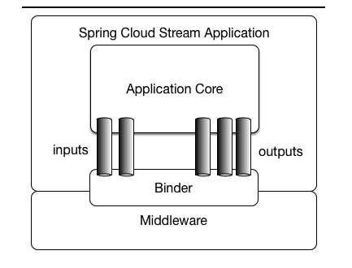
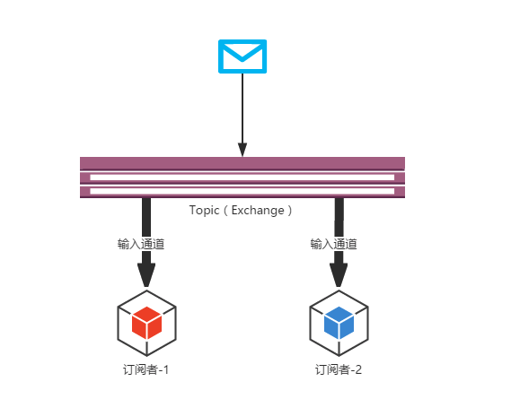
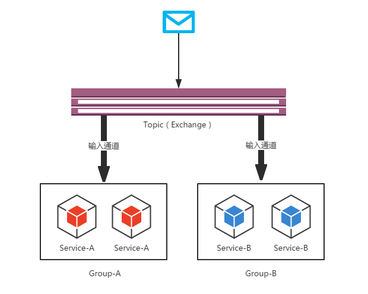
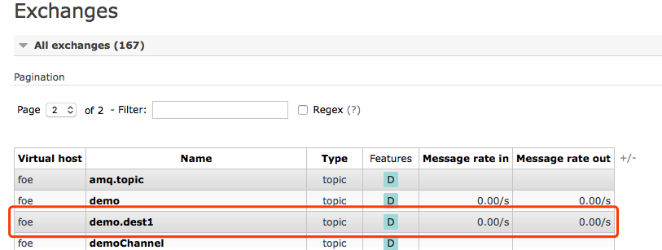
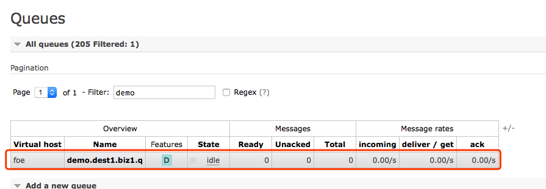

# semak-stream

`semak-stream` 基于 `spring-cloud-stream` 进行构建，目前主要适配的中间绑定器（Binder）为：

- RabbitMQ
- RocketMQ
- Kafka
- Redis（规划中，暂未实现）


`semak-stream` 主要提供了以下特性：

1. 统一不同消息中间件的接口，标准化调用方式。
1. 更简单快捷的配置方式。
1. 支持主流中间件适配。


## 1. 应用模型结构

下图是官方文档中对于**Spring Cloud Stream**应用模型的结构图。从中我们可以看到，**Spring Cloud Stream**构建的应用程序与消息中间件之间是通过绑定器**Binder**相关联的，绑定器对于应用程序而言起到了隔离作用，它使得不同消息中间件的实现细节对应用程序来说是透明的。所以对于每一个**Spring Cloud Stream**的应用程序来说，它不需要知晓消息中间件的通信细节，它只需要知道**Binder**对应用程序提供的概念去实现即可，也就是消息通道：**Channel**。如下图案例，在**应用程序**和**Binder**之间定义了两条输入通道和三条输出通道来传递消息，而**绑定器**则是作为这些通道和消息中间件之间的**桥梁**进行通信。




## 2. 核心概念

### 2.1. 绑定器
**Binder**绑定器是**Spring Cloud Stream**中一个非常重要的概念。在没有绑定器这个概念的情况下，我们的**Spring Boot**应用要直接与消息中间件进行信息交互的时候，由于各消息中间件构建的初衷不同，它们的实现细节上会有较大的差异性，这使得我们实现的消息交互逻辑就会非常笨重，因为对具体的中间件实现细节有太重的依赖，当中间件有较大的变动升级、或是更换中间件的时候，我们就需要付出非常大的代价来实施。


通过定义绑定器作为中间层，完美地实现了应用程序与消息中间件细节之间的隔离。通过向应用程序暴露统一的**Channel**通道，使得应用程序不需要再考虑各种不同的消息中间件实现。当我们需要升级消息中间件，或是更换其他消息中间件产品时，我们要做的就是更换它们对应的**Binder**绑定器而不需要修改任何**Spring Boot**的应用逻辑。


### 2.2. 发布-订阅模式


在**Spring Cloud Stream**中的消息通信方式遵循了**发布-订阅模式**，当一条消息被投递到消息中间件之后，它会通过共享的**Topic**主题进行广播，消息消费者在订阅的主题中收到它并触发自身的业务逻辑处理。这里所提到的**Topic**主题是**Spring Cloud Stream**中的一个抽象概念，用来代表发布共享消息给消费者的地方。在不同的消息中间件中，**Topic**可能对应着不同的概念，比如：在**RabbitMQ**中的它对应了**Exchange**、而在**Kakfa**中则对应了**Kafka**中的**Topic**。

相对于点对点队列实现的消息通信来说，**Spring Cloud Stream**采用的**发布-订阅模式**可以有效的降低消息生产者与消费者之间的耦合，当我们需要对同一类消息增加一种处理方式时，只需要增加一个应用程序并将输入通道绑定到既有的**Topic**中就可以实现功能的扩展，而不需要改变原来已经实现的任何内容。




### 2.3. 消费组


虽然**Spring Cloud Stream**通过**发布-订阅模式**将消息生产者与消费者做了很好的解耦，基于相同主题的消费者可以轻松的进行扩展，但是这些扩展都是针对不同的应用实例而言的，在现实的微服务架构中，我们每一个微服务应用为了实现高可用和负载均衡，实际上都会部署`多个实例`。很多情况下，消息生产者发送消息给某个具体微服务时，`只希望被消费一次`。为了解决这个问题，在**Spring Cloud Stream**中提供了消费组的概念。

如果在同一个主题上的应用需要启动多个实例的时候，我们可以通过`spring.cloud.stream.bindings.``<channelName>``.group`属性为应用指定一个组名，这样这个应用的多个实例在接收到消息的时候，只会有一个成员真正的收到消息并进行处理。如下图所示，我们为Service-A和Service-B分别启动了两个实例，并且根据服务名进行了分组，这样当消息进入主题之后，Group-A和Group-B都会收到消息的副本，但是在两个组中都只会有一个实例对其进行消费。



> 需要注意的是，当定义**group**时，队列名称将被设置为`${destination}.${group}`。以RabbitMQ为例，当Exchange对应的`destination`值为`demo.dest1`、`group`值为`biz1.q`，那么实际在RabbitMQ中定义的完整队列名称为：`demo.dest1.biz.q`。





### 2.4. 消息分区


通过引入**消费组**的概念，我们已经能够在多实例的情况下，保障每个消息只被组内一个实例进行消费。通过上面对消费组参数设置后的实验，我们可以观察到，消费组并无法控制消息具体被哪个实例消费。也就是说，对于同一条消息，它多次到达之后可能是由不同的实例进行消费的。


但是对于一些业务场景，就需要对于一些具有相同特征的消息每次都可以被同一个消费实例处理，比如：一些用于监控服务，为了统计某段时间内消息生产者发送的报告内容，监控服务需要在自身内容聚合这些数据，那么消息生产者可以为消息增加一个固有的特征ID来进行分区，使得拥有这些ID的消息每次都能被发送到一个特定的实例上实现累计统计的效果，否则这些数据就会分散到各个不同的节点导致监控结果不一致的情况。而分区概念的引入就是为了解决这样的问题：当生产者将消息数据发送给多个消费者实例时，保证拥有共同特征的消息数据始终是由同一个消费者实例接收和处理。


**Spring Cloud Stream**为分区提供了通用的抽象实现，用来在消息中间件的上层实现分区处理，所以它对于消息中间件自身是否实现了消息分区并不关心，这使得**Spring Cloud Stream**为不具备分区功能的消息中间件也增加了分区功能扩展。


## 3. 先决条件


### 3.1. 环境配置


1. Open JDK 1.8+，并已配置有效的环境变量。
1. Maven 3.3.x+，并已配置有效的环境变量。
1. RabbitMQ 3.7+ （使用RabbitMQ适配时必选）
1. RocketMQ 4.7+（使用RocketMQ适配时必选）
1. Kafka 2.13-2.6.0（使用Kafka适配时必选）


### 3.2. Maven依赖配置


#### 3.2.1. 适配RabbitMQ
```xml
<dependency>
    <groupId>com.github.semak.stream</groupId>
    <artifactId>semak-stream-rabbitmq-spring-boot-starter</artifactId>
    <version>最新RELEASE版本</version>
</dependency>
```


#### 3.2.2. 适配RocketMQ

```xml
<dependency>
    <groupId>com.github.semak.stream</groupId>
    <artifactId>semak-stream-rocketmq-spring-boot-starter</artifactId>
    <version>最新RELEASE版本</version>
</dependency>
```


#### 3.2.3. 适配Kafka

```xml
<dependency>
    <groupId>com.github.semak.stream</groupId>
    <artifactId>semak-stream-kafka-spring-boot-starter</artifactId>
    <version>最新RELEASE版本</version>
</dependency>
```


## 4. 绑定器与消息通道的配置


### 4.1. 属性定义
```yaml
spring:
  application:
    name: semak-stream-rabbitmq-demo
  cloud:
    stream:
      binders:
        bizRabbit:
          type: rabbit
          defaultCandidate: true
          environment:
            spring:
              rabbitmq:
                host: 127.0.0.1
                port: 5672
                username: guest
                password: guest
                virtual-host: semak-demo
                connection-timeout: 10000
      bindings:
        demoInput:
          binder: bizRabbit
          #exchange name
          destination: demo.dest
          #queue name = ${destination}.${group}
          group: biz.q
        demoOutput:
          binder: bizRabbit
          #exchange name
          destination: demo.dest
          #queue name = ${destination}.${group}
          group: biz.q
```


### 4.2. 属性描述

| **属性** | **是否必填** | **默认值** | **描述** |
| :--- | :--- | :--- | :--- |
| **spring.cloud.stream.binders.<binderName>.type** | 是 |   | 绑定器类型支持：`rabbit`, `kafka` |
| **spring.cloud.stream.binders.<binderName>.defaultCandidate** | 否 | true | 定义为候选Bean（Primary Bean），多个绑定器只能定义一个为候选Bean |
| **spring.cloud.stream.binders.<binderName>.environment** | 是 |   | 绑定器相关的环境属性 |
| **使用RabbitMQ Binder时，以下属性按需填写** |  |  |  |
| **spring.cloud.stream.binders.<binderName>.environment.spring.rabbitmq.host** | 是 |   | RabbitMQ的Broker地址 |
| **spring.cloud.stream.binders.<binderName>.environment.spring.rabbitmq.port** | 是 |   | RabbitMQ的Broker端口 |
| **spring.cloud.stream.binders.<binderName>.environment.spring.rabbitmq.username** | 是 |   | RabbitMQ的Broker用户名 |
| **spring.cloud.stream.binders.<binderName>.environment.spring.rabbitmq.password** | 是 |   | RabbitMQ的Broker密码 |
| **spring.cloud.stream.binders.<binderName>.environment.spring.rabbitmq.virtual-host** | 是 |   | RabbitMQ的Broker的虚拟主机名称 |
| **使用Kafka Binder时，以下属性按需填写** |  |  |  |
| **spring.cloud.stream.binders.<binderName>.environment.spring.cloud.stream.kafka.binder.brokers** | 是 |   | Kafka的Broker地址和端口，多个使用英文逗号分隔 |
| **使用RocketMQ Binder时，以下属性按需填写** |  |  |  |
| **spring.cloud.stream.binders.<binderName>.environment.spring.cloud.stream.rocketmq.binder.name-server** | 否 | 127.0.0.1:9876 | NameServer地址 |
| **spring.cloud.stream.binders.<binderName>.environment.spring.cloud.stream.rocketmq.binder.enable-msg-trace** | 否 | true | 是否为 Producer 和 Consumer 开启消息轨迹功能 |
| **spring.cloud.stream.binders.<binderName>.environment.spring.cloud.stream.rocketmq.binder.customized-trace-topic** | 否 | RMQ_SYS_TRACE_TOPIC | 消息轨迹开启后存储的 topic 名称 |
|  |  |  |  |
| **spring.cloud.stream.bindings.<channelName>.binder** | 否 | 取默认binder | 消息通道绑定的绑定器名称 |
| **spring.cloud.stream.bindings.<channelName>.destination** | 是 |   | RabbitMQ的含义为Exchange；Kafka的含义为Topic |
| **spring.cloud.stream.bindings.<channelName>.group** | 否 |  | 分组名称，消息仅能由相同组内的一个消费者消费 |

- **binderName**: 绑定器名称
- **channelName**: 消息通道名称


### 4.3. 专有属性


> 由于属性较多，下面将给出官方文档指定章节的连接。

除了通用属性外，还有一些中间件相关的特有配置。


#### 4.3.1. RabbitMQ专有属性
`spring.cloud.stream.rabbit.bindings.``<channelName>`节点下的属性为RabbitMQ中间件特有的属性配置，主要分为**消费者属性**和**生产者属性**。

- [消费者属性](https://docs.spring.io/spring-cloud-stream/docs/current/reference/htmlsingle/#_rabbitmq_consumer_properties)
- [生产者属性](https://docs.spring.io/spring-cloud-stream/docs/current/reference/htmlsingle/#_rabbit_producer_properties)


#### 4.3.2. Kafka专有属性
`spring.cloud.stream.kafka.bindings.``<channelName>`节点下的属性为Kafka中间件特有的属性配置，主要分为**消费者属性**和**生产者属性**。

- [消费者属性](https://docs.spring.io/spring-cloud-stream/docs/current/reference/htmlsingle/#_kafka_consumer_properties)
- [生产者属性](https://docs.spring.io/spring-cloud-stream/docs/current/reference/htmlsingle/#_kafka_producer_properties)


#### 4.3.3. RocketMQ专有属性
`spring.cloud.stream.rocketmq.bindings.``<channelName>`节点下的属性为Kafka中间件特有的属性配置，主要分为**消费者属性**和**生产者属性**。

- [消费者属性](https://github.com/alibaba/spring-cloud-alibaba/wiki/RocketMQ#rocketmq-consumer-properties)
- [生产者属性](https://github.com/alibaba/spring-cloud-alibaba/wiki/RocketMQ#rocketmq-provider-properties)


## 5. 使用方式


### 5.1. 生产者定义
#### 5.1.1. 定义输出通道
```java
public interface DemoSource {

    String OUTPUT = "demoOutput";

    @Output(OUTPUT)
    MessageChannel output();
}
```


#### 5.1.2. 配置通道绑定

```yaml
spring:
  cloud:
    stream:
      ...
      bindings:
        demoOutput:
          binder: bizRabbit
          #exchange name
          destination: demo.dest1
          #queue name = destination + . + group
          group: biz1.q
```
这里将定义好的输出通道`demoOutput`绑定到绑定器`bizRabbit`上，`destination`指定到交换器名称，`group`指定到队列名称后缀（队列名称完整名称由`destination + . + group`构成）。


#### 5.1.3. 发送消息

我们可以定义一个基于通道的发送器。
```java
@EnableBinding(DemoSource.class)
public class DemoSourceSender {

    @Autowired
    private DemoSource demoSource;

    /**
     * 发送消息
     *
     * @param payload 发送内容
     * @return boolean 消息是否已被发送
     */
    public boolean send(Object payload){
        return demoSource.output().send(MessageBuilder.withPayload(payload).build());
    }
}
```

- 需要通过类注解`@EnableBinding`开启通道绑定。
- 引用`DemoSource`通道进行发送。

然后再业务代码中引用发送器发送消息。
```java
@Autowired
private DemoSourceSender demoSourceSender;

......

demoSourceSender.send(userRequest);
```
这样，一条消息就被发送到队列中了。


### 5.2. 消费者定义

#### 5.2.1. 定义输入通道
```java
public interface DemoSink {

    String INPUT = "demoInput";

    @Input(INPUT)
    SubscribableChannel input();
}
```


#### 5.2.2. 配置通道绑定

```yaml
spring:
  cloud:
    stream:
      ...
      bindings:
        demoInput:
          binder: bizRabbit
          #exchange name
          destination: demo.dest1
          #queue name = destination + . + group
          group: biz1.q
```


#### 5.2.3. 监听消息

定义一个基于通道的接收器。
```java
@Slf4j
@EnableBinding(DemoSink.class)
public class DemoSinkReceiver {

    @Autowired
    private DemoService demoService;

    @StreamListener(DemoSink.INPUT)
    public void receive(TUser payload) {
        log.info(">>>> Recevied: {} - {}", payload.getClass(), payload);
    }
}
```

- 需要通过类注解`@EnableBinding`开启通道绑定。
- 引用`DemoSink`通道进行消息监听。
